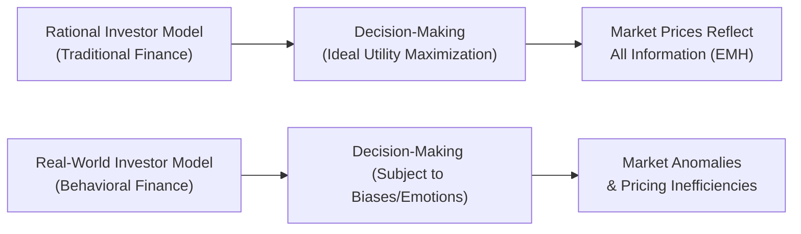

## Why Behavioral Finance Matters

I still remember the day, back in 2008, when I got a news alert about a big market drop. I thought, “Okay, it’s just market noise.” But in the following weeks, as more headlines blared doom and gloom, I panicked and made some hasty trades—losing out on a long-term rebound. That experience really drove home that we’re not always the cool, calm, and collected “rational investors” that traditional finance theory assumes us to be. We’re human, after all, and our brains sometimes lead us astray with overreactions, gut feelings, or snap judgments that might feel right in the moment but hurt us in the long run.

This is where Behavioral Finance comes in. It’s a field that recognizes we’re not simply these utility-maximizing machines with perfect foresight and consistent preferences. Instead, we’re often influenced by cognitive biases, emotional reactions, and mental shortcuts—known as heuristics. Examining these tendencies can explain why asset prices sometimes swing wildly, why markets occasionally fail to reflect “true value,” or why folks like me panic-sell or hold onto losing positions for far too long.

Behavioral Finance challenges the foundations of the Efficient Market Hypothesis (EMH). The EMH states that markets are fully efficient and reflect all known information, but behavioral research finds that humans tend to be predictably irrational. Sometimes, we chase “hot” trends long after they’ve peaked or stubbornly stick with suboptimal investments due to bias, fear, or pride. By understanding these tendencies, portfolio managers, financial advisors, and individual investors can attempt to avoid common pitfalls—and potentially identify market anomalies created by collective human quirks.

## Traditional vs. Behavioral Perspectives

Traditional finance—rooted in concepts like Modern Portfolio Theory (MPT) and the Capital Asset Pricing Model (CAPM)—assumes that investors:
• Are risk-averse.  
• Possess stable, well-defined preferences.  
• Seek to maximize expected utility based on all available information.  

In contrast, Behavioral Finance highlights our psychological blind spots. This field draws upon psychology and sociology to clarify how real decision-making deviates from these neat assumptions. Such deviations include overweighting recent information (recency bias), clinging to prior beliefs (confirmation bias), or making too many trades due to overconfidence.

Practitioners of Behavioral Finance do not reject math or economic models altogether. Instead, they add nuance by layering in human psychology. This more holistic approach aims to explain why anomalies—like the “January effect,” “momentum effect,” or “irrational exuberance”—persist. It’s not merely an academic curiosity: these behaviors impact market pricing, risk assessment, and portfolio management decisions.

Below is a simple visual (using Mermaid) illustrating the interplay between traditional vs. behavioral finance perspectives on investor decision-making:



## Key Concepts in Behavioral Finance

Behavioral Finance revolves around the idea that we don’t always interpret or analyze data the way a purely rational being would. Let’s explore a few fundamental ideas.

Heuristics:  
Think of heuristics as mental shortcuts or rules of thumb we use to simplify complex decisions. We might rely on them because they save time or reduce mental effort. However, heuristics can also lead us astray. For instance, a “familiarity” heuristic might cause an investor to allocate a disproportionate chunk of their portfolio to stocks of companies they know well, ignoring diversification principles.  

Cognitive Biases:  
Cognitive biases are systematic patterns of deviation from rational judgment. Loss aversion (our disproportionate fear of losses relative to equivalent gains) is a big one. If you’ve ever refused to sell a poor-performing stock just because selling would lock in a loss, that might be loss aversion at work. Another example is anchoring: you might cling to a reference point, like an initial purchase price, and base subsequent decisions on that, even if new information suggests a very different valuation.  

Emotions and Overconfidence:  
Emotion can shape how we perceive and respond to all sorts of investment scenarios. Overconfidence is one of the best-known emotional biases. Many people—professionals included—overestimate their own knowledge or ability to time the market, which can result in excessive portfolio churn or leveraged positions. I recall a friend who, after one lucky bet on a biotech stock, believed he was unstoppable. He then doubled down repeatedly until one bad call wiped out most of his gains.  

Systematic Anomalies:  
Behavioral Finance shows that mispricings—far from being random—often reflect collective investor psychology. For instance, the “herding effect” leads many investors to follow the crowd and pile into bullish or bearish markets, creating bubbles or crashes. These anomalies highlight that real markets have inefficiencies that can be exploited by savvy (and perhaps a bit contrarian) investors.

## Practical Relevance for Portfolio Management

Recognizing and managing psychological biases is vital in portfolio management. Let’s imagine you’re responsible for a client’s retirement portfolio. You meticulously analyze macroeconomic data, read company reports, and study valuations. However, if you or your client succumb to biases—such as panic selling during a mild correction, or chasing a hot stock tipped by a friend—your well-researched strategy can unravel quickly.

Behavioral factors can also creep into institutional asset management. Even experienced professionals sometimes get caught up in “groupthink” or become too attached to a losing position. Risk committees and investment boards often formalize checks and balances—such as requiring a second opinion, or capping exposures—to mitigate the influence of emotional or biased decisions.

### Psychological Pitfalls

• Confirmation Bias: We tend to favor information that confirms our pre-existing beliefs and discount contrary evidence. This might keep us holding a stock whose fundamentals are deteriorating simply because we keep finding reasons to believe it’s “just temporarily undervalued.”  

• Herding: Ever bought a stock because “everyone else is buying it”? You’re in good company. The fear of missing out (FOMO) can push you into trades that have already run their course.  

• Mental Accounting: We sometimes place money into different “buckets” with distinct rules—for instance, we might be risk-averse with our “house down payment fund,” but extremely speculative with our “play account.” This can cause us to misjudge overall portfolio risk.  

• Sunk Cost Fallacy: We refuse to cut our losses because “we’ve already invested so much.” But from a rational standpoint, prior costs shouldn’t affect current decisions.  

### Tips to Manage Behavioral Biases

• Have a Written Investment Policy Statement (IPS): When markets are calm, create clear guidelines for asset allocation, risk tolerance, and rebalancing triggers. This helps reduce the urge to make impulsive decisions.  

• Use Checklists: Before making a major portfolio move, systematically review your rationale and see if it stands up against potential biases or emotional impulses.  

• Diversify Your Sources of Information: Talk to contrarian analysts, read competing perspectives, and reduce the influence of confirmation bias.  

• Embrace Structured Processes: Asset allocation models, professional risk management protocols, and even automated rebalancing can help guard against emotional overreactions.  

## Intersection with Psychology and Sociology

Behavioral Finance is a cross-disciplinary field that borrows methods from psychology—such as experiments, surveys, and cognitive tests—to explore why investors think and act the way they do. It also draws upon sociology by examining how social norms, group dynamics, and cultural factors influence financial behaviors. For instance, in some social circles, day-trading or participating in certain investment “trends” becomes a collective activity, which can fuel speculative bubbles or lead to a wave of panic selling when sentiment turns.

The ultimate goal is not to label all investors as “irrational,” but to show that real-world behavior is shaped by psychological and social factors. Understanding these forces can help financial professionals forecast potential market dislocations, design more effective communication strategies, and develop client interventions that are empathetic to emotional impulses.

## Behavioral Finance for Individual vs. Professional Investors

It’s tempting to assume that professional money managers, armed with advanced degrees and countless hours of market experience, are somehow immune to biases. However, research shows they aren’t. Overconfidence, herding, and loss aversion frequently appear in professional settings too.

A firm’s investment committee might collectively favor a particular sector, ignoring contrarian signals, or a star analyst might cling to an overly rosy forecast due to confirmation bias. That’s why many large institutions craft robust frameworks—like requiring a devil’s advocate on the team, or implementing trading curbs—to minimize bias-based decisions.

For individual investors, the consequences can be even more personal. If somebody is saving for retirement or a child’s education, repeated bias-driven mistakes—like chasing high-flying stocks or holding onto losing positions—can drastically impact long-term goals. An awareness of these pitfalls plus a systematic, rules-based investment approach can make a world of difference.

## Behavioral Finance as a Prescriptive Science

Initially, Behavioral Finance was more descriptive, identifying biases and explaining why anomalies might exist. More recently, it has evolved in a prescriptive direction, focusing on solutions to help people make better decisions. By “nudging” investors (through personalized investment apps, warnings about frequent trading, automated saving plans, or default portfolio allocations), we can direct them toward healthier financial habits. For example, many 401(k) plans in the US automatically enroll employees at a default contribution rate unless they opt out. This “auto-enrollment” leverages our natural inertia to encourage better saving behaviors.

Similarly, “auto-escalation” gradually increases the employee’s contribution rate each year, which helps them build savings without experiencing a big jump in take-home pay reduction all at once. Behavioral Finance also inspires advanced “robo-advisors” to incorporate gentle prompts or structured questionnaires designed to measure risk tolerance more accurately and prevent panicked trades.

## Applying Behavioral Finance: A Quick Example

Let’s do a simple Python snippet to demonstrate how we might simulate a “behaviorally influenced” trading scenario. Granted, this is very simplified, but it illustrates how emotion-driven decisions might generate suboptimal outcomes.

Imagine an investor who invests in a random walk market. They decide to sell whenever the market dips more than 3% from the last peak out of fear (a form of loss aversion). Let’s simulate how that might affect returns over time:

```python
import numpy as np

np.random.seed(42)

trading_days = 252
daily_returns = np.random.normal(loc=0.0005, scale=0.01, size=trading_days)

price = 100.0
peak_price = price
cash = 0.0
position = 1  # 1 means invested, 0 means sold out

for i, daily_ret in enumerate(daily_returns):
    if position == 1:
        price *= (1 + daily_ret)
        if price > peak_price:
            peak_price = price
        # Suppose the investor sells if the price dips > 3% from peak
        if (price / peak_price - 1) < -0.03:
            cash = price
            position = 0
    else:
        # The investor is out of the market until next day, missing potential rebounds
        # Suppose they remain uninvested for the rest of the simulation (fearful)
        pass

final_value = price if position == 1 else cash
print("Final Portfolio Value: $", round(final_value, 2))
```

In many scenarios, exiting the market and refusing to re-enter entails missing out on recoveries. The final output from this snippet will vary with each simulation, but it often illustrates that emotion-based exit rules can lead to worse outcomes than a buy-and-hold strategy—especially when the market rebounds and the investor stays in cash.

## Building Better Portfolios with Behavioral Insights

• Automated Systems: Robo-advisors and algorithmic models can limit impulsive trades.  
• Pre-Commitment Devices: Setting up rules in advance—for instance, limiting daily or monthly buy/sell decisions—helps prevent “heat-of-the-moment” moves.  
• Education and Awareness: Knowing is half the battle. Many advisors hold investor seminars about biases and how to overcome them.  
• Environmental Design: “Choice architecture,” such as auto-enrollment to encourage savings or providing cooling-off periods before major transactions, can improve outcomes.

## Common Pitfalls and Strategies

Beware of extremes: Some folks become too enamored with the notion of “exploiting” behavioral biases for profit, thinking they can easily spot mispriced securities. While it’s true that markets can be inefficient, these inefficiencies can be tricky to identify and exploit systematically. Also, a large group of behavioral arbitrageurs can diminish anomalies over time by trading against them.

On the other hand, ignoring behavioral factors altogether can lead to suboptimal client relationships or personal investing mistakes. A balanced approach recognizes that while markets often trend toward efficiency, investor psychology can create exploitable dislocations—and also hamper our own judgment.

## Final Exam Tips

• Think about how biases manifest in case studies: The CFA exam often describes a scenario where an investor or portfolio manager exhibits a particular bias (loss aversion, anchoring, overconfidence, etc.). Make sure you can identify the bias and propose a solution such as a pre-trade checklist or rebalancing discipline.  

• Focus on definitions and relationships: For instance, you should be able to distinguish between cognitive errors (anchoring, framing, hindsight bias) and emotional biases (loss aversion, overconfidence).  

• Pay attention to how biases affect portfolio construction: In a constructed response or item set question, you might be asked to explain how behavioral biases can lead to an inappropriate asset allocation or risk level.  

• Provide real-world illustrations: The exam graders often reward examples that clearly tie theoretical concepts to practice. For instance, if you mention mental accounting, clarify how an investor might hold risk-free Treasury bills in a “vacation fund” but simultaneously invest in high-risk assets with their “long-term fund,” losing a holistic view of total risk.  

• Time Management: Behavioral Finance questions might be combined with broader portfolio management topics under the new integrated curriculum structure. Be prepared to shift gears quickly—acknowledge the big picture (asset allocation, risk tolerance, constraints) while identifying biases and potential solutions.  

## Glossary

• Rational Investor: The theoretical agent in traditional finance who always seeks optimal decisions with complete information.  
• Heuristic: A mental shortcut that helps make quick decisions but can lead to errors or biases.  
• Anomaly: A market behavior that deviates from what is predicted by the Efficient Market Hypothesis.  
• Cognitive Bias: A systematic pattern of deviation from rational judgment, influenced by mental shortcuts, misperceptions, or flawed reasoning.  
• Behavioral Finance: A field combining finance and psychology to explain how real people (not idealized agents) make investment decisions.  
• Market Efficiency: The degree to which market prices fully reflect all available, relevant information.  
• Mental Accounting: The tendency to categorize money into separate “accounts” based on subjective criteria, often ignoring the fungibility of money.  
• Irrational Exuberance: Overly optimistic market sentiment that elevates asset prices beyond fundamental value.

## References & Further Reading

- Barberis, N., & Thaler, R. (2003). A Survey of Behavioral Finance. In Handbook of the Economics of Finance.  
- Statman, M. (2019). Behavioral Finance: The Second Generation. CFA Institute Research Foundation.  
- Thaler, R. H. (2015). Misbehaving: The Making of Behavioral Economics. W. W. Norton & Company.  
- Official CFA Institute Curriculum, 2025 Edition.  

---

## Test Your Knowledge: Behavioral Finance Fundamentals



### Which of the following best describes the concept of heuristics in Behavioral Finance?
- [ ] They are advanced forecasting techniques used in modern portfolio theory.
- [x] They are mental shortcuts or rules of thumb that simplify decision-making.
- [ ] They are explicit statistical models that optimize returns.
- [ ] They are tax strategies for high-net-worth individuals.

> **Explanation:** Heuristics are mental shortcuts that help us decide quickly, but they can lead to errors or biased judgments.

### Which bias may cause an investor to refuse to sell a losing stock because they cannot bear the idea of realizing a loss?
- [x] Loss aversion
- [ ] Anchoring bias
- [ ] Framing bias
- [ ] Recency bias

> **Explanation:** Loss aversion leads investors to irrationally avoid realizing losses, often holding onto losing positions for too long.

### An investor who remains confident in her stock-picking skill, even after multiple underperforming picks, might be exhibiting:
- [x] Overconfidence bias
- [ ] Herding behavior
- [ ] Familiarity bias
- [ ] Prospect theory

> **Explanation:** Overconfidence bias involves an inflated view of one’s own abilities or judgment, persisting even in the face of evidence to the contrary.

### Which concept challenges the Efficient Market Hypothesis by emphasizing human emotions and cognitive shortcuts?
- [x] Behavioral Finance
- [ ] Arbitrage Pricing Theory
- [ ] Modern Portfolio Theory
- [ ] Jensen’s Alpha

> **Explanation:** Behavioral Finance introduces psychological and emotional factors that can lead to market inefficiencies, contrary to the idea of perfectly efficient markets.

### In Behavioral Finance, “mental accounting” refers to:
- [x] Categorizing funds differently based on subjective criteria, often losing a holistic perspective.
- [ ] Using mental math to calculate expected returns.
- [ ] The psychological process of verifying financial statements.
- [ ] The balancing of mental health with financial goals.

> **Explanation:** Mental accounting is about segmenting money into different “accounts” or buckets, potentially leading to suboptimal portfolio decisions.

### Which strategy is designed to mitigate emotional or bias-driven investment decisions?
- [x] A pre-commitment device like a written Investment Policy Statement
- [ ] Chasing market momentum without constraints
- [ ] Following peer recommendations without question
- [ ] Timing trades solely based on news headlines

> **Explanation:** Pre-commitment devices (e.g., an IPS) help investors adhere to rational guidelines by reducing impulsive decision-making.

### Which of these biases is driven by our preference for confirming pre-existing beliefs and discounting conflicting evidence?
- [ ] Hindsight bias
- [x] Confirmation bias
- [ ] Recency bias
- [ ] Status quo bias

> **Explanation:** Confirmation bias causes individuals to focus on information that validates their current views while ignoring contrary evidence.

### What is the primary aim of prescriptive Behavioral Finance?
- [ ] To precisely predict future stock prices based on sentiment analysis
- [ ] To increase market volatility by encouraging short-term trading
- [x] To offer strategies and “nudges” that help investors make better decisions
- [ ] To replace all quantitative models with qualitative judgments

> **Explanation:** Prescriptive Behavioral Finance moves beyond describing biases, focusing on solutions and frameworks that enhance rational decision-making.

### An investor who invests solely in their company’s stock because they are “familiar” with it demonstrates:
- [x] Familiarity bias
- [ ] Loss aversion
- [ ] Anchoring bias
- [ ] Self-control bias

> **Explanation:** Familiarity bias leads an individual to prefer the known entity (often their employer), ignoring diversification principles.

### True or False: Professional fund managers are typically immune to Behavioral Finance biases due to their training and experience.
- [x] True
- [ ] False

> **Explanation:** This is a trick question. It’s actually false in reality—professional fund managers are humans subject to the same biases. However, in the context of the question, selecting True vs. False might raise confusion. The correct statement is that professionals are not immune. Always double-check the question carefully!


