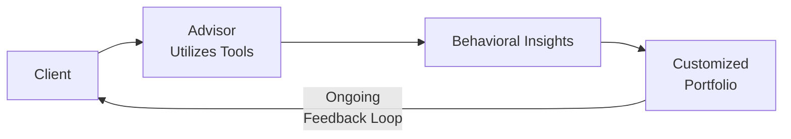

## Introduction to Advisor-Client Behavioral Tools

You know, working with clients over the years, I’ve seen firsthand how powerful it can be to have the right tools for spotting and addressing behavioral biases. It’s sort of like having a good map: you can always walk around aimlessly, sure, but a good map helps you see where you’re heading and sidestep trouble. In behavioral finance, the main objective is to help advisors and clients navigate emotional and cognitive pitfalls that may derail the best-laid portfolio plans.

This section expands on prior discussions introduced in other parts of Chapter 5 about common behavioral biases and their effects on portfolio decisions (e.g., 5.3 Common Investor Biases). Now, we’ll turn our focus to specialized tools that make these biases more visible—things like online analytics platforms that track a client’s every move in real time and short, gamified risk-tolerance exercises that can be surprisingly revealing.

## Importance of Interactive Behavioral Tools in Advisory

In sections like 5.5 Behavioral Aspects of Managing Client Relationships, we explored how two-way communication is vital in bridging the gap between advisor expertise and client goals. Sometimes, just listening to what clients say about risk and reading their body language only tells part of the story. Tools that gather quantitative and qualitative data can help you figure out their real tolerance for drawdowns, their actual decision-making patterns under pressure, and any hidden anchor bias from past experiences.

Moreover, these tools don’t just highlight biases—they often provide valuable conversation starters. For instance, an interactive game that simulates a market crash scenario can open your client’s eyes to how they might behave in reality (sometimes drastically different from their self-reported questionnaire answers). As a result, you’ll have more candid discussions about risk management strategies, rebalancing approaches, and even investment horizons.

## Risk Profile Questionnaires

Risk profile questionnaires have been around for years, but newer versions leverage technology to gather more nuanced insight. Maybe you’ve used these questionnaires yourself, those multiple-choice forms that ask how comfortable a client is losing a certain percentage of their portfolio. While they might feel rudimentary, they are often the first line of defense against poorly aligned portfolios.

• Structure and Content  
Traditional versions focus on hypothetical losses (like “What would you do if your portfolio lost 10% in one quarter?”). More advanced questionnaires integrate scenario-based queries, measuring emotional reactions under timed conditions. A typical item might say: “Markets drop by 15% in a month; you have 24 hours to decide on your response.” By adding time pressure, the questionnaire mimics real-life stress conditions.

• Scoring Interpretation  
If used properly, the questionnaire’s output is not just a single number (e.g., a risk score of 7 out of 10). It’s an entire profile that includes panic points, long-term vs. short-term orientation, and emotional triggers. Interpreting these scores demands practice. Advisors should consider the broader client context: net worth, personal experiences with past market crises (as found in 5.16 Lessons from Market Crises and Behavioral Patterns), and the investor’s stage in life. For example, a high-income young professional with minimal debt might technically have the capacity for more risk, but what if the questionnaire suggests extremely high loss aversion? That’s a delicate puzzle to solve.

• Incorporating Personal Anecdotes  
I recall a client who confidently claimed they could weather any volatility. Their risk questionnaire painted a very different picture—exhibiting strong aversion once financial goals became concrete. They changed their tune after a quick conversation, leading us to position the portfolio in a way that balanced growth with a safety cushion for psychological comfort.

## Gamification and Game-Based Learning

Gamification (the use of game-design elements) is becoming increasingly popular in finance. Maybe you’ve seen those online simulations—or “games”—where your client is given imaginary capital and asked to make quick decisions. These exercises can show how the client actually behaves when losses or gains appear in real time—no matter how hypothetical.

• Revealing Emotional Triggers  
Games challenge players with real-time price changes, sudden market news announcements, or random external events (like a simulated global crisis). Clients who initially say, “I’m calm, I’ll just buy and hold,” might find themselves panic-selling after seeing a quick 10% simulated drawdown. It’s an honest reflection of real impulses.

• Engagement and Learning  
People learn better when they’re emotionally engaged. Games provide immediate feedback: If a client sells too soon, they might see theoretical opportunity costs or realize they’re jumping in and out of positions for no good reason. This interactive approach fosters a deeper understanding of how biases creep in—far more effectively than simply reading about them in a textbook.

• Compatibility with Client Needs  
Not everyone loves games, so it’s wise to gauge if your client is open to that style of learning. For instance, older clients or those pressed for time might prefer a simpler approach—like a short, scenario-based quiz. But for clients who do engage, these tools can be gold mines of insight.

## Investor Behavior Analytics Platforms

Integrating digital platforms into your advisory process is becoming standard practice. These analytics engines track everything from login times to trading patterns in real or simulated portfolios. They can even measure how long a client hovers over a certain trade button before deciding. It might sound a bit “Big Brother,” but there’s real value in seeing whether a client’s behavior aligns with or departs from their stated strategy.

• Real-Time Insights  
One of the coolest parts, in my opinion, is that you get real-time “nudges” or alerts if a client makes an impulsive move. If you see them drastically changing their allocations to chase a hot stock, you can step in early with a coaching call or a gentle explanation about the pitfalls of trend-chasing.

• Advanced Reporting  
Investor behavior analytics can create a dashboard that flags potential herding behavior (tying back to 5.7 Impact of Herding Behavior in Portfolio Decisions), excessive trading, and even recency bias. For instance, after a strong market run, the platform might notice your client is overconcentrating in the best-performing asset class. Then it sends you a message: “Client is overweight in technology stocks beyond recommended thresholds.”

• Data and Privacy Considerations  
With great power comes responsibility. You’ve got to be transparent with your client about what data you’re collecting and why. Ethical standards (1.5 Linking Ethical Standards to Portfolio Management Practices) call for informed consent and an unambiguous explanation of privacy protocols. That keeps the trust intact.

## Building a Toolkit for Comprehensive Client Profiling

Chances are you won’t rely on a single magic bullet. Each tool (risk profile questionnaires, game-based modules, analytics) excels in capturing a slightly different angle. In my experience, the best advisors blend them:

• Start with a standard risk profiling questionnaire as a broad introduction.  
• Use gamification to stress test how the client responds under pressure.  
• Deploy analytics platforms to gather real or simulated trading data for more robust insights over time.

Below is a visual summary of how you can integrate these tools:

Think of this diagram as your high-level process: after gathering data from these tools, you generate insights, build or adjust the portfolio strategy, and continue refining your approach as the client’s preferences evolve. It’s a continuous feedback loop rather than a one-time transaction.

## Interpreting Tool Outputs: Best Practices

It’s tempting to take the final score from a risk questionnaire or the analytics dashboard at face value—but that can be a big oversight. The data is just one piece of the story. The other piece is good old-fashioned conversation (5.9 Cognitive Dissonance and Confirmation Bias in Forecasting expands on how an advisor must look for contradictory signals).

• Cross-Check Scores with Qualitative Observations  
If the questionnaire says the client is “risk-hungry,” does that resonate with how they talk about safe assets or guaranteed returns? Or does it conflict? Sometimes a client’s posture is influenced by the day’s headlines. Don’t forget to check the bigger picture: personal finances, net worth, and life goals.

• Customize Education and Communication  
Tool outputs can hint at which biases a client is most prone to. If you see lots of short-term trading, that might point to overconfidence or a recency bias. You can tailor your discussions (see 5.12 Behavioral Finance Tools for Advisor-Client Interactions) around illustrating those pitfalls, maybe using real-world or hypothetical examples to drive the point home.

• Context, Context, Context  
Tools are not the final authority; they’re an aid. A risk profile might look drastically different if administered during a bull market vs. after a 30% global downturn. Remind clients that these outputs reflect current emotions and that life events (marriage, job changes, health concerns) can shift risk tolerance.

## Periodic Re-Evaluation

Market conditions change, and so do clients. In 5.5 Behavioral Aspects of Managing Client Relationships, we talked about how a single conversation at the beginning of an engagement isn’t enough. Periodic reviews, at least annually—often quarterly for more active clients—help you pick up on shifts in attitudes.

• Updating Questionnaires  
Encourage clients to retake risk profile questionnaires or other modules after significant market events or personal milestones. The difference in results sometimes sparks enlightening conversations about how their perspective has evolved.

• Ongoing Use of Analytics  
Behavioral analytics platforms really shine over time. Patterns might not be obvious in a single day—or even a single quarter—but across a year or two, you’ll see if certain behaviors repeatedly surface (e.g., selling winners too early or holding onto losers too long).

• Tuning the Portfolio Strategy  
Maybe your client becomes more conservative as they near retirement. Or perhaps their tolerance for risk increases if they receive a large inheritance. The updated insights from these tools, combined with your professional judgment, let you refine their asset allocation and plan in line with real-life changes.

## Potential Pitfalls and Ethical Considerations

It’s easy to go overboard and assume a fancy analytics platform is a panacea for all behavioral quirks. Likewise, the “fun” factor of gamification might overshadow real-world complexities. Don’t forget the following:

• Overreliance on Technology  
Algorithms are only as good as the data. If clients input inaccurate personal information or “play” with the platform in a non-serious way, the results might not reflect their true inclinations.

• Privacy and Data Security  
Make sure you’re following the regulatory frameworks discussed in Chapter 7: Professional Practices in Portfolio Management. Inform clients about what data is being tracked, how it’s stored, and how it’s used.

• Advisor’s Judgment Reigns Supreme  
None of these tools can replace a thoughtful advisor who understands macroeconomic context (1.6 Integration of Macroeconomic Indicators in Portfolio Decisions) and who can parse out genuine signals from the noise. Your role is to interpret these tools, not blindly follow them.

## Practical Example: Implementing a Multi-Tool Approach

Imagine a mid-career client, Alex, who’s transitioning from a stable corporate job to starting a small business. Initially, Alex’s risk profile questionnaire suggested moderate risk tolerance. Then a gamified platform revealed that Alex was prone to panic-sell in hypothetical volatile markets. However, the real-time analytics didn’t show any drastic trades. So what gives?

Turns out, Alex’s business launch was overshadowing financial anxiety. Whenever those simulated big red losses showed up, Alex felt the pressure to “fix” everything. But so far, in real life, no such event had occurred, so that’s why the analytics data seemed calm. Here’s the interpretation:

• Combine knowledge from the risk questionnaire (moderate risk tolerance) with the gamification insight (tendency to panic).  
• Realize that Alex’s real-world portfolio hasn’t faced a market shock yet, so the analytics don’t reflect that behavior—yet.  
• Create a strategy that includes a stable emergency fund, invests in select moderate- to lower-volatility assets, and addresses Alex’s emotional triggers before they appear in real markets.  

A discussion about risk layering (e.g., all those times we talk about stable anchor assets vs. growth-oriented equities) helps Alex remain committed. Over time, as the business stabilizes, Alex might take on more risk.

## Final Exam Tips

• Demonstrate your ability to interpret multiple sources of data. If an exam scenario presents a contradictory risk score vs. an analytics dashboard, discuss how you’d reconcile that.  
• Stress the importance of re-evaluation. In constructed-response questions, emphasize how dynamic changes—personal or market-driven—necessitate fresh tools or re-administration of the same tools.  
• Show ethical considerations. The CFA Institute Code and Standards require the protection of client confidentiality and the need to avoid misrepresentation (Chapter 7.2 Regulatory Environment and Compliance Considerations).  
• Remember that each tool is a complement, not a substitute, for professional judgment. That means acknowledging both the benefits and the limitations in an exam question context.  

## References

• Kahneman, D., et al. (2021). Noise: A Flaw in Human Judgment. Little, Brown Spark.  
• CFA Institute. (2023). Tools for Behavioral Finance in Advisory Practice.  

## Test Your Knowledge: Behavioral Finance Tools for Advisor-Client Interactions



### Which of the following statements about risk profile questionnaires is most accurate?

- [ ] They should replace the need for any personal conversations with the client.
- [x] They provide a structured initial assessment but must be combined with qualitative insights.
- [ ] They are fully accurate regardless of market conditions or client circumstances.
- [ ] They are best used only once, at the start of the advisor-client relationship.

> **Explanation:** Risk profile questionnaires offer helpful initial data but cannot capture the entire behavioral context. Additionally, ongoing conversation and updates remain critical, especially as market conditions or personal circumstances change.

### A game-based learning module that simulates market downturns can best reveal which of the following about a client?

- [ ] The exact dollar amount of potential client losses in a real downturn.
- [x] The emotional responses a client might exhibit when facing sudden market losses.
- [ ] Precise correlations between different asset classes in the client’s portfolio.
- [ ] Detailed cost basis tracking for tax efficiency purposes.

> **Explanation:** Interactive simulations help uncover emotional triggers that might not appear in standard questionnaires or static risk assessments.

### Investor behavior analytics platforms provide real-time insights by:

- [x] Tracking a client’s trading activities and flagging potential biases.
- [ ] Automatically reversing trades that exhibit behavioral errors.
- [ ] Eliminating herding behavior in all market environments.
- [ ] Reporting monthly metrics without real-time alerts.

> **Explanation:** These platforms gather real-time data on trading patterns, such as excessive trading or concentration risk. They do not intervene directly in the trades; they merely alert the advisor to potential behavioral issues.

### Which of the following is a key benefit of using gamification to assess client biases?

- [ ] It ensures the client makes no errors in their real-world investments.
- [ ] It allows the client to bypass the need for professional advice.
- [ ] It provides the advisor with a compliance-free environment to experiment.
- [x] It engages clients emotionally, uncovering behavioral patterns not always seen in questionnaires.

> **Explanation:** Gamification allows clients to experience hypothetical scenarios in an engaging format, revealing hidden biases that often fail to emerge in purely theoretical or questionnaire-based assessments.

### If an advisor notices conflicting insights between a client’s risk profile questionnaire and the analytics platform, the advisor should:

- [x] Schedule a follow-up discussion to reconcile the differences before finalizing portfolio decisions.
- [ ] Disregard both tools and rely solely on the advisor’s instincts.
- [x] Consider external factors (such as market news or personal life events) that may have influenced client responses.
- [ ] Immediately escalate the case to regulatory authorities.

> **Explanation:** The advisor should attempt to reconcile conflicting data by engaging the client in further discussion, while also considering any external factors that could be causing this discrepancy. There is no need for regulatory escalation in typical circumstances.

### What is a best practice regarding privacy when using investor behavior analytics platforms?

- [x] Advisors must obtain informed consent and clearly communicate data usage.
- [ ] Advisors should collect as much data as possible without informing the client.
- [ ] Advisors can share client data with third parties without restriction.
- [ ] Advisors should block the client from viewing any real-time analytics to avoid bias.

> **Explanation:** The CFA Institute Code and Standards, along with most global regulations, require that client data usage is transparent, consent-based, and protected for confidentiality.

### Periodic re-evaluation of client biases is essential because:

- [x] Client priorities and market conditions can change over time.
- [ ] Once biases are identified, they rarely shift significantly.
- [x] Major life events can alter a client’s risk tolerance.
- [ ] Regulators mandate re-evaluation on a daily basis.

> **Explanation:** Repeated assessments help capture evolving preferences, attitudes, and life events (such as retirement or inheritance). Daily re-evaluation is not typically required but periodic updates are essential.

### In analyzing outputs from a behavioral tool, an advisor should primarily:

- [x] Cross-check the results with qualitative observations and market context.
- [ ] Implement a fully automated trading strategy based solely on the output.
- [ ] Assume the result is definitive and requires no further discussion.
- [ ] Disregard the client’s personal circumstances.

> **Explanation:** Behavioral tool outputs provide data for informed decision-making, but an advisor’s duty is to interpret that data in conjunction with client circumstances and wider economic conditions.

### Which of the following is a common pitfall when using game-based simulations to profile client behavior?

- [x] Clients might treat the simulation as a game and not reveal true decision-making processes.
- [ ] Clients will never learn from these exercises.
- [ ] The outputs are always unreliable.
- [ ] These tools are highly regulated and cannot be used outside official trade settings.

> **Explanation:** While these simulations can be very insightful, clients sometimes do not treat them seriously or might behave “optimally” because they know it is a test, thus hiding their real emotional responses.

### Advisors should remember that these behavioral finance tools:

- [x] Complement professional judgment rather than replace it.
- [ ] Make further client communication unnecessary.
- [ ] Eliminate bias completely from investment decisions.
- [ ] Are only helpful for young, tech-savvy clients.

> **Explanation:** Despite technological innovations, the advisor’s expertise and professional judgment remain crucial, as tools merely assist in identifying and understanding biases rather than removing them entirely.


