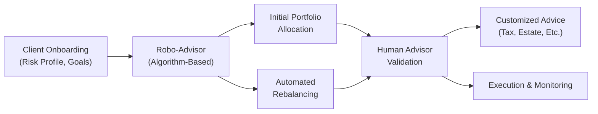

## Introduction

So let’s talk about robotic or automated advice, also known as robo-advisors. If you’ve ever filled out an online questionnaire about your investment goals and risk tolerance and then had a system spit out a recommended asset allocation for you, that’s basically the concept in action. Robo-advisors are automated, software-based platforms that create and manage investment portfolios with minimal human intervention. They use algorithms to decide how to invest your money based on your profile—your goals, time horizon, and risk appetite—and then periodically rebalance the portfolio. 

In some ways, it’s super cool and convenient: with a few clicks, you can have a fully managed diversified portfolio, often at a lower cost than traditional wealth managers. But, of course, there are definite caveats and real-world complexities. For instance, these algorithms can still carry biases, rely heavily on historical data, and sometimes miss the more idiosyncratic personal or emotional nuances that human advisors usually pick up on (remember from Section 5.2 that emotional biases can be quite stubborn).

This section explores the emergence of purely automated solutions as well as hybrid models that marry human oversight with algorithmic efficiency. We’ll discuss where robo-advisors shine (like reducing impulsive overtrading) and where they might falter (like missing your unique financial quirks or misinterpreting your emotional risk tolerance). We’ll also highlight how data scientists and portfolio managers should be mindful of potential biases in algorithmic design, model assumptions, and historical data sets. 

## Robotic and Automated Advice: Key Concepts

### Robo-Advisor Definition
A robo-advisor is a platform or software that offers:

- Automated Asset Allocation: Portfolios are allocated and rebalanced based on algorithms.  
- Minimal Human Intervention: Typically, interaction is through an online interface, with little direct contact with a human advisor.  
- Lower Fees: Costs are often reduced when compared with full-service human advisors, thanks to automation.  
- Standardized Onboarding: Users provide their financial profile and risk tolerance through standardized questionnaires.

### Algorithmic Underpinnings
Robo-advisors rely on sets of predefined rules and criteria. These might originate from modern portfolio theory (MPT) or other quantitative frameworks (see Chapters 2 and 3 on risk and return). In addition, some platforms integrate risk assessment models, use heuristic optimization, or incorporate factor investing. While the computational sophistication can vary widely, the basic principle is that a user’s preferences or constraints feed into these models, which output an allocation aligned with the user’s risk-return profile.

For instance, a very simplified rebalancing algorithm might look something like:

```python
def rebalance_portfolio(current_allocations, target_allocations, tolerance=0.02):
    """
    current_allocations: dict of asset_class -> proportion
    target_allocations: dict of asset_class -> proportion
    tolerance: rebalancing threshold
    """
    for asset_class, target_weight in target_allocations.items():
        current_weight = current_allocations.get(asset_class, 0)
        deviation = abs(current_weight - target_weight)
        
        # If the deviation exceeds the tolerance, adjust
        if deviation > tolerance:
            # Adjust the current_allocation closer to the target
            current_allocations[asset_class] = target_weight
            
    return current_allocations
```

Here, the robo-advisor would systematically check whether each asset class is off its target weight by more than 2% (the tolerance). If so, it automatically “pulls” the allocation back to target. In practice, of course, real robo-advisor code is far more complex and typically integrated with brokerage APIs to execute trades in real-time. But you get the gist: the system uses a strict rule set, instead of human judgment, to decide when rebalancing occurs.

## Addressing Behavioral Biases

### Reduced Overtrading and Emotional Decision-Making
Remember from Section 5.3 that overtrading often arises from overconfidence or attempts to time the market. One major benefit of robo-advisors is their consistent, rule-based approach. If the algorithm says “rebalance every quarter” or “maintain a 60/40 equity-to-bond ratio,” it just does it—no second guessing out of fear or excitement. That can curb emotional or panic-driven trades often triggered by events like sudden market volatility.

### Potential for Algorithmic Bias
However, it’s important to note that even automation can be biased, as we learned from earlier discussions on cognitive errors (Section 5.2). If the data used to build the algorithm is skewed, or if certain assumptions are encoded without thorough scrutiny, you may see biases creeping in. For instance:

- Historical Data Bias: If a robo-advisor was trained only on data from a bull market, it might be overly optimistic about equities.  
- Sampling Bias: Some robo-advisors use narrower investment universes that might not account for certain asset classes or geographies.  
- Default Behavioral Bias: The system’s default inputs might oversimplify risk tolerances (for instance, a single question on risk preference).

These are all forms of embedded biases that can lead to suboptimal or ironically “biased” outcomes. In my opinion, it’s one of the trickiest aspects of algorithmic design: you can’t see the biases as obviously as you can in a human conversation.

## Hybrid Advisory Models

Hybrid advisory models combine robo-advisors’ efficiency with the emotional intelligence and domain expertise of a human advisor. You might get an automated asset allocation, but also have the option to chat with a person who can empathize with your personal circumstances.

For example, let’s say you’ve just inherited a surprising sum of money. A pure robo-advisor might not handle the complexities of taxation and estate planning. A hybrid model might automatically place some of that inheritance into recommended ETFs but raise a flag to a human advisor for specialized advice. It’s the best of both worlds—automation for routine tasks, plus a personal touch for nuanced decisions.

### Diagram of Hybrid Advisory Model

Below is a simple Mermaid diagram illustrating how the hybrid model might structure client interactions and decisions:



In this setup, the client’s onboarding data is first processed by the robo-advisor engine to generate an initial portfolio. Then, a human advisor reviews or monitors that recommendation—especially for higher net worth or more complex situations—and can override or tailor allocations considering more nuanced aspects. Automated rebalancing continues, but with a human always able to step in.

## Advantages and Limitations

### Advantages of Robo-Advisors
- Low Cost: Economies of scale and low overhead let many platforms charge minimal advisory fees.  
- Convenience: All interactions can happen online, from sign-up to rebalancing.  
- Objectivity: Minimizes emotional factors, such as fear or greed.  
- Accessibility: Opens up portfolio management for less affluent investors, sometimes with account minimums in the hundreds of dollars.

### Limitations of Robo-Advisors
- Limited Personalization: Some systems have difficulty with complex scenarios, like integrating multiple income streams or irregular cash flows.  
- Potential Oversimplification: Many rely on static questionnaires that might not reflect a client’s nuanced risk tolerance.  
- Data and Model Risk: Outcomes hinge on assumptions. If the model is poorly designed or fed biased data, the results suffer.  
- Lack of Emotional Support: In times of market stress, an algorithm won’t hold your hand or talk you through emotional worries.

## Regulatory Considerations

Robo-advisors must comply with the same suitability standards, ethical guidelines, and disclosures set by regulators (for instance, the SEC in the US or equivalent bodies worldwide). Key points include:

1. Suitability and Best Interest: Automated platforms must gather enough information about clients’ investment objectives and risk tolerance to ensure recommendations are appropriate.  
2. Transparency in Fees: Clients should clearly understand how robo-advisors charge fees and whether any conflicts of interest exist between the robo-advisor and the investment products.  
3. Disclosure of Algorithmic Methodologies: Some jurisdictions might require disclaimers about how the algorithm works, especially if it is using advanced predictive models.  
4. Cybersecurity Measures: As with any online platform, robo-advisors must meet data protection requirements and guard client information carefully. See also Chapter 6.13 on cybersecurity risk.  
5. Ongoing Compliance and Governance: Because these platforms may push frequent updates to their algorithms, they must maintain robust governance frameworks to ensure changes remain compliant.

## Overcoming Embedded Bias in Automated Advice

Drawing parallels to the earlier discussions of behavioral biases and risk management, you might also consider these steps to keep robo-advisors fair and accurate:

- Frequent Stress Tests: Evaluate the robo-advisor’s performance under different hypothetical market conditions (bull, bear, sideways, etc.).  
- Continuous Data Checks: Ensure data sets remain up to date, cover diverse market environments, and avoid sampling biases.  
- Periodic Human Oversight: Schedule audits by a committee of professionals, perhaps a combination of data scientists and portfolio managers, to detect anomalies or suspicious investment recommendations.  
- Enhanced User Profiling: Use dynamic questionnaires and behavioral tools to refine the user’s risk profile over time, rather than sticking to a one-time snapshot.

## Practical Example: Automated Advice in Action

Imagine a young professional, Sarah, who wants to start investing with $10,000. She signs up on a robo-advisor platform, answers questions about her age (thirty), investment horizon (long, say 20+ years), risk tolerance (moderate), and invests in a recommended 80/20 equity-bond portfolio. That portfolio is automatically rebalanced every quarter. Sarah, being new to the market, might have otherwise panicked during a market dip. But the robo-advisor automatically keeps her on target. She avoids overreacting, which can be a huge advantage.

But let’s say Sarah changes jobs and wants to roll over an old 401(k) with special vesting rules or employer stock holdings. The robo-advisor might not have a feature to handle employer stock distributions in a tax-optimized way. A specialized or hybrid solution with human input would probably do better in such a scenario.

## Common Pitfalls and Best Practices

- Blind Trust in Algorithms: Relying entirely on an algorithm can overlook personal changes in your life or shift in risk appetite.  
- Underspecification of Goals: If you just say “I want moderate risk,” the algorithm might mismatch your true ability versus your willingness to take risk (Section 4.2).  
- Skimping on Due Diligence: Even if it’s automated, you should still read the disclosures, check the platform’s reputation, and ensure your money is insured or adequately protected.  
- Overlooking Long-Term Strategy: Automated rebalancing is great for short-term discipline, but big life events or changing investment goals might require deeper discussion.

## Table: Purely Automated vs. Hybrid Advisory

| Feature                  | Pure Robo-Advisory                                 | Hybrid Model                                      |
|--------------------------|----------------------------------------------------|---------------------------------------------------|
| Cost Structure           | Typically lower fees                               | Moderately higher (cost of human component)       |
| Personalization          | Standardized solutions, limited customization      | Greater customization and scenario-based advice   |
| Emotional Guidance       | Largely absent                                     | Available via human advisor discussions           |
| Typical Client Profile   | Often newer investors or cost-sensitive clients    | Clients needing specialized or complex advice     |
| Bias Mitigation          | Partial (algorithmic design, but no human emotion) | More robust (balanced by both algorithm & oversight) |

## Exam Tips

• Clarify the differences between purely automated and hybrid models, focusing on how each addresses (or doesn’t address) behavioral biases.  
• For scenario-based questions, consider how unexpected life events or unique constraints might require human intervention.  
• Cross-reference regulatory frameworks from the perspective of digital platforms—knowing what disclosures are required can show up in exam item sets.  
• Practice explaining why algorithmic biases remain relevant even though there’s no “human emotion” in the system.  

When you see a question about the potential pitfalls of robo-advisors, look for mention of biases in data collection, assumptions about risk tolerance, or a mismatch in portfolio design. On the exam, they might present a scenario with an investor whose circumstances have changed and ask you to evaluate whether a robo-advisor is still suitable.

## References and Further Reading

- Deloitte. (2016). Robo-Advisory: Capitalizing on a Growing Opportunity.  
- CFA Institute. (2021). FinTech in Investment Management.  
- See also: Chapter 5.2 (Cognitive Errors and Emotional Biases), Chapter 6.1 (Definition and Scope of Risk Management), and Chapter 5.1 (Introduction to Behavioral Finance).  

## Test Your Knowledge: Robotic and Automated Advice Implementation



### Which of the following is a key advantage of using robo-advisors for portfolio management? 

- [x] Reduced emotional bias in decision-making 
- [ ] Human intervention available for complex life events 
- [ ] Ability to handle unique estate planning needs 
- [ ] Immediate automated taxation benefits 

> **Explanation:** Automated platforms follow predefined rules and are less prone to emotional behavior like panic selling or greed-driven buying, thus reducing emotional biases.


### In which scenario is a “purely automated” robo-advisor likely to be least effective?

- [ ] Routine portfolio rebalancing 
- [ ] Maintaining a target asset allocation 
- [x] Tailoring a strategy to address a client’s complex tax situation 
- [ ] Generating basic risk assessment scores

> **Explanation:** Complex tax situations require personalized advice. A robo-advisor’s standardized processes often can’t handle region-specific or highly individualized tax concerns without human input.


### According to typical regulatory standards, why must robo-advisors gather detailed client information?

- [x] To ensure investment recommendations align with suitability standards 
- [ ] To offer short-term trading signals 
- [ ] To avoid any need for periodic portfolio rebalancing 
- [ ] To market additional credit card products

> **Explanation:** Robo-advisors must comply with suitability (and sometimes best-interest) standards, which demand understanding each investor’s goals, risk tolerance, and financial circumstances.


### Which statement accurately describes a hybrid robo-advisor model?

- [ ] A fully automated approach, without any human input 
- [x] Combines automated recommendations with human advisor oversight 
- [ ] Includes 24/7 live phone support but no portfolio customization 
- [ ] Only suitable for emerging market equities

> **Explanation:** Hybrid models integrate the efficiency of automated, algorithmic allocation with the personalized insight of human advisors.


### Which of the following is a primary limitation of a robo-advisor?

- [ ] They are typically more expensive than traditional advisors. 
- [ ] They limit portfolio rebalancing frequencies. 
- [x] They may not capture nuanced personal or emotional factors. 
- [ ] They require an exceptionally high minimum investment.

> **Explanation:** Because robo-advisors rely on standardized questionnaires and algorithmic rules, they often cannot fully account for the complexities of personal or emotional circumstances.


### How can systematic rebalancing by a robo-advisor mitigate certain behavioral biases?

- [x] By automatically adhering to a target allocation regardless of market fluctuations 
- [ ] By deferring all decisions until the client calls an advisor 
- [ ] By adding more complex emotions to the decision process 
- [ ] By limiting the type of assets that can be purchased

> **Explanation:** Robotic rebalancing systematically corrects portfolio drift without emotion, thus reducing panic selling or greed-driven buying decisions.


### What type of bias could be introduced if a robo-advisor’s algorithm is developed using incomplete historical data?

- [x] Sampling bias 
- [ ] Loss aversion bias 
- [x] Overconfidence bias 
- [ ] Disposition effect

> **Explanation:** Sampling bias may arise if the data used to train or calibrate the model is not representative. Incomplete or one-sided historical data can also inadvertently amplify overconfidence in certain asset classes.


### Why might purely automated solutions remain suboptimal for high-net-worth individuals with complex estates?

- [ ] They over-represent the benefits of emerging markets. 
- [x] They rarely account for specialized legal, tax, and estate planning needs. 
- [ ] They always require active short-selling strategies. 
- [ ] They cannot handle periodic rebalancing.

> **Explanation:** High-net-worth clients often have complicated legal, tax, and estate planning scenarios that require personalized expertise beyond a standardized algorithm.


### What is a major regulatory concern surrounding robo-advisors?

- [ ] They lack any legal requirements for client suitability. 
- [x] Potential misalignment with best-interest or suitability standards if data gathering is insufficient. 
- [ ] They operate under a no-disclosure regime. 
- [ ] They are not required to monitor account performance.

> **Explanation:** Even technology-driven platforms must adhere to regulatory frameworks meant to protect clients. If a robo-advisor fails to collect adequate information, it risks misalignment with suitability or best-interest standards.


### True or False: A hybrid advisory model seeks to combine the efficiency of automated advice with personalized human guidance.

- [x] True
- [ ] False

> **Explanation:** Hybrid models integrate the benefits of robo-technology for routine tasks with human insight for more complex or personalized financial decisions.


