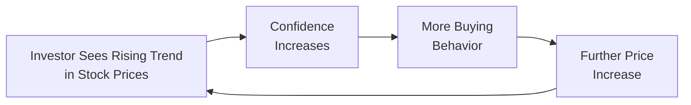

## Introduction and Context

If you’ve ever been in a conversation where everyone suddenly seems to agree that a particular stock “can’t lose,” you’ve likely witnessed herding behavior in real-time. It’s that moment when the entire group appears to follow the same investment trend—often chasing recent winners and pulling others into the wave. Well, this tendency can lead to price patterns that deviate from what we might expect if everyone was relentlessly rational. Such market patterns are often referred to as anomalies.

In this section, we’ll define what market anomalies are, explore how herding can create momentum, and consider why it sometimes results in speculative bubbles. And, because no bubble is forever, we’ll also look at how the longer-term reality check—through mean reversion—can suddenly change the game.

## Market Anomalies: A Behavioral Perspective

A “market anomaly” is effectively a deviation from what we’d expect under the standard assumption of an efficient market (where prices instantly reflect all available information in an unbiased manner). So, in an efficient market, investors would be rational machines, always updating beliefs whenever new data arrives. In reality, we’re human. We’re influenced by emotions, groupthink, recency bias, overconfidence, and more.

These nuanced human behaviors lead to recurring price patterns that puzzle classic economic theories. A few prominent anomalies include value anomalies, small-cap premiums, and—our focus here—momentum effects sustained by herding. The question is, why do these anomalies persist if there are indeed many smart and well-informed investors out there who should be arbitraging them away?

## Short-Term and Medium-Term Momentum

One recognized form of “anomaly” is momentum investing, which basically means picking out stocks (or other assets) that have been rising in price with the expectation that they’ll continue to rise. The underlying assumption is that winners keep winning, at least for some length of time. Let’s see how herd behavior might strengthen this effect:

• Recency Bias: Investors emphasize recent performance and assume it will continue.  
• Social Validation: When more investors jump in, everyone else thinks, “They must know something,” and also buys.  
• Self-Fulfilling Prophecy: The very act of widespread buying pushes prices further up, confirming the idea that these assets are “hot.”

### A Quick Story

I remember a friend who was new to finance—she’d caught wind of a certain tech stock that had soared 30% over the last quarter. She exclaimed, “It’s going to keep going—there’s no way it’ll stop!” So, she bought more as the price rallied. Then, a flood of positive tweets and talk-show mentions led to a wave of excitement, pushing the stock still higher. It was basically a communal feedback loop: positive sentiment led to more buying, which fueled even greater optimism, which attracted even more buyers. For a while, it seemed unstoppable. But then, well, the longer-term fundamentals started to matter again.

## Mean Reversion Over the Long Term

While momentum investing can pay off in shorter or medium time frames, another well-documented pattern is that of mean reversion. This concept asserts that most assets gravitate back toward their intrinsic value or a long-term average rate of return eventually—even if short-term momentum leads them to deviate for a while.

• **Fundamental Anchors**: Corporate earnings, macroeconomic factors, and discount rates have a way of pulling prices back into alignment.  
• **Profit-Taking**: When prices run too far above (or below) estimates of fair value, some investors will close out positions, halting the trend.  
• **Contrarian Strategies**: Certain managers specifically hunt for overheated assets to “short” or for underappreciated bargains to “go long,” pushing prices back toward rational levels.

If the momentum crowd piles in too heavily, the contrarian types might see an opportunity to exploit the likely reversion—knowing that markets often overreact to good (or bad) news. 

## The Role of Herding in Sustaining Momentum

When “everyone” jumps on the bandwagon, we call it herding. And it’s a powerful force because it tends to perpetuate trends, setting strong momentum in motion:

• **Social Cue Reliance**: Instead of thoroughly analyzing fundamentals, many people look to what others are doing.  
• **Fear of Missing Out (FOMO)**: If the market is accelerating, you might think, “I don’t want to be left behind; everyone is profiting except me!”  
• **Confirmation Bias**: Investors interpret fresh information in a way that supports the prevailing story, ignoring contradictory data.

These collective tendencies can cause price runs that extend well beyond reasonable valuations.

Below is a simple diagram showing how a herding-driven loop can reinforce itself:



### Momentum vs. Contrarian Strategies

To illustrate how momentum strategies contrast with contrarian approaches, here’s a quick comparison table:

| Strategy       | Key Idea                                 | Typical Holding Period | Core Psychology             |
|----------------|-------------------------------------------|------------------------|-----------------------------|
| Momentum       | Buy recent winners, sell recent losers    | Short to medium term   | Recency bias, trend-follow |
| Contrarian     | Buy undervalued, unloved stocks           | Longer term            | Exploit overreaction        |

Momentum strategies can deliver significant gains while the trend persists. But eventually, you risk a harsh reversal if the crowd realizes valuations are too frothy.

## Bubble Formation and Speculation

When momentum becomes rampant speculation, you can end up with a bubble. Picture a soap bubble: it looks shiny and can expand for a while, but everyone knows it’s fragile. Once the air comes rushing out:

• **Investor Euphoria**: Prices surge above any historical measure of fair value.  
• **Media Hype**: Positive news and social proof amplify illusions of endless uptrends.  
• **Over-Leverage**: Investors use borrowed funds to chase these “sure things,” fueling risk.  
• **Pop**: Some catalyst—maybe a disappointing earnings announcement—shatters confidence. Prices plummet as everyone tries to run for the exits simultaneously.

One classic example is the Dot-Com Bubble of the late 1990s. Although not all technology was bad, the mania became so extreme that valuations soared based on speculation rather than realistic earnings. Eventually, the bubble burst, and many “momentum” investors were left holding overpriced stocks.

## Recency Bias and the Reinforcement of Herding

Recency bias is the psychological phenomenon of placing too much weight on recent events. In portfolio management, this might show up when you lean too heavily on the past few quarters of returns, ignoring longer performance histories or fundamentals.

- **Availability of Information**: Right now, it’s easier than ever to watch daily stock price changes.  
- **Emotional Impact**: Recent gains or losses feel more salient, overshadowing historical averages.  
- **Leadership Shifts**: Market leadership (e.g., growth vs. value stocks) can rotate, and recency bias may cause you to miss the rotation.

## Practical Examples and Case Studies

1. **Tech Stock Mania**  
   In the 2020–2021 period, some tech companies witnessed tremendous gains. Investors, influenced by social media hype, piled in. The stocks soared higher monthly, in part because each new wave of buyers looked at the recent uptrend and assumed it would continue.

2. **Commodity Price Spikes**  
   Oil or precious metal prices can sometimes get caught in a hype cycle. Momentum traders ride the wave, analysts publish bullish reports, and the public sees headlines about surging prices. Meanwhile, fundamental supply-demand data might not justify the spike.

3. **Index Inclusion Effect**  
   Companies that join major indices like the S&P 500 often see a price jump, partly because many index funds must buy. This can trigger momentum as other investors latch onto the upward move. Over the long term, subsequent price performance may settle.

## Overcoming Behavioral Biases in Momentum

• **Structured Investment Process**: Use quantitative screens that evaluate both momentum indicators and fundamental ratios.  
• **Objective Policy Statements**: Keep a written Investment Policy Statement (IPS) that outlines under what conditions you buy and sell.  
• **Risk Management**: Put limits on position sizes, maintaining discipline even when the market feels euphoric.  
• **Diverse Information Sources**: Check data outside the echo chamber, including contrarian analysts or macro indicators.

## Python Snippet: A Simple Momentum Check

Below is a quick example (in Python) of how one might assess “winners” by looking at short-term returns. This is a trivial snippet, but it conveys the essence of a systematic approach:

```python
import pandas as pd
import numpy as np

returns = prices.pct_change().dropna()

momentum_scores = (prices / prices.shift(60)) - 1  # 60-day lookback

threshold = momentum_scores.quantile(0.75)
top_momentum = momentum_scores[momentum_scores > threshold]
```

In reality, a well-rounded strategy might combine signals for momentum, valuation, and risk constraints. 

## Best Practices and Potential Pitfalls

- **Avoid Overtrading**: Herding can induce frequent buy-sell decisions that rack up transaction costs.  
- **Stay Skeptical**: If everyone is euphoric, ask, “Is this actually sustainable?”  
- **Watch for Shifting Market Regimes**: Momentum can persist in bull markets but fade if sentiment sours.  
- **Monitor Fundamentals**: High momentum with no fundamental support is extra risky.  

## Exam Relevance and Tips

For the CFA exam, expect scenario-based questions that test your grasp of how behavioral biases (like herding or recency bias) can drive anomalies such as momentum. You might face an item set analyzing a portfolio manager’s decision to follow a hot stock, or an essay question asking you to weigh the trade-off between short-term momentum gains and the likelihood of long-term mean reversion.

• **Application to IPS**: Show how you would structure guidelines to prevent overconfidence and recency bias from influencing investment decisions.  
• **Calculation**: Understand simple screening methods (e.g., ranking stocks by past return) to identify momentum.  
• **CFA Institute Code of Ethics**: Even in a momentum play, investment professionals must ensure they’re not misleading clients by projecting unrealistic returns.

## Conclusion

Market anomalies like momentum can be driven, reinforced, and often distorted by herding behavior. Yes, a strong pattern might be exploited, and plenty of traders have earned remarkable profits by cleverly hopping onto a rising wave. However, prices frequently revert to their fair value over longer horizons. This interplay between short-term momentum and eventual mean reversion is a fundamental tension in portfolio management. 

Be wary of recency bias—sometimes referred to as “yesterday’s hero” effect—because it can exacerbate herd-driven pricing. And keep in mind that when speculation runs rampant, bubble-like conditions might form, leading to swift and painful corrections.

Staying aware of these forces and implementing robust risk controls can help you navigate the tricky balance between riding the wave and avoiding the crash.

## References and Further Reading

- Jegadeesh, N., & Titman, S. (1993). Returns to Buying Winners and Selling Losers. The Journal of Finance.  
- CFA Institute. (2022). Equity Asset Valuation.  
- Shleifer, A. (2000). Inefficient Markets: An Introduction to Behavioral Finance.  
- CFA Institute Code of Ethics and Standards of Professional Conduct.  

---

## Test Your Knowledge: Market Anomalies and Herding Behavior



### Which of the following best describes a “market anomaly”?
- [x] A price pattern or phenomenon that appears inconsistent with efficient market theory.
- [ ] A predictable return series explained by the capital asset pricing model.
- [ ] A standard deviation calculation method used in risk analysis.
- [ ] A governance practice that ensures ethical decision-making in trading.

> **Explanation:** Market anomalies are return patterns that traditional market theories struggle to explain, such as momentum, low-volatility effects, etc.

### What is one reason momentum strategies can be profitable in the short or medium term?
- [ ] Financial markets always price assets below their fundamental value.
- [x] Herding behavior and recency bias can drive short-term outperformance for rising stocks.
- [ ] Diversification across industries guarantees profits for all investors.
- [ ] Governments systematically protect investors from downside risk.

> **Explanation:** Herding and recency bias often create self-reinforcing price trends, which momentum strategies seek to exploit.

### According to the concept of mean reversion, how do stock prices tend to behave in the long run?
- [ ] They will never deviate from their fair values.
- [ ] They keep rising if investors continue buying.
- [ ] They commonly stay undervalued due to market inefficiencies.
- [x] They usually revert closer to their fundamental or average values over time.

> **Explanation:** Mean reversion suggests that extreme deviations from fair value eventually correct, returning prices toward a long-term mean.

### Which behavioral bias most directly supports the phenomenon of herding in financial markets?
- [ ] Overconfidence bias.
- [ ] Mental accounting bias.
- [x] Recency bias.
- [ ] Anchoring bias.

> **Explanation:** Recency bias leads investors to give disproportionate weight to recent price movements, encouraging them to follow the “hot” trend along with the crowd.

### When momentum strategies become disconnected from fundamental values, they may lead to:
- [ ] Peyton's Conjecture.
- [x] Speculative bubbles that can burst.
- [ ] Ordinary interest rate swaps.
- [ ] Risk-free arbitrage opportunities.

> **Explanation:** Overextending momentum investments beyond fundamental values creates a risk of bubbles, prone to rapid collapses when sentiment shifts.

### Which statement about herding is accurate?
- [ ] It always reflects in-depth, independent due diligence.
- [x] It can create self-fulfilling cycles of buying and rising prices.
- [ ] It rarely influences institutional investors.
- [ ] It is a purely rational decision-making process.

> **Explanation:** Herding behavior is often based on imitating others, which can cause feedback loops that push prices higher without fundamental justification.

### How might a contrarian investor behave in a market driven by momentum?
- [ ] Buy only the most overvalued stocks.
- [ ] Follow the trend just to avoid missing out.
- [x] Short the overvalued winners, anticipating a price reversion.
- [ ] Avoid all trading until the market cycle has completed.

> **Explanation:** Contrarian strategies look to capitalize on overreaction and mispricing, so they often bet against heavily hyped and overbought securities.

### Which factor is most associated with sustaining a momentum-driven “winning streak”?
- [ ] Sudden regulatory intervention.
- [x] Ongoing positive media sentiment and social proof.
- [ ] Dramatic improvement in real fundamentals overnight.
- [ ] Sizable increase in margin requirements.

> **Explanation:** Positive media coverage, analyst upgrades, and social validation perpetuate the enthusiasm, fueling further buying.

### What is one practical way to limit the negative impact of herding on an investment portfolio?
- [x] Establish risk controls and position limits that prevent excessive exposure.
- [ ] Only purchase stocks that have already doubled in value this year.
- [ ] Rely solely on peer recommendations for buy and sell decisions.
- [ ] Base all portfolio choices on recent headlines and social media trends.

> **Explanation:** Formal controls and well-defined processes help mitigate the emotional or crowd-driven impulses that lead to herding.

### True or False: Recency bias can cause investors to mistakenly assume a short-term winning trend will continue indefinitely.
- [x] True
- [ ] False

> **Explanation:** Recency bias overemphasizes the newest data or outcomes, leading to an unwarranted belief that a short-term pattern might persist long term.


