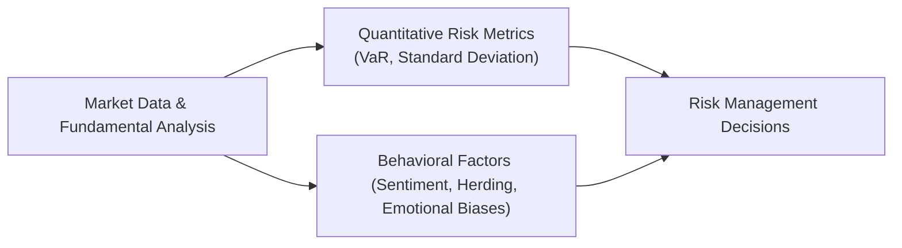

## Introduction
It’s funny how we, as finance professionals, like to think of ourselves as purely rational beings—sticking to our models, calibrating beta, calculating Value at Risk (VaR), and so on. But deep down, we know there’s a messy side to the markets driven by our own moods, fears, and occasional greed. One day, the markets look fine, and the next, we’re all in panic-mode hitting “Sell” faster than you can say “volatility.” These emotional ups and downs—often captured under the broad term “behavioral factors”—can dramatically reshape a risk management framework.

In traditional risk management, metrics like standard deviation, beta, and VaR are front and center. They’re essential tools, but they tend to treat human motivations as if they barely matter. In reality, unbridled fear or mass euphoria can create market distortions no standard deviation model can predict. Let’s go deeper into how these behavioral factors can affect your portfolio and, more importantly, how you can incorporate them into risk management practices.

## Behavioral Influences on Risk Management
Financial theory typically assumes that investors are rational, quickly absorbing new information into prices. Yet time and again, markets exhibit herding, panic liquations, or wild rallies fueled by sentiment. Integrating behavioral components into risk management means acknowledging that sometimes we’re our own worst enemies, especially under stress.

• Emotional triggers: News headlines, social media buzz, or sudden price drops can trigger an emotional response among investors.  
• Psychological heuristics: How folks frame gains and losses can drive irrational trades. Prospect theory, for instance, shows we hate losing more than we love winning.  
• Social proof: If we see everyone pulling out of a trade, we might second-guess our own analysis and “join the party,” even if that party is heading off a cliff.  

These patterns expand the scope of risk management from purely computational metrics—like a Sharpe ratio or expected tail loss—to also include intangible factors that come from real-world human behavior.

## Amplification Mechanisms
Have you noticed how sometimes a market can tumble on seemingly trivial news? Fear in the air intensifies that move; the bandwagon effect can turn minor tremors into a massive avalanche. Traditional metrics don’t always account for these feedback loops, which magnify volatility when behavioral factors are at play.

• Fear amplifies volatility: As fear grows, everyone rushes for the exit. Liquidity vanishes, bid-ask spreads widen, and stop orders trigger additional selling.  
• Greed exacerbates risk-taking: During bull markets, people chase high returns, ironically piling leverage onto overpriced assets. When reality sets in, the fall is that much harder.  
• Liquidity illusions: In calm times, liquidity looks plentiful. But in moments of crisis, illusions shatter, and fire-sale prices emerge rapidly.  

To put it simply, the typical standard deviation or VaR calculations might vastly underestimate the speed and severity of price adjustments that come from extreme investor behavior.

## Stress Testing with Behavioral Scenarios
One effective way to integrate behavioral elements is through stress testing. Most of us run stress tests based on historical crises—oil embargoes, subprime meltdown, or currency devaluations. However, you can extend these hypothetical stress tests to include behavioral triggers, such as:

• Panic selling scenario: Model what would happen if a large percentage of investors decide to liquidate positions simultaneously (often called a “mass redemption event”).  
• Overconfidence shock: Suppose analysts systematically overestimate future earnings, leading to a bubble-like environment. Then introduce a shock (e.g., central bank rate hike) that bursts the bubble.  
• Herding around a rumor: Evaluate tail risk if asset managers, all referencing the same viral rumor, reverse positions in unison.  

By blending standard risk models with these behavioral assumptions, you can gain a more holistic picture of potential drawdowns.

## Monitoring Investor Sentiment
Sure, you can read the usual macro signals. But to understand the collective mood, you might also want to watch for “Investor Sentiment Indicators”. These indicators go beyond classical data:

• Social media sentiment: Yes, scraping Twitter or finance forums can provide early hints of brewing panic or euphoria.  
• Consumer confidence indices: A slump in consumer confidence might precede rapid shifts in investment behavior.  
• Fund flow data: Where is the money headed? Significant inflows or outflows from specific asset classes can signal a regime change in market mood.  

Blending these sentiment signals into your approach can help you anticipate market waves before they swell into a tsunami.

### A Quick Example with Python
Below is a short snippet showing how you might parse sentiment data in Python. Let’s say you have a CSV file with daily sentiment scores that range from –1 (very negative) to +1 (very positive). You can add a rolling average to spot trend shifts:

```python
import pandas as pd

df = pd.read_csv("investor_sentiment.csv")

df['rolling_sentiment'] = df['sentiment_score'].rolling(window=5).mean()

print(df.tail(10))
```

This sort of “quick hack” can highlight anomalies or abrupt shifts in mood. You might then feed that rolling sentiment score into your risk model for an extra layer of insight.

## Governance and Decision Protocols
Behavioral risk isn’t just an individual affair. On an organizational level, your firm’s governance structure can help mitigate (or, if poorly designed, aggravate) behavioral biases.

• Separation of duties: When the same portfolio manager also oversees risk controls, the impetus to highlight negative signals might be weaker.  
• System of checks: Deploy risk committees or boards that sign off on major decisions, especially in high-volatility windows. 
• Culture of openness: Teams that encourage questioning and devil’s-advocate thinking are less likely to fall prey to groupthink.  

And hey, I’ve seen it up close: if a firm’s leadership panics, that mood seeps throughout the entire team. It’s easier to maintain discipline when you have clear protocols and an empowered risk department that’s not afraid to wave a yellow or red flag when needed.

## Case Study: Panic-Selling in an Emerging Market
I once consulted for a fund with substantial exposure to an emerging market that abruptly announced a policy change—something about foreign currency controls. Overnight, social media chatter went wild, speculating that the local currency would crumble. Before any official data confirmed this, we saw a wave of redemption requests coming in. Traders started dumping positions, deepening a self-fulfilling panic spiral. 

A purely quantitative risk model might have signaled only mild changes in volatility at first, reflecting limited historical reference for such a policy shift. But in reality, the extreme short-term outflows and negative sentiment created a liquidity crisis. By mid-week, the fund’s managers realized they had to close trades at rock-bottom prices. 

How could this have been handled differently?  
1. Stress testing for a mass redemption event.  
2. Early incorporation of social media signals, anticipating the policy rumor’s serious psychological impact.  
3. Strong leadership from the risk committee to adopt a phased withdrawal policy instead of throwing everything overboard.  

## Incorporating Behavioral Factors into a Risk Management Framework
So, how do you systematically fuse this “behavioral lens” into your day-to-day risk processes? One approach is to create a dual risk management engine:



Step-by-step synopsis:
- Gather both traditional market data (for standard VaR, volatility, correlation measures) and alternative data sources (investor sentiment, fund flows, social media analysis).  
- Evaluate potential biases in the data. For instance, are you overweighting extremely negative sentiments? Are you ignoring longer-term fundamentals?  
- Incorporate scenario analysis that includes behavioral “shock events.”  
- Present integrated results to risk committees and decision-makers for final calls on hedges, allocations, or capital buffers.

This dual framework ensures that you’re not only looking at the numeric side but also the human element that might be fanning the flames of certain market moves.

## Conclusion
At the end of the day, behavioral factors can be as potent—if not more so—than raw financial data. Incorporating them enriches your risk management toolkit, providing a 360-degree view of potential pitfalls. It may feel like extra effort to track sentiment or run “emotional scenario” analysis. But clinging to purely quantitative metrics without acknowledging our own investment biases can lead to big surprises when markets turn.

So, the next time you’re updating your risk models, maybe ask yourself: Am I factoring in how real humans might overreact or underreact to news? Understanding that piece might spell the difference between a well-managed portfolio and one that gets blindsided by fear, greed, or mass panic.

## Glossary
• Behavioral Risk: The risk of substantial portfolio impact driven by irrational or emotional investment decisions.  
• Stress Testing: A simulation analysis of how a portfolio would perform under extreme or rare events, helping identify potential vulnerabilities.  
• Investor Sentiment Indicator: A metric gauging the aggregate mood of investors—positive, negative, or neutral—through signals like polls, trade volumes, or even social media.  
• Mass Redemption Event: A situation where a large percentage of investors withdraw or liquidate capital simultaneously, triggering liquidity nightmares.

## References & Further Reading
• Lo, A. W. (2012). Adaptive Markets: Financial Evolution at the Speed of Thought. Princeton University Press.  
• CFA Institute. (2015). Global Guide to Risk Management.  
• Kahneman, D. (2011). Thinking, Fast and Slow. Farrar, Straus and Giroux.  
• Shiller, R. (2015). Irrational Exuberance (3rd ed.). Princeton University Press.  

## Test Your Mastery: Behavioral Factors in Risk Management



### Which of the following best describes the concept of "behavioral risk"?  
- [ ] The risk associated solely with regulatory changes.  
- [x] The portfolio impact stemming from irrational or emotional investment decisions.  
- [ ] The chance that market volatility remains stagnant.  
- [ ] The risk that existing biases will be permanently removed from investor psychology.  

> **Explanation:** Behavioral risk arises from emotional and psychological factors that affect investment decisions, leading to potentially irrational market actions.

### During a mass redemption event, which of the following is most likely to occur first?  
- [ ] Liquidity remains stable due to central bank intervention.  
- [ ] Investor sentiment improves abruptly.  
- [x] Investors rush to liquidate, deepening a sell-off.  
- [ ] Collateral requirements are immediately lowered.  

> **Explanation:** In a mass redemption event, fear or uncertainty typically prompts many investors to sell holdings simultaneously, which often accelerates the downward pressure on prices.

### One primary reason to monitor investor sentiment, such as social media trends, is:  
- [ ] It removes the need for standard deviation calculations.  
- [x] It can offer early signals of panic or euphoria not captured by classic metrics.  
- [ ] It automatically stabilizes liquidity spreads.  
- [ ] It reliably predicts central bank policy changes.  

> **Explanation:** Social media sentiment can reveal shifts in investor mood well before they’re reflected in traditional market data, allowing for earlier risk mitigation.

### Which of the following methods best integrates behavioral factors into risk management?  
- [ ] Relying entirely on historical correlation data.  
- [x] Incorporating scenario analyses that model herd behavior or overconfidence shocks.  
- [ ] Eliminating any form of quantitative analysis.  
- [ ] Using only volatility metrics for market exposure.  

> **Explanation:** Scenario analyses allow practitioners to simulate behavioral triggers such as herding or excessive optimism—factors that traditional models often overlook.

### In an organization’s governance structure, a key approach to manage behavioral risk is:  
- [x] Creating checks and balances through committees that question major decisions.  
- [ ] Centralizing all risk and portfolio management in one person’s hands.  
- [ ] Saving all risk reviews for an annual meeting.  
- [ ] Only consulting external advisors when panic is already underway.  

> **Explanation:** Having active governance bodies fosters diverse viewpoints, reducing the probability of groupthink or emotional missteps.

### When fear in the market amplifies volatility, which of the following outcomes is most probable?  
- [x] Liquidity providers withdraw, causing wider bid-ask spreads.  
- [ ] The market remains unaffected by panic selling.  
- [ ] Greed and risk-taking suddenly increase.  
- [ ] Portfolio managers automatically adjust to rational strategies.  

> **Explanation:** As fear spreads, liquidity can dry up, forcing prices downward and increasing the cost of trading through a wider bid-ask spread.

### Why might a purely quantitative risk model underestimate losses during times of crisis?  
- [ ] Behavioral biases always reduce potential losses.  
- [x] Emotional sell-offs and herding can accelerate downward price spirals beyond historical norms.  
- [ ] Regulatory constraints guarantee lower volatility.  
- [ ] A mass redemption event tends to drive prices up.  

> **Explanation:** Models calibrated on historical data might fail to capture the intensity and speed of panic-driven selling, leading to underestimation of tail risk.

### Which factor is most characteristic of “herding” in financial markets?  
- [ ] Investors carefully analyzing fundamentals before selling.  
- [x] A large group of investors following each other’s trades with minimal independent judgment.  
- [ ] Uniform price stability across all asset classes.  
- [ ] Central banks imposing restrictions to block both buying and selling.  

> **Explanation:** Herding occurs when investors follow others’ behavior rather than rely on their own analysis, often compounding market swings.

### What is the primary function of including sentiment-based inputs in a dual risk management framework?  
- [x] To complement quantitative metrics by detecting possible emotional extremes.  
- [ ] To replace VaR and standard deviation altogether.  
- [ ] To reduce compliance requirements.  
- [ ] To isolate the effect of purely fundamental news.  

> **Explanation:** Behavioral components, like sentiment data, plug gaps that traditional metrics leave open, giving a fuller view of imminent market risks.

### True or False: Integrating behavioral factors into risk management requires discarding traditional quantitative models entirely.  
- [ ] True  
- [x] False  

> **Explanation:** Behavioral factors should complement—not replace—quantitative analyses, offering a more complete risk assessment.


