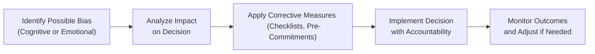
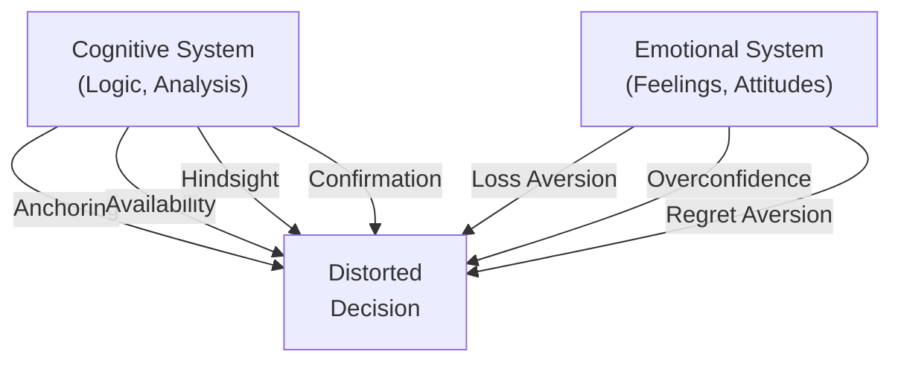

## Distinguishing Cognitive from Emotional Biases

When we talk about biases in investing, we're essentially explaining how our brains lead us astray. Sometimes the errors come from purely rational shortcuts—what we call cognitive biases—and sometimes they’re more about our feelings, impulses, or even raw fear—these are emotional biases. You might think, “Surely my decisions are logical,” but in reality, nearly all of us slip into biases more often than we'd like to admit.

Cognitive biases typically arise from incomplete information processing or from an overreliance on a mental rule. These biases often feel logical and can sneak into our analyses without us even noticing. Emotional biases, on the other hand, are more about how we feel than how we think. They can lead us to make impulsive decisions: refusing to sell a losing stock out of a sense of attachment, or panic-selling a portfolio the moment the market shows a dip. In Chapter 5.1 (Introduction to Behavioral Finance), we outlined how these biases form part of the broader field of behavioral finance. This section dives deep into identifying them and exploring ways to mitigate their impact.

## Cognitive Biases

Cognitive biases usually stem from individual thought processes, knowledge limitations, or misguided heuristics. Let’s take a closer look at a few:

Anchoring Bias  
Investors often fixate on an initial reference point—like the price at which they bought a stock—and adjust too little from that anchor. If you purchased a stock at $50 a share, you might cling to that figure as its “fair value,” even if market conditions have changed drastically. Ironically, you might hold onto the asset waiting for it to “come back” to $50, ignoring evidence that its actual value might now be $30 or $60.

Availability Bias  
This is the tendency to rely on the most readily available information rather than the most relevant. For example, you might buy a hot technology stock because it was recently all over the financial news, but you skip thorough due diligence on its fundamentals. Availability bias can lead you to overlook better opportunities that aren’t generating the same buzz.

Hindsight Bias  
People often believe they “knew it all along” after an event has occurred. If you look back at the 2008 financial crisis, you might be tempted to say you “knew housing prices were too high.” Such a mindset can cause overconfidence in future decision-making, because the lessons gleaned from properly analyzing events get replaced by over-simplified “I predicted it” narratives.

Confirmation Bias  
Ever catch yourself reading analyses that confirm what you already believe and ignoring research that challenges your view? That’s confirmation bias. It’s a major culprit when an investor zeros in on cherry-picked facts and filters out conflicting information, leading to misguided conclusions.

## Emotional Biases

Emotional biases are trickier because they’re rooted in feelings and impulses. While cognitive biases can sometimes be corrected with training and more data, emotional biases persist—no matter how strong the analysis—because we often guard our emotional comfort zones.

Loss Aversion  
Losses sting more than equivalent gains feel good. If you've ever caught yourself holding a losing position for too long—saying, “I can’t bear to realize this loss right now, so I’ll wait”—that’s loss aversion at work. It can lead to suboptimal portfolios, cluttered with lagging positions and missed opportunities.

Overconfidence Bias  
This is a classic one. Overconfidence leads investors to overestimate their skills, knowledge, or the precision of their forecasts. Something in your gut might say, “I’ve done this for years; I can see what’s coming.” You might overweight your portfolio in certain sectors or skip essential risk management steps. Plus, you can underestimate the role of luck in your previous successes.

Regret Aversion  
Have you ever avoided a potentially great trade just because you’re terrified of regretting a wrong move? Regret aversion can paralyze decision-making. In severe cases, it hinders growth by causing you to default to “doing nothing,” hoping to avoid mistakes. Ironically, that inaction can generate even larger regrets later when you’ve failed to position for market opportunities.

## Effects on Investment Decisions

Cognitive and emotional biases don’t just live in theory. They seep into real-life investment decisions, sometimes revealing themselves in the most high-stakes circumstances:

• Overpaying for Growth Stocks  
  Emotional excitement about a growing tech start-up might overshadow logical valuation metrics. If you’re too attached to the narrative of endless expansion, you might pay inflated prices.  
• Selling at the Worst Possible Time  
  Emotionally driven panic can lead investors to sell their holdings en masse during market shocks (think about sudden dips caused by geopolitical news). Meanwhile, rational analysis might say to hold—or even to buy.  
• Holding Falling Positions  
  Anchoring and loss aversion often keep you stuck in a losing trade. You might keep repeating, “I just want to get back to my original purchase price.” This can be extremely costly.

If you look at prior chapters—like Chapter 2 on Portfolio Risk and Return, or Chapter 3’s discussion of systematic vs. nonsystematic risk—none of that objective analysis matters if biases take over. For instance, a well-designed diversification strategy (Chapter 2.5 Effects of Correlation on Portfolio Risk) could lose its effectiveness if you let your emotional attachments override the plan and allocate heavily to a single “favorite” stock.

## Strategies to Mitigate Biases

You might ask, “Well, if these things are so powerful, how do we fight them?” Thankfully, there are structured ways to keep biases in check:

Build a Formal Investment Policy Statement (IPS)  
A well-crafted IPS, as covered in Chapter 4.1, sets predetermined guidelines for risk tolerance, asset allocation, and rebalancing triggers. This supports disciplined decision-making and minimizes the scope for impulsive trades.

Use Checklists and Structured Processes  
Similar to a pilot’s pre-flight checklist, an investment checklist might require you to confirm specifics such as:  
• True value estimates from multiple sources.  
• Evaluation of best- and worst-case scenarios.  
• Proper risk assessment, including scenario testing and stress testing (Chapter 6.5).  

Keeping track ensures you systematically address potential blind spots rather than relying on “gut feeling.”

Encourage Accountability and Peer Review  
Working in a team environment with clearly assigned roles can help validate decisions. If you’re prone to overconfidence, ask a colleague (or an external advisor) to play the “devil’s advocate.” Structured feedback loops can spot emotional or cognitive biases before they contaminate the trade.

Adopt a Pre-Commitment Approach  
You might set a rule: “If my stock drops by 10% from purchase, I’ll revisit the assumptions that justified my buy decision.” This approach forces you to reflect on whether you’re anchoring or letting loss aversion creep in.

Because emotional biases stem from personal dispositions (fear, pride, regret), they can be more stubborn. Behavioral coaching—perhaps with a financial therapist or counselor—might be necessary for those who repeatedly violate rational guidelines. But even standard portfolio management tools, like rebalancing or risk monitoring dashboards, can help bring objectivity back to the conversation.

Below is a simple flow diagram of a structured mitigation process:

## Market Examples and Case Studies

Let’s shout out a couple of real-world scenarios where biases played out in spectacular ways:

Dot-Com Bubble (Late 1990s)  
Investors assumed that every internet-related company was bound for stratospheric success. There was a serious availability bias from relentless media coverage: all you’d see in the news was “dot-com success stories.” Then overconfidence set in, with many believing they had a proven knack for picking winners. People poured money into unprofitable start-ups, ignoring fundamental metrics. The crash in 2000–2001 illustrated how biases can compound to create market-wide overvaluations.

Panic Selling in 2008  
During the financial crisis, fear and uncertainty spiked. Many investors gave in to emotions, pulling money out at market lows—only to miss the recovery. Loss aversion and heightened risk aversion overshadowed rational forecasts. Meanwhile, a balanced perspective might have encouraged a patient approach or even opportunistic buying when assets were depressed.

IPO Anchoring  
If a company’s share price soars on day one, there's often strong anchoring to that initial surge. Even if the stock’s fundamentals might not justify such a valuation, people hold onto the opening day price as a reference point. Soon, if the stock dips below that price, some investors refuse to sell—waiting endlessly for a bounce back to their anchor.

## Best Practices and Common Pitfalls

It’s not enough to simply know about biases. We can also benefit from adopting best practices to ensure we don’t keep falling into the same traps:

• Separate Analysis from Emotions  
  Pre-trade frameworks should emphasize objective data—like valuation multiples, sector prospects, or macroeconomic indicators. Emotional attachments to certain industries, trends, or hearsay can hamper rational evaluation.

• Document Investment Decisions in Real Time  
  Write down your rationale for each trade. Note the data points and assumptions driving your action. Later, you can compare the actual outcomes to your stated strategy. This exercise can highlight recurring biases.

• Embrace Long-Term Perspectives  
  Concentrating on short-term market fluctuations often triggers emotional biases, especially fear and greed. Aligning your strategy with a multi-year horizon can help keep daily noise in perspective.

• Avoid “Hindsight Traps”  
  After an outcome, it’s tempting to say you knew exactly what would happen. You might even discount relevant data that contradicted your thesis. Being mindful of hindsight bias prompts a more honest review of your performance.

Pitfalls arise when investors place too much faith in single data points, rely on sensational news, or let short-term emotions wipe out solid plans. Even professional money managers with advanced quantitative tools can succumb to these pitfalls, showing how universal the problem is.

## Diagrams to Visualize Bias Interactions

Below is a conceptual diagram illustrating how various biases can intersect within an investor’s mind:

The two main systems—cognitive and emotional—feed into the final investment decision. In practice, analyzing these feedback loops can help identify and correct the underlying biases.

## Practical Exam Tips

Exam questions in Behavioral Finance often focus on identifying a specific bias in a scenario and then suggesting a way to address it. Here are some tips:

• Pay attention to keywords or phrases signaling “fear” or “regret” (emotional bias) or “fixation on initial info” or “selective recall” (cognitive bias).  
• Look for solutions that emphasize structured processes or a deliberate approach to offset subjective impulses.  
• Be ready to discuss both short- and long-term investing implications, connecting them to specialist concepts like portfolio rebalancing (Chapter 4.5) or risk management frameworks (Chapter 6.2).  
• In item set or essay questions, demonstrate how you might design an IPS or a checklist to counter these biases. That approach shows a strong practical understanding of how to handle real-world client scenarios.

Bring your knowledge from earlier chapters together: show how measuring risk (Chapter 2) and building portfolio strategies (Chapter 4) can be undermined by biases if you’re not vigilant. In your answers, blend the theoretical knowledge with practical examples, describing exactly why a particular bias applies and how you’d mitigate it.

## References & Further Reading

Kahneman, D. (2011). Thinking, Fast and Slow. Farrar, Straus and Giroux.  
Pompian, M. M. (2012). Behavioral Finance and Investor Types. Wiley.  
CFA Institute (2025). CFA® 2025 Curriculum – Level I, Volume 9: Portfolio Management.  
For broader insights on risk frameworks and ethics:  
• CFA Institute Standards of Practice Handbook (most recent edition).  
• Various professional articles on accountability frameworks, investor psychology, and risk governance.

## Test Your Knowledge: Cognitive Errors and Emotional Biases in Portfolio Management



### Which bias best describes an investor who refuses to sell a stock merely because it was purchased at a higher price?  
- [ ] Availability bias  
- [x] Anchoring bias  
- [ ] Confirmation bias  
- [ ] Regret aversion  

> **Explanation:** Anchoring bias involves holding on to the initial purchase price as a reference point and failing to adjust despite new information.

### An investor who browses only bullish market reports and ignores any opposing evidence is demonstrating:  
- [ ] Loss aversion  
- [ ] Hindsight bias  
- [x] Confirmation bias  
- [ ] Overconfidence  

> **Explanation:** This is confirmation bias, where the investor filters out data that does not align with pre-existing beliefs.

### Which bias arises from an emotional fear of feeling remorse after a decision goes badly?  
- [ ] Hindsight bias  
- [ ] Availability bias  
- [ ] Anchoring bias  
- [x] Regret aversion  

> **Explanation:** Regret aversion is the avoidance of decisions due to an excessive fear of future regret, which can lead to inaction.

### When an investor claims “I knew it all along” after seeing the outcome of an event, they are likely demonstrating:  
- [x] Hindsight bias  
- [ ] Overconfidence bias  
- [ ] Availability bias  
- [ ] Anchoring bias  

> **Explanation:** Hindsight bias is the inclination to see past events as predictable—even if they were not.

### An investor who systematically overestimates the accuracy of their own forecasts is most likely showcasing:  
- [ ] Loss aversion  
- [x] Overconfidence bias  
- [ ] Anchoring bias  
- [ ] Availability bias  

> **Explanation:** Overconfidence bias refers to overestimating the precision of personal judgment or skill.

### Which bias is rooted in feeling the pain of losses more acutely than the pleasure of gains?  
- [x] Loss aversion  
- [ ] Availability bias  
- [ ] Confirmation bias  
- [ ] Hindsight bias  

> **Explanation:** Loss aversion describes an investor's disproportionate emotional reaction to losses versus gains.

### In a team meeting, an analyst always references a recent and widely circulated market report instead of looking at broader data. This exemplifies:  
- [ ] Regret aversion  
- [x] Availability bias  
- [ ] Loss aversion  
- [ ] Hindsight bias  

> **Explanation:** Availability bias involves emphasizing readily available information rather than seeking more relevant but less immediate data.

### What is the main reason emotional biases tend to be harder to correct than cognitive biases?  
- [ ] Emotional biases are based on historical data.  
- [ ] Cognitive biases reflect deeper psychological patterns than emotional biases.  
- [ ] Emotional biases are always profitable in the long run.  
- [x] Emotional biases arise from personal feelings, making them more resistant to rational correction.  

> **Explanation:** Emotional biases spring from deeper personal emotions, making them harder to regulate through purely logical or training-based approaches.

### During a market crash, an investor sells all equities in a panic, ignoring their long-term strategy. Which bias is most evident?  
- [x] Emotional bias driven by loss aversion  
- [ ] Cognitive bias driven by anchoring  
- [ ] Cognitive bias driven by availability  
- [ ] Emotional bias driven by regret aversion  

> **Explanation:** The panic-selling suggests that fear of loss is dominating rational planning.

### True or False: Documenting the rationale for each investment decision can help mitigate both cognitive and emotional biases.  
- [x] True  
- [ ] False  

> **Explanation:** Writing down investment logic provides a reference for reflection, reducing the likelihood of making decisions based purely on unfounded beliefs or fleeting emotions.


