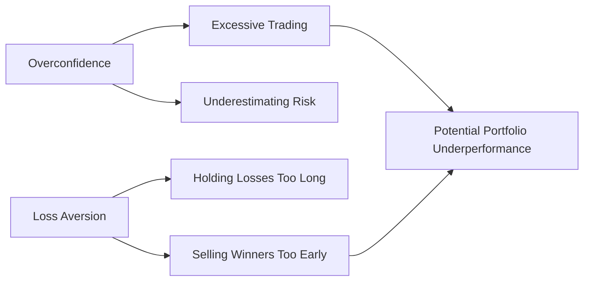

## Introduction

Behavioral biases are those little mental shortcuts—and sometimes, let’s be honest, big stumbling blocks—that cause us to deviate from rational decision-making. It’s one thing to talk about mean–variance optimization and all those fancy risk–return models, but reality sets in once real people with real emotions step onto the investing stage. As much as we’d love to be fully rational Homo economicus, our brains can lead us astray.

In this section, we’ll take an up-close look at several of the most common investor biases—overconfidence, loss aversion, herding, confirmation bias, and the disposition effect—and show how they affect decisions in the real world. We’ll see how multiple biases can interact, compounding their negative impacts. Throughout, we’ll also offer practical examples to keep things grounded, along with a short glossary and references. Let’s get going!

## Why Behavioral Biases Matter in Portfolio Management

So, what’s the big deal? Why do we need to study biases or figure out how they pop up in day-to-day portfolio management? Well, ignoring them, or assuming that “rational agents” always hold sway, can lead to flawed forecasting, excessive trading costs, or even meltdown-level events—like the tech bubble of the early 2000s or the real estate mania leading up to the financial crisis of 2007–2008.

Beyond big headlines, biases can creep into every corner of a portfolio manager’s work. For example, an overconfident manager might overweight certain stocks just because their gut feeling says so, or hold onto a losing trade hoping “it’ll come back.” The result? Potential underperformance, needless risk, and, ironically, a disservice to client objectives. The CFA Institute Code and Standards strongly emphasize that managing clients’ best interests also includes acknowledging psychological pitfalls.  

## Overconfidence Bias

Overconfidence is often described as the tendency to overestimate the accuracy of one’s knowledge, skill, or predictive abilities. We get carried away with how brilliant we think we are—kind of like that time you were sure you could assemble IKEA furniture in record time. Then halfway through, you realized you missed a whole page of instructions.

### Manifestations of Overconfidence

• Excessive Trading: Overconfident investors may trade more frequently than necessary, believing they possess superior market timing or unique insights.  
• Underestimation of Risks: Overconfidence can lead to ignoring downside risks or fundamental market threats.  
• Narrow Diversification: A belief in one’s ability to pick “winners” might cause concentration in a few stocks or sectors, ignoring basic portfolio theory guidelines.

### Example: Dot-Com Boom and Bust

During the dot-com mania of the late 1990s, many investors and fund managers assumed their holdings in internet startup companies would keep going up forever. “We can’t lose. We’ve picked the next big thing,” was the prevailing sentiment. Fast-forward to March 2000, and the NASDAQ peak gave way to a massive collapse. Overconfident investors realized too late that no amount of “vision” could outrun fundamentals forever.

## Loss Aversion

Loss aversion suggests that losses hurt us significantly more than equivalent gains make us feel good. Some psychologists suggest a loss can feel about twice as powerful as a gain of the same size. Ever hold on to a losing stock, telling yourself, “Um, I’ll just wait until it gets back to my purchase price.”?

### Manifestations of Loss Aversion

• Holding Losers Too Long: Investors cling to declining positions to avoid the pain of realizing a loss. This can lead to bigger and bigger drawdowns.  
• Selling Winners Too Soon: Paradoxically, loss-averse investors are eager to lock in small gains quickly, preventing a possible drop below their initial purchase price.

### Example: Real Estate Boom/Bust

Let’s say you bought a property at the peak of a real estate cycle. Suddenly, the market plunges, and your property is underwater. Rather than take the loss and sell, you hold on, hoping it’ll pop back up. Meanwhile, if your property is in a region with weakening fundamentals (e.g., oversupply, shrinking job base), the chance of recovery might be lower than you think. That unwavering hold can cost you more in interest payments, opportunity costs, and stress.

## Herding

Herding is the inclination to follow the crowd, especially in periods of uncertainty. The logic might be: “Hey, everyone else seems to be chasing this hot IPO, so it’s probably a good idea. They know something I don’t.” That sense of safety in numbers can be irresistible.

### How Herding Distorts Markets

• Asset Price Bubbles: Herding inflates prices beyond fundamental values, as seen in speculative manias for everything from tulips (in 17th-century Netherlands) to cryptocurrencies.  
• Momentum Trading: Sometimes herding leads to short-term momentum where upward (or downward) price swings attract more participants, creating a self-fulfilling prophecy—until it all unravels.  
• Groupthink Among Professionals: Even seasoned portfolio managers are not immune. Analysts on the sell side might produce homogeneous recommendations if they see peers praising the same stock or sector.

### Case in Point: Tech Bubble Mania

The late 1990s dot-com scenario is again a prime illustration. People hopped onto internet stocks regardless of business models or actual revenue. The crowd effect was so strong that many demanded an entry into “the new economy,” ignoring valuations or rational metrics. Post-crash, the same group realized that not all “innovations” are sustainable.

## Confirmation Bias

Confirmation bias occurs when we look for information and clues that validate our existing views, conveniently ignoring contradictory evidence. “I just knew I was right,” we say, as we scroll through sources that cheerlead the same perspective.

### Impacts on Investment Decisions

• Distorted Research: Investors might read only bullish analyst reports if they’re bullish themselves, reinforcing their existing stance, then skip over any negative highlights.  
• Poor Risk Management: If new data suggests a stock’s fundamentals are deteriorating, an investor with confirmation bias might downplay it, missing an exit sign.  
• Reinforced Echo Chambers: In the age of social media, it’s easy to join communities that share a similar investment angle. That bubble can lead to groupthink and intensify emotional convictions.

### Example: Biased Portfolio Reviews

Say you’re bullish on the biotechnology sector. You keep reading research that’s positive on biotech. You might be ignoring crucial information on FDA approval rates, clinical trial mishaps, or even shifting regulatory frameworks. If you’re not balanced in your review, you’ll be blindsided when unexpected negative events surface.

## Disposition Effect

While closely related to loss aversion, the disposition effect specifically pinpoints the tendency to sell winning investments too early and keep losers for too long. It’s basically a behavioral pattern that lumps together our desire to “book profits” promptly while avoiding the harsh reality of “locking in losses.”

### Behavioral Drivers

• Emotional Accounting: Investors might feel the “win” is only real if they sell at a profit. Conversely, ignoring a losing position on paper keeps the “loss” from feeling real.  
• Anchoring to Purchase Price: We fixate on the initial buy price rather than focusing on the asset’s current fundamentals or future prospects.  

### Example: Holding a Struggling Stock Through Earnings

Imagine you bought a tech company’s shares at $50. Soon after, the price drops to $30. Instead of analyzing the actual reason for that decline—maybe the company’s product pipeline is failing or margins are shrinking—you hang onto it. “It’s got to come back,” you tell yourself. Meanwhile, you might prematurely have sold a stock that rose from $50 to $60, just to lock in that $10 gain. The net effect is a suboptimal portfolio.

## Multiple Biases Compounding Irrational Decisions

Here’s the kicker: these biases do not typically appear in isolation. A manager could be both overconfident and prone to confirm only the good news, while also being loss-averse. When biases converge, the distorted behavior can get amplified.

• Overconfidence + Confirmation Bias: You overestimate your skill, and you also ignore contradictory data. That’s a recipe for ignoring key signals that your trade is going south.  
• Loss Aversion + Disposition Effect: You hold onto losers longer and sell winners too soon, compounding the portfolio’s drag.  

It’s like mixing questionable cooking ingredients: once they’re all tossed together, the resulting stew can be pretty unpalatable.

## Real-World Market Examples

### Tech Bubble of the Late 1990s

• Overconfidence: Fund managers believed they had perfectly timed entry into emerging “internet titans.”  
• Herding: New retail investors, longing to join the hottest market, jumped in because “everyone else is.”  
• Confirmation Bias: Analysts touting sky-high “page views” as a new metric for a company’s success, ignoring lack of profits.  

Eventually, gravity and rational value prevailed.

### Real Estate Bubble (Mid-2000s)

• Loss Aversion: Homeowners refused to sell when prices started to decline, hoping a rebound was around the corner.  
• Herding: Buyers piled in, believing “real estate never goes down,” influenced by friends, neighbors, and the media.  
• Disposition Effect: Some individuals flipped homes quickly if they gained a small profit, while continuing to hold properties that started losing value.

## Visualizing Common Biases

Below is a Mermaid diagram illustrating how some of these biases lead to specific outcomes in a typical investment process:

This simplified depiction shows how overconfidence or loss aversion can independently or collectively result in poor portfolio performance. Of course, in the real world, it’s even more complex, as biases can come from multiple directions.

## Overcoming Behavioral Pitfalls

Admittedly, biases can be tough to eliminate. But with awareness and strategy, you can mitigate their impact:

• Use Checklists: Structured processes for research or trade decisions encourage objectivity.  
• Precommitment Strategies: Decide on exit positions (stop-loss or trailing stops) before emotion sets in.  
• Seek Contrary Opinions: Make it a habit to read research that opposes your original viewpoint.  
• Diversify Decision-Making: Involve team members with different perspectives; reduce groupthink.

### Example of a Structured Process

One manager might use a “devil’s advocate” approach—officially designating one team member to challenge every bullish thesis, forcing the group to consider negative scenarios. Another approach is a “portfolio triage” meeting, scheduled quarterly: if a stock has fallen 20% below the purchase price without signs of improvement, re-examine it rigorously.

## Practical Applications in Portfolio Management

Recognizing these biases isn’t just academic. It translates into real steps you can take for your clients:

• Incorporate Realistic Return Assumptions: Overconfidence can lead to overly rosy forecasts. Base your expected returns on long-term averages and scenario analyses.  
• Rebalance Regularly: Automated rebalancing can help offset any reluctance to sell losers or hold onto winners past their prime.  
• Stress Testing: By running adverse scenarios, you confront the possibility that the investment thesis might be wrong—counteracting confirmation bias.  
• Educate Clients: Often, it’s not just the asset manager but the client who’s biased. Explaining these pitfalls can help shape better client expectations.

## Ethical Considerations

The CFA Institute Code of Ethics emphasizes putting the client’s interests first, acting with independence and objectivity, and striving to maintain professional competence. Behavioral biases can impede each of these tenets if left unchecked. For instance, if an overconfident manager churns the portfolio, it can create unnecessary fees and potential conflicts with the client’s best interest. Staying informed about these biases and systematically mitigating them is a key part of acting ethically.

## Glossary

• Herding: The tendency to mimic the actions of a larger group, driven by social pressure or assumptions of group expertise.  
• Confirmation Bias: Searching for, interpreting, and recalling information in a way that confirms pre-existing beliefs.  
• Disposition Effect: The behavioral pattern of selling winning positions too early and holding losing positions too long.  
• Cognitive Dissonance: The mental discomfort from holding contradictory beliefs or values simultaneously (e.g., believing a stock is undervalued while seeing data that it might be overvalued).

## Final Exam Tips

• Expect Scenario-Based Questions: Be prepared to apply these biases to hypothetical market situations or real-world cases. The CFA exam often provides a scenario and asks you to identify which bias is at play.  
• Practice Constructed Responses: Explain not just the bias, but how it manifests. For instance, highlight the difference between overconfidence and confirmation bias by providing example statements or behaviors.  
• Time Management: Behavioral finance questions can be deceptively simple. Don’t overthink them, but do carefully read each detail in the item set—this is where valuable context hides.  
• Link to Ethical Conduct: The CFA Program frequently tests your ability to see how biases might violate the Code of Ethics and Standards of Professional Conduct.  
• Revisit Key Definitions: Make sure you know the definitions of each bias well, but also be ready to illustrate them with credible examples.  

## References & Further Reading

• Shiller, R. J. (2015). Irrational Exuberance (3rd ed.). Princeton University Press.  
• Shefrin, H. (2007). Beyond Greed and Fear: Understanding Behavioral Finance and the Psychology of Investing. Oxford University Press.  
• CFA Institute. (Latest Edition). CFA Institute Code of Ethics and Standards of Professional Conduct.  
• Articles on Behavioral Economics by Daniel Kahneman and Amos Tversky (various publications).  

-----------------

## Practice Questions on Common Investor Biases



### Which of the following best describes overconfidence bias in investment decisions?

- [ ] The tendency to hold underperforming assets to avoid realizing a loss.
- [x] The tendency to overestimate the accuracy of one’s knowledge or ability.
- [ ] The tendency to selectively seek information confirming existing beliefs.
- [ ] The tendency to sell winning investments prematurely.

> **Explanation:** Overconfidence bias occurs when investors overestimate their skills and the accuracy of their knowledge. It often manifests in excessive trading and insufficient risk consideration.

### An investor who obsessively follows bullish analyst reports but ignores bearish indicators is most likely demonstrating which bias?

- [ ] Herding
- [ ] Loss Aversion
- [x] Confirmation Bias
- [ ] Disposition Effect

> **Explanation:** This is a classic example of confirmation bias—actively searching for or favoring information that aligns with one’s existing viewpoint.

### A portfolio manager refuses to sell a stock that declined 40%, insisting it will “come back,” but quickly sells another stock that rose 10% to “lock in profits.” This behavior is known as:

- [ ] Overconfidence
- [ ] Herding
- [x] Disposition Effect
- [ ] Representativeness

> **Explanation:** The disposition effect is the tendency to hold onto losers and sell winners too soon. This can undermine overall returns by limiting potential gains while magnifying losses.

### Which of the following biases best explains a retail investor following friends and neighbors into a popular stock craze without independent research?

- [ ] Disposition Effect
- [ ] Loss Aversion
- [ ] Confirmation Bias
- [x] Herding

> **Explanation:** Herding involves following the crowd. In this scenario, the investor is copying peers’ actions without conducting their own due diligence.

### Which of the following is a useful technique to mitigate confirmation bias?

- [ ] Using more leverage to increase profit potential.
- [ ] Buying assets that have already appreciated significantly.
- [x] Asking a team member to serve as a “devil’s advocate.”
- [ ] Avoiding reading any research reports at all.

> **Explanation:** Designating a devil’s advocate aims to challenge the majority view, helping the decision-making team confront potential blind spots.

### Loss aversion primarily manifests in:

- [ ] Developing an overly diversified portfolio.
- [ ] Making frequent trades based on short-term price movements.
- [ ] Failing to ever take capital gains for tax reasons.
- [x] Avoiding losses more vigorously than seeking equivalent gains.

> **Explanation:** Loss aversion describes our psychological tendency to feel the sting of losses more acutely than the pleasure of comparable gains, often leading to holding losers too long.

### A CFP professional sells his entire position in a stock the minute it becomes profitable by 1%—even though the underlying fundamentals suggest further growth. He is most likely exhibiting:

- [x] Loss Aversion in relation to the disposition effect
- [ ] Overconfidence
- [ ] Herding
- [ ] Representativeness bias

> **Explanation:** The desire to lock in a small profit too quickly while ignoring strong fundamentals is consistent with the disposition effect, part of loss aversion behavior.

### Which term describes the mental discomfort an investor feels when new evidence contradicts their firmly held belief in a particular stock’s future?

- [ ] Disposition Effect
- [ ] Loss Aversion
- [ ] Overconfidence
- [x] Cognitive Dissonance

> **Explanation:** Cognitive dissonance arises from holding contradictory beliefs or being confronted with evidence that challenges one’s existing stance.

### A hedge fund manager who believes his stock-picking is always superior to the market, yet fails to acknowledge recent underperformance, is demonstrating:

- [x] Overconfidence
- [ ] Herding
- [ ] Loss Aversion
- [ ] Disposition Effect

> **Explanation:** Overconfidence is characterized by an investor’s belief that their skills surpass the market despite contradictory performance metrics or data.

### True or False: Behavioral biases are typically isolated; they hardly ever occur simultaneously.

- [ ] True
- [x] False

> **Explanation:** In reality, multiple biases often interact, compounding each other. An overconfident investor might also exhibit confirmation bias, further skewing decision-making processes.


