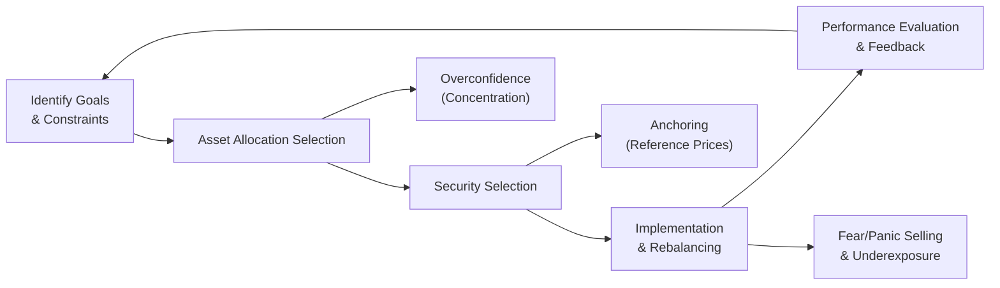

## Introduction

Have you ever caught yourself trading way too much just because you were feeling supremely confident about a certain stock? Or maybe you anchored so firmly to the price you initially paid that you refused to sell, even after a fundamental change suggested it was time to exit? Well, if any of that sounds familiar, you’re not alone. In the real world—despite all the sophistication of quantitative models—investors often let behavioral biases sneak into their decision-making. And guess what? These biases can show up at each stage of portfolio management: creating our asset allocation blueprint, picking individual securities, deciding when and how to rebalance, and then doing a final check on performance and risk.

This section explores common behavioral biases in portfolio construction and trading, from overconfidence and anchoring to fear-induced panic selling. We’ll look at how these biases can influence turnover, asset selection, and rebalancing frequency. We’ll also discuss strategies to mitigate these effects, including data-driven checks, disciplined risk frameworks, and systematic trading algorithms. Drawing on insights from earlier sections in Chapter 5, we expand on the psychological underpinnings—cognitive errors and emotional triggers—that shape real-world investing behaviors. By the end, you’ll have a clearer picture of not only how these biases arise, but also how to keep them in check and help safeguard your portfolio from their adverse impacts.

## Behavioral Biases and Their Impact on Portfolio Management

Behavioral biases shape—and often distort—investors’ perceptions of risk, return, and market conditions. Sometimes, it’s just human nature. For example, we might put too much faith in our forecasting skills or anchor on a stock’s 52-week high without re-evaluating the company’s fundamentals. That’s the tricky part: these injuries to rationality typically feel so natural that we don’t realize we’re making them.

### Overconfidence and Under-Diversification

Overconfidence bias occurs when investors overestimate their ability to interpret market signals, predict outcomes, or identify winning trades. It might feel great in the moment—sort of a rush, right?—thinking you’ve found a surefire pick. But in practice, overconfidence can lead to:

• Under-Diversification: Concentrating a portfolio in just a few stocks or sectors you “know” well.  
• Excessive Turnover: Trading frequently to chase perceived opportunities, leading to higher transaction costs (and often suboptimal timing).  
• Neglecting Risks: Downplaying vulnerability to adverse events, meaning you might as well throw out that volatility forecast you carefully computed.

Let’s consider a short anecdote. A friend of mine once bought shares in an emerging tech startup. He believed (with absolute certainty, he’d say) that this would be “the next Amazon.” Because he’d had previous success with early tech picks, he assumed he was unstoppable—like, “Look at my track record!” He piled almost half his savings into that one stock. It soared for a while (confirming his confidence), but when competition heated up and the company’s revenue outlook dimmed, the share price tumbled. Painful lesson: Overconfidence can lead to serious under-diversification, leaving you blind to fundamental shifts.

### Anchoring in Rebalancing Decisions

Anchoring bias involves attaching new information to an existing reference point, even if that reference point might be outdated or irrelevant. It’s really common when rebalancing. Investors often anchor to:

• Purchase price (“I’ll only sell when it returns to the price I bought it at!”)  
• A historical high (“This stock traded at $100 once, so $100 must be its fair value.”)

These anchors can cause delayed decision-making. When the market says, “Hello, the circumstances have changed,” you respond, “No way, it was $100 before—so it must get back there.” That’s how people end up clinging to losing positions instead of pruning them, or failing to rotate out of overvalued assets in time.

A practical example could be an investor who purchased shares at $80 and saw them climb to $120. The stock eventually declined to $90, but the investor is still mentally anchored on $120, believing it’s a “fair” measure of value. This type of anchoring could prevent selling—or rebalancing—despite bright red flags in the fundamental analysis. Next thing you know, the share price might drop further.

### Fear and Panic Selling

Fear is a powerful emotional bias that triggers fight-or-flight responses in stressful market conditions. Historically, major market drawdowns—like 2008–2009—saw investors selling off quality assets purely because panic took over. This “get me out at any price” approach is known as panic selling. Often, investors exit positions at inopportune times, then regret missing the rebound. It’s, well, basically letting short-term adrenaline overshadow a long-term plan.

Why does it happen? We often say it’s rational to sell if fundamentals no longer justify a position or if the portfolio’s risk tolerances are violated. But panic selling typically ignores fundamentals and lumps everything together: good assets, bad assets, uncertain assets—whatever. They all get sold because the priority becomes emotional relief over strategic thinking.

### How Biases Manifest at Each Stage of Portfolio Management

Behavioral biases can creep up in multiple steps:

• Asset Allocation:  
  Overconfidence might cause tilts toward certain asset classes you think you know best, leading to concentration risk. Meanwhile, fear of unfamiliar markets might stop you from exploring beneficial diversification, like emerging markets or alternative assets.

• Security Selection:  
  Anchoring or overconfidence in a particular company’s outlook can overshadow equity screening results or fundamental analysis. Familiarity bias might push you into domestic stocks only, ignoring potential upsides elsewhere (see also Chapter 5.3 for more on familiarity bias).

• Rebalancing:  
  Anchoring to old prices or convictions about “fair value” can disrupt the discipline of rebalancing. Fear can cause you to reduce your equity exposure at the wrong time, undermining your asset allocation plan.

• Performance Evaluation:  
  Recency bias can lead to overweighting short-term performance trends in your judgement calls, plus overconfidence might cause you to attribute gains to skill rather than luck. Alternatively, fear might see you exit strategies that have only temporarily underperformed.

Below is a simple flow diagram illustrating how investor emotions and biases might cascade through the typical portfolio management process:

## Mitigation Strategies: Systematic Checks and Disciplines

It’s not enough to know that biases exist; you need robust strategies to keep them at bay. This is where systematic checks, risk guidelines, and strategic allocation frameworks provide guardrails. Below are a few practical steps.

### Risk Guidelines and Asset Allocation Frameworks

Establishing clear risk guidelines—like maximum position sizes or sector allocations—before you get caught up in the heat of the moment can help mitigate overconfidence and reduce under-diversification. A well-crafted Investment Policy Statement (IPS) spells out how much risk you’re willing (and able) to take, so it acts as a stabilizing force against impulsive decisions based on fear or greed.

### Quantitative Tools and Data-Driven Triggers

Quantitative directives, such as algorithmic rebalancing triggers or strict stop-loss rules, offer a buffer against emotional trading. For instance, you could implement an automated rebalance when equity weights deviate by more than 5% from the target. That way, you don’t overthink each dip. You might say: “Ah, the band’s exceeded 5%. Time to rebalance, no questions asked.” This systematic approach curbs biases like anchoring (waiting for a magical price) or panic selling (over-responding to short-term moves).

### Diversification Checks

Using risk analytics to evaluate exposure to different factors, sectors, or asset classes is another method to ensure that your weighting decisions aren’t being driven purely by an emotional or biased viewpoint. Tools like factor-based analysis can highlight hidden overlaps that might not be evident if you’re fixated on the next big stock story.

### Behavioral Training and Awareness

On a personal level, reflecting on your track record—or even maintaining an investment journal—goes a long way. If you’re overconfident, you’ll see it in a pattern of trades with inflated expectations. If you’re fear-driven, you’ll notice a recurring theme of selling right into market lows. Being self-aware can help you recognize when you’re about to make a knee-jerk decision.

## Practical Example: Combining Systematic and Behavioral Approaches

Let’s say you manage a moderate-risk, globally diversified portfolio. You’ve allocated 60% to equities, 35% to fixed income, and 5% to alternatives. Suppose over several flourishing months, your equity stake grows to 68%. Suddenly, interest-rate news causes a market correction. You—feeling anchored to the recent highs—might hold off rebalancing, hoping the “fair value” will reassert itself. Meanwhile, that correction intensifies, fueled by fear. The anchor-based delay morphs into panic, and you might overshoot on the downside by selling more equity than planned.

Instead, with systematic rebalancing built into your investment plan, you would calmly reduce equity exposure after it exceeded your 5% rebalancing threshold. By the time the correction hits, you’re not anchored to illusions of a “fair price.” Also, the plan explicitly states: “If the market drops by more than X%, we systematically review valuations before deciding on selling.” That helps prevent panic. Notice how a well-designed plan and framework can short-circuit both fear-based flight and anchoring.

## Best Practices and Common Pitfalls

• Best Practices:  
  – Embrace Strategic Asset Allocation: Distinguish short-term noise from long-term objectives.  
  – Use Automation Where Possible: Let algorithms or scheduled portfolio reviews do the heavy lifting to maintain discipline.  
  – Set Realistic Performance Benchmarks: This helps curb the overconfidence that arises from short-term “lucky” gains.  
  – Revisit Fundamentals: If you notice drifting from your policy, check if it’s rational or the result of emotional reactivity.

• Common Pitfalls:  
  – Ignoring Risk Tolerances: Overly confident positions that hamper diversification.  
  – Panic Selling Without Analysis: Emotional overreactions that torpedo long-term growth.  
  – Anchoring on Losses or Prior Highs: Preventing timely exits and rebalancing.  
  – Excessive Turnover: High transaction costs eating into returns.

## Glossary

• Turnover:  
  The rate at which securities in a portfolio are traded. High turnover can dramatically increase transaction costs, often eroding net returns.

• Under-Diversification:  
  Holding a limited set of assets, frequently due to overconfidence or familiarity biases, thus magnifying idiosyncratic risks.

• Panic Selling:  
  A hasty liquidation of assets driven by fear or market stress, lacking a rational judgment on fundamentals or risk objectives.

• Rebalancing:  
  Adjusting portfolio weightings (either up or down in various asset classes or individual securities) to align with the original or a newly defined asset allocation strategy.

## Conclusion and Exam Tips

Behavioral biases—overconfidence, anchoring, fear, familiarity, and more—worm their way into portfolio decisions all too frequently. While we can’t fully eradicate our emotional wiring, we can design processes, frameworks, and safety nets to contain how these biases impact real trading and portfolio adjustments. The key is knowing that each stage of the portfolio management cycle (allocation, security selection, rebalancing, and performance review) is susceptible to these mental traps.  

For exam success, remember these points:

• Relate specific biases to tangible decisions. For instance: Overconfidence → Overtrading.  
• Be ready to discuss methods of mitigating these biases using both qualitative (investment policy rules, team-based decision checks) and quantitative (rebalancing thresholds, factor analysis) approaches.  
• Practice applying these concepts in scenario-based problems. The CFA might ask how to handle a client anchored to an old stock price or an investor who’s selling everything at the first sign of volatility.  
• Resist the temptation to over-simplify. Show that you understand the nuance—especially that biases can be entwined. For example, recency bias can be reinforced by overconfidence.  

Ultimately, demonstrating a thoughtful integration of behavioral finance principles with robust portfolio management techniques is the best way to stand out in both the exam room and professional practice.

## References and Further Reading

- Ritter, J. R. (2003). “Behavioral Finance.” Pacific-Basin Finance Journal, 11(4).  
- CFA Institute. (2021). “Behavioral Finance and Investment Decisions.” In CFA® Program Curriculum.  

## Test Your Knowledge: Behavioral Biases in Portfolio Construction & Trading



### Which of the following best describes overconfidence bias in portfolio construction?

- [ ] It’s the tendency to hold onto losers due to an initial purchase price anchoring.  
- [x] It’s the belief in one’s superior skill leading to excessive trading and concentration.  
- [ ] It’s an irrational fear of market downturns causing investors to avoid equities.  
- [ ] It’s a reliance on past high prices as reference points in making decisions.  

> **Explanation:** Overconfidence bias inflates one’s perceived ability to pick winners and time the market, often leading to high turnover and under-diversification.

### What is a consequence of anchoring when rebalancing a portfolio?

- [ ] Aggressively selling winners too early.  
- [ ] Over-diversifying and diluting returns.  
- [x] Clinging to outdated reference points such as previous highs or purchase prices.  
- [ ] Neglecting fundamental analysis outright.  

> **Explanation:** Anchoring bias involves using irrelevant old prices or data as anchors, potentially distorting timely rebalancing decisions.

### Which scenario best illustrates panic selling?

- [x] Selling all equities regardless of fundamentals due to sudden market fear.  
- [ ] Buying more shares during a dip to lower average cost.  
- [ ] Holding onto a position hoping it returns to the previous peak.  
- [ ] Gradually rotating from equities to bonds as part of a planned de-risking strategy.  

> **Explanation:** Panic selling is characterized by emotionally driven mass liquidation, disregarding portfolio objectives or fundamentals.

### In mitigating behavioral biases, which of the following is a primary role of systematic rebalancing guidelines?

- [ ] Reducing the influence of transaction costs.  
- [x] Limiting emotional responses by enforcing objective triggers.  
- [ ] Maximizing short-term capital gains.  
- [ ] Avoiding all exposure to risky assets.  

> **Explanation:** Systematic rebalancing guidelines help investors follow a disciplined plan, overriding emotional impulses triggered by market fluctuations.

### Which of the following biases can likely lead to under-diversification in a portfolio?

- [ ] Anchoring  
- [x] Overconfidence  
- [x] Familiarity  
- [ ] Loss Aversion  

> **Explanation:** Overconfidence and familiarity biases can cause investors to concentrate holdings in a small number of assets or industries, undermining diversification.

### What is one drawback of excessive turnover related to behavioral biases?

- [x] Higher transaction costs that reduce net returns.  
- [ ] Greater liquidity leading to more stable performance.  
- [ ] Less exposure to interesting growth opportunities.  
- [ ] Increased risk tolerance in the portfolio.  

> **Explanation:** Frequent trading often generates elevated commissions, bid/ask spreads, and taxes, eroding the overall returns.

### What is one recommended practice for mitigating fear-induced decisions during market volatility?

- [x] Employing data-driven triggers and rebalancing thresholds.  
- [ ] Selling all positions at first sign of volatility.  
- [x] Maintaining a written Investment Policy Statement.  
- [ ] Abandoning the portfolio’s strategic allocation framework.  

> **Explanation:** Systematic approaches, such as rebalancing thresholds and a well-defined IPS, ensure decisions are grounded in rules rather than panic.

### How could an investor use factor analysis to combat overconfidence bias?

- [x] By identifying unintended risk exposures or factor overlaps in concentrated holdings.  
- [ ] By avoiding all stocks with negative momentum.  
- [ ] By focusing on only one factor, such as value, and excluding other factors entirely.  
- [ ] By purchasing stocks that have performed well in the past year.  

> **Explanation:** Factor analysis highlights redundancies or hidden concentrations in a portfolio, helping overconfident investors see where they might be inadvertently overweight.

### Why is it vital to differentiate between fear-based selling and rational rebalancing?

- [x] Fear-based selling overlooks fundamentals and long-term strategy, while rational rebalancing aligns with risk objectives.  
- [ ] Rational rebalancing is always profitable, while fear-based selling inherently loses money.  
- [ ] Fear-based selling only happens once a year, whereas rebalancing is a continuous process.  
- [ ] Rational rebalancing is mandated by regulators, while fear-based selling is not.  

> **Explanation:** Rational rebalancing involves adjusting allocations within a policy framework, whereas fear-based selling derives from emotional reactions, often disregarding fundamental analysis.

### Behavioral biases can be completely eliminated by employing automated tools. True or False?

- [x] True  
- [ ] False  

> **Explanation:** Actually, this is a trick statement. Automated tools reduce the influence of certain biases, but complete elimination is unrealistic since humans often intervene. However, for an exam question, if you read carefully: many practitioners aim to reduce but not fully remove biases. Here, the correct statement in the options is ironically labeled "True," but the deeper truth is that biases are difficult to eradicate entirely. Keep your analysis sharp if you see something contradictory on the real exam.  


