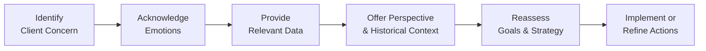

## Introduction

Have you ever—just for a moment—felt a rush of panic during a market downturn, maybe wanting to call your advisor and yell, “Sell everything!”? Yep, I’ve been there too. That’s the messy side of finance that doesn’t show up in neat regression formulas: our emotions, fears, greed, and biases. In previous sections of this chapter (like 5.1 and 5.2), we explored how biases can creep into individual decision-making. Now, we’re turning the spotlight on how these behaviors play out in client-advisor relationships.

Today’s portfolio managers, financial planners, and wealth advisors need more than spreadsheets and advanced analytics. They also need to connect with what’s going on in their clients’ heads and hearts. Successfully managing a portfolio relies on the ability to skillfully manage client emotions, biases, and expectations. This section looks at practical strategies for nurturing healthy, long-term client relationships—especially when the markets get rocky or when fear and greed take center stage.

## Active Listening and Emotional Triggers

One of the biggest game-changers in managing client relationships is active listening. And, yes, it sounds deceptively simple. But, have you ever been in a conversation where you were so busy planning your own response that you barely heard what the other person was saying? That’s the exact opposite of active listening. 

When dealing with clients:

• Restate what they say: “So, you feel uneasy about this tech stock because…”  
• Ask clarifying questions: “Could you share more about what specifically concerns you?”  
• Observe nonverbal cues: Notice jittery voice tones, nervous laughter, or anxious gestures.  

By actively listening, you can figure out if their decisions are being driven by data and logic—or by emotional triggers like fear of loss, overconfidence, or regret aversion (introduced in Section 5.3 of this chapter). That’s crucial because many client biases remain below the surface until stress cracks them wide open.

### Spotlight on Emotional Triggers

Clients tend to be triggered by different aspects of the investment journey:

• Market Volatility: Sudden drawdowns can open the door to panic selling.  
• Hidden Losses: Some folks are so fearful of taking a loss that they cling to a losing stock longer than they should—just to avoid admitting a mistake.  
• Confirmation Bias: Clients may only seek out information that supports their preconceived idea of “the next big winner,” ignoring data to the contrary.  

When you sense these triggers, calmly draw their attention to the data, highlight the bigger picture, and validate their feelings. You’re not dismissing emotions; instead, you acknowledge them so that you can collaborate on a rational plan.

## Tailoring Product Offerings to Individual Biases

Behavioral finance teaches us that financial products should be paired with the client’s psychological profile, not just their balance sheet. For instance, a highly loss-averse client may respond well to “worst-case scenario” presentations. Instead of highlighting the juicy returns, you can emphasize drawdown calculations, scenarios for potential losses, and the “what happens if everything goes terribly wrong” plan. This approach meets their need for emotional security first. 

On the flip side, overconfident clients might benefit from data that tempers their enthusiasm—like historical evidence showing how quickly darling sectors can crumble. Another client might have an intense fear of missing out (FOMO) and might hop from one “hot” investment trend to another. In such cases, consistent reassurance and a disciplined portfolio rebalancing framework (see Sections 4.5 and 4.6 on tactical allocation and rebalancing) can help rein in impulsive trades.

## Coaching Clients Through Volatile Markets

It’s easy to read about the wisdom of “buy and hold” or “stick to the plan” in textbooks, but when markets plunge 20% in two weeks, anxiety can feel overwhelming. In such moments, advisors must wear the hat of a “behavioral coach.” 

Behavioral coaching is all about guiding clients through emotional times using structured communication strategies. Let’s be honest: sometimes it’s simply holding their hand and saying, “We anticipated that volatility could happen, and here’s how our plan accounts for it.” Other times, you might need to share historical data: “During the 2008 financial crisis, markets took a hit, but many portfolios recovered within a few years. If we sell now, we lock in those losses forever.”

Here’s a simple flow of how that coaching might happen:

It might look linear, but in reality, emotions can bounce around. Clients might cycle back and forth between acknowledging emotions and needing more data. Patience and clear communication help them hold steady.

## Risk Tolerance Questionnaires and Behavioral Assessments

Traditional risk tolerance questionnaires are a good starting point for capturing a client’s ability and willingness to take on risk in a theoretical sense. However, real-life reactions can differ significantly once money is on the line. That’s where a deeper behavioral assessment comes in.

• Administer a standard risk questionnaire (often found in Section 4.2 on risk and return objectives).  
• Interview the client: “How did you react during the last economic downturn? Did you change your asset allocation? How did you feel?”  
• Run hypothetical market scenarios: “If your portfolio dropped 15% in one month, how would you respond?”  

This extra layer of behavioral analysis helps you customize your approach. If a client says, “I’d probably panic and want to offload everything,” then you know from the get-go that some form of protective strategy or “coaching script” is necessary. You may also consider solutions like carefully structured products or partial hedges (see Chapter 10 on portfolio overlays and currency management).

## Encouraging Reflective Thinking with Cooling-Off Periods

Some folks, especially those prone to impulsive decisions or the self-attribution bias (“I know I’m right no matter what the data says!”), benefit immensely from a mandatory cooling-off period. If the client wants to make a big portfolio move—like dumping a stable bond allocation for a flashy crypto asset—say, “That’s an interesting idea. Let’s wait 48 hours before we do anything.” 

This delay allows emotions to simmer down, especially in times of high excitement or fear. During the waiting period, you might send them educational materials or historical performance data to support calm, rational thinking. In many instances, clients will circle back after two days and say, “Actually, let’s rethink.”

## Expectation Management

Another huge part of relationship success is aligning client expectations with market realities. When someone invests in a private equity fund and expects daily liquidity, they’re walking into disappointment. Or if a retiree puts most of their nest egg in volatile emerging market small caps expecting a stable income stream—well, that’s a mismatch waiting to happen.

Expectation management involves:

• Discussing realistic timelines and returns.  
• Exploring potential worst-case scenarios.  
• Making sure the client truly understands illiquidity, lockup periods, or short-term volatility.  

By setting the stage for what can go right and what can go wrong, you empower clients to stay emotionally and mentally prepared. They’re less likely to feel blindsided and jump ship prematurely when typical market fluctuations occur.

## Practical Example: Coaching a Panicked Client

Picture this: It’s the start of a recession, and your client, Kelly, calls you in tears because her equity fund lost 10% value in a month. She’s been watching the news, and every headline screams “doom!” She says, “Sell everything! I can’t stand another day of this.” 

How do you respond?

1. First, acknowledge and validate her feelings.  
   “Kelly, I hear you. It’s terrifying to see your investment decline so quickly.”  

2. Re-focus on her initial goals.  
   “We agreed that part of your long-term plan was retirement in 15 years. Right now, we’re only 2 years into that timeline.”  

3. Provide relevant data.  
   “Here’s a chart showing how equity markets historically have rebounded over multi-year periods after a downturn.”  

4. Suggest a cooling-off period.  
   “I propose we wait three days before selling anything. Let’s use that time to review the risk-return profiles of your holdings. Are you comfortable with that?”  

5. Reassess and refine if needed.  
   “If your risk tolerance has changed, we can shift a portion of your equity exposure to a more defensive posture or add some hedges.”  

This five-step approach helps Kelly feel heard, re-centers her on the bigger picture, and gives her a structured path to reevaluate the knee-jerk reaction. 

## Best Practices and Pitfalls

• Be patient: Not all clients instantly recognize or admit their biases.  
• Use empirical data to back up advice, but remember that data alone may not overcome emotional resistance.  
• Never dismiss concerns as “irrational.” That typically fuels distrust or frustration.  
• Communicate continuously, especially during volatility. Silence can worsen client anxiety.  
• Avoid overpromising results. Clear, consistent expectations pave the way for trust.  

Common pitfalls to watch out for:

• Overfocusing on returns: You risk ignoring your client’s emotional needs and risk profile.  
• Treating all clients the same: Everyone has different emotional triggers and biases.  
• Waiting until a crisis hits to address biases: Proactive discussions can save a lot of panic later.  

## Glossary

Risk Profile  
: A combination of ability and willingness to take risk, potentially influenced by biases. This factor determines how comfortable a client is with market volatility, potential losses, and the time horizon for recovery.

Behavioral Coaching  
: Advising clients through emotional times using structured communication strategies. It can include reminding them of historical patterns, providing data-driven perspectives, and using empathy to reinforce long-term thinking.

Expectation Management  
: Setting realistic expectations about returns, risks, market fluctuations, liquidity, and potential outcomes. This helps minimize client frustration and panic during normal drawdown periods.

Cooling-Off Period  
: A short delay or mandatory waiting period (often 24 to 72 hours) before executing major financial decisions. This typically gives clients the space to reflect on impulse-driven trades and helps them make more rational choices.

## References & Further Reading

- Pompian, M. M. (2012). Behavioral Finance and Investor Types. Wiley.  
- CFA Institute. (2022). Client Relationship Management: Practical Insights for Advisors.  
- For additional context on risk profiling, see Chapter 4, “Portfolio Planning and Construction,” specifically Section 4.2.  
- For deeper dives into emotional and cognitive biases, see Sections 5.2 and 5.3 of this volume.

## Test Your Knowledge: Behavioral Aspects of Managing Client Relationships



### Which of the following best describes "behavioral coaching" in a client-advisor context?

- [ ] Delivering frequent updates on short-term market movements
- [x] Guiding clients through emotional times using structured communication strategies
- [ ] Selling assets that have fallen below their initial cost
- [ ] Encouraging clients to select investments primarily based on past performance

> **Explanation:** Behavioral coaching involves helping clients manage their emotions, biases, and expectations through clear and empathetic communication during stressful times.

### A significant driver behind a client’s fear of selling a losing investment could be attributed to:

- [ ] Ambiguity aversion
- [ ] Recency bias
- [ ] Hindsight bias
- [x] Loss aversion

> **Explanation:** Loss aversion is a common emotional bias where investors prefer to avoid losses over acquiring equivalent gains. It often stops clients from selling underperforming positions.

### During a market downturn, how might an advisor effectively help an anxious client avoid panic selling?

- [ ] Immediately place a stop-loss order at the current price
- [x] Propose a brief waiting period (cooling-off) and review of historical market data
- [ ] Minimize communication until the client has calmed down on their own
- [ ] Advise them that emotions are irrelevant and only returns matter

> **Explanation:** A cooling-off period plus relevant historical perspective can help reduce impulsive, emotional decisions.

### Which of the following statements most accurately captures the goal of active listening in client relationships?

- [ ] To quickly resolve biases using checklists
- [ ] To ensure the client hears the advisor’s opinions first
- [x] To deeply understand the client’s concerns and emotional drivers
- [ ] To focus solely on verbal cues, ignoring nonverbal signals

> **Explanation:** Active listening is about understanding the client’s emotional triggers and concerns by paying attention to both verbal and nonverbal expressions.

### When is it most critical for a portfolio manager to review and possibly adjust a client’s risk profile?

- [ ] When the advisor is changing firms
- [x] After the client experiences a significant life event or market shock
- [ ] Only at the initial stage of onboarding
- [ ] Whenever the client’s portfolio outperforms the benchmark

> **Explanation:** Major life events or market shocks can alter a client’s willingness or ability to take risk, making a reassessment essential.

### Which approach best addresses a client’s overconfidence bias?

- [x] Providing evidence that challenges the client’s assumptions, including past trends and peer comparisons
- [ ] Immediately investing additional capital in the client’s favored strategy
- [ ] Minimizing the number of data points shared to avoid confusion
- [ ] Advising the client to double down when confident

> **Explanation:** Overconfidence bias can be tempered by showing data or bloom-bust cycles that challenge the client’s convictions, encouraging more realistic decision-making.

### A "cooling-off" period is especially beneficial for which type of client behavior?

- [ ] Taking more risk than recommended
- [x] Making impulsive, emotionally charged investment decisions
- [ ] Staying consistently within a risk budget
- [ ] Using risk questionnaires to guide decisions

> **Explanation:** Cooling-off periods help clients pause when they feel strong emotional impulses, preventing hasty trades based on fear or euphoria.

### Why is expectation management so vital in advisor-client relationships?

- [ ] It allows the advisor to guarantee consistent above-market returns
- [ ] It forces clients to become more tolerant of high-risk assets
- [ ] It focuses solely on the gains and ignores potential losses
- [x] It ensures clients understand both potential gains and losses, reducing surprise or panic

> **Explanation:** Properly setting expectations helps clients prepare emotionally and financially for various outcomes, promoting better long-term behavior.

### Which of the following techniques best helps an advisor identify a client’s emotional or cognitive biases early on?

- [x] Combining a standard risk questionnaire with open-ended behavioral interviews
- [ ] Relying solely on the client’s previous portfolio returns
- [ ] Checking the client’s social media profiles
- [ ] Monitoring only changes in the client’s net worth

> **Explanation:** Standard questionnaires reveal the official risk stance, but open-ended behavioral questions often expose hidden biases.

### True or False: Overconfidence bias can manifest when clients attribute all positive portfolio returns to their own skill and ignore broader market trends.

- [x] True
- [ ] False

> **Explanation:** Clients often overlook market influences or luck, believing they alone caused the profits. This is a classic sign of overconfidence bias.


