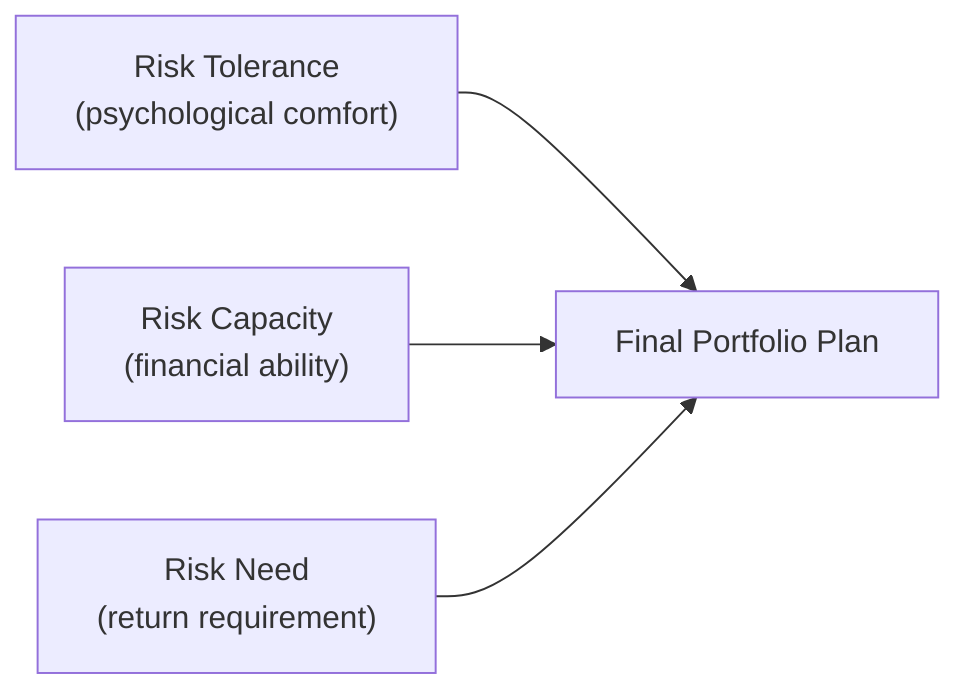

## Introduction

So, let’s say you’re sitting across from a client—maybe a friend, maybe a new investor—who claims they’re “pretty comfortable with risk.” You dig a little deeper, and it turns out they’re on edge whenever the market drops a hair. Sound familiar? This mismatch between what people say (or even believe) about their willingness to bear risk and how they actually behave under stressful market conditions can be surprisingly common. Why does this happen, and what does it mean for constructing and managing portfolios?

In this section, we explore investor profiling and risk tolerance. We’ll talk about the difference between risk tolerance, risk capacity, and risk need, and we’ll see how behavioral biases—like overconfidence—shape (and sometimes distort) an investor’s self-perception. We’ll also provide practical frameworks and real-world examples that will help you create more accurate, dynamic, and investor-aligned portfolios. Our journey will be a bit conversational—not stiff, or, um, robotic—because these topics get personal fast, and the human element is key.

## The Distinction Between Risk Tolerance, Risk Capacity, and Risk Need

Before diving into profiles and psychological nuances, it’s crucial to understand three core concepts that define an investor’s overall “risk stance.” In the investment management process, these three often come up in the Investment Policy Statement (IPS) discussion, and they are all distinct yet interconnected:

• Risk Tolerance: This is the investor’s comfort with uncertainty and fluctuation in returns. It’s an emotional or psychological measure. How will they react when their portfolio loses 10%, 20%, or even more?

• Risk Capacity: This is a more objective measure of financial strength—how much loss an investor can actually withstand without jeopardizing financial goals. Think of it as budgetary thick skin. For example, a high-net-worth individual might have the capacity to handle a market downturn, whereas a retiree living off a modest nest egg might not.

• Risk Need: This explains how much return is needed (and thus how much risk might be necessary) to meet specific goals—such as saving for college tuition or building retirement funds. Sometimes, an investor’s “risk need” conflicts with their “risk tolerance.” For example, if a client wants large returns to fund an early retirement but has very low risk tolerance, there’s tension that must be resolved.

A mismatch among these three can lead to an unsuitable portfolio strategy. Overemphasizing risk tolerance without accounting for risk capacity may lead to an underfunded retirement. Conversely, ignoring an investor’s emotional comfort can incite panic selling and sabotage long-term returns.

Below is a simple Mermaid diagram that shows how these three components connect to shape the final portfolio plan:

## Approaches to Investor Profiling

It’s easy to think that all you need is a quick risk questionnaire and you’re done, but capturing an investor’s risk profile accurately can be trickier than it looks. Some folks answer those questionnaires based on how they *want* to feel about risk, not how they actually feel in volatile markets. Others might rely on prior experiences (“Well, in 2008, I lost a ton of money, so I’m never doing that again!”). Let’s talk about different profiling methods—and their pros and cons.

### Psychometric Questionnaires

Psychometric tests are standardized tools designed to measure facets like risk attitude, personality traits, or even certain biases. These are often given in standard multiple-choice formats to capture how an investor might react in hypothetical market scenarios. A popular example is the Grable and Lytton (1999) questionnaire, which helps measure an individual’s investment risk tolerance by focusing on their willingness to accept uncertainty and potential losses.

• Advantages:  
  – Systematic, comparable across large sample sizes.  
  – Provides numerical scores that can map to recommended allocation ranges.  

• Disadvantages:  
  – Investors may game or misunderstand questions.  
  – Doesn’t always tell you how an investor will behave under *real* stress.

### In-Depth Interviews

Interviews allow an advisor or investment professional to explore an investor’s prior experiences, attitudes, and beliefs with greater nuance. A good interviewer can pick up on emotional cues, such as hesitation when asked about large drawdowns or subtle excitement about potential gains.

• Advantages:  
  – Personal and flexible.  
  – Enables deeper insight into emotional triggers and personal history.  

• Disadvantages:  
  – Time-consuming; depends on interviewer skill.  
  – Responses can be influenced by the interviewer’s tone or approach.

### Observational Methods

Observational profiling looks at actual behavior—maybe you see how someone’s reaction changes when the market swings or track how quickly they want to buy or sell. Sometimes, risk tolerance is more evident in real-time decisions than in hypothetical scenarios or carefully worded questionnaires.

• Advantages:  
  – Captures real behaviors rather than stated preferences.  
  – Invaluable for adjusting allocations in reaction to actual decisions, not just survey responses.  

• Disadvantages:  
  – Requires long-term client relationship and real market events to observe.  
  – Might be confounded by short-term events that don’t represent the investor’s fundamental risk stance.

Below is a quick table that compares the main approaches:

| Approach             | Advantages                                             | Disadvantages                                                       |
|----------------------|--------------------------------------------------------|---------------------------------------------------------------------|
| Psychometric Tests   | Systematic; objective scoring                          | May not reflect real behavior under stress                          |
| Interviews           | Personal; insights into triggers                      | Subject to interviewer bias; time-consuming                         |
| Observational        | Reflects real actions under market conditions         | Needs extended time horizon; real drawdowns can be costly lessons   |

## Behavioral Biases and Mismatches

Now, let’s talk about how we can get it all wrong. Investor profiling is only half the battle; it doesn’t matter how great your questionnaire is if behavioral biases lead clients to misjudge or misstate their risk preferences.

### Overconfidence

Overconfidence often surfaces when markets have been doing well. Investors might believe they can handle large fluctuations—after all, “they picked the winning stocks,” and the rising tide made them feel unstoppable. I remember an investor who was convinced that their “tech-savvy” picks would keep beating the market. They said they were risk-tolerant; however, the moment a tech crash hit, guess who was out the door selling their shares at the worst possible time? That’s how overconfidence in risk tolerance can breed misalignment and potentially catastrophic portfolio rebalances.

### Confirmation Bias

Another big one is confirmation bias, where investors cling to data points that confirm their beliefs about their risk tolerance while ignoring contradictory evidence. For instance, someone might interpret a mild decline in their portfolio as “just a blip,” but panic on a larger dip that triggers genuine fear. If their initial risk-tolerance assessment didn’t account for that vulnerability, the portfolio might be misaligned.

### Loss Aversion

Loss aversion means that pain from losses hurts us more than pleasure from gains of an equivalent amount. Clients who *think* they can handle a 10% drop sometimes discover they have a threshold that’s much lower when the actual loss appears on their monthly statement. Knowing about these biases helps you, as a portfolio manager or financial advisor, incorporate safety measures (like lower volatility assets or structured products) that reduce the chance of panic selling.

## Ongoing Monitoring of Investor Profiles

Like it or not, people change over time. Risk attitudes often shift as we go through different life stages or experiences:

• A new parent might suddenly become more cautious.  
• A retiree living on fixed income may become more conservative than they’d admit in an earlier stage of life.  
• Market experiences—a big crash or a big win—can alter risk perception.  

That’s why it’s critical to build regular “touchpoints” into the client relationship. A phone call, a portfolio review meeting, or even an updated risk-tolerance survey every couple of years can keep you informed. Major life events—inheritance, divorce, new job—also call for an immediate re-check. 

These updates ensure the portfolio remains suitable. Time horizons, liquidity needs, and income stability rarely stand still.

## Framework for Adjusting Portfolios by Risk Tolerance Levels

Once you have a sense of your client’s profile—both numerically (from psychometric or objective data) and qualitatively (from interviews or long-term observations)—how do you put it into practice?

One popular approach is to place clients into broad categories such as “Conservative,” “Moderate,” “Aggressive,” or “Very Aggressive,” each with a corresponding range of equity, fixed income, and alternative asset exposures:

• Conservative Investor: May hold a larger portion in high-grade bonds, cash, and a smaller allocation to equities. The focus is capital preservation, so volatility is minimized.  
• Moderate Investor: Balanced allocations between equities and bonds, with a small satellite portion in alternatives, if appropriate.  
• Aggressive Investor: Heavy in equities and growth-oriented sectors, with some portion in fixed income for diversification.  
• Very Aggressive Investor: High equity exposure, possibly with leveraged positions or alternative strategies that take on material risk.  

This framework can be fine-tuned with each investor’s capacity and need. For example, a “moderate” risk-tolerance investor with a modest short-term objective might tilt the allocation toward bonds, even if their psychometric score leans towards growth. On the other hand, a younger, high-income earner might be able to take a more aggressive posture if their capacity is significant, but you still have to respect how they *feel* about volatility.

### Incorporating Behavioral Factors

If you sense certain behavioral pitfalls—like overconfidence—your solution might be incremental. Instead of investing a lump sum all at once, you could recommend a dollar-cost averaging strategy or a structured product that mitigates downside risk for a while. If your client is prone to herding or panic selling, consider building a “behavioral circuit breaker”: an agreement that they wait three days after requesting a large trade before it is executed. This short “cooling off” window often deters decisions driven by sudden fear.

## Illustrative Examples and Case Studies

Let’s briefly consider two hypothetical investors and how their profiles might guide portfolio construction:

• “Mia the Millennial”: Mia is in her late 20s, single, with stable employment in the tech industry. She has a relatively small portfolio but very high future earning potential. Psychometric testing shows a moderately high risk tolerance—she’s comfortable with a decent level of volatility. She’s not spooked by daily fluctuations, but she also notes her fear of losing everything. In real behavior, she’s made small but consistent contributions to equity ETFs, even after minor market downturns. Her risk capacity is above average because her human capital is significant; her risk need is moderate—she wants to buy a house in 10 years, but it’s not urgent. This profile suggests a growth-tilted portfolio, with a moderate safety net in bonds or stablecoins for short-term emergencies.  

• “Ron the Retiree”: Ron is in his mid-60s, newly retired, living on a combination of pensions and savings. He scored moderately on risk tolerance in his youth, but a recent health scare made him extremely cautious about any losses. He has large obligations: potential healthcare costs, and he wants to ensure a stable legacy for his grandchildren’s education. Observing him in the 2020 market correction, you noticed fear-based selling in his personal brokerage account. Ron’s risk tolerance is moderate, but his capacity for risk has decreased significantly—he simply cannot afford a big drawdown that reduces his quality of life. His risk need is modest (he’s not aiming for huge returns), so his portfolio might include more high-grade bonds, dividend-paying stocks for income, and perhaps an annuity product.  

## Glossary

• Risk Tolerance: The degree of variability in investment returns that an investor is willing to withstand.  
• Risk Capacity: The financial capacity to absorb market losses without compromising financial goals.  
• Risk Need: The required growth rate or return needed to meet investment objectives.  
• Psychometric Test: A standardized survey tool used to measure risk attitudes, preferences, or personality traits.

## Final Exam Tips

• Understand the conceptual differences among risk tolerance, risk capacity, and risk need—exam scenarios often test whether you can spot inconsistencies in an investor’s profile.  
• Be prepared to address how behavioral biases (overconfidence, confirmation bias, loss aversion) can distort risk tolerance. In constructed-response questions, you might be asked to identify these biases and recommend strategies to mitigate them.  
• Time horizon and life-cycle changes are a classic exam theme. Make sure you can explain how an investor’s risk position evolves with major life events.  
• For item sets, you may see data from a psychometric questionnaire combined with real-life behavior. Be ready to reconcile contradictory signals.  
• Incorporate recommended best practices—like ongoing monitoring and rebalancing—to ensure alignment with changes in an investor’s circumstances.  

## References

• Grable, J. E., & Lytton, R. H. (1999). Assessment of Financial Risk Tolerance. Journal of Financial Counseling and Planning.  
• CFA Institute. (2021). Managing Individual Investor Portfolios.  

## Test Your Knowledge: Investor Profiling and Risk Tolerance



### An investor who claims to have a high risk tolerance but sells assets during minor market declines may be exhibiting which behavioral bias?

- [ ] Anchoring
- [ ] Mental Accounting
- [x] Overconfidence
- [ ] Regret Aversion

> **Explanation:** Overconfidence occurs when an investor overestimates their tolerance for risk or their ability to manage losses. In practice, they behave more conservatively.

### Which of the following statements best defines risk capacity?

- [x] The financial ability to absorb potential losses without jeopardizing long-term goals.
- [ ] The willingness to accept volatility in an investment portfolio.
- [ ] The emotional comfort an investor has when facing market drawdowns.
- [ ] The required return needed to achieve stated goals.

> **Explanation:** Risk capacity is about objective financial strength and the ability to handle losses without derailing planned financial outcomes.

### Which of these methods is most likely to capture real investor behavior under actual market stress?

- [ ] Psychometric questionnaires
- [ ] Structured interviews
- [x] Observational methods over time
- [ ] A single meeting with the client

> **Explanation:** Observational methods involve studying the investor’s actual buy/sell decisions, revealing genuine behaviors rather than self-reported preferences or hypothetical reactions.

### An investor wants aggressive returns to purchase a vacation home in five years but scores low on a risk-tolerance questionnaire. Which statement is most accurate?

- [ ] The investor’s risk tolerance and risk capacity are both high.
- [ ] The investor’s risk need is low.
- [x] There is a mismatch between risk need and risk tolerance.
- [ ] This indicates excellent alignment between risk tolerance and risk capacity.

> **Explanation:** Although they have a high return goal (high risk need), their low risk tolerance suggests they might not cope well with portfolio volatility, creating a mismatch.

### Which step would be most effective if a client’s actual trading behavior shows more conservative reactions than indicated by their questionnaire responses?

- [ ] Move the portfolio entirely to fixed income.
- [ ] Dismiss the questionnaire results and rely only on the data.
- [ ] Ignore the discrepancy and keep the allocation the same.
- [x] Revisit the profile, possibly adjusting the equity allocation downward.

> **Explanation:** The best approach is to reconcile the questionnaire findings with observed behavior and adjust the portfolio strategy accordingly.

### Which of the following biases can cause an investor to cling to information confirming their perceived tolerance to risk while dismissing contradictory evidence?

- [ ] Herding
- [x] Confirmation bias
- [ ] Loss aversion
- [ ] Framing bias

> **Explanation:** Confirmation bias is the tendency to look for and favor information that confirms one’s preexisting beliefs, particularly about risk comfort.

### When an investor’s capacity to bear risk is high, but their psychological comfort is low, which outcome is most likely if not addressed?

- [ ] The investor will become more aggressive automatically.
- [ ] The investor’s portfolio will outperform market benchmarks.
- [ ] The investor will confidently stick to a higher-volatility portfolio.
- [x] The investor may panic in a downturn and sell at a disadvantageous time.

> **Explanation:** A psychologically low risk tolerance often leads to panic selling and suboptimal decisions, even if the investor theoretically can afford volatility.

### A psychometric test reveals an investor’s willingness to assume high volatility. However, this investor has minimal savings, is near retirement, and has significant upcoming medical bills. This scenario underscores:

- [ ] A strong match between risk tolerance and risk capacity.
- [x] A discrepancy: The investor’s financial situation (risk capacity) does not support high-volatility allocations.
- [ ] Underconfidence in long-term planning.
- [ ] Confirmation bias driving the investor’s profile.

> **Explanation:** High stated risk tolerance does not necessarily align with limited financial resources (low capacity). Their capacity is insufficient to sustain potential losses.

### Why is ongoing monitoring of an investor’s risk profile vital?

- [ ] Because the portfolio should remain static once assigned.
- [ ] Because risk profiles never change once set.
- [x] Because life events and market experiences can significantly alter risk tolerance.
- [ ] Because formal procedures discourage any portfolio alterations.

> **Explanation:** Investor circumstances evolve (through job changes, family events, market experiences), thus requiring regular updates to keep the portfolio aligned.

### A risk capacity that exceeds an investor’s risk tolerance typically implies:

- [x] The investor could handle more risk financially but is not comfortable psychologically.
- [ ] The investor must hold 100% equities.
- [ ] The investor’s required return is likely very high.
- [ ] The investor should allocate to low-volatility instruments only.

> **Explanation:** If someone can handle more risk but feels uncomfortable with it, advisors usually focus on emotional well-being, ensuring the portfolio still meets goals without inducing panic or stress.


