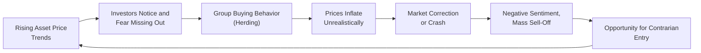

## Understanding Herding Behavior in Modern Markets
Picture this scenario: You’re chatting with friends about the newest “hot stock,” and everyone seems convinced it’s a sure bet. You sense their excitement—and you also discover your favorite social media channels are buzzing with the same hype. You might get that itch, the underlying thought of, “If everyone’s on board, maybe I should be, too.” That’s herding behavior in a nutshell: moving with the crowd because everyone else seems so certain.

Herding behavior is an age-old phenomenon, but these days it spreads faster than ever thanks to social media, online forums, and even instant messaging groups. As we’ll see, herding has profound consequences for portfolio decisions—potentially driving assets far beyond their fundamental worth, creating “too good to be true” run-ups, and then magnifying the pain of a crash when the bubble bursts.

Herding can be subtle. Sometimes we think we’re being rational, but we’re actually just following “market sentiment.” And this, for better or worse, is a key reason large market swings (both upward and downward) often overshoot rational price levels. In other words, herding can feed the mania and the panic. Let’s talk about how that happens.

## Why Investors Herd
Herding can stem from numerous psychological and social factors. One powerful element is the natural human desire to conform. It’s uncomfortable to be the odd one out—especially in a room full of people excited about “the next big thing.” We fear missing out on gains (known as FOMO) or we fear looking foolish if we, alone, take a stand.

Another factor is self-reinforcing feedback. When you see a stock’s price surging, excitement builds. Then the media discusses it. Then your neighbors discuss it. Suddenly, the idea of ignoring that stock might feel like walking away from easy money. Before you know it, public sentiment dwarfs detailed company research. In short, the “herd” becomes far more persuasive than carefully analyzing earnings statements or reading a balanced research report.

From a portfolio perspective, these dynamics can cause large groups of investors—both retail and professional—to chase the same assets simultaneously, often paying little attention to the underlying fundamentals.

## Social Media and Real-Time Communication
In the past, herding typically happened through word of mouth, newspaper articles, or television coverage. But nowadays, everything is instant. Online platforms like Twitter, Reddit, and TikTok can amplify a “trending” idea in a matter of minutes. Influencers—some credible, some not—tweet or post about a company, a cryptocurrency, or a new exchange-traded fund (ETF), and word spreads at lightning speed.

This hyper-speed environment can turbocharge the herding effect. Instead of waiting days or weeks for market sentiment to filter through more traditional channels, now it’s like a flash flood. If you blink, it feels like you’ll miss massive price moves. This is precisely the fear (or excitement) that can lead you to jump in without proper research—just because it’s all happening so quickly.

## Fear of Missing Out (FOMO)
A major driver of herding is FOMO, or Fear of Missing Out. It’s basically that voice in your head saying, “Don’t be left behind!” Suppose you see a stock up 50% in two weeks—and everyone else who bought it is bragging. You might feel that sting: “Why didn’t I invest?” So you hurry and buy the stock, ignoring the possibility that you’re now late to the party. FOMO can push investors to chase overheated markets, ironically increasing the risk of a steep correction.

Investment professionals aren’t immune. Even large institutions with carefully articulated investment policy statements or robust due diligence processes can get swept up by surging prices. The desire to keep pace with benchmark performance, or not look bad in quarterly updates, might override caution when a fad is on fire. Sometimes, a firm feels pressure to explain why it “missed out,” which can incentivize jumping on the bandwagon. This is herding at the institutional level.

## How Herding Affects Market Volatility
Herding can increase market volatility in alarming ways. When everyone buys in unison, it drives up asset prices quickly (and sometimes artificially). Then, when a negative signal appears—perhaps a poor quarterly earnings report or a shift in Federal Reserve policy—those same herders race for the exit all at once, leading to dramatic price drops. The result is a whipsaw effect: markets stampede one way, then stampede back the other way.

This can create genuine headaches for portfolio managers attempting to maintain asset allocations or risk profiles. If you’re in a bubble environment, your portfolio might rise rapidly—but risk levels also quietly escalate. In the event of a sharp turnaround, losses can be substantial because of overexposure to inflated assets. Herding, therefore, doesn’t just push prices up or down—it amplifies the swings between those movements, shaking portfolio stability.

## The Evolution from Bubble to Bust
When herd-driven buying happens repetitively, we often see asset “bubbles.” In a bubble, prices run far ahead of any rational measure of value (like discounted cash flow analysis or fundamental price-to-earnings ratios). It’s as if the crowd decides a certain narrative—“this tech stock will change the world,” or “real estate always goes up,” or “meme stocks can’t fail”—and then invests accordingly, ignoring cautionary signals.

Eventually, flaws in the narrative appear. The fundamentals can’t justify the sky-high valuation, or economic shifts reduce the future growth potential. At this point, the bubble bursts. Herding, ironically, works just as effectively on the downside—people rush to exit in droves. The crowd moves from euphoria to despair, and in the wake of the crash, some investors may wonder, “What were we thinking?”

## Historical Examples of Herding
Throughout history, we see repeated patterns of herding behavior:

• Dot-Com Bubble (late 1990s to early 2000s): Investors poured money into internet-related companies with questionable revenue models, ignoring fundamentals. Stock prices soared and then plummeted. You can see the same story in numerous tech IPOs of that era—many never regained their bubble-level valuations.

• Housing Bubble (mid-2000s): Real estate in many regions of the U.S. was seen as a one-way bet. The crowd logic was “prices always go up.” Speculative investment, fueled by easy credit, overshadowed actual capacity to repay mortgages. When cracks began to show, people rushed to sell, toppling prices and triggering a global financial crisis.

• Meme Stock Mania (2020–2021): Social media forums drove sensational buying of heavily shorted stocks, swiftly boosting share prices. While some investors profited handsomely, others got in at elevated valuations and suffered painful losses after inevitable corrections. It was a real-time demonstration that mass sentiment, fueled by online chatter, could overwhelm classic fundamentals—at least temporarily.

## A Quick Visual Look at the Herding Cycle

Below is a simple diagram illustrating how herding can create a cyclical pattern of rising and falling asset prices:

This loop can repeat if market conditions remain conducive to speculation or if a new “hot” narrative emerges. It shows how the crowd’s collective bias can feed price action in both directions.

## Strategies to Counteract Herding
The good news is that, while herding is powerful, there are ways to mitigate its impact on your portfolio decisions.

Contrarian Analysis  
Contrarian strategies intentionally look for overbought or oversold conditions. A contrarian investor might avoid the market’s darlings (or even take short positions in them) when prices seem detached from reality. Likewise, they may buy unloved sectors that the herd has abandoned, anticipating that prices might be too low relative to fundamentals. Of course, contrarian investing requires robust fundamental research and firm discipline, since the herd-driven narrative can persist longer than many believe possible.

Independent Research  
Independent research is one of the first lines of defense against herding. Instead of simply following what’s trending, an investor can scrutinize company financials, read industry reports, or consult third-party analyses. By forming an opinion based on data rather than mood, you reduce the risk of jumping on a bandwagon at inflated prices.

Critical Peer Review  
In professional settings, investment committees can establish a culture of respectful challenge—where members question each other’s assumptions and research. This “devil’s advocate” approach often spots overlooked risks or hype-driven over-optimism. Leaders in portfolio teams (see “Collaboration Between Analysts and Portfolio Managers” from Chapter 1) can foster an environment where skepticism and debate are not just tolerated but encouraged.

Long-Term Perspective  
Taking a long-term view can also help. Many herding episodes focus on short-term price movements. A well-crafted Investment Policy Statement (IPS), as discussed in Chapter 4, can remind you of your true objectives: retirement funding, home purchase, or educational goals. This perspective can prevent impulsive, fear-driven trades.

Diversification  
When in doubt, diversification still helps. Even if you’re somewhat influenced by the herd, having a mix of asset classes—equities, fixed income, alternative investments—balances out your exposures. This approach may limit the fallout if one segment becomes inflated and subsequently crashes. It’s not a perfect solution, but it builds resilience into your overall portfolio.

## Connecting Ethics and Professional Standards
From an ethical standpoint (see “Linking Ethical Standards to Portfolio Management Practices” in Chapter 1), professionals must ensure they’re not misleading clients with hype-based recommendations. Adherence to the CFA Institute Code of Ethics and Standards of Professional Conduct emphasizes due diligence, objectivity, and loyalty to the client’s best interests—not blindly following or fueling herding sentiments for short-term gain.

## Lessons for Risk Management
For a portfolio manager, recognizing herding signals is part of robust risk management (see Chapter 6). If you discern that a particular sector is attracting frenzy buying, you might:
• Increase monitoring of position concentrations in that sector.  
• Stress test the portfolio for significant drawdowns if prices revert to historical norms.  
• Communicate more frequently with clients about potential volatility.  

This kind of proactive approach can save you from unpleasant surprises when the herd turns around. Indeed, a successful manager tries to anticipate how group psychology might affect certain holdings.

## Potential Pitfalls
• “Early” Contrarian: You might be right that something is overvalued, but the herd can keep pushing prices for longer than expected. Being too early can be painful.  
• Overconfidence in Contrarian Views: Some contrarian strategies morph into stubborn denial of market signals. Balance is essential.  
• Confirmation Bias: Even contrarian thinkers can fall prey to seeking only data that supports their existing view. A truly critical approach means acknowledging you could be wrong.  
• Crowd Aggregation Tools: Tools that measure social media sentiment can be double-edged swords. While helpful in gauging crowd behavior, they might also lead you to rely excessively on what “everyone” is discussing.

## Tying It All Together
Herding is basically a collision between our emotional wiring and the realities of financial markets. When the crowd surges in a certain direction, it’s easy to feel like you’re missing the boat if you don’t join. The best defense is a combination of self-awareness, robust analysis, and an investment process that demands evidence rather than mere sentiment.

Taking the time to verify whether a company is truly undervalued (or overvalued) will not only safeguard your capital but also place you among the thoughtful group of market participants who can step aside from the mania. And if you do decide to invest in something that’s “hot,” you’ll at least know the risks and have an exit plan if the trade sours.

As we keep exploring the human side of investing in this Chapter 5 on Behavioral Biases, remember that the markets are made up of people—each influenced by their own biases and emotions. Herding is just one (very powerful) example of how psychology and group behavior can merge to create unusual price movements, which can severely impact portfolios if left unchecked.

## Final Thoughts and Exam Tips
On the CFA exam (yes, even at Level I), herding can appear in questions about behavioral biases or portfolio construction. You may see scenarios describing a manager or client ignoring fundamentals and charging into the “market trend.” A correct answer often involves recognizing the bias and proposing a sensible remedy—like emphasizing fundamentals, employing an alternative viewpoint, or reviewing the IPS to realign decisions with long-term objectives.

Time management on the exam is crucial. If you see a question about a sudden price surge largely backed by “expert tweets,” think about herding. The test might ask which bias is at play (fear of missing out too). Or it might ask for a recommended solution, like contrarian analysis. Familiarize yourself with the definitions and be prepared to apply them in scenario-based questions.

Keeping a level head in the exam setting—just like in investing—will help you see beyond hype-driven illusions.

---

**Glossary**  
• Herding Behavior: Converging investment or trading decisions toward what the majority is doing, often ignoring independent analysis.  
• FOMO (Fear of Missing Out): The anxiety that one is missing potential gains, leading to hurried or emotional investment decisions.  
• Contrarian Investing: A style of investing that goes against prevailing market trends, betting companies or markets are mispriced due to crowd sentiment.  
• Market Bubble: A period when asset prices exceed intrinsic values, with speculation creating unsustainably high valuations that often end in a severe correction.

**References and Further Reading**  
• Bikhchandani, S., & Sharma, S. (2000). Herd Behavior in Financial Markets. IMF Staff Papers.  
• Shiller, R. J. (2015). Irrational Exuberance. Princeton University Press.  
• CFA Institute (2025). CFA Program Curriculum Level I, Vol. 9: Behavioral Finance and Portfolio Management.  
• For deeper dives into social media impacts: Froot, K.A., Scharfstein, D.S., & Stein, J.C. (1992). Herd on the Street: Informational Inefficiencies in a Market with Short-Term Speculation. The Journal of Finance.

---

## Test Your Knowledge: Herding Behavior and Market Volatility



### Which of the following best describes herding behavior in financial markets?
- [ ] Individual investors relying strictly on fundamental analysis. 
- [ ] Institutions allocating assets based solely on client risk profiles.
- [x] Investors copying others’ trades without fully analyzing fundamentals.
- [ ] Short sellers holding contrarian positions against the market.

> **Explanation:** Herding behavior refers to investors following the majority, often ignoring their own independent research or fundamentals.

### How does social media accelerate herding behavior?
- [ ] By providing accurate forward earnings guidance from company insiders.
- [x] By quickly spreading group opinions and amplifying market sentiment.
- [ ] By limiting immediate reactions to market events.
- [ ] By enforcing regulations that control stock discussions.

> **Explanation:** Social media delivers real-time discussions and opinions to a widespread audience rapidly, reinforcing group consensus and prompting synchronized trading decisions.

### What is a common consequence of herding when prices are driven above intrinsic value?
- [ ] Markets stabilize at a new equilibrium price.
- [x] An eventual market correction or crash.
- [ ] Long-term price support based on rational valuations.
- [ ] Reduced volatility and steady returns.

> **Explanation:** When prices exceed their fundamentals due to herding, they tend to revert, often sharply, leading to severe corrections.

### Which investor emotion often drives herding behavior in a rapidly rising market?
- [x] Fear of missing out (FOMO)
- [ ] Regret aversion
- [ ] Self-attribution bias
- [ ] Representativeness bias

> **Explanation:** Fear of missing out (FOMO) is a powerful motivator for herding, making investors rush into popular trades without thorough analysis.

### Which strategy is most useful to counteract the effects of herding?
- [ ] Buying heavily into trending assets at their peak.
- [x] Conducting independent research and adopting a contrarian perspective.
- [x] Diversifying across asset classes to limit concentrated exposure.
- [ ] Increasing turnover by jumping into every new market fad.

> **Explanation:** Independent research and contrarian thinking help identify genuine opportunities—or overvalued hype stocks—while diversification controls risk if herd-driven corrections occur.

### Which historical event exemplifies herding behavior and its severe aftermath?
- [ ] Roth IRA inception
- [x] The dot-com bubble of the late 1990s
- [ ] Fixed income meltdown in the 1960s 
- [ ] Great Depression farmland pricing

> **Explanation:** The dot-com bubble was a classic example of herd-driven valuations that eventually collapsed, leaving many investors with large losses.

### What phenomenon encourages herding among professional portfolio managers who fear underperformance?
- [x] Career risk and the desire to match benchmark or peer results
- [ ] Non-financial personal liabilities
- [x] Pressure to provide instant returns for short-term client gratification
- [ ] Strong correlation with contrarian investments

> **Explanation:** Career concerns and pressure from clients or peers can push professional managers to mimic market trends, thus fueling herd behavior.

### What is a significant risk of incorporating social media signals into portfolio decisions?
- [x] Overreliance on trending topics that lack fundamental support
- [ ] Complete absence of real-time investor sentiment
- [ ] Elimination of all potential biases
- [ ] Guaranteed outperformance due to crowd “wisdom”

> **Explanation:** Social media may present short-lived fads and under-researched opinions that amplify herd-driven moves, possibly misaligning portfolios with long-term fundamentals.

### Which statement best describes the role of contrarian investing during a herd-driven bubble?
- [ ] Contrarian investors join the herd to maximize returns from hype.
- [ ] Contrarian investors never purchase assets that are undervalued.
- [ ] Contrarian investors sell assets at far less than fair value.
- [x] Contrarian investors take positions against crowd sentiment, potentially profiting when bubbles burst.

> **Explanation:** Contrarian strategies involve going against the prevailing market consensus, which may pay off if overextended valuations revert.

### True or False: A well-structured IPS (Investment Policy Statement) can help investors reduce the risk of herding.
- [x] True
- [ ] False

> **Explanation:** An IPS insists on disciplined objectives and constraints, reminding investors to assess fundamentals and maintain strategic focus instead of chasing market trends.


