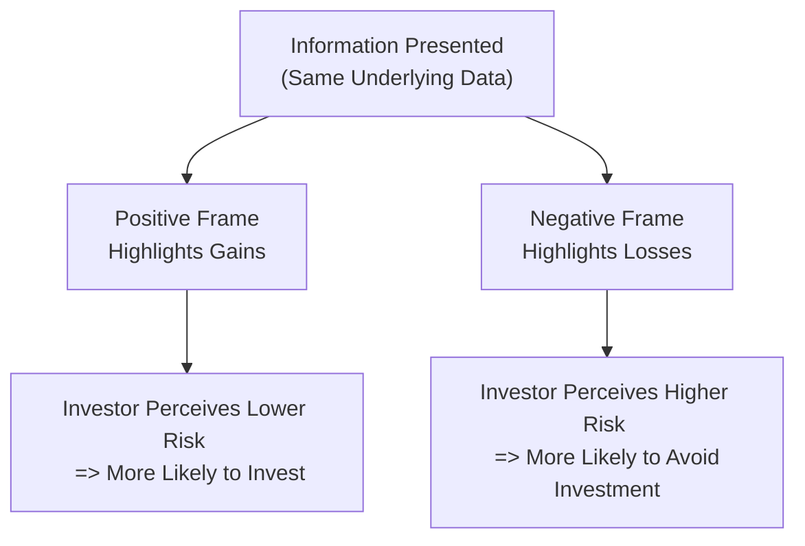

## Introduction

Have you ever found yourself making two completely different decisions based on how a question was asked? For instance, maybe you once jumped at the chance to buy a stock when someone said, “It has an 80% chance of going up,” but you hesitated when someone else said, “Well, there is a 20% chance it might drop.” Both statements actually convey the same probability—just framed differently. That’s what we call framing.

In this section, we explore the powerful effect that “framing” can have on investment selections. We’ll look at how certain marketing messages, product presentations, or even the names of strategies can drastically alter how we perceive risk and reward. We’ll tie these insights back to broader behavioral finance concepts—especially Prospect Theory, which helps explain why a positive or negative frame can push investors into making less-than-rational choices. By the end, you’ll see that framing is not just an academic concept but a critical real-world factor in portfolio management.

## The Concept of Framing

Framing refers to how the presentation or “frame” around a piece of information influences decisions, even when the underlying data remain constant. Sure, it sounds simple, but the ramifications are huge. In portfolio management, a risk can appear more or less severe based solely on the words or structure used to describe it.

When a scenario is presented in a “positive frame,” the emphasis is placed on what you stand to gain. On the other hand, a “negative frame” focuses on potential losses or undesirable outcomes. Because investors tend to be loss averse (that is, they feel the pain of losses more strongly than the pleasure of gains), negative framing often induces a different—sometimes more cautious—approach compared to positive framing.

### Prospect Theory in a Nutshell

Prospect Theory, developed by Daniel Kahneman and Amos Tversky, is the foundation for understanding how framing intersects with decision-making. Traditional finance might say, “A rational investor makes choices purely based on expected utility.” But Prospect Theory highlights that people weigh gains and losses differently and are influenced by reference points or how a question or outcome is framed.

In formal terms, traditional expected utility might be written as:


U = \sum_{i} p_i \times u(x_i),


where \\( p_i \\) is the probability of outcomes and \\( x_i \\) are the payoffs. Under Prospect Theory, however, the utility function becomes asymmetrical, emphasizing that losses hurt more than gains of a similar size feel good, and that framing can shift the reference point that defines what counts as a “loss” vs. a “gain.”

## Real-World Examples of Framing

### Positive vs. Negative Frames

• Positive Frame Example: “This mutual fund has outperformed its benchmark 80% of the time.”  
• Negative Frame Example: “This mutual fund has failed to exceed its benchmark 20% of the time.”

Both statements say exactly the same thing, numerically speaking. However, many investors feel more comfortable hearing the positive framing because it highlights their potential success. 

Similarly, compare “If you invest in this bond, there’s a 95% chance you’ll receive all your principal plus interest” with “There’s a 5% chance this bond will default.” You might get spooked by the second version, even though it provides the same information. That’s framing in a nutshell.

### Product Marketing and Investor Choices

Let’s say a financial advisor markets a retirement plan with the tagline, “Secure your golden years—your principal is protected in most market conditions.” Potentially, that’s a bright, confidence-building message. But if the same plan was advertised as “Under severe conditions, your principal could still decline,” you might be more skeptical. This phenomenon is why marketing campaigns often focus on positives: they know that how you frame a product can invoke enthusiasm or fear, and that can determine whether an investor commits.

On a personal note, I (the author) once nearly passed on a seemingly attractive hedge fund strategy. The word “loss” was sprinkled throughout the marketing materials—albeit in a factual context—so it felt risky. When the same strategy was presented with an emphasis on “capital preservation,” I suddenly felt more at ease, even though the underlying strategy was identical. It was a revealing moment about framing’s power to shape one’s perception.

## Interaction with Other Biases

Framing rarely operates in isolation. It often interacts with other cognitive biases:

• Loss Aversion: Investors already hate losses more than they enjoy equivalent gains. When you frame the same outcome as a potential loss, it can heighten a loss-averse response.  
• Confirmation Bias: People might select the framings that confirm their preexisting attitudes. If they’re bullish on a stock, they seek out the “80% chance of success” messaging. If they’re bearish, the “20% chance of failure” resonates.  
• Anchoring Bias: A positively framed anchor, like “average 15% annual returns,” could anchor an investor to overly optimistic expectations, even if the strategy’s probability distribution is more nuanced.

## Why Framing Matters in Portfolio Management

### Impact on Asset Allocation and Rebalancing

When constructing or rebalancing a portfolio, how an advisor frames the potential risk-return trade-off can nudge an investor into more (or less) conservative allocations. A “fear-based” presentation of certain equities might skew them to overweight conservative assets like Treasury bills, while a “growth-oriented” pitch might encourage heavier equity exposure.

### Influence on Risk Perception

Framing can also affect the perceived severity of risk events. A manager might downplay the potential drawdowns by focusing on the long-term average returns. Conversely, focusing on short-term volatility might scare off an investor who otherwise would have benefited from a riskier but higher-expected-return asset.

### Tactical Decision-Making

During times of market stress (like a market correction or a sudden geopolitical crisis), the framing of what's happening in the market can shape immediate tactical decisions. An investor confronted with “There is a 25% probability of losing more than 10% of your portfolio in the next three months” will likely make different decisions compared to hearing “There is a 75% probability you will lose less than 10%.”  

## Limiting Misleading Frames

1. Standardized Presentations: Regulators often require standardized disclosures, especially for mutual funds and structured products, to give balanced presentations of both gains and losses.  
2. Scenario Analyses: Present multiple scenarios (market rally, base case, market downturn) so that the investor sees an investment from different angles.  
3. Break-Even Analysis: Show the investor how much of a drawdown they can sustain before the investment fails to meet a key objective (like funding college tuition). This clarifies the real “cost” of losses rather than just focusing on average returns.  
4. Balanced Outlooks: Use both positive and negative frames—potential gains, possible losses—to provide a fuller picture.  
5. Clear Metrics and Benchmarks: Ensure that metrics (like Sharpe ratio, drawdown, upside/downside capture) are clearly defined and that benchmarks for performance are disclosed.

## A Quick Illustration Using Python

Below is a short snippet of Python code showing a simple simulation of how decision-making could shift under different frames, even though the probabilities remain the same:

```python
import numpy as np

np.random.seed(42)
num_scenarios = 10

prob_success = 0.80
prob_failure = 1 - prob_success

decisions_positive_frame = []
decisions_negative_frame = []

for i in range(num_scenarios):
    # In a real world situation, more data would shape these decisions
    # For demonstration, we'll randomly choose an acceptance threshold
    threshold = np.random.uniform(0.5, 0.9)
    
    # Positive framing decision
    if prob_success > threshold:
        decisions_positive_frame.append("Invest")
    else:
        decisions_positive_frame.append("Reject")
    
    # Negative framing decision
    if prob_failure < (1 - threshold):
        decisions_negative_frame.append("Invest")
    else:
        decisions_negative_frame.append("Reject")

print("Decisions with Positive Frame: ", decisions_positive_frame)
print("Decisions with Negative Frame: ", decisions_negative_frame)
```

In reality, context is everything—desired return, volatility tolerance, and so forth. Nonetheless, you’d be surprised how the lens of “80% success” vs. “20% failure” can shift the decision.

## Visualizing Framing Effects

Below is a simple Mermaid diagram illustrating how framing leads an investor from the same situation to two different decisions:



Observe that from node A (the same raw data), we branch to either a positive or negative framing, leading to distinct psychological perceptions of risk and, potentially, distinct action.

## Practical Strategies to Overcome Framing

1. Ask for Both Sides: When you’re presented with an “upside” argument, ask: “What’s the downside?” If you’re shown the downside, ask for potential gains.  
2. Use Explicit Comparisons: Compare the expected outcome to a benchmark or alternative strategy. That can neutralize framing by providing perspective.  
3. Adopt a Structured Decision-Making Process: Create consistent steps for evaluating opportunities—like always analyzing risk metrics, liquidity considerations, and correlation effects—rather than relying on marketing messages.  
4. Scenario Testing: Conduct scenario tests with different frames to see how your own decisions might shift. This can help shine a light on your own biases.  
5. Seek Independent Opinions: Getting input from a colleague, a friend, or a second professional can help you see through marketing frames.

## Exam Relevance and Further Considerations

Within the broader context of behavioral finance, especially for those pursuing the CFA designation, understanding framing effects is critical in both theoretical exam questions and real-case, scenario-based item sets. You may be asked to:

• Recognize the presence of framing in a provided investment recommendation and identify how it might mislead the client.  
• Suggest strategies for ensuring balanced communication in an Investment Policy Statement (IPS).  
• Calculate or discuss how different frames can alter the perceived risk of identical investments.  
• Evaluate how to mitigate biases using scenario analyses and standardized jargon.

Remember that the CFA exam often tests your ability to detect subtle biases in practice, so pay attention to how numerical data is phrased or anchored.

## Glossary

• Framing Effect: A cognitive bias where people make different decisions depending on how the same information is presented.  
• Prospect Theory: A behavioral model that describes how individuals evaluate potential losses and gains and make decisions under conditions of risk and uncertainty.  
• Positive Frame: Presenting information in a way that emphasizes potential gains or benefits.  
• Negative Frame: Presenting information in a way that highlights potential losses or risks.

## Conclusion

Framing is one of those deceptively simple concepts that has far-reaching implications in finance. Sure, we might think we’re fully aware of “80% vs. 20%,” but in practice, that shift in endpoints can meaningfully affect whether someone invests in a hedge fund, holds onto a stock during a downturn, or locks in an annuity for retirement. By recognizing framing cues, using scenario and break-even analyses, and demanding balanced presentations, investors and managers can make more informed, less biased decisions.

At the end of the day, the “same data” can lead to very different actions—so keep an eye on how it’s packaged. With an awareness of framing, plus the standard rock-solid analytics of risk and return taught throughout the CFA curriculum, you’re better positioned to avoid snap judgments and steer portfolios toward rational, well-grounded choices.

---

## References & Further Reading

- Tversky, A., & Kahneman, D. (1981). “The Framing of Decisions and the Psychology of Choice.” Science.  
- Bento, N., & Ferreira, P. (2020). “The influence of informational framing on investor decision-making.” Energy Policy.  
- CFA Institute. (2025). CFA® 2025 Level I Curriculum, Volume 9: Portfolio Management.

---

## Test Your Knowledge: Framing Effects in Portfolio Decisions



### How does the framing effect primarily influence investment decision-making?

- [x] By altering the way the same information is perceived, leading to different choices.
- [ ] By changing the fundamental risk profile of an asset.
- [ ] By eliminating personal judgments and focusing solely on data.
- [ ] By ensuring a strictly rational response to outcome probabilities.

> **Explanation:** The framing effect influences how we perceive the same data. It doesn’t change actual risk but can shift our decision about risk-taking.

### Which of the following best illustrates positive framing?

- [x] “There’s an 80% chance your stock will meet or exceed its target return.”
- [ ] “There’s a 20% chance your stock will miss its target return.”
- [ ] “This fund will guarantee returns in all market conditions.”
- [ ] “The performance of this fund depends solely on market volatility.”

> **Explanation:** Emphasizing the high probability of success (80% chance) is positive framing, versus highlighting the risk that it might fail.

### Prospect Theory suggests that investors:

- [x] Value losses more than equivalent gains, shaping decisions in a non-linear way.
- [ ] Value gains and losses equally so long as the probabilities match.
- [ ] Are always rational and unaffected by frames.
- [ ] Are primarily influenced by nominal values rather than utility.

> **Explanation:** According to Prospect Theory, investors exhibit loss aversion, which can be magnified by how information is framed.

### Which of the following is a common method to mitigate framing bias?

- [x] Using standardized presentations of both pros and cons.
- [ ] Removing all data on risk from investment proposals.
- [ ] Basing decisions only on short-term charts.
- [ ] Focusing on just one best-case scenario.

> **Explanation:** Offering standardized, balanced views of potential gains and losses helps ensure that framing doesn’t skew investor judgment.

### An investor sees a statement: “This strategy has a 15% probability of loss and an 85% probability of at least breaking even.” What might best minimize framing bias?

- [x] Requesting a scenario analysis showing losses and gains across different market conditions.
- [ ] Taking the statement as an absolute truth about investment success.
- [x] Asking the advisor to provide alternative wordings, such as “You have an 85% chance of preserving your principal.”
- [ ] Eliminating all exposure to the strategy immediately.

> **Explanation:** Viewing multiple scenarios or re-phrasing the statement are both valid ways to clarify the underlying probabilities and reduce framing bias. This question has two correct options.

### Which outcome is most likely when a product is framed to emphasize long-term average returns?

- [x] Investors may downplay short-term volatility and invest more aggressively.
- [ ] Investors will automatically demand stricter margin calls.
- [ ] The product’s fundamental risk increases.
- [ ] Framing does not affect experienced investors.

> **Explanation:** By emphasizing average or long-term returns, investors tempted by a positive spin often ignore potential short-term downside.

### A real estate investment is presented as “90% of this property’s leases have historically been paid on time.” Its negative counterpart would be:

- [x] “10% of the leases have historically faced late or delinquent payments.”
- [ ] “The property can occasionally have late payments but mostly short-term in nature.”
- [x] “10% of the leases do not pay on time, which could reduce cash flow predictability.”
- [ ] “Approximately 90% rent collection occurs, which is normal across all real estate assets.”

> **Explanation:** Highlighting the 10% delinquency is the negative framing, despite being equivalent to “90% on-time payments.” This question has two correct negative framings.

### Which statement accurately reflects the combined effect of framing and loss aversion?

- [x] Investors are more sensitive to negative frames, leading them to overestimate risk.
- [ ] Investors become indifferent to risk when it is framed negatively.
- [ ] Investors ignore negativity if it conflicts with confirmation bias.
- [ ] Framing eliminates the effect of loss aversion on decision-making.

> **Explanation:** Because of loss aversion, a negative frame can amplify how severe the risk appears, sometimes making investors overly cautious.

### In a scenario where two investment products have identical risk-return profiles, but one is marketed emphasizing “protection from loss,” an investor might:

- [x] Pick the “protection” product due to its more comforting framing.
- [ ] Choose both products equally often since rationally they are the same.
- [ ] Refuse to invest in either product.
- [ ] Always choose the cheaper product.

> **Explanation:** The protective framing can nudge an investor to select that product, despite identical fundamentals, indicating the power of framing.

### The framing effect can be effectively addressed by:

- [x] True
- [ ] False

> **Explanation:** Acknowledging framing bias, using scenario and break-even analyses, and seeking balanced presentations can reduce its impact, so yes, it can be effectively addressed.


