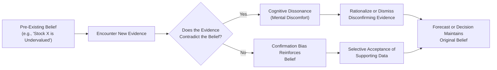

## Introduction

Have you ever felt that pang of frustration (or maybe denial) when new information flies in the face of a belief you’ve held for a long time? I know I have. It’s that moment when your mind goes “Wait a minute—this can’t be right,” and you scramble to explain away the inconvenient data. In finance, this can lead to stubborn forecasts and poor decisions. This phenomenon is called cognitive dissonance: the psychological discomfort of holding two conflicting views. Investors under its influence often rationalize or dismiss new evidence rather than adjust their positions.

Layer on top of that our dear friend confirmation bias: the tendency to collect only the data that confirm our existing viewpoints, ignoring evidence that challenges those views. And there you go—your forecasting process is on a collision course with flawed conclusions. This section explores these two powerful biases, focusing on how they affect forecasts in portfolio management, how to spot them, and, of course, how to reduce their impact on your investment decisions. After all, as future portfolio managers or investment advisors, it’s not enough to be right; we also need to be open-minded when new information tells us we might be wrong.

## Understanding Cognitive Dissonance

Cognitive dissonance is that uneasy feeling you get when you become aware of holding contradictory beliefs, values, or attitudes simultaneously. Let’s say an investor is deeply convinced a certain stock is undervalued. Later, they stumble upon sell-side research that contradicts their bullish stance. If the research is robust and plausible, they experience mental tension. This tension is what we call dissonance. Because it’s uncomfortable, investors often try to reduce it. Sometimes they’ll question the integrity of the research, or they’ll search for any reason to disregard the negativity—even something as trivial as the color of the graphs. It’s surprising, but we can get creative in rationalizing away inconvenient truths.

In the context of portfolio management, cognitive dissonance can sabotage objectivity. When faced with contradictory market data, say signals of declining fundamentals in an industry that was previously believed to be immune to recession cycles, we might cling to old convictions. Instead of rebalancing or selling, we double down to avoid that nagging sense of conflict in our minds.

## The Link Between Cognitive Dissonance and Confirmation Bias

Cognitive dissonance frequently teams up with confirmation bias to create a self-reinforcing behavioral loop:

• Cognitive dissonance triggers the need to eliminate contradictory evidence (to reduce the discomfort).  
• Confirmation bias steps in by filtering out negative or opposing information, making it easier to maintain the original, possibly outdated belief.  

If you think of it like a vicious cycle, it goes something like this:

1) You hold a strong belief about a certain investment (say, stock of Company X).  
2) Any evidence that this belief might be wrong (a negative earnings surprise or a product recall) creates tension—cognitive dissonance.  
3) You experience mental discomfort and want to reduce it as quickly as possible.  
4) You start searching for evidence that reaffirms your original stance, ignoring or discounting anything that doesn’t fit—this is confirmation bias.  
5) The original belief grows stronger and more entrenched, even if it’s no longer accurate.  

Financial professionals are particularly susceptible to these biases. In day-to-day practice, heavy workloads and quick decision turnarounds can lead to mental shortcuts. Confirmation bias is often that “easy route,” especially if you already have a strong thesis.

Below is a simple flowchart illustrating how these biases reinforce each other in an investment context:



## Effects on Forecasting Accuracy

Now, let’s shift specifically to forecasting. Forecasting is at the heart of portfolio management: we predict market directions, investment performance, economic cycles, and corporate earnings. We rely on both quantitative and qualitative data, and we incorporate forward-looking assumptions. In a perfect world, these assumptions are fluid—subject to change as new data arrive. But in reality, cognitive dissonance and confirmation bias can cause analysts to systematically overlook red flags, interpret ambiguous information in a self-serving way, or cling to an outdated forecast.

• Skewed Data Collection: Analysts might cherry-pick data to support a favored scenario (e.g., ignoring macro trends suggesting a slowdown or discounting negative analyst reports).  
• Overconfidence in Projections: If a team is convinced that a growth stock will continue to grow, they might exaggerate revenue growth rates and discount risk factors.  
• Inadequate Revision of Estimates: Once an earnings forecast is set, contradictory data are downplayed. Analysts might revise forecasts too slowly—leading to forecast error and potential mispricing.  

Let’s say you’re analyzing a consumer products company that launched a new line of eco-friendly packaging. You expect big success due to rising global demand for green products. But imagine you ignore the steep cost of materials that threatens margins, which a competitor’s research paper highlighted. Because you’re already “invested” in the idea that eco-friendly is the next big trend, you might dismiss that cost issue as temporary or an overestimation. That’s how these biases creep in.

## Real-World Anecdote

Some years ago, I worked with a team that was extremely excited about a certain industrial manufacturer. The company had just merged with a smaller competitor, and our internal consensus was that the synergy story would drive near-term growth. Unfortunately, we found numerous neutral or even mildly negative signals—like rumors of supply-chain issues and managerial turnover. But we all just said, “Yeah, well, every acquisition experiences some friction.” We insisted on the synergy synergy synergy point. Then the stock price went sideways for a full year while the rest of the industrial sector soared. Hindsight is 20/20, of course, but if we had recognized our cognitive dissonance and confirmation bias, we might have at least considered an alternative scenario that accounted for those increasingly visible red flags.

## Strategies for Mitigating Dissonance and Confirmation Bias

So, how do we avoid the trap? Or at least reduce its impact? Obviously, we’re human, and nobody is 100% objective. But there are practical steps to lessen these biases:

Fostering Open Debate  
Encourage an environment where team members can freely challenge each other’s conclusions. If you’re the team lead, maybe set up a “red team” or a group designated to pick apart the bull thesis. This is an example of devil’s advocacy in action. This is not meant to create hostility but to clarify risks. By systematically challenging the group’s assumptions, you bring potential blind spots into the open.

Scenario Planning  
Another approach is scenario planning: instead of just making one baseline forecast, create multiple potential outcomes (optimistic, neutral, pessimistic). Force yourself or your team to detail each scenario’s assumptions. This helps in better evaluating contradictory data. For instance, if new evidence arises that might shift your view from baseline to pessimistic, scenario planning makes it smoother to adapt. You can identify early triggers, like a competitor’s product launch or an unfavorable regulatory ruling.

Encouraging Dissent  
It’s one thing to listen politely to a contrarian viewpoint. It’s another to promote it. Let’s face it, in many corporate cultures, disagreeing with managers can feel risky. But if you reward thoughtful challenges, the result is profoundly beneficial. That voice in the back of the room saying, “Wait, are we sure about these margin assumptions?” might actually save you from big forecast errors.

Formalizing Risk Assessments  
Another tip is to systematically evaluate what might go wrong with your forecast. Force yourself to outline key risk factors. Are interest rates a potential spoiler? Could new regulation hamper product demand? By journaling or systematically documenting these possible risks, you reduce the tendency to gloss over them.

## Utilizing Objective Forecasting Tools

Numbers don’t lie, but how we interpret them can be quite subjective. To help mitigate confirmation bias, consider using objective tools:

• Multiple Data Sources: Don’t rely solely on a single source—try exploring a range of economic indicators, sell-side analyses, buy-side commentaries, and third-party data providers.  
• Quantitative Models: Statistical or machine-learning models might be a solid line of defense against personal conviction overriding evidence. A purely algorithmic approach can highlight contradictory data you might otherwise dismiss. For example, factor-based models that identify style tilts—value, growth, or momentum—can serve as an objective baseline.  
• External Advisors or Reviewers: Having a third party who isn’t invested in your forecast—someone from outside your team or even your organization—can provide an independent opinion on your assumptions.   

In section 15.2 on Machine Learning and Algorithmic Portfolio Optimization (found later in this volume), we’ll discuss how advanced models can be integral to screening out emotional and cognitive biases. That said, these models are only as good as the data you feed them. Biases can also creep in when you choose or interpret data. So be mindful.

### Python Example: Simple Forecasting Check

Sometimes a quick Python check can reveal biases. Assume you have a list of analyst price targets for a single stock:

```python
import statistics

price_targets = [105, 110, 108, 112, 150, 109, 107]

mean_target = statistics.mean(price_targets)
stdev_target = statistics.pstdev(price_targets)

print(f"Mean Price Target: {mean_target}")
print(f"Price Target Standard Deviation: {stdev_target}")
```

If the stock is currently trading at 100, a mean price target of 114 with an outlier at 150 might prompt further questioning. Is that 150 reasoned or a product of an overconfident forecast? Treat outlier opinions as either an exciting opportunity or an important warning sign, but investigate thoroughly. Don’t simply use them to “prove” your original bullish stance.

## Post-Mortem and Ongoing Learning

Ever hear of a “forecast autopsy”? It’s one of the best ways to learn. After a forecast has played out—maybe a quarter’s earnings or over a end-of-year period—take the time to dissect what went right and what went wrong. Did overconfidence cause you to dismiss contradictory evidence too quickly? Did you weigh one data point too heavily because it confirmed your thesis?

A structured post-mortem can help identify if biases systematically affected your results. You can even keep a “forecasting diary,” noting each time you felt uneasy about certain data. These diaries help you see patterns, like “I always fail to integrate negative guidance from management calls,” or “I seem to ignore credible short-seller reports.”

At the organizational level, you can adopt something akin to after-action reviews used in project management or the military. The goal is not to point fingers but to gather lessons learned for continuous improvement. Over time, this fosters a culture of accountability and rigorous thinking.  
 
## Conclusion

Whether you’re an equity analyst or a multi-asset portfolio manager, being aware of cognitive dissonance and confirmation bias can greatly improve your investment strategies and forecasting skills. It’s not about becoming magically free of biases—we’re all human. Instead, it’s about creating processes and fortifying them with open dialogue, scenario planning, and objective measurement. Big decisions demand big humility, and these biases, left unchecked, can lead to big missteps.

Recognizing the tension of conflicting beliefs (cognitive dissonance) and actively seeking out contradictory evidence (the antidote to confirmation bias) can elevate both individual and collective decision-making in finance. In the next sections of this volume, we’ll see how these biases interplay with other behavioral factors, and we’ll discuss more advanced techniques, like risk management frameworks and multi-factor models, that can further counteract these cognitive pitfalls.

## Final Exam Tips

• Always challenge your own assumptions. In essay-type questions, the CFA Exam frequently rewards candidates who demonstrate reasoned perspectives, highlight potential counterarguments, and prove they can pivot when faced with contradictory data.  
• Use scenario-based analysis when tackling item set questions. Assume multiple outcomes and weigh the evidence for each.  
• Beware of overly simplistic answers. In many portfolio management problems, the exam expects you to weigh multiple data points without ignoring negative signals.  
• In constructed-response questions, it’s helpful to show that you considered alternative viewpoints—this often translates into partial credit even if your final stance isn’t correct.  
• Quantitative cross-checks can provide a second opinion. Cite factual data (e.g., mean and standard deviation) as a buffer against your personal biases.  

Use these tips across your analyses, especially in the portfolio management sections, where forward-looking assumptions are crucial to success.

## References & Further Reading

• Plous, S. (1993). The Psychology of Judgment and Decision Making. McGraw-Hill.  
• Tetlock, P. (2017). Expert Political Judgment: How Good Is It? How Can We Know? Princeton University Press.  
• CFA Institute. (Current Edition). Code of Ethics and Standards of Professional Conduct.  
• CFA Institute. (Current Edition). CFA Program Curriculum.  

---

## Test Your Knowledge: Cognitive Dissonance and Confirmation Bias in Forecasting



### Which of the following best describes the concept of cognitive dissonance in an investment context?

- [ ] Seeking out only information that confirms your existing opinion
- [x] Feeling mental discomfort when new information contradicts your current belief
- [ ] Having consistently accurate forecasts by ignoring new information
- [ ] Accepting multiple contrary opinions at once without questioning them

> **Explanation:** Cognitive dissonance is the unease that arises when the investor’s strongly held beliefs conflict with new contradictory data, leading to mental discomfort and potential rationalization.

### When investors experience confirmation bias, they tend to:

- [ ] Adopt new and conflicting data easily
- [ ] Overestimate the effect of contradictory evidence
- [x] Focus on information that aligns with their pre-existing views
- [ ] Stop monitoring any data once they make an initial decision

> **Explanation:** Confirmation bias manifests as actively seeking, interpreting, or remembering information in a way that supports an existing opinion.

### Which strategy is most likely to mitigate the impact of cognitive dissonance in a research team?

- [x] Introducing devil’s advocacy in the decision-making process
- [ ] Rewarding groupthink to maintain harmony in the team
- [ ] Encouraging analysts to ignore riskier scenarios
- [ ] Emphasizing a single bullish thesis as group consensus

> **Explanation:** Devil’s advocacy ensures that assumptions are challenged and that contradictory evidence is properly considered.

### One likely outcome of combining cognitive dissonance with confirmation bias is:

- [ ] Improved adaptability of forecasts to new information
- [ ] Rapid and consistent adjustments in investment theses
- [ ] Excessive reliance on negative alternative scenarios
- [x] Reinforcement of outdated beliefs and reluctance to revise forecasts

> **Explanation:** When faced with evidence that conflicts with existing beliefs, individuals can become more entrenched, failing to update forecasts effectively.

### How can scenario planning help manage forecasting biases?

- [x] By forcing analysts to acknowledge and evaluate multiple potential outcomes
- [ ] By eliminating any possibility of data misinterpretation
- [x] By reducing the reliance on a single, possibly biased perspective
- [ ] By building a single bullish thesis based on group consensus

> **Explanation:** Scenario planning widens the scope of consideration, compelling analysts to think about alternative outcomes and reduce over-reliance on a favorite scenario.

### Which of the following approaches would help a forecaster detect confirmation bias?

- [x] Comparing a quantitative model’s recommendations with one’s own subjective analysis
- [ ] Only discussing forecasts with team members who share similar opinions
- [ ] Avoiding any post-mortem analysis of past decisions
- [ ] Refusing to engage in devil’s advocacy discussions

> **Explanation:** An objective tool like a quantitative model can bring to light contradictions that a subjective forecaster might overlook.

### What is the purpose of a “forecast autopsy” (post-mortem) in behavioral finance?

- [x] Identifying where biases like cognitive dissonance and confirmation bias influenced outcomes
- [ ] Quickly finalizing decisions by limiting data review
- [x] Helping teams learn from errors to improve future forecasts
- [ ] Protecting consensus forecasts from outside review

> **Explanation:** Post-mortems systematically assess the correctness of forecasts. They highlight where biases might have warped the decision-making process, so future decisions can be improved.

### In practice, how can an investment committee encourage healthy debate and minimize confirmation bias?

- [x] By setting up a “red team” to challenge and question major assumptions
- [ ] By immediately adopting the most bullish viewpoint for morale
- [ ] By enforcing penalties for dissenting opinions
- [ ] By granting veto power to the most experienced analyst only

> **Explanation:** Red teams and structured debates invite contradictions and help uncover blind spots, reducing the chance of ignoring negative signals.

### Which statement exemplifies cognitive dissonance?

- [x] “I usually see negative signals, but that news article criticizing our preferred stock must be biased.”
- [ ] “I always love hearing any perspective that differs from mine.”
- [ ] “I prefer a variety of data, so I can see all possible viewpoints.”
- [ ] “I’m satisfied with the outcome and adjusted my thesis accordingly right away.”

> **Explanation:** Dismissing negative signals or rationalizing them as biased is a classic sign of cognitive dissonance.  

### True or False: Using objective forecasting tools guarantees freedom from confirmation bias.

- [x] True
- [ ] False

> **Explanation:** Actually, this is a trick question. Even with objective tools, biases can creep in through the selection or interpretation of data. No system is completely immune; human oversight is still needed.


