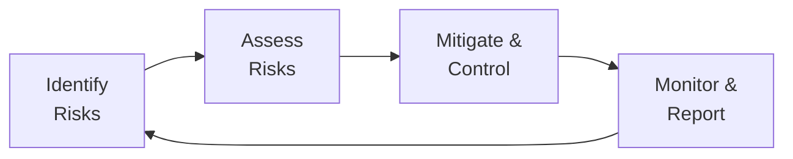

## Understanding the Importance of Operational Risk

Operational risk is the risk of financial or reputational loss resulting from inadequate or failed internal processes, people, systems, or external events. It might sound a bit abstract at first, but just imagine the chaos if a firm’s trading software goes down unexpectedly for hours—possible missed trades, compliance risks, or maybe even client dissatisfaction skyrocketing. That’s operational risk in action. This risk category can include everything from cyberattacks to hurricanes or simple human errors that bring the back office to a grinding halt.

Firms large and small take operational risk management very seriously because, well, things happen. Nobody loves dealing with broken processes or data breaches, but addressing them proactively can save enormous headaches. Over the years, as global regulations like Basel guidelines have expanded, the financial industry has become more proactive about structuring robust operational risk frameworks. These frameworks guide us on how to identify key vulnerabilities, measure them, and create meaningful metrics that let us see early warning signs of trouble.

## Defining Key Components of Operational Risk

Operational risk is inherently broad, which can be both fascinating and daunting. The primary components often include:

• People: Think unintentional errors, but also possibilities of fraud and misconduct.  
• Processes: Weak or outdated procedures, or lack of clarity in workflow responsibilities.  
• Systems: Unexpected IT outages, software malfunctions, or system incompatibilities.  
• External Events: Natural catastrophes, pandemics, sabotage, or changes in the regulatory environment.

If you’ve ever tried explaining to a friend why your firm has a “disaster recovery site,” well, it’s precisely to hedge against these external disruptions. The strategy is all about protecting the portfolio management process and broader business functions from sudden operational shocks.

## Core Operational Risk Metrics

A well-balanced operational risk dashboard uses quantitative and qualitative metrics to give management that all-important sneak peek into emerging problems. Below are some of the common metrics you’ll encounter:

### Key Risk Indicators (KRIs)

KRIs are measurable triggers that alert us to potential risk events before they fully materialize. For instance, a rising trend in system downtime incidents might serve as a KRI alerting you to a broader technology stability issue or vendor management gap.

• Frequency of System Downtime (e.g., hours of outage per quarter)  
• Number of Reported Internal Control Breaches  
• Data Quality Scores (e.g., error rates in new account openings)  

KRIs work well because they’re forward-looking and adjust management’s mindset from reactive (“We had a problem—now let’s fix it”) to proactive (“We might have a problem, so let’s tackle it ahead of time”).

### Loss Event Frequency and Severity

Loss event frequency speaks to how often adverse operational events—like system errors or compliance breaches—actually happen. Severity addresses how damaging those events can be in terms of financial loss or reputational fallout.

• Frequency: How many times have we had to fix a scheduled payment error each month?  
• Severity: How large were the resulting losses or reputational hits?

It’s not uncommon to slice and dice these metrics by department or region to figure out if a particular line of business needs extra attention or specialized training.

### Time-to-Recovery (TTR)

Time-to-Recovery is a favorite among technology and business continuity teams. It captures how quickly a system or process bounces back after a disruption.

• Mean TTR: The average time (in hours or days) it takes to restore a critical system after it crashes.  
• Worst-Case TTR: The maximum restoration time observed over a specific period.  

A consistent increase in TTR might indicate insufficient backup resources or lack of redundancy, which could hamper portfolio managers’ ability to make timely trades or settlements.

### Near-Miss Incidents

A near miss is an event that could’ve triggered a loss but, by luck or partial intervention, didn’t. Near-miss data is precious because it reveals vulnerabilities in your processes. At an old job of mine, we had a near-miss where an IT patch almost took down our main trading platform during peak hours—yikes! Monitoring these events tells you where you’re skating on thin ice, hopefully before you fall in.

• Count of near misses per quarter  
• Root-cause analysis of what prevented the incident from escalating  

Often, near misses are the best teachers. They help you adjust processes or upgrade controls without the financial or reputational pain of a full-blown crisis.

## Designing Effective Operational Risk Reporting

Your operational risk metrics rely on thorough reporting to ensure they produce real value. Without timely, transparent dashboards, even the best metrics remain hidden in project folders. Effective reporting typically involves these approaches:

### Clear Visualization Formats

Present your metrics in simple yet visually appealing charts, tables, or heat maps. Try using color-coded thresholds to highlight whether your metrics are within acceptable limits or straying into cautionary territory.



In the diagram above, reporting is a vital part of the iterative risk management life cycle. You don’t just identify and assess risks; you circle back with meaningful output that guides decision-making.

### Frequency and Escalation Pathways

Some metrics need daily or weekly tracking, especially if they monitor critical processes like portfolio trading or settlement systems. Others might be fine on a monthly or quarterly schedule. The point is that you shouldn’t burden your team with daily metrics if they only change meaningfully over longer horizons. Likewise, if something is truly urgent—like a major compliance breach—there should be a clear escalation path to senior management and the board.

### Trend Analysis and Benchmarking

No single data point is useful in a vacuum. Would you say a 2% increase in system errors is acceptable? It depends—maybe you added new staff or new systems. That’s why trend analysis is essential. By comparing metrics month-over-month or year-over-year, you can see if you’re improving or if your risk exposures are growing. Benchmarking against industry norms, or established best practices, also helps you interpret the significance of any changes in your operational risk data.

## Linking Metrics to Risk Tolerance Thresholds

One crucial step in operational risk management is connecting the dots from metrics to real-world action. You might define thresholds: “If the system downtime exceeds one hour per month, we escalate.” Clear thresholds remove guesswork, guiding your teams on when to respond.

Let’s say your critical portfolio management system is offline for 30 minutes. That might be annoying, but maybe it’s still acceptable if you have redundancy or alternative workflows. However, beyond the 30-minute mark, your risk appetite starts to get tested. By setting these tolerance thresholds, you declare upfront how much disruption you’re willing to tolerate. If you exceed it, you can’t just shrug—management is obligated to dig in and fix the root cause. This approach helps you spot risk patterns early and systematically, rather than on an ad hoc basis.

## The Role of Internal Audits and External Reviews

Sometimes, risk metrics might be over- or under-reported due to inconsistent data collection or conflicting departmental incentives. To counteract that, internal audits, external reviews, or even third-party consultants validate both your metrics and your overall risk management framework. This dual layer of assurance keeps everyone honest and invests greater trust in the numbers you post to your risk dashboards.

Internal audits often perform spot checks of your data collection process:  
• Do operational logs match the reported numbers?  
• Are you systematically capturing near misses, or only the major events?  

Meanwhile, external reviews from independent experts or regulatory inspectors cross-verify your internal findings. They might suggest best practices gleaned from industry-wide experience or new regulatory standards. The idea is synergy—internal teams watch the day-to-day processes, while external reviewers provide fresh, outside insights.

## Practical Example: Linking Incident Data with KRIs

Imagine a mid-sized asset management company that experiences a series of small but recurring transaction settlement delays on Fridays. These incidents may look minor—refunds and trades end up settling a day or two later—but combined, they can erode client confidence. After noticing the frequency creeping up, the firm sets a new KRI:

• Settlement Delay Count per Month  

The threshold they define is: “No more than 5 settlement delays per month.” After close monitoring, they find they regularly hit 6–7. Knowing they’ve breached their threshold, management invests in staff training, and the count drops to 2 by the following quarter. This is precisely how KRIs should be used—linking measured performance to targeted improvements before losses become too large.

## Best Practices for Operational Risk Metrics and Reporting

• Align Metrics with Business Objectives: Ensure that each metric reflects something that truly matters to organizational performance or legal compliance.  
• Keep Processes Scope-Appropriate: Not every department needs a daily KRI for everything. Customize dashboards so that each function focuses on its main risk drivers.  
• Maintain Historical Data: Tracking historical data helps you spot new trends or cyclical patterns.  
• Promote a Near-Miss Culture: Encourage employees to report near misses without fear of blame. This fosters continuous learning and helps refine processes before an actual failure occurs.  
• Use Tiered Reporting: Basic dashboards for line managers, more advanced analytics for risk committees, and executive summaries for top leadership. Everyone gets the right depth of information for their responsibilities.

## Common Pitfalls and How to Overcome Them

• Metric Overload: Trying to track too many metrics can be paralyzing. Focus on those that have real impact on the business.  
• Data Inaccuracies: Manual entry is prone to human error. Automate data collection where possible, and run routine technical checks.  
• Lack of Buy-In: If employees feel the metrics only serve compliance or “bureaucracy,” they won’t engage. Communicate how risk metrics protect the firm and even individual jobs.  
• Repetitive Reporting without Action: Avoid “zombie reports” that nobody reads. If a metric signals a risk, ensure there’s a plan to address it.

## Python Snippet: Simulating Loss Event Frequency

Below is a simplified example of how you might simulate the frequency of operational loss events in Python. Of course, this is just to illustrate data-driven approaches to forecasting or stress-testing operational risk exposures.

```python
import numpy as np

np.random.seed(42)
loss_events = np.random.poisson(lam=3, size=12)  # 12 months data
avg_loss_events = np.mean(loss_events)

print("Monthly loss events:", loss_events)
print(f"Average monthly loss events over the year: {avg_loss_events:.2f}")
```

This code produces a synthetic dataset indicating how many loss events might occur each month based on a Poisson process. You’d still need real data (and ideally more sophisticated modeling) to capture your firm’s specific risk profile, but it’s a handy demonstration to see how you can turn risk metrics into actionable analytics.

## Integrating Operational Risk into the Portfolio Management Framework

Operational risk management doesn’t sit in a vacuum; it’s part of the broader enterprise risk management. In a multi-asset portfolio context, you might also be tracking market risk, credit risk, and liquidity risk. Where does operational risk fit?

• Portfolio Execution: Delays or system glitches can affect trade execution quality.  
• Reporting Accuracy: Operational errors in daily performance updates can mislead investment decisions.  
• Regulatory Compliance: Non-compliance in areas like KYC (Know Your Client) or AML (Anti-Money Laundering) can lead to fines and reputational losses.  

By interlinking operational risk data with other risk management modules—like market VaR (Value at Risk) or credit exposure dashboards—you get a holistic view. For example, a surge in system downtime might coincide with missed trading opportunities, thus amplifying market risk. This synergy is key when senior leadership decides on overall risk mitigation budgets or capital allocations.

## Encouragement for CFA® Candidates

Operational risk may feel a bit unglamorous compared to analyzing the latest equity factor or building a multi-asset portfolio. But as the market has shown time and time again, a single process breakdown can cause massive losses or reputational damage. Understanding operational risk metrics, setting thresholds, and designing robust reporting frameworks is essential if you hope to build a resilient portfolio management practice.

And, yes, there’s a good chance you might see operational risk scenario-based questions on your exam. You know, the type where a hypothetical firm experiences a system outage right at the close of a major trading day. The question might ask how you’d measure or mitigate the risk. So, keep these concepts in your back pocket—they’re practical, testable, and will distinguish your skill set both on the exam and in real life.

## Final Exam Tips
• Precisely define terms like Key Risk Indicator (KRI) and near-miss incident. Scenario-based questions may rely heavily on those definitions.  
• Practice using metrics in short case studies. If given data about system outages or settlement errors, try to quickly interpret trends and draw conclusions.  
• Remember that operational risk can span from cybersecurity breaches to compliance lapses—show broad awareness.  
• In essay questions, demonstrate how operational risk integrates with other risk classes. Connect it with liquidity, market, or credit risk factors. The CFA exam often emphasizes synergy across risk areas.

## Glossary
• Operational Risk: The risk of loss arising from inadequate or failed internal processes, people, systems, or external events.  
• Key Risk Indicators (KRIs): Quantifiable measures that provide early warnings of potential risk events.  
• Near-Miss Incident: An event that had the potential to result in damage or loss but did not escalate to full-blown harm.

## References and Further Reading
• Basel Committee on Banking Supervision. (2011). Principles for the Sound Management of Operational Risk.  
• Power, M. (2004). The Risk Management of Everything. Demos.  
• ISACA. (2019). COBIT 2019 Framework: Governance and Management Objectives.  

## Test Your Knowledge: Operational Risk Metrics and Reporting



### A firm has seen a steady increase in reported system downtime over the past quarter. Which of the following metrics would be most effective as a Key Risk Indicator to monitor this situation?

- [x] Total hours of system downtime per month
- [ ] Fund performance compared to benchmark indices
- [ ] Number of new equity trades executed
- [ ] Headcount turnover rate in the marketing department

> **Explanation:** The best KRI here is the total hours of system downtime per month, since it directly addresses the observed increase in downtime.

### Which of the following statements about near-miss incidents in operational risk management is correct?

- [x] Near-miss incidents indicate a potential failure that did not result in a loss but reveals system vulnerabilities.
- [ ] Near-miss incidents are so minor that they do not need to be documented.
- [ ] Near-miss incidents reflect opportunities to increase risk-taking.
- [ ] Near-miss incidents are only relevant in credit risk and not in operational risk.

> **Explanation:** A near-miss is a valuable learning opportunity. Although it doesn’t cause a loss, it highlights critical vulnerabilities so you can reinforce controls.

### If a firm sets a maximum acceptable threshold of five settlement delays per month and reports eight delays in the current month, which is the most appropriate next step?

- [x] Escalate the issue to senior management and investigate root causes.
- [ ] Accept it as normal variability and move on.
- [ ] Increase the threshold to accommodate the extra delays.
- [ ] Remove settlement from the operational risk metrics.

> **Explanation:** Exceeding a defined threshold requires escalation and thorough investigation to avoid repeated breaches.

### Why is it critical to link operational risk metrics to specific risk tolerance thresholds?

- [x] It helps determine when corrective action must be taken.
- [ ] It reduces the overall cost of technology investments.
- [ ] It ensures employees receive higher bonuses.
- [ ] It eliminates the possibility of system downtime entirely.

> **Explanation:** Setting explicit thresholds allows teams to know the boundary between acceptable and unacceptable risk. Once metrics exceed these thresholds, corrective action becomes mandatory.

### In the context of operational risk, which example best illustrates a “loss event frequency” metric?

- [x] Counting how many times a trading error occurred in a given quarter
- [ ] Calculating the total financial impact of materialized credit risk events
- [x] Tallying the monthly occurrences of unauthorized system logins
- [ ] Estimating the standard deviation of daily portfolio returns

> **Explanation:** Loss event frequency focuses on how often certain operational failures occur (e.g., trading errors or unauthorized logins).

### Which of the following best describes a pitfall in operational risk reporting?

- [x] Creating too many metrics, leading to information overload
- [ ] Prompt escalation paths for critical issues
- [ ] Using heat maps to visualize operational risk data
- [ ] Setting clear thresholds for each KRI

> **Explanation:** Overabundance of metrics can confuse decision-makers, diluting the impact of truly pivotal data.

### Why are internal audits and external reviews important in operational risk management?

- [x] They validate the accuracy of metrics and effectiveness of controls.
- [ ] They replace the need for internal incident reporting.
- [x] They serve as the only way KRIs can be established.
- [ ] They eliminate all cyber threats quickly.

> **Explanation:** Independent verification—by both internal and external reviewers—ensures reliable data and identifies weaknesses in the firm’s control environment.

### A firm notices its time-to-recovery (TTR) for critical systems is rising month-over-month. Which of the following is the most plausible reason?

- [x] Backup processes are failing or insufficiently tested.
- [ ] The firm recently experienced a large trading gain.
- [ ] The marketing team is slow to update social media content.
- [ ] Portfolio managers are rebalancing more frequently.

> **Explanation:** An increasing TTR often indicates that backup infrastructure isn’t robust or well-tested, delaying system restoration.

### What is the prime benefit of including near-miss incidents in operational risk reporting?

- [x] They provide early warnings of what could go wrong and enable proactive mitigation.
- [ ] They guarantee lower capital requirements under regulatory frameworks.
- [ ] They are only necessary for small firms lacking formal risk frameworks.
- [ ] They always lead to immediate regulatory sanctions.

> **Explanation:** Near-miss incidents help identify emerging risks in time to strengthen controls.

### True or False: Benchmarking is not relevant to operational risk metrics because operational risk is unique to each firm’s internal processes.

- [x] True
- [ ] False

> **Explanation:** This is a bit of a trick. While operational processes vary by firm, industry or peer benchmarking can offer insights into what levels of downtime or error rates are typical. However, many argue that detailed external benchmarking can be more challenging for operational risk than, say, for investment performance. So, it’s plausible that some might consider operational risk too unique for direct comparisons, but many organizations still attempt some form of benchmarking for context.


