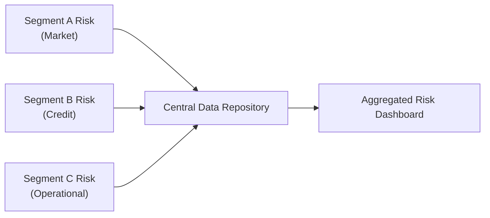

## Understanding the Importance of Risk Aggregation

When I was a junior analyst—quite a few years ago—I remember being a little startled when the first big bank I worked for had its risk management teams separated by thick walls, figuratively and literally. Each department would track its own exposures with a laser focus: the credit team worried about default probabilities, the market team crunched volatility numbers, the operational folks were logging near-misses in spreadsheets. Thing is, nobody was talking to each other all that much. And guess what? That siloed thinking created blind spots about how these risks can combine, especially in tough market conditions. If you’re reading this and thinking, “Hmm, that’s kind of how things still are in some places,” then you see the practical problem behind risk aggregation.

Aggregating risks across business segments is a fundamental step in shaping a comprehensive view of an entity’s total risk exposure. Within an asset management firm, it might mean bringing together performance data from equity, fixed income, and alternative investment desks. Within a bank, it might involve combining credit, market, liquidity, and operational risk figures to get a big-picture perspective. This integrated approach helps senior managers see what might lie around the corner, from correlated market drawdowns to unexpected credit events. Without risk aggregation, organizations often underestimate (or fail to notice) the potential for small cracks in one area to create a giant fissure in another.  

## Challenges in Aggregating Diverse Risks

Aggregating different kinds of risk—market, credit, operational, liquidity, and so on—isn’t as simple as just adding up the numbers. Each risk type often uses its own scale, time horizon, and measurement approach. For example, Value at Risk (VaR) might be used for market exposures, expected loss or probability of default for credit risk, and Key Risk Indicators (KRIs) for operational risk. The challenge? Each metric is speaking a slightly different language.

It reminds me a bit of traveling in Europe, with multiple currencies before the euro. Converting from French francs to German deutsche marks could get complicated, but you needed a single conversion to compare them properly. Aggregating risk is kind of like that. You need common benchmarks, consistent data, and the right “exchange rates” to interpret credit exposures alongside market exposures. Otherwise, you could end up with mismatched risk numbers that completely misrepresent the organization’s true vulnerability.

## Correlation Analysis: When Risks Collide or Cancel

One of the pivotal methods for effective risk aggregation is correlation analysis. Correlation analyses can reveal whether risks from different segments amplify each other (positive correlation) or offset each other (negative correlation).  

Mathematically, you might consider the correlation coefficient ρ between two sets of returns or exposures, X and Y:


\rho_{X,Y} = \frac{\text{Cov}(X, Y)}{\sigma_{X}\sigma_{Y}}


where Cov(X, Y) is the covariance between X and Y, and σ is the standard deviation. In an enterprise risk context, X could be the market risk of the equity desk, and Y could be the credit risk exposures from a bond portfolio. If ρ is close to 1, that means these exposures will likely blow up in tandem during a crisis; if ρ is negative, then a loss in one segment could be partially offset by gains or lesser losses in another.

It’s worth noting that correlation estimates might shift drastically during extreme events (i.e., correlations can “go to 1” in a crisis). That is exactly why we can’t just rely on normal market conditions to guess how a meltdown might look. Stress testing—incorporating adverse scenarios where multiple risk factors spike simultaneously—helps you see what happens if that correlation jumps.  

## Factor Models in Risk Aggregation

Moving beyond pairwise correlations, some organizations embrace factor models. These advanced techniques break down the risk of each portfolio or segment into a collection of shared factors (such as interest rates, credit spreads, equity market returns, or macroeconomic drivers like GDP growth). The factor loadings measure how sensitive each business segment is to each factor. Summing up factor exposures across the whole organization can reveal surprisingly large concentrations in a given factor.

For instance, maybe the equity desk invests heavily in cyclical industries, while the credit desk is loaded with corporate bonds from the same industries. Meanwhile, the real estate group invests in commercial real estate tied to cyclical consumer spending. Each segment individually might look logical, but collectively they could introduce a massive cyclical risk factor if the economy dips. Factor models force leadership to see that exposures are not so random or disconnected. Once a core cyclical shock hits, it impacts multiple “unconnected” areas.

## Unified Reporting Systems

How do you aggregate risk effectively if the data is scattered among different software systems and database structures? Many large institutions have grown through acquisitions, creating a landscape of incompatible data warehouses, accounting systems, or risk engines. A unified reporting system—sometimes called an enterprise-wide risk dashboard—is critical.  

The main goal is to centralize or at least standardize data so that senior management can see real-time or near-real-time risk updates. This typically involves:
• A single data schema that normalizes transactions and exposures across products.  
• Automated reconciliation processes to flag data gaps or inconsistencies.  
• Tools that can handle complex consolidations for advanced metrics (e.g., enterprise VaR).  

This single system (or a group of interconnected systems) should integrate with all lines of business, giving a live feed of relevant risk indicators. I once saw a brilliant demonstration of such a system in a large bank’s “war room.” They had giant screens on the wall showing aggregated risk color-coded by severity. If credit risk spiked in the corporate loan book, the system captured the shift in real time. That visual representation alone forced collaboration between desks like no policy memo ever could.

## Avoiding Siloed Thinking

Siloed thinking is perhaps the single biggest enemy of risk aggregation. If each desk or department sees only its own puzzle piece, nobody appreciates the entire jigsaw. This phenomenon can lead to duplication of exposures—just imagine multiple teams unknowingly betting on similar underlying risk factors. It can also hide vulnerabilities, because a strong performance in one area might mask a severe loss in another.

In practice, “silos” form because of organizational structures, competitive dynamics among different profit centers, or simply because of the complexity in collecting and analyzing cross-segment data. Breaking down those silos is a cultural and technological challenge. Often, it requires management buy-in (and yes, sometimes mandated policies) to push teams to share data, coordinate risk reporting, and discuss integrated risk strategies. But the payoff is immeasurable: better insight, fewer surprises, and a more robust risk posture.

## Practical Example: Multi-Asset Fund

Let’s consider a multi-asset fund with three segments: equities, fixed income, and alternative investments (e.g., hedge funds). Each segment might measure risk differently:
• Equities: using standard deviation of returns, beta to an index, Sharpe ratio.  
• Fixed Income: using duration, spread duration, probabilities of default.  
• Alternatives: using absolute return metrics, drawdown analysis, or stress scenarios.  

Aggregating these requires converting exposures into a consistent framework. Let’s say the fund decides to measure total risk using VaR at a 99% confidence level for a one-week horizon. They might run a simulation that projects portfolio losses across the entire ensemble of assets and strategies, taking into account the correlations between equity returns, interest-rate movements, and the more idiosyncratic patterns from alternative investments. Then they produce a consolidated report. 

If the correlation between equities and credit spreads is +0.7 in normal times, the overall VaR might be quite high if interest rates widen across the board. Meanwhile, if certain hedge fund strategies aim to short equity market risk exactly at times of stress, total risk might be reduced. This is the point of aggregation: to see interplay from all those angles.

## Mermaid Diagram: Aggregation Flow

Below is a simple Mermaid diagram showing how risk data from various segments can flow into one aggregated dashboard:

This integrated approach fosters transparency and helps decision-makers appreciate total risk across the enterprise.

## Case Study: The 2008 Crisis as a Lesson

The 2008 financial crisis remains one of the biggest cautionary tales about failing to aggregate risk. Many banks had large, complex mortgage portfolios on their books, plus structured credit products that were ironically more sensitive to the same underlying mortgages. Because different parts of the business analyzed them separately—some thought market risk, others saw credit risk, others recognized liquidity risk—nobody had a cohesive snapshot of how deeply the entire enterprise was exposed to the U.S. housing downturn. When home prices fell, all those segments experienced correlated losses, far larger than what was expected if analyzed individually.

The chaos that followed hammered home the importance of bridging the gap between lines of business and risk types. Financial regulators worldwide, from the Basel Committee on Banking Supervision (whose BCBS 239 principles directly address risk data aggregation) to local authorities, began emphasizing the need for robust enterprise-wide risk measurement capabilities.

## Building an Effective Aggregation Framework

1. Standardization of Data: The foundation is consistent data definitions, naming conventions, and timing. If one segment updates positions daily while another updates weekly, combining them in real time is messy.

2. Integration of Risk Methods: Pick or design a risk measurement approach that can unify your organization’s exposure data. This might involve adopting a single risk metric like enterprise VaR or building a multi-metric approach that each desk can align with.

3. Correlation and Factor Analysis: Understanding cross-segment correlations is non-negotiable. Factor models help to unify apples-and-oranges risk exposures under a single theoretical framework.

4. Technology & Infrastructure: Implement a robust data warehouse, or an integrated risk system, that can handle high volumes of transactions and multiple risk metrics.

5. Governance & Reporting: Create committees or tasks forces to ensure that risk data is being collected, validated, and reported consistently. Senior management should regularly review aggregated risk reports, not bury them in email attachments.

6. Culture & Communication: Encourage employees to speak openly about risk concerns and share data or insights with other teams. In other words, break down the silos from the top down.

## Common Pitfalls

• Over-Reliance on Historical Correlation: Past relationships aren’t always a perfect guide to the future. Correlations can spike or invert under stress.  
• Double Counting or Missing Data: Without robust data governance, you might double count exposures or skip entire sub-portfolios.  
• Failing to Update Models: Correlations, factor sensitivities, and operational risk profiles evolve. Too many organizations “set it and forget it.”  
• Ignoring Operational Complexity: The more sophisticated your data architecture, the more potential points of failure in collecting or reconciling data.  
• Lack of Clear Ownership: If no one person or department “owns” enterprise risk, it can fall into the cracks. Make the reporting line explicit.

## Stress Testing Within Aggregation

Stress testing complements risk aggregation by asking, “What if everything goes wrong at once?” If your correlation assumptions or factor exposures are off in normal times, stress tests might catch extreme but plausible scenarios. For instance, you might run a stress test where interest rates spike, credit spreads widen, and equity markets tumble. Then see how that affects each segment—and the enterprise as a whole. The results can guide capital buffers, asset allocation changes, or hedging strategies.

## Exam Tips

• When you see an exam question about aggregating risks across different segments, identify the main risk metrics each segment uses and show how to integrate them (e.g., correlation analysis, factor analysis, or scenario-based VaR).  
• Be prepared to explain how correlations behave differently in calm versus stressed markets.  
• In a constructed response (essay) question, you might be given partial data for multiple segments and asked to highlight potential risk concentrations. Make sure you mention the importance of synergy (or conflict) among the segments’ exposures.  
• Don’t forget the governance and cultural aspects—it’s often a big part of the question’s “soft skills” or enterprise-risk dimension.  
• In item-set or scenario questions, watch for data that signals hidden correlations (e.g., repeated exposures to the same industries). Summarize the total risk across segments and highlight the net effect.  

## Conclusion

Risk aggregation isn’t just a fancy term to throw around in board meetings; it’s essential for ensuring that organizations truly understand their holistic exposure. Without it, you risk the dreaded “silo effect,” missing the interconnectedness of seemingly unrelated positions. By applying correlation analysis and factor models—and by building strong enterprise reporting structures—you can guard against nasty surprises.

As I found in my early days, the real magic happens when teams share information, adopt common data definitions, and speak in a unified risk language. That’s how you convert scattered puzzle pieces into one big, accurate, and cohesive picture.  

## References and Further Reading

• McNeil, A. J., Frey, R., & Embrechts, P. (2015). Quantitative Risk Management: Concepts, Techniques, and Tools. Princeton University Press.  
• BCBS 239. (2013). Principles for Effective Risk Data Aggregation and Risk Reporting. Basel Committee on Banking Supervision.  
• Lam, J. (2017). Implementing Enterprise Risk Management: From Methods to Applications. Wiley.  

--------------------------------------------------------------------------------

## Test Your Knowledge on Aggregating Risks Across Business Segments



### Which statement best describes the purpose of risk aggregation?

- [ ] To focus on a specific type of risk, such as credit risk or market risk, in a given business segment.
- [x] To consolidate various exposures across the organization to achieve a holistic view of total risk.
- [ ] To ensure local sites can act independently without enterprise oversight.
- [ ] To eliminate the need for correlation analysis.

> **Explanation:** Risk aggregation is designed to provide a single overarching perspective on the total risk portfolio, rather than viewing each segment in isolation.

### What is one major challenge when aggregating different types of risks?

- [ ] The lack of historical data for equity portfolios.
- [x] Inconsistent metrics and reporting formats across various business segments.
- [ ] Not enough liquidity in fixed income markets.
- [ ] The ongoing need to remove all correlation between segments.

> **Explanation:** Different measurement methods, data formats, and timelines make risk aggregation difficult, as each business line might use its own methodology.

### Why do correlations among business segments often increase during market stress?

- [ ] Markets become more transparent, so correlations decrease.
- [x] Extreme events can cause various risk factors to move together, “converging to 1” in periods of panic.
- [ ] Regulators force correlations to remain at a fixed level.
- [ ] Advanced analytics remove natural fluctuations in correlation.

> **Explanation:** In times of significant distress, segments that previously appeared uncorrelated can suddenly become highly correlated, amplifying losses.

### Which of the following best defines siloed thinking?

- [ ] A cultural practice of sharing risk updates frequently.
- [ ] A structured approach to risk appetite and tolerance.
- [x] A focus on individual departments without recognizing wider organizational dependencies.
- [ ] The method of removing correlation from enterprise risk models.

> **Explanation:** Siloed thinking occurs when departments do not collaborate or share risk information, leading to incomplete understanding of enterprise-level risks.

### In practice, how might a unified reporting system help break down siloed thinking?

- [ ] By strictly limiting departmental access to risk data.
- [ ] By emphasizing operational risk over all other risk types.
- [ ] By only focusing on historical performance metrics.
- [x] By providing an enterprise-wide dashboard that consolidates data from all segments.

> **Explanation:** A robust reporting solution that integrates data from all segments fosters transparency and collaboration, helping management see the big picture.

### Which principle underlies the BCBS 239 framework?

- [ ] Risk data should be separated by each desk or department.
- [ ] Risk management applies only to credit exposures.
- [ ] Regulatory oversight is optional for large banks.
- [x] Effective risk data aggregation and reporting are essential for global banking organizations.

> **Explanation:** BCBS 239 outlines best practices and principles for banks to achieve superior risk data aggregation and reporting.

### What is a potential limitation of over-relying on historical correlations for risk aggregation?

- [ ] Historical correlations cannot be used in factor analysis.
- [ ] Regulators generally forbid the use of correlations in final risk measures.
- [x] Correlations can change significantly in stressed markets, making historical data less reliable for future crises.
- [ ] Correlation only applies to operational risk, not market or credit risk.

> **Explanation:** Historical correlation estimates might fail to capture how risk factors behave in extreme scenarios, leading to underestimation of tail events.

### Why might factor models be particularly helpful when aggregating risks across segments?

- [ ] They eliminate the need for correlation analysis.
- [ ] They apply only to equities, ignoring other asset classes.
- [x] They identify and measure a small set of fundamental drivers that may affect multiple segments.
- [ ] They assume all desks have the same risk style.

> **Explanation:** Factor models decompose each position into exposures to underlying macro or financial factors, making it easier to spot overlapping or concentrated exposures across multiple business segments.

### Among the following elements, which is essential in a comprehensive risk aggregation framework?

- [ ] Outdated IT infrastructure.
- [x] Common data definitions and consistent risk metrics.
- [ ] Avoiding stress testing or scenario analysis.
- [ ] Compartmentalized business units with minimal data sharing.

> **Explanation:** Aggregation requires consistent data standards and metrics across the organization to ensure that risks can be measured and combined accurately.

### A single factor shock that simultaneously affects multiple segments demonstrates:

- [x] That different product lines may share sensitivity to the same underlying risk factor.
- [ ] That correlation across segments is zero.
- [ ] The complete elimination of credit risk from the institution.
- [ ] That operational risk is always more important than market risk.

> **Explanation:** A single macroeconomic or market factor can cut across business lines, underscoring the importance of seeing how each line is affected by that factor in an aggregated framework.


