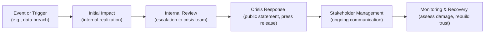

## Understanding the Nature of Reputational Risk

Reputational risk sometimes feels a bit intangible, right? You can’t easily observe it on a balance sheet, and it doesn’t get the same immediate attention as more quantified metrics like Value at Risk (VaR) or market beta. Yet, reputational risk—defined here as the risk of diminished stakeholder trust or brand equity due to negative publicity, errors, or ethical lapses—often poses a more severe threat to a firm than direct financial losses. Why? Because it can undermine client loyalty, spark regulatory investigations, and reduce market confidence faster than you might expect.

I once worked with a small asset management boutique that experienced a nasty reputational crisis: an unfortunate combination of client data mismanagement and negative press. Although the monetary impact was, at first, contained to a moderate settlement, the real blow came when existing clients started fleeing and prospective investors ceased returning calls. Investors lost confidence, not necessarily because of the direct costs but because the firm’s image had been tarnished. That’s the heart of reputational risk: intangible but immensely powerful.

### Key Drivers of Reputational Risk

• Ethical Breaches and Misconduct  
• Negative Publicity or Media Coverage  
• Governance Failures  
• Poor Transparency or Communication  
• Social Media Backlash  

It’s also worth emphasizing that reputational risk management interconnects with other areas of risk—like operational, regulatory, and even strategic risk. A mechanical failure in a data center (operational risk) can escalate into a reputational nightmare if clients learn that you lacked proper fail-safes.  

## Consequences Beyond Direct Financial Loss

Reputational damage can have a ripple effect that extends well beyond immediate losses. Adverse press might lead to plummeting share prices, a loss of investor or client trust, heightened regulatory scrutiny, or even a complete overhaul of leadership. In previous sections of this chapter, we discussed how risk events can be quantified using models such as scenario analysis and stress testing. But reputational harm, in many ways, can be longer lasting and trickier to measure, as it’s deeply tied to stakeholder sentiment.

• Share Price Impact: Negative perception often drives investors away, leaving share prices depressed.  
• Customer/Client Retention: Clients may not want to be associated with a firm beset by scandal or allegations.  
• Regulatory and Legal Actions: Negative publicity and public outcry can encourage regulators to investigate more aggressively.  
• Talent Drain: Employees, especially top talent, may leave to avoid being associated with a tarnished brand.  

## Developing a Communication Policy

One of the best ways to safeguard your reputation is to have a robust communication policy—essentially a set of internal guidelines on how your organization publicly communicates. A thoughtful communication policy ensures that all stakeholders (employees, customers, regulators, media, and the public) receive consistent, accurate information in a timely way. That might sound obvious, but in the heat of a crisis, consistent messaging can fall apart if you don’t have an established framework.

### Core Features of an Effective Communication Policy

• Clear Hierarchy of Spokespeople: Identify who in the organization is authorized to speak publicly, whether to media or on social media.  
• Decision-Escalation Process: Clarify what types of information can be shared immediately and what must first be escalated to senior leadership or legal counsel.  
• Tone and Style Guidelines: Even small nuances—like whether or not you use a friendly, empathetic tone—can drastically shape stakeholder perception.  
• Compliance and Regulatory Considerations: Ensure public statements do not misrepresent performance or violate confidentiality agreements.  
• Crisis-Specific Templates: Pre-approved statements or press releases can speed up response times.  

And, let’s be honest, implementing a communication policy takes discipline. You know how it goes: you’re juggling a thousand tasks, maybe feeling a bit anxious about negative publicity, and you just want to answer a journalist’s question quickly. But a consistent policy is key. A single impulsive comment can drastically affect your public image.

## Crisis Management Protocols

Even the most refined organization can be upended by an unforeseen crisis. Crisis management protocols help you prepare for—and rapidly respond to—events that threaten your public image. It’s one thing to say, “We’ll handle it if it occurs,” but quite another to have a step-by-step plan documented, practiced, and updated regularly.  

### Building a Crisis Management Framework

Below is a simplified diagram illustrating how reputational threats may escalate and how crisis management applies at each stage:

• Event or Trigger: Something bad happens—a data breach, a negative article, a compliance violation.  
• Initial Impact: The organization becomes aware of the event.  
• Internal Review: The crisis team (or designated individuals) evaluates the severity, potential harm, and stakeholders who might be affected.  
• Crisis Response: This is where your communication policy is tested. Timely, transparent, and accurate statements to the media, clients, and regulators are crucial.  
• Stakeholder Management: Continual updates, Q&A sessions, and direct contact with key stakeholders to reduce uncertainty.  
• Monitoring and Recovery: Tracking public sentiment, analyzing social media and press coverage, and taking concrete steps to fix issues or adjust policies.

### Social Media Monitoring

Let’s be honest: in today’s world, a Twitter storm (or any other social media storm) can tarnish a brand overnight. Some of us have seen organizations attempt a half-baked response on social platforms. It’s like watching a train wreck. Active monitoring helps your firm respond quickly and cohesively. If stakeholders voice concerns or confusion on social feeds, you can address them before rumors spiral out of control.

### Designated Spokespeople and Internal Escalation

Having designated spokespeople is critical. You really don’t want every employee—no matter how well-intentioned—giving their own spin on sensitive issues. Formally identifying who is authorized to speak on behalf of the firm grants a measure of control over how key messages are framed. 

Equally important is internal escalation. If something big goes wrong, employees should know exactly whom to notify, be it legal counsel, compliance officers, or senior executives. A quick, structured internal escalation keeps your external communication consistent.

## Intersection with Ethics and Governance

As explored in earlier sections of this chapter, ethics, governance, and corporate social responsibility (CSR) are crucial underpinnings for robust risk management. A breach in ethics or governance can trigger a reputational crisis. In fact, many high-profile scandals—like insider trading, misrepresentation of performance data, or falsified financial statements—are discovered after a whistleblower or investigative journalist pulls back the curtain. That’s definitely not a good look!

### Good Governance as a Shield

Strong governance policies, like transparent board oversight or well-defined compliance programs, can diminish the probability of ethical lapses in the first place. Additionally, adherence to codes of conduct (like the CFA Institute Code of Ethics and Standards of Professional Conduct) fosters a culture of integrity. This culture can help your firm spot and correct misconduct before it escalates.

### Corporate Social Responsibility (CSR)

CSR efforts—such as environmental sustainability initiatives, community outreach, and charitable engagements—can enhance stakeholders’ goodwill toward the organization. If a crisis emerges, that reservoir of goodwill can act as a buffer, giving you a bit of leeway to regain trust. However, inconsistent or “token” CSR efforts can backfire if stakeholders perceive them as hypocritical.

## Best Practices and Common Pitfalls

A few best practices come to mind if you want to minimize reputational risk:

• Integrate Reputational Risk in Enterprise Risk Management: Include reputational risk in your scenario analyses and stress testing.  
• Conduct Regular Training: Employees should know what the communication policy entails and how to escalate a concern.  
• Be Proactive About Transparency: Sometimes, it’s better to proactively disclose issues to preserve trust rather than wait for the media to uncover them.  

And a couple of pitfalls:

• Downplaying the Crisis: Saying “it’s not a big deal” when it clearly is can fan the flames of public outrage.  
• Inconsistent Messaging: Contradictory statements from different departments create more confusion and erode trust.  
• Neglecting Social Media: Assuming social media is a minor channel can be disastrous in a heavily online world.

## Practical Example: A Step-by-Step Scenario

Imagine a mid-sized investment firm. A key portfolio manager is accused of front-running trades (executing trades in advance of client orders). A local financial journalist picks up the story and publishes a scathing piece. Social media erupts with calls for investigations.

1. Internal Realization: The compliance officer escalates the event to senior management and legal counsel.  
2. Crisis Team Coordination: The crisis management team convenes, reviews the evidence, and determines immediate next steps.  
3. Public Statement: The designated spokesperson issues a brief, factual update, acknowledging the accusations, stating that an internal review is underway, and promising further updates.  
4. Stakeholder Communication: Clients and investors receive personal emails with details on how the firm is handling the situation.  
5. Social Media Engagement: The firm’s social media manager posts a careful statement on official channels, monitors comments, and swiftly clarifies misinformation.  
6. Ongoing Investigation: Transparent internal investigation is launched. Findings are shared—within reason—to demonstrate accountability.  
7. Follow-Up: Results of the investigation (including disciplinary actions or policy changes) are published, showcasing commitment to high ethical standards.

## Final Exam Tips

1. Prioritize Ethical Foundations: Link reputational risk considerations to the CFA Institute Code of Ethics and Standards. Provide examples of how an ethics breach can spiral into a reputational crisis in short-answer or essay responses.  
2. Use Real-World Illustrations: In a constructed-response question, reference known corporate reputation scandals and how the communication process could have been improved.  
3. Practice Consistency: If a question prompts you to outline a communication strategy, ensure your proposed plan is coherent, with designated points of contact, escalation paths, and stakeholder management steps.  
4. Integrate Reputational Considerations in Risk Framework: Show how an integrated risk management approach measures and monitors intangible risks—for instance, by referencing scenario analysis that includes stakeholder backlash.

## References and Further Reading

• Eccles, R. G., Newquist, S. C., & Schatz, R. (2007). “Reputation and Its Risks.” Harvard Business Review.  
• CFA Institute. (2021). Code of Ethics and Standards of Professional Conduct.  
• Argenti, P. (2013). Corporate Communication. McGraw-Hill.  

## Glossary

• Reputational Risk: The risk of diminished stakeholder trust or brand equity due to negative publicity, errors, or ethical lapses.  
• Communication Policy: Internal guidelines on how the organization communicates important information to the public, regulators, and employees.  
• Crisis Management Protocols: A structured approach to handling high-profile or unexpected events that could harm an organization’s reputation.  

----

## Test Your Knowledge: Reputational Risk and Crisis Communication



### Which of the following best describes reputational risk in the context of portfolio management?

- [ ] The risk of portfolio underperformance relative to an industry benchmark.  
- [ ] The risk of unexpected increases in operational costs.  
- [x] The risk of stakeholder distrust or diminished brand equity due to negative publicity, errors, or ethical lapses.  
- [ ] The risk of an investment strategy being misaligned with investor time horizons.  

> **Explanation:** Reputational risk refers to the negative impact on an organization’s brand and stakeholder trust stemming from issues like public scandals, ethical breaches, or errors.

### What is a key reason why reputational harm can sometimes be more severe than direct financial losses?

- [x] Because it can cause long-term damage to client relationships, share value, and brand perception.  
- [ ] Because operational losses are always covered by insurance.  
- [ ] Because reputational risks are always quantifiable and easier to measure.  
- [ ] Because regulators rarely focus on reputational mishaps.  

> **Explanation:** Reputational harm often lingers and can drastically affect client retention, market value, and overall trust in the firm, extending far beyond a simple monetary loss.

### Which of the following is NOT typically included in a well-articulated communication policy?

- [ ] Guidelines on who may speak to the media.  
- [ ] Defined processes for escalating sensitive information.  
- [ ] Clear instructions on how to disclose performance data.  
- [x] Mandating employees to never communicate any firm-related information online.  

> **Explanation:** A communication policy generally clarifies who can speak for the firm and how to handle external inquiries, but it doesn’t prohibit all forms of communication (especially internal or regulated disclosures), as complete silence can lead to more confusion.

### In crisis management, what is the most appropriate first step once a potentially damaging event is identified?

- [ ] Immediately issue a public apology regardless of the facts.  
- [ ] Publish all internal documents for full transparency.  
- [x] Internally review and escalate the event to the designated crisis team or senior leadership.  
- [ ] Dismiss the event and resume normal business operations.  

> **Explanation:** The immediate action should be to conduct an internal review and escalate so that the crisis team can gather facts and determine the best communication strategy.

### How can social media monitoring help mitigate reputational risks?

- [x] By detecting negative sentiment early and allowing prompt, targeted responses to address stakeholder concerns.  
- [ ] By disabling all social media platforms whenever a crisis occurs.  
- [x] By providing real-time feedback on public perception.  
- [ ] By ensuring that stakeholders never hear about negative events.  

> **Explanation:** Ongoing social media monitoring helps the firm respond quickly and accurately, clarifying rumors and containing misinformation before it escalates.

### Which of the following best illustrates the intersection of reputational risk and corporate governance?

- [x] Board oversight that enforces strict compliance can reduce unethical behavior and thus reduce reputational risk.  
- [ ] Board members never discussing risk management.  
- [ ] Publicizing incomplete financial information.  
- [ ] Corporate governance is unrelated to ethics or reputational concerns.  

> **Explanation:** Strong corporate governance fosters ethical practices that, in turn, reduce reputational vulnerabilities.

### What is one common pitfall in managing a reputational crisis?

- [x] Delivering contradictory messages from multiple departments.  
- [ ] Having a designated spokesperson authorized to speak to the press.  
- [x] Adopting a proactive communication plan.  
- [ ] Monitoring social media in real time.  

> **Explanation:** Mixed or contradictory messaging can cause confusion and erode trust, making a reputational crisis worse.

### During a reputational crisis, which statement best describes a proactive transparency approach?

- [x] Sharing relevant information promptly, even if it may reveal organizational shortcomings.  
- [ ] Delaying communication in hopes the issue will resolve on its own.  
- [ ] Immediately blaming external parties without an internal review.  
- [ ] Remaining silent until a regulator requests information.  

> **Explanation:** A proactive approach means swiftly acknowledging potential issues, taking corrective measures, and keeping stakeholders informed.

### Which of the following is a primary function of crisis management protocols?

- [x] Ensuring a standardized, organized response to major negative events.  
- [ ] Eliminating any need for public statements.  
- [ ] Deprecating all social media channels immediately.  
- [ ] Shifting accountability to third parties.  

> **Explanation:** Crisis management protocols provide a structured response plan, designating roles and processes so that leaders can address problems swiftly and effectively.

### True or False: Reputational risk must be considered separately from other enterprise risks, such as operational or credit risk, and cannot be integrated into scenario analysis.

- [ ] True  
- [x] False  

> **Explanation:** Reputational risk is often intertwined with other forms of enterprise risk and can be incorporated into scenario planning and stress tests to assess broader impacts.


