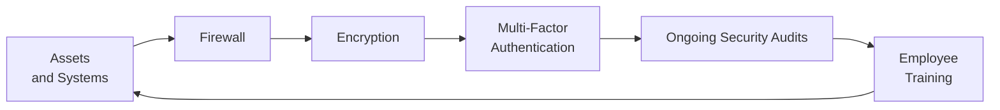

## The Evolving Landscape of Cybersecurity Risk

If there’s one thing I’ve noticed over the last decade, it’s that almost everything in finance has gone digital. Automations, algorithmic trading, and cloud-based data analytics can all be fantastic in terms of speed and efficiency. But—um—have you ever considered what happens when hackers or unauthorized users find a backdoor or exploit a software vulnerability? A single cyber breach can freeze your access to trading systems, compromise client data, and cause massive reputational harm. This is where cybersecurity risk in portfolio management becomes front and center.

Cybersecurity risk is, in plain English, the probability of suffering financial, operational, or reputational losses due to cyberattacks and data breaches. As technology merges with finance, the line between portfolio risk and cyber risk gets blurred. From your vantage point as a portfolio manager or a risk professional, ignoring cybersecurity is a bit like ignoring interest rate risk—sooner or later, it’ll catch you off guard, and the impact can be substantial, even catastrophic.

### Technology Integration and Emerging Threats

The push towards digitalization has dovetailed with numerous enhancements in portfolio management tools—like real-time analytics, automated rebalancing, and AI-driven risk assessments (check out Chapter 15 on “Advances in Portfolio Construction and Technology” for more around machine learning). These tools offer enormous upsides but also expose investors and managers to new threats that simply didn’t exist a couple of decades ago.

A few well-known culprits include:

• Hacking attempts on trading software or custodial platforms.  
• Ransomware attacks that lock you out of your systems until you pay a ransom.  
• Phishing schemes tricking employees into sharing their passwords with malicious parties.  
• Insider threats (yes, disgruntled employees can sometimes pose an even bigger risk than external hackers).  

Just like liquidity risk was once an afterthought until it caused meltdown events, cybersecurity risk is steadily gaining attention in enterprise risk frameworks. If your systems are compromised on a major market-moving day, you might be unable to execute trades. This can cause direct financial loss (e.g., markets moving against your positions) and indirect damage like a tarnished brand or massive regulatory fines.

## Potential Impacts on Portfolio Management

### Financial Loss and Disrupted Trading

Let’s say you’re running a major portfolio allocation. Suddenly, ransomware hits your trading terminals and middle-office software, shutting them down. You can’t execute trades, and you’re stuck. The market continues moving—like the market does—so you might miss out on profitable trades, or worse, you may be unable to offload a deteriorating position. The direct financial loss in that scenario can be enormous.

Furthermore, insider threats can lead to unauthorized trades or data leaks. If hackers or malicious insiders gain access to reorder certain transactions, they may attempt front-running strategies and profit at your expense (another scenario explored in some real-world cases). These issues are not just theoretical or “fear-mongering”—they have happened in large firms, occasionally resulting in multimillion-dollar losses or settlement fines.

### Reputational Harm and Client Confidence

In portfolio management, trust is critically important. If clients suspect that their personal and financial data is not well-protected, they might look elsewhere for an investment manager who can demonstrate better security. Word spreads quickly in financial circles, so a single breach can undermine years—maybe decades—of brand building.

### Regulatory and Legal Repercussions

Globally, regulators are increasingly imposing data protection and privacy laws, from the General Data Protection Regulation (GDPR) in Europe to various cybersecurity regulations in the United States, Asia, and beyond. Non-compliance or a demonstrated lack of cybersecurity measures can expose you to fines and lawsuits. Many jurisdictions are imposing mandatory breach notifications—fail to notify in time, and you risk further penalties.

## Common Threats and Attack Vectors

### Ransomware

One of the most dreaded forms of attack, ransomware, encrypts a victim’s files and demands payment—often in cryptocurrency—to restore access. If successful, an attacker can hold an entire asset management operation hostage. This cripples normal trading and can prevent you from meeting client requests. I know one colleague who lost days of operational time because they had no contingency plan and had to negotiate with an attacker—definitely not a position you want to find yourself in.

### Phishing Attacks

Phishing messages often look legitimate, mimicking official emails or texts, but they’re laced with malicious links or requests for sensitive data. Social engineering is ridiculously effective. Even if you personally are cautious, not everyone on your team has the same level of vigilance. And also, some phishing attempts can be so cunning that even an experienced individual might slip up.

### Insider Threats

Insiders can range from disgruntled employees looking to sabotage the firm to employees who inadvertently make a mistake (like sharing login credentials with an unauthorized person). If you read Chapter 7, “Professional Practices in Portfolio Management,” you’ll remember discussions around personal trading policies and data access protocols. Well, insider threats can exploit system knowledge or elevated privileges to cause serious damage. 

### Distributed Denial of Service (DDoS)

Portfolio managers rely heavily on real-time data feeds. Overwhelm those feeds (or your trading platform) with a massive volume of fake traffic, and legitimate traffic can’t get through. The result? Market data is inaccessible, or your trades are severely delayed. Opportunistic attackers might do this strategically to exploit market inefficiencies.

## Multi-Layered Defense Strategies

Now that we’ve established the severity of these threats, how do we stay one step ahead?

### Firewalls and Intrusion Detection

Robust firewalls form your first line of defense. They monitor data traffic entering and leaving your network, filtering out suspicious or malicious packets. At a more advanced level, intrusion detection and prevention systems analyze network behavior to pick out anomalies—kind of like stress testing in risk management, but for your IT architecture instead of your portfolio’s market exposures.

### Encryption for Data Confidentiality

Encryption ensures that even if an unauthorized party intercepts your data in transit or gains physical access to your hardware, the data remains unreadable without the correct decryption key. For sensitive client information (e.g., client statements, personal identifying details, transaction logs), encryption is almost a non-negotiable technique.

### Multi-Factor Authentication

Many of us have experienced the annoyance of MFA prompts: first a password, then your phone, maybe a fingerprint. But if you’ve ever had your password compromised, you’ll appreciate that second or third step. The idea is to verify a user’s identity using two or more factors (something they know, something they have, or something they are). If a malicious actor somehow obtains your password, they’ll still be locked out without the second authentication factor.

### Regular Security Audits and Testing

An audit might sometimes feel like a chore, but just like we do in an operational risk assessment or a compliance check, it’s essential to verify that your security systems remain up to date. Technology changes quickly, and so do attack methods. Conducting Penetration Testing (often referred to as Pen Testing) or simulated phishing campaigns can help you discover holes before real attackers do.

### Employee Training

Listen, you can have the best software and hardware protections in the world, but all it takes is Bill from accounting to click on a malicious link, and you’re left plugging holes. Ongoing security training can drastically reduce the odds of a successful phishing attempt or social engineering exploit. Build and reinforce a culture where employees feel comfortable asking, “Is this email legit?” or “Should I open this attachment?” When employees become cybersecurity champions, the firm becomes significantly stronger.

### Quick Illustrative Diagram

Below is a simple Mermaid diagram showing how these layers reinforce one another:

Each layer doesn’t act in isolation—rather, they work together to form an integrated defense scheme. Notice how the cycle loops back, because cybersecurity is never a one-and-done exercise. It’s an iterative process that requires continuous vigilance.

## Cybersecurity in the Risk Management Framework

One recurring theme in this Volume (see especially Sections 6.1 and 6.2) is that risk management is about more than finding ways to reduce risk. It’s about anticipating where risk might come from and having processes to tackle it effectively. Cyber risk should be a standard item in any comprehensive risk register. It should be addressed alongside market, credit, liquidity, and operational risks.

### Approaches to Integrating Cyber Risk

• Document and analyze potential cyber incidents as part of the overall risk assessment process.  
• Assign risk tolerance levels and potential risk capital or “risk budget” to cybersecurity measures (see Section 6.3 on risk tolerance and policy integration).  
• Maintain open channels between IT teams and portfolio or trading desks. This is a major operational synergy that fosters real-time threat detection.  
• Have incident response communication protocols laid out in the Investment Policy Statement (IPS) or in the firm’s procedural guidelines (tying back to how we define triggers and constraints in Chapter 4).

### Cyber Insurance: A Risk Transfer Tool

Some organizations purchase “cyber insurance” to hedge the financial consequences of a breach (similar to purchasing Directors & Officers (D&O) insurance for certain operational contingencies). Cyber insurance can cover costs related to breach investigation, data recovery, and potential legal liabilities. That said, it’s crucial to recognize insurance as a supplement to, not a replacement for, strong security protocols.

## Practical Examples and Case Scenarios

### Example 1: Phishing Attack Just Before a Trade

Scenario: An employee in the trading department receives a seemingly legitimate email from a manager requesting an urgent password reset. The link leads to a fake website collecting credentials. Within minutes, an attacker logs into the system and places unauthorized trades, causing the portfolio to assume large short positions in a major index, anticipating a later “pump” scenario.

Key Takeaway: Regular staff training and immediate suspicious email reporting could have thwarted the attack. A second layer of MFA also would have prevented the logging in with a stolen password alone.

### Example 2: Ransomware and Reputational Risk

Scenario: A small investment advisory firm is hit by ransomware, locking all client statements and performance reports. They have no backups and are forced to pay the ransom, which for them is a large sum. Clients discover the firm fell victim to the attack and question the organization’s data handling standards.

Key Takeaway: Encrypted backups and an incident response plan are critical. The inability to quickly restore systems, along with the negative press, could erode client trust beyond immediate financial losses.

### Example 3: Insider Data Leak

Scenario: An IT administrator who feels underpaid and overlooked decides to profit by selling client portfolios and strategic allocation data to an external party. The competitor uses the data to craft similar investment strategies and undercut the original firm’s fees.

Key Takeaway: Implementing robust access controls on sensitive data, monitoring of privileged user activities, and creating a culture of trust and transparency could all significantly reduce the likelihood of insider abuse.

## Best Practices and Common Pitfalls

### Best Practices

• Classify and segment data to ensure only authorized employees have access to sensitive information.  
• Maintain up-to-date patch management to close software vulnerabilities.  
• Incorporate cybersecurity questions into third-party vendor due diligence.  
• Conduct regular tabletop exercises to simulate attack scenarios and assess your incident response.  
• Stay informed about emerging threats—cyber attackers evolve rapidly.

### Common Pitfalls

• Overreliance on single-layer defenses, like just a firewall.  
• Inadequate employee training or believing a data breach “could never happen here.”  
• Failure to align cybersecurity with the broader risk management strategy.  
• Lack of communication between IT staff, portfolio managers, and compliance officers.  
• Not auditing vendor partners—like cloud providers—who might not adhere to best practices.

## Exam Relevance and Final Tips

In the context of the CFA® Level I curriculum, consider how cybersecurity threads through operational risk, compliance, and even performance reporting. On exam questions or scenario-based prompts, you may need to:

• Identify vulnerabilities in a firm’s risk management setup regarding cyber threats.  
• Recommend enhancements to reduce potential cyberattack surface.  
• Evaluate the impact a data breach can have on portfolio continuity and investor confidence.  

Remember that exam prompts will often integrate multiple risk concepts in a single scenario. For instance, a question could combine liquidity risk with a hypothetical DDoS that blocks market access. You might have to describe how to mitigate the combined effect.

Keep in mind these strategies:

1. Read each scenario carefully and figure out where the “human error factor” might lie.  
2. Look for ways to connect cybersecurity risk to standard operational risk frameworks (like RCSAs—Risk Control Self-Assessments).  
3. Always propose layered, complementary mitigations rather than relying on a single solution.  
4. Mention the potential role of staff training. The CFA Institute Code and Standards (particularly Standard III: Duties to Clients) emphasizes protecting client data.  

Finally, from my experience, you should never underestimate the exam’s inclination to test your ability to link ethics and successful cybersecurity practices—because a breach or unethical handling of client data can be a direct violation of professional responsibilities.

## Glossary

• Cybersecurity Risk: The risk of financial loss, reputational harm, or operational disruption due to cyberattacks or data breaches.  
• Multi-Factor Authentication (MFA): A security measure requiring two or more verification methods (e.g., passwords plus tokens or biometric data).  
• Ransomware: Malware that encrypts a victim’s files, demanding payment to restore access.

## References and Further Reading

• National Institute of Standards and Technology (NIST). (2018). Cybersecurity Framework.  
• ISACA. (2020). Cybersecurity Fundamentals Study Guide.  
• CFA Institute. (2022). “Cybersecurity for Asset Managers.”  
• Additional insights can be found in Chapter 6 (Sections 6.1–6.2) for broader risk concepts, and Chapter 7 for compliance considerations.

---

## Test Your Knowledge: Cybersecurity in Portfolio Management



### A phishing attack that tricks an employee into revealing their password is an example of:
- [ ] A brute force attack
- [ ] A server-side injection attack
- [x] A social engineering attack
- [ ] A denial-of-service attack

> **Explanation:** Phishing is a social engineering attack, relying on tricking humans into providing confidential information.

### Which of the following can best protect against compromised passwords?
- [ ] Single sign-on
- [x] Multi-Factor Authentication (MFA)
- [ ] Firewall updates
- [ ] Virtual Private Networks (VPNs)

> **Explanation:** MFA requires multiple forms of verification, reducing the effectiveness of compromised passwords.

### In the context of a ransomware attack, which measure helps the most in quick recovery without paying ransom?
- [ ] Advanced encryption
- [ ] Market risk hedging
- [ ] Security incident newspapers
- [x] Regular data backups

> **Explanation:** Having frequent backups lets a firm restore systems without relying on attackers to unlock encrypted files.

### If a company’s trading platform is overwhelmed by a high volume of malicious traffic, the firm likely faces:
- [x] A Distributed Denial-of-Service (DDoS) attack
- [ ] Insider trading
- [ ] Password spraying
- [ ] Social engineering

> **Explanation:** DDoS attacks flood systems with illegitimate requests, making the trading platform inaccessible.

### Which of the following techniques specifically addresses unauthorized data access if a hacker gains physical access to storage?
- [ ] Network segmentation
- [x] Data encryption
- [ ] Firewall installation
- [x] Access controls

> **Explanation:** Encryption and appropriate access controls ensure that even if a hacker physically obtains the hardware, the data remains protected.

### Insider threats can be mitigated primarily by:
- [ ] Eliminating all remote work
- [x] Implementing robust access controls and monitoring
- [ ] Having only one shared admin account
- [ ] Raising capital requirements

> **Explanation:** Insider threats are best addressed by limiting privileges, segregating duties, and consistently monitoring user activity.

### Which statement concerning cyber risk integration into a risk management framework is most accurate?
- [ ] Cyber risks should be treated entirely separate from market or liquidity risks.
- [x] Cyber risks should be addressed similarly to other operational risks and included in risk assessments.
- [ ] Cyber risks are only relevant for technology companies.
- [ ] Cyber risks do not affect clients unless a breach has actually occurred.

> **Explanation:** Cyber threats must be integrated into overall operational risk assessments, as they can disrupt operations and affect clients.

### A strong first-line defense for preventing unauthorized network access is:
- [ ] A robust marketing campaign
- [ ] Key performance indicators (KPIs)
- [x] A properly configured firewall
- [ ] Geographical diversification

> **Explanation:** A firewall is a fundamental tool for filtering and controlling incoming and outgoing network traffic, a crucial first line of cyber defense.

### When employees click on suspicious email links, one recommended measure is:
- [ ] To immediately replace all trading software
- [x] Conducting periodic phishing simulation tests
- [ ] Doing nothing unless formal complaints arise
- [ ] Withdrawing from all market positions

> **Explanation:** Periodic simulation tests require employees to identify potential phishing emails and thus reduce vulnerability to real attacks.

### True or False: Cyber insurance policies completely eliminate the need for robust cybersecurity measures.
- [ ] False
- [x] True

> **Explanation:** This is a trick question. The correct answer is actually “False.” Cyber insurance is a supplemental layer. It does not eliminate the need for strong security measures. (Be cautious of misread statements; insurance alone does not prevent cyber attacks.)


