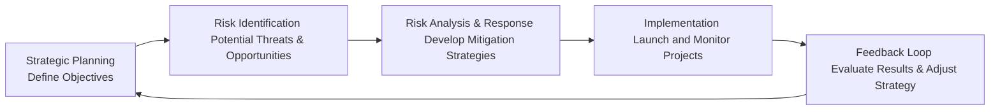

## Introduction

Risk management is sometimes viewed as this separate, box-checking process that doesn’t quite talk to the larger strategic mission of an organization. You know how it goes: you figure out all the big goals and growth targets, and then you remember, “Oh right, we also need to do a little risk check.” But risk management shouldn’t be an afterthought. When you integrate risk management into your strategic planning, you’re essentially weaving a safety net right into the fabric of your business goals and future vision. No one wants to build a grand plan only to stumble at the first unforeseen obstacle.

Below, we’ll look at how strategic planning and risk management connect, show some frameworks that guide this integration, and share personal anecdotes and practice tips that might help you see the bigger picture. The key takeaway? Aligning risk and strategic objectives isn’t just prudent—it can sharpen your competitive edge and reveal fresh opportunities you never saw coming.

## Why Integrate Risk Management and Strategic Planning

When organizations make strategic decisions—like entering a new market or launching a new product—they naturally think about revenues, market share, and competitive positioning. But, let’s be honest, it’s easy to get blinded by the excitement. Risk management helps you see the less glamorous but equally vital side: what if the new product flops, or the regulatory environment changes overnight?

• Bridging Silos: Bringing risk professionals into early-stage strategic discussions ensures risks are not only identified but also factored into the strategic blueprint. This cross-pollination fosters a culture of informed decision-making.  
• Capital Allocation: Integrating risk assessments into the planning process helps management channel resources into projects that offer the best balance between profitability and uncertainty—otherwise known as the risk-return profile.  
• Early Warning System: Let’s say you’re planning to tap into an emerging market. A robust risk assessment can highlight supply chain vulnerabilities or currency exchange threats before you commit heavy investments. Addressing these issues proactively can save a lot of hassle down the road.  
• Continuous Learning: By embedding risk in your strategic plan, you set the stage for continuous feedback loops—when real-world outcomes differ from the plan, you can quickly adapt, refine, or pivot your strategies.

In short, strategic planning sets the course, but risk management helps you navigate the rough waters and spot hidden opportunities along the way.

## Core Concepts to Keep in Mind

Before we delve into frameworks and processes, let’s pause and define a few key concepts that form the backbone of this discussion:

• Strategic Planning: The process of defining an organization’s direction and making decisions on allocating resources to pursue this strategy.  
• Risk-Return Profile: The balance between potential rewards and potential losses associated with an investment or strategy.  
• Feedback Loop: A cyclical process of monitoring outcomes, evaluating performance, and adjusting strategies accordingly.

## Linking Strategy and Risk: A Practical View

It might help to visualize how these two processes—planning and risk management—come together. One personal experience that sticks with me is from my early days working in a small tech startup. We had a bold product roadmap, but we kept stumbling because we weren’t thinking about production bottlenecks or patent infringement issues. Once we started integrating risk analytics into our monthly product strategy meetings, we actually became more creative. Why? Because when you address threats early, you can alter course or build safeguards into your plan without scrambling at the last minute.

Below is a diagram illustrating how strategic planning can seamlessly integrate with risk management, forming a continuous cycle of improvement:

## Frameworks: COSO ERM and ISO 31000

To structure this integration, globally recognized frameworks such as COSO Enterprise Risk Management (ERM) and ISO 31000 provide comprehensive guidelines:

### COSO ERM — Integrating with Strategy and Performance

• Strategic Alignment: COSO ERM emphasizes that risk management starts with strategy-setting. By articulating risk appetite in relation to organizational objectives, you ensure that risk considerations aren’t an afterthought.  
• Enhanced Decision-Making: COSO’s principles highlight the need for a robust risk culture, where everyone from the board to frontline employees understands how their everyday actions align with the larger mission.  
• Performance Linkage: The framework encourages measuring performance not just by financial results but also through metrics that capture how well risk exposures are managed within acceptable thresholds.  

### ISO 31000

• Principles-Based Approach: ISO 31000 defines risk management as a set of coordinated activities to direct and control an organization with regard to risk. It focuses on integration into all organizational processes, including strategic planning.  
• Leadership and Commitment: The standard strongly emphasizes leadership buy-in. When top management sets the tone, risk assessment becomes part of the routine, not just something done at annual reviews.  
• Tailored Implementation: ISO 31000 isn’t overly prescriptive. It allows you to adapt its guidelines based on your organization’s size, culture, and risk profile—so you can integrate risk into strategic planning in a way that feels natural.

## Applying Integration in Strategic Decisions

Let’s walk through a hypothetical example: Suppose an investment firm wants to expand into emerging markets. Its strategic plan might highlight huge growth potential, but a well-integrated risk process will also ask:

• What are the political and regulatory risks associated with different local governments?  
• How does currency volatility affect expected returns and capital requirements?  
• What operational controls are needed to mitigate cybersecurity threats that might be more prevalent in certain regions?  

If the firm addresses these questions upfront, it can weigh each region’s risk-return profile more accurately and allocate capital where the upside compensates for the risks. That leads to a more robust portfolio strategy, better resilience against nasty surprises, and an improved likelihood of hitting strategic objectives.

## Continuous Feedback Loops

One of the biggest perks of a well-integrated risk-strategy approach is the creation of feedback loops. Once you’ve rolled out a strategic initiative:

• Monitor Key Risk Indicators (KRIs): Let’s say your new product depends heavily on raw materials from a single supplier. If your KRI is “supplier capacity utilization rate,” a spike could signal the risk of shortages or price hikes, prompting you to find alternative suppliers early.  
• Conduct Post-Implementation Reviews: Did it turn out you under- or over-estimated certain risks? Document those cases. Feed that information (the feedback loop) back into the next round of strategic planning.  
• Real-Time Adjustments: The environment changes, often in ways you can’t predict. Building risk monitoring into your strategy means you can pivot quickly without upending your entire plan.

## Aligning Capital Allocation with Risk Appetite

In portfolio management, capital allocation is often the main event. Investors need to decide how much to put into fixed income, equities, alternatives, or new ventures. By systematically embedding risk assessment into asset allocation decisions, you’re effectively matching your portfolio’s risk-return profile to stakeholder appetite:

• Risk-Adjusted Metrics: Tools like the Sharpe ratio, Sortino ratio, or Jensen’s alpha can quantify the risk-adjusted performance of potential investments. If a new product line or market expansion has a risk-adjusted return that aligns with the strategy and overall risk tolerance, it often justifies the capital outlay.  
• Scenario Planning: Running scenarios—best, moderate, worst—helps anticipating how the strategy holds up in volatile conditions. If you find that a particular initiative tanks in a moderate scenario, you might want to tweak the plan or add hedges to offset the risk.  
• Corporate Governance Alignment: This is also where governance rules from earlier chapters come in. As boards set the risk appetite, they tie it directly to how capital is distributed among different strategic initiatives.

## Potential Pitfalls and Best Practices

While integration is beneficial, it’s not always smooth sailing:

• Pitfall: Treating Risk as a Box to Tick. You can’t just run one set of risk calculations at the outset and forget it. Risk is dynamic. Make sure your strategic reviews incorporate ongoing risk evaluations.  
• Pitfall: Lack of Communication. If the risk function is siloed, the rest of the organization might not know how to interpret risk reports—or might ignore them altogether. Consistent communication and accessible reporting keep risk considerations at the forefront.  
• Best Practice: Embed Risk Language into Business Goals. Instead of separate “risk objectives,” define business objectives that explicitly reference risk tolerance. For example, “Expand into markets with less than X% political instability, while maintaining operating margins above Y%.”  
• Best Practice: Align Incentives. If employees are incentivized only on aggressive growth targets, guess what? They’ll likely ignore risk. A balanced scorecard that includes risk metrics ensures everyone has skin in the game.

## Case Study: Launching a New Fund

Imagine you’re managing a mid-sized asset management company that’s planning to launch a new thematic fund focusing on renewable energy technologies. Your strategic objective is to become a market leader in sustainable investing.

1. Strategic Goal: “Allocate 20% of new capital into next-generation renewable energy ventures.”  
2. Risk Identification: Potential policy changes around green subsidies, technological risks (e.g., unproven solar cell advances), commodity price volatility for materials like lithium.  
3. Risk Analysis and Response: Engage in macroeconomic and regulatory scenario analysis, build a network of specialized analysts, and consider partial hedges for commodity exposure. Perhaps you also consider structuring your investments to be stage-gated—funding extended if certain technology readiness levels are met.  
4. Implementation: Launch the fund in stages, marketing to high-net-worth individuals who have an appetite for innovative solutions but also appreciate thorough risk assessments.  
5. Feedback Loop: Monitor performance monthly, track policy changes globally, and watch for externalities—like how a competitor’s new technology influences valuations. If a planned technology lags, re-allocate capital to proven solutions or pivot to a different clean-tech approach.

## Tying It All Together with an Example

Another personal moment: I remember analyzing a strategic shift to digital distribution channels during my time at a large insurance firm. The C-suite planned a big online rollout. Risk management discovered we had a gap in cybersecurity protocols. Rather than delay everything, the strategic plan was adjusted to roll out in phases, with a robust cybersecurity framework integrated along the way. We actually ended up with a stronger digital presence and fewer friction points with customers concerned about data privacy. That synergy wouldn’t have happened if we’d kept risk management as a separate, box-ticking exercise.

## Exam Tips for CFA Learners

• Remember to connect the dots: If a question asks about strategic planning, don’t forget to suggest risk management steps that could strengthen or safeguard strategic objectives.  
• Practice scenario analysis: Constructed-response questions often require you to evaluate how well a strategic plan handles various risk scenarios. Show your reasoning!  
• Pay attention to governance: Board-level risk appetite statements often guide how risk is integrated into strategy.  
• Use real-world examples: The exam might present a case. If you can tie risk management recommendations to the firm’s goals, you’ll be on solid footing.

## References and Further Reading

• Kaplan, R. & Mikes, A. (2012). “Managing Risks: A New Framework.” Harvard Business Review.  
• COSO. (2017). Enterprise Risk Management — Integrating with Strategy and Performance.  
• Mankins, M. & Steele, R. (2005). “Turning Great Strategy into Great Performance.” Harvard Business Review.  
• ISO 31000:2018 – Risk Management Guidelines.  

These resources provide deeper dives into how to effectively unite risk management and strategic planning in real-world environments.

---

## Test Your Knowledge: Integrating Risk Management with Strategic Planning



### Which of the following best describes the advantage of integrating risk management into strategic planning?

- [ ] It reduces the need for regular board oversight.
- [x] It helps identify potential threats early and align resources with risk-return goals.
- [ ] It eliminates the need for continuous monitoring of project outcomes.
- [ ] It focuses exclusively on increasing leverage for business growth.

> **Explanation:** When risk processes are built directly into strategic planning, organizations can detect potential pitfalls proactively and align strategic initiatives with the most suitable risk-return profiles.

### According to COSO ERM, how should risk management be linked with strategy?

- [ ] Risk management should come only after all strategic initiatives are funded.
- [x] Risk management should be considered at the strategy-setting stage.
- [ ] Risk management should replace the board’s role in determining growth objectives.
- [ ] Risk management should be used as a separate annual compliance requirement.

> **Explanation:** COSO ERM emphasizes starting risk management at the inception of strategic objective setting, ensuring a natural alignment between risk appetite and performance targets.

### What is the primary focus of ISO 31000 in the context of risk management?

- [ ] Creating a prescriptive, one-size-fits-all checklist for all organizations.
- [ ] Encouraging organizations to avoid taking risks altogether.
- [x] Providing principles and guidelines that can be tailored to an organization’s specific context.
- [ ] Eliminating the leadership’s influence in risk planning.

> **Explanation:** ISO 31000 is a principles-based standard offering guidance that organizations can adapt, ensuring risk management is aligned with the organization’s culture and strategic goals.

### How can continuous feedback loops strengthen risk management within strategic planning?

- [x] They allow organizations to monitor results, learn from deviations, and refine strategies.
- [ ] They only measure performance against historical market data.
- [ ] They eliminate the need to assess new projects past the initial design phase.
- [ ] They focus purely on compliance requirements without updating future plans.

> **Explanation:** By analyzing outcomes and adapting strategies in real time, continuous feedback loops empower better decision-making and alignment with evolving market and risk conditions.

### Which activity is most crucial for ensuring alignment between risk tolerance and capital allocation decisions?

- [x] Consistently applying risk-adjusted metrics when evaluating projects or portfolios.
- [ ] Always choosing the highest-return project, regardless of overall risk exposures.
- [ ] Outsourcing the entire risk function to third-party consultants.
- [ ] Avoiding all projects that have any form of regulatory risk.

> **Explanation:** Using metrics such as the Sharpe Ratio or Jensen’s Alpha can help measure whether a project’s return is commensurate with its risk, ensuring the portfolio matches the firm’s risk appetite.

### In what way can a balanced scorecard help integrate risk management with strategic performance?

- [x] It includes diverse performance metrics, including risk metrics, so managers and employees see risk trade-offs clearly.
- [ ] It limits the ability of employees to take on new projects.
- [ ] It penalizes teams who communicate potential threats to senior management.
- [ ] It eliminates organizational goals, focusing only on risk avoidance.

> **Explanation:** A balanced scorecard that factors in risk-related objectives keeps teams cognizant of potential downsides and aligns incentives with both growth and safety.

### Which of the following is a best practice when integrating risk management into strategic planning?

- [x] Embedding risk language into business goals and communicating them organization-wide.
- [ ] Reviewing risk only at the end of the fiscal year to finalize budgets.
- [ ] Restricting risk discussions to the compliance department alone.
- [ ] Incentivizing employees purely based on maximizing short-term earnings.

> **Explanation:** Making risk an explicit part of strategy fosters a consistent culture and ensures company-wide alignment with defined tolerances and mitigations.

### If a strategic plan involves rapid expansion into multiple markets, what is a key question a risk management team should ask?

- [x] “How do we address political, currency, and operational risks in each region?”
- [ ] “Which single model can guarantee no losses no matter the market?”
- [ ] “Can we measure these risks after we make all capital investments?”
- [ ] “Should we stop performing scenario analyses to avoid confusion?”

> **Explanation:** Expanding into new markets comes with a range of regulatory, currency, and operational risks that need to be assessed upfront. Proper due diligence helps prevent costly missteps.

### Which is the most effective way to sustain the integration of risk management and strategic planning over time?

- [ ] Conduct a one-time, comprehensive risk review and file the report away.
- [ ] Assign risk teams to validate strategic decisions only after they have been implemented.
- [ ] Impose rigid annual updates to strategic goals without further assessment.
- [x] Continuously monitor outcomes, update risk assessments, and iterate on strategic plans.

> **Explanation:** Sustaining integration requires an ongoing process of measuring results, revisiting assumptions, and adapting strategies—reinforcing both accountability and agility.

### True or False: By integrating risk management with strategic planning, an organization can uncover additional competitive advantages and possibly discover new market opportunities.

- [x] True
- [ ] False

> **Explanation:** Integrating risk management early often reveals hidden opportunities (and threats). Proactive evaluation of uncertainties can spark creative solutions, giving a firm not just protection but competitive leverage.


