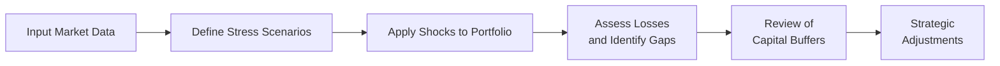

## Introduction

Stress testing is one of those terms we throw around a lot in risk management circles. But let’s be honest, many folks feel a bit anxious when they hear it—probably because it’s all about preparing for those downright scary moments in the markets when things seem to unravel at an alarming rate. Imagine the market meltdown scenarios from 2008, pandemic disruptions, or steep commodity price collapses—these are prime examples of extreme market conditions. When panic spreads, liquidity can evaporate quickly, portfolios can lose value in record time, and even well-structured positions can look shaky. Stress testing aims to shed some light on what might happen if (or when) markets take a nosedive, so that institutions and individuals can plan well in advance.

In this section, we’ll explore what extreme market conditions really mean, look at how stress testing works, and review methods like reverse stress testing—where you start with a hypothetical “failure point” and figure out which conditions might cause it. We’ll also talk about how managers use test results to strengthen their defenses, build recovery plans, and monitor liquidity. And, to be honest, I always think it’s better to have a plan and never need it than to need a plan you never created!

## Defining Extreme Market Conditions

When we say “extreme market conditions,” we’re talking about states of the market that go beyond normal volatility—situations where prices plummet, liquidity disappears, or economic disruptions become so severe that they affect the entire financial system. Often, these conditions manifest as:

• Rapid, significant declines in asset prices.  
• Seizure in credit markets where no one wants to lend.  
• Tightly interconnected global sell-offs fueled by panic or forced liquidations.  
• Dramatic policy shifts and interest rate gyrations as central banks scramble to respond.  
• Real-world disruptions, such as pandemic-induced halts in consumer spending or supply chain collapses.

If you’re like me, you might remember how in 2008, some of the largest names in finance suddenly wavered under the weight of subprime mortgage exposures. Blink, and institutions with decades of history were battling insolvency. That meltdown taught us the importance of systematically examining our vulnerabilities—and that’s exactly what stress testing is all about.

## Purpose and Fundamentals of Stress Testing

The main goal of stress testing is to expose the vulnerabilities in a portfolio or an institution’s balance sheet when faced with these extreme conditions. This process helps in:

• Gauging potential losses: By systematically applying severe shocks, firms (and investors) can estimate the expected and unexpected losses under extraordinary circumstances.  
• Guiding contingency planning: If a stress scenario shows painfully high drawdowns, management is spurred to enhance liquidity, strengthen hedges, or shore up capital.  
• Ensuring adequate capital buffers: Regulators worldwide frequently require banks, insurance companies, and other financial entities to maintain certain capital levels, and stress testing is a key tool for verifying capital adequacy.  
• Informing strategic adjustments: Rethinking exposures, asset allocations, or risk limits becomes easier once you see data highlighting where you’re most vulnerable.  

A helpful way to visualize the flow of a typical stress test in a risk management setting is:

In simpler terms, you gather your data, decide on the scenarios, apply extreme shocks to your holdings (or portfolio valuations), assess what happens to your capital and liquidity, and then consider your next steps.

### Practical Example of Scenario Setup

Imagine you manage a balanced portfolio of equities and bonds—say 60% in a diversified equity index and 40% in high-grade corporate bonds:

1. Historical scenario: You pick the 2008 Global Financial Crisis. You might impose a 35–40% decline on equity values and a simultaneous spike in credit spreads for corporate bonds.  
2. Hypothetical scenario: Perhaps you forecast a global recession triggered by a new trade war and mass cybersecurity issues. This scenario might assume equity markets drop 25%, credit spreads widen 200 basis points, and risk-free rates shift lower by 100 basis points.  
3. Extreme liquidity crunch: You could assume bond market liquidity disappears and transaction costs shoot up, so that forced sales (if needed) cause large haircuts.

After applying these shocks, you’d measure the overall portfolio value drop, figure out if your bond holdings can be quickly converted to cash, and check if your losses exceed your firm’s risk tolerance or an established capital threshold.

## Designing Stress Tests for Extreme but Plausible Conditions

Now, designing a stress test isn’t as simple as throwing a big negative percentage at your portfolio and calling it a day. The test should be severe but also plausible—meaning you must consider how markets behave in times of crisis:

• Correlations often spike in panic conditions: Risky assets tend to move in the same direction, meaning diversification benefits might dramatically diminish.  
• Volatility can surge: The “normal” daily price movements in calm market environments can suddenly triple or quadruple.  
• Liquidity can vanish: Even highly rated bonds might become difficult to sell at a reasonable price, making the difference between “paper values” and “realizable cash” painfully clear.

### Historical vs. Hypothetical Stress Tests

• Historical: These tests replicate the patterns and severity of past crises (e.g., the 2008 meltdown, the 2020 pandemic shock, or the 1998 LTCM crisis). They offer a grounded reference point—if it happened before, it can happen again.  
• Hypothetical: These scenarios string together a set of scary “what-if” factors, like a sudden pandemic plus a surge in inflation plus collapsed commodity prices. Hypotheticals may seem imaginative, but as we know, the world is full of surprises and black-swan surprises can absolutely happen.

## The Role of Reverse Stress Testing

Let’s talk about reverse stress testing—a different twist. In a typical stress test, you define plausible shocks and see how bad the damage might be. But in a reverse stress test, you start with the worst-case outcome: total failure of a business line, catastrophic depletion of capital, or persistent illiquidity. Then, you backtrack to figure out which conditions produce that particular meltdown.

• Identifying triggers: A reverse stress test highlights the risk drivers that can bring an institution to its knees—be it credit default shocks, plummeting equity markets, or a dramatic breakdown in a swap or derivatives hedge.  
• Focusing on the meltdown threshold: By defining the actual point at which the firm cannot survive, you get clarity about your “limit line.”  
• Actionable outcomes: Reverse stress testing can be a wake-up call for management. If the meltdown scenario doesn’t seem too far-fetched, it’s time to scale back exposures, explore better hedging, or revise business models.

I distinctly recall a risk workshop I attended, where the presenter asked us to imagine we were a large pension fund that became insolvent overnight. He challenged us to identify every possible route from normalcy to insolvency. That exercise forced a deeper risk culture, prompting us to question every assumption we made about liquidity, correlation, manager behavior, and policy constraints.

## Liquidity Management and Contingency Planning

Stress test results feed directly into liquidity management and contingency planning. Why is this so important?

• Liquidity shortfalls: Under normal conditions, you might easily fund your liabilities by selling a few highly liquid securities. But in a severe crunch, anxious buyers can vanish.  
• Lines of credit: Institutions typically secure credit facilities or secure borrowing lines that can be tapped when quick cash is needed. However, credit lines might evaporate or become extremely costly if everyone is seeking liquidity at once.  
• Recovery and resolution planning: Regulators often require large financial institutions to have “living wills” or resolution strategies, where they lay out the steps for an orderly wind-down if financial distress hits. Stress testing is a crucial input to identify those steps—such as asset sales, capital injections, or halting certain business lines.

## Using Stress Test Results to Enhance Future Crisis Resilience

We don’t just conduct stress tests to fill a compliance checkbox. The ultimate aim is to build resilience:

• Adjusting risk limits: If the test reveals an uncomfortable drawdown under plausible scenarios, you might reduce leverage, shift out of volatile assets, or re-hedge your positions.  
• Boosting capital buffers: Instead of running with minimal equity or Tier 1 Capital, many firms opt to maintain a “safety margin” that’s above regulatory minimums, just in case.  
• Improving policy and governance: A robust stress testing framework fosters better governance—management and the Board can engage in more informed discussions about risk and set policies that reflect real vulnerabilities.  

In many banking systems, supervisors examine stress test results to determine if a bank’s capital plan is adequate. But from an asset management or individual portfolio perspective, these insights are still powerful: you get a data-driven rationale for how to position your portfolio to endure catastrophic storms.

### Example: Liquidity Gaps

Suppose your stress test indicates that if the stock market plummets 30% in one quarter, you might have margin calls on your leveraged positions. If you can’t raise cash quickly from elsewhere in your portfolio, you’ll be forced to sell assets at depressed prices, amplifying losses.

Armed with this knowledge, you might rearrange your portfolio to hold more liquid positions or utilize derivatives with less stringent margin requirements. To put it simply, the stress test is telling you: “Hey, if the boat starts to sink, do you have a lifeboat?” If not, well, time to find one.

## Common Pitfalls in Stress Testing

Even though stress testing is a powerful tool, there are several pitfalls and mistakes to watch out for:

• Overreliance on historical data: Just because something has never happened before doesn’t mean it can’t happen. Rare or unprecedented events do occur.  
• Inaccurate model assumptions: Unclear correlation structures, flawed assumptions about how certain assets behave in crises, or ignoring liquidity risk can all lead to insufficient stress scenarios.  
• Narrow scope: Some organizations focus solely on market risk, forgetting operational or counterparty risks that can be just as devastating in an extreme scenario.  
• Complacency: If a firm’s initial tests pass “just fine,” managers might become too comfortable. Stress tests need continuous updating as markets and business models evolve.

## Personal Reflections

You know, I once ran a stress test on a portfolio that was heavily tilted toward renewable energy equities—very stable in normal times. I thought, “Ah, this is a resilient sector.” But the test assumed a simultaneous collapse in global growth, a spike in interest rates, and a plunging oil price. Guess what? Suddenly, the valuations on those otherwise stable energy stocks got hammered, and the portfolio faced a serious shortfall. The lesson: don’t underestimate how quickly an unexpected combination of factors can converge to produce large losses.

## Integrating Stress Testing with Other Risk Management Techniques

Stress testing fits seamlessly into your overall risk management framework, complementing other tools:

• Value at Risk (VaR) or Conditional VaR still help measure typical daily volatility or tail risk in a usual environment, but stress tests fill the gap of “what if the improbable happens?”  
• Scenario analysis is often broader-based, capturing multiple macro variables. Stress testing zooms in on more extreme shocks than typical scenario analyses might consider.  
• Quantitative risk metrics rarely incorporate qualitative judgments, but stress testing thrives on expert input, past experiences, and forward-looking hypotheticals.

## A Quick Numerical Illustration

Let’s say you run a stress test on a $100 million portfolio. You apply these shocks:

1. Equity shock: –30% (applied to 60% of the portfolio).  
2. Bond shock: –10% (applied to 40% of the portfolio).  
3. Correlation shift: Equities and bonds now both drop concurrently, which is unusual in stable markets but common in crises.  

Without correlation or synergy, the naive approach might say the portfolio drops by:  
(0.60 × –30%) + (0.40 × –10%) = –22%.  
Meaning you might expect $22 million in losses. But if you add in distressed correlation and forced liquidation costs—maybe an additional 5%—the final drop could be 27% or higher. This is just a rough illustration of how synergy effects can compound the damage.

## Best Practices in Stress Testing

• Refresh scenarios regularly: Keep your scenario library updated with the latest market developments.  
• Combine historical and hypothetical shocks: Balance realism (from historical data) with creativity (plausible new risks).  
• Communicate results widely: Ensure risk managers, portfolio managers, and senior leadership are all aligned on the findings.  
• Document rationale: Keep a clear audit trail of how you chose scenario parameters and the assumptions behind each.  
• Link to contingency plans: Use insights from stress tests to shape actionable steps—like raising capital or seeking central bank liquidity facilities.

## Reverse Stress Testing and the Bigger Picture

The best stress testing frameworks also include reverse stress testing to identify precisely which scenario kills the firm. In other words:  
• Start with a meltdown: “Our capital goes to zero,” or “We miss a required coupon payment on senior debt.”  
• Reverse-engineer the path: For instance, we might need a 40% drop in equities, plus a specific jump in our cost of funding, plus a deposit bank run, to produce that meltdown.  
• Evaluate plausibility: Is this combined shock scenario purely theoretical, or could a real-world event chain cause it? If it’s not so far-fetched, it’s wise to plan for it.

## Conclusion and Exam Tips

Stress testing is all about preparing for the worst before the worst actually crops up. Whether you’re a large financial institution, an asset manager, or just someone who invests for retirement, having a handle on how your portfolio might react under severe conditions is invaluable. It helps you plan your liquidity, adjust your capital position, and refine your investment strategies so you can stay afloat even if the market waters get stormy.

• Be concise and structured: In a CFA exam setting, if you see a question on stress testing, don’t just define it—describe how it’s applied, why it matters, and how reverse stress testing adds another dimension.  
• Show real examples: Use historical contexts like 2008 or COVID-19. The exam often likes to see practical references.  
• Watch for correlation effects: Examiners may test your understanding that diversification benefits can quickly diminish in crisis scenarios.  
• Link to risk management: Demonstrate how stress testing aligns with capital requirements, liquidity coverage, and rebalancing strategies.  
• Tackle reverse stress testing: If asked, be able to explain how it looks from meltdown to cause, rather than cause to meltdown.

Stress tests aren’t just about giving you a worst-case number to stare at; they’re about prompting decisive action to be better prepared. That’s perhaps the biggest takeaway: it’s not about being fearful, but about enhancing your readiness and resilience in the face of extreme market turbulence.

## References and Further Reading

• IMF. (2020). Macrofinancial Stress Testing—Methods and Applications.  
• Alessi, L., & Detken, C. (2018). “Identifying excessive credit growth and leverage.” Journal of Financial Stability.  
• Bank of England. (2021). Stress testing the UK banking system: Key elements of the 2021 stress test.

## Glossary

• Extreme Market Conditions: Highly volatile states of financial markets often driven by widespread panic, systemic failures, or severe economic disruptions.  
• Reverse Stress Testing: A technique that identifies the conditions under which a firm’s business model becomes unviable, working backward to find the triggers.  
• Liquidity Crunch: A situation in which borrowing becomes expensive or impossible, and assets cannot be quickly sold without major price discounts.

---

## Test Your Knowledge: Stress Testing for Extreme Market Scenarios



### Which scenario best describes “extreme market conditions” for stress testing purposes?

- [ ] A temporary slowdown in equity markets with minimal price impact
- [x] A broad market panic characterized by swift, steep price declines and liquidity shortages
- [ ] A moderate shift in interest rates under stable markets
- [ ] A single-day market closure for a national holiday

> **Explanation:** Extreme market conditions imply severe volatility, liquidity crunches, or systemic disruptions, such as those observed during the 2008 financial crisis or a major geopolitical shock.

### Which of the following is a primary goal of stress testing?

- [ ] To ensure that the portfolio outperforms the market under normal conditions
- [ ] To maximize short-term profitability
- [x] To gauge potential losses in severe scenarios and guide contingency planning
- [ ] To eliminate all market risk from the portfolio

> **Explanation:** Stress testing focuses on severe yet plausible market stresses, helping institutions anticipate potential losses and plan for resilience.

### Which statement best reflects the purpose of reverse stress testing?

- [ ] To confirm that a portfolio never experiences capital losses
- [ ] To replicate historical market downturns
- [ ] To reduce the complexity of stress testing by ignoring rare events
- [x] To identify conditions that cause total failure and trace back possible triggers

> **Explanation:** Reverse stress testing starts at an endpoint of firm or portfolio failure and works backward to find scenarios that could lead to that undesirable outcome.

### Which pitfall can arise when designing stress test scenarios?

- [ ] Including both historical and hypothetical data
- [x] Overreliance on historical data that fails to capture new or unprecedented events
- [ ] Considering the impact of correlation shifts in a crisis
- [ ] Involving multiple risk dimensions such as credit, liquidity, and market

> **Explanation:** Relying solely on past events may overlook new types of shocks or market structures not previously observed.

### Which of the following best describes how stress test results can inform investment strategy?

- [x] By revealing where capital buffers or portfolio adjustments might be needed
- [ ] By proving that a portfolio can never lose value
- [x] By highlighting the need for enhanced liquidity or hedging in a crisis
- [ ] By eliminating exposure to all asset classes

> **Explanation:** Stress testing illuminates vulnerabilities, prompting firms to re-engineer or strengthen their strategies, often by assigning larger capital buffers or improving liquidity.

### In the context of extreme market conditions, which phrase best describes a liquidity crunch?

- [x] A situation where assets cannot be easily sold without major price discounts
- [ ] A slight increase in brokerage fees due to seasonal factors
- [ ] A halt in trading due to a minor data glitch
- [ ] A short-lived dip in market sentiment, quickly reversed by central bank intervention

> **Explanation:** A liquidity crunch implies the disappearance of ready buyers, forcing sellers to liquidate assets at significant losses.

### When might a firm use historical scenarios to design a stress test?

- [x] When replicating the conditions of past crises, like 2008, to measure current exposures
- [ ] When wanting to ignore real-world data over purely theoretical events
- [x] When capturing correlation spikes observed during specific past market downturns
- [ ] When confirming that market conditions never recur

> **Explanation:** Historical scenarios let firms model their current portfolios under significant past events, such as the 2008 crash, to see how they might fare if such conditions recurred.

### Why is a correlation spike often incorporated in an extreme stress test?

- [x] Because, in a market panic, asset classes often move in the same direction
- [ ] Because it increases diversification benefits
- [ ] Because correlation typically drops during market turmoil
- [ ] Because it makes historical stress tests irrelevant

> **Explanation:** During crises, correlations between normally uncorrelated or mildly correlated assets can converge, intensifying losses across the board.

### Which of the following strategies might be prompted by stress test outcomes?

- [x] Reducing leverage and bolstering liquidity reserves
- [ ] Eliminating regulatory compliance frameworks
- [ ] Accepting higher-than-usual levels of illiquidity risk with no hedge
- [ ] Avoiding the need for reverse stress testing

> **Explanation:** Stress test results often highlight areas where leverage is too high or liquidity buffers are insufficient, leading to potential de-risking strategies.

### Stress testing under extreme market conditions is always done to confirm a portfolio can avoid losses.

- [ ] True
- [x] False

> **Explanation:** Stress testing does not guarantee avoidance of losses. Instead, it helps identify vulnerabilities and plan for potential adverse outcomes, enhancing overall resilience.


