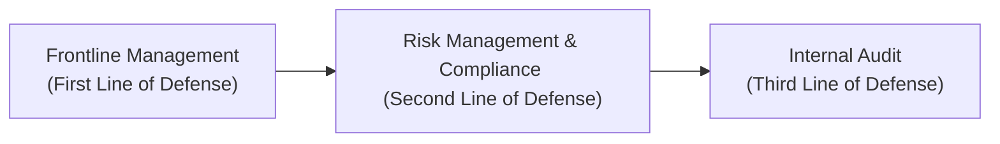

## Overview
Risk management can sometimes feel like an abstract idea, but—believe me—once you’re in the middle of a market upheaval or a major organizational pivot, you realize how crucial a solid risk management framework is. At its core, a Risk Management Framework (RMF) is a structured method to identify, measure, manage, and monitor all identifiable risks an organization faces. Think of it like a blueprint that dictates how you should deal with the potential dangers—both everyday vulnerabilities and “out of the blue” shocks.

When we talk about governance, we’re focusing on the system that guides how decisions are made and how the organization’s leaders are held accountable. From a risk management perspective, effective governance ensures there’s a well-defined process for risk oversight from top to bottom. As you might guess, this stuff really matters: a strong governance environment helps maintain investor confidence, protect the organization’s brand, and (most importantly) keep adverse exposures in check.

## Key Elements of a Risk Management Framework
A robust RMF covers the processes, policies, tools, and structures that enable an organization to navigate risks in an orderly and strategic way. An RMF typically includes:

• Clear policies describing how to handle various risk types.  
• Defined roles and responsibilities so each staff member knows how they contribute to risk management.  
• Internal guidelines (such as risk appetite statements) specifying how much risk the organization is willing to tolerate.  
• Mechanics for continuous monitoring, reporting, and escalation of risk.  

I once worked with a small asset management firm that was so focused on day-to-day portfolio returns, they forgot to formalize their risk protocols. After a turbulent economic event, they scrambled to figure out who was responsible for what. They eventually implemented a thorough RMF, which helped them remain calm and collected the next time storm clouds started brewing in the markets.

### Building an Effective RMF
An RMF doesn’t come in a one-size-fits-all package—it must be customized to the organization’s size, complexity, and industry. However, some universal features are usually present:

• A risk policy manual describing major risks (market, credit, operational, liquidity, etc.).  
• Procedures for day-to-day oversight, including reporting and escalation.  
• Tools like Key Risk Indicators (KRIs), Value at Risk (VaR) calculations, or scenario analysis.  
• Ongoing feedback loops: the framework should adapt, because changing market conditions or major regulatory updates can render older procedures obsolete.

Below is a high-level formula often used for aggregating portfolio-level risk, showing how correlation between assets matters in total risk assessment:


\text{Portfolio Risk} = \sqrt{\sum_{i=1}^{n} (w_i^2 \sigma_i^2) + 2 \sum_{i} \sum_{j>i} w_i w_j \,\text{Cov}(R_i, R_j)}


Where:  
• \\( w_i \\) = Portfolio weight of asset \\( i \\).  
• \\( \sigma_i \\) = Standard deviation of asset \\( i \\).  
• \\( \text{Cov}(R_i,R_j) \\) = Covariance of returns of assets \\( i \\) and \\( j \\).  

This formula might appear in a risk management policy as the basis for how the organization calculates total risk exposures in a multi-asset portfolio.

## Establishing Governance and the Role of the Board
Governance is the glue that holds the risk management function together. In fact, it’s the starting point because it sets the tone from the top. The Board of Directors bears ultimate responsibility for defining the organization’s risk appetite and ensuring that the entire process of identifying, assessing, and controlling risk stays on track.

### Board Responsibilities
• Oversight: The Board ensures the RMF aligns with organizational goals.  
• Approval: The Board reviews and approves the risk appetite statement and major risk-related points of policy.  
• Supervision: By communicating risk policy expectations, the Board ensures management remains accountable.

Board discussions often include heated debates trying to figure out just how much risk is “enough.” Too conservative, and the organization might lose competitive edge. Too aggressive, and you might face unsustainable volatility. Striking that perfect balance isn’t easy. Think of it like balancing on a seesaw with a friend—if too much weight moves to one side, you risk toppling over.

## Implementing the Three Lines of Defense
One commonly accepted model for structuring risk responsibilities is the “Three Lines of Defense” model. Each line clarifies who owns risk, who monitors it, and who independently verifies that effective controls are in place.

### Frontline Management (First Line of Defense)
These are the individuals who take and manage risk on a daily basis. For example, a portfolio manager deciding how to allocate assets among various equities or an operations manager approving a new automated process. These are the folks “in the trenches,” so to speak. They must understand the organization’s risk appetite, follow guidelines, and communicate emerging risks promptly.

### Risk Management & Compliance (Second Line of Defense)
This second line is more about oversight, advice, and creation of policies. Compliance officers or dedicated risk management teams monitor the first line and keep track of whether risk-taking activities remain within established thresholds. They also produce risk reports for executive leadership and the Board.

### Internal Audit (Third Line of Defense)
Finally, you have internal (and occasionally external) audit, which provides independent assurance that the first two lines are doing their jobs correctly. They’re not involved in day-to-day risk mitigation decisions, so their perspective is objective. They conduct audits to verify that controls and compliance efforts are actually effective and that they align with the Board’s overall mandate.

For a quick visual reference, here is a simplified Mermaid diagram:



Notice how each stage depends on the previous one but also has distinct responsibilities and levels of oversight.

## Defining Risk Appetite and Tolerance
Risk appetite is a high-level statement of how much risk the organization is willing to take on to achieve its strategic objectives. In contrast, risk tolerance takes this broader concept and translates it into more tangible limits. For instance, risk appetite might say, “We aim to outperform the benchmark by X% but can handle moderate volatility,” while risk tolerance might quantify how much leverage or market exposure is allowable for the portfolio.

A well-defined risk appetite statement helps guide strategic decisions. It’s also an easy way for new team members (and even external stakeholders) to understand the philosophy behind all risk management activities.

### Example of a Risk Appetite Statement
• “The firm’s goal is to achieve annual returns above the benchmark by at least 1.5% while maintaining a maximum drawdown of 10% or less in extreme market conditions.”  

### Translating to Risk Tolerance
• Maximum permissible portfolio leverage: 1.3x.  
• Limit on allocation to any single equity sector: 20%.  
• VaR with a 99% confidence level not to exceed 8% of total portfolio value over a 1-month horizon.  

These kinds of specific numeric targets make it easier to track compliance and quickly notice red flags when you wander into territory that exceeds the firm’s comfort zone.

## Keeping the Framework Current
A dynamic risk environment means that what’s acceptable or effective today might be obsolete tomorrow. Market crises, technological disruption, and new regulations (or sometimes all of these simultaneously!) can rapidly change the risk landscape. Consequently, robust RMFs require periodic reviews—annually at a minimum, but preferably more frequently in volatile times.

A quick personal anecdote: In one of my previous roles, our team updated the RMF only once a year. Then the regulatory environment changed drastically in the middle of that cycle, forcing us to scramble. We needed urgent policy revisions and more detailed scenario analyses. From that point, we decided to do smaller quarterly assessments and incorporate real-time feedback from significant market or regulatory events.

## Practical Tools and Techniques
Risk management frameworks aren’t just about documents and sign-offs; they’re also about day-to-day tools and processes that keep the entire machine running smoothly.

• Key Risk Indicators: Metrics that act like early warning systems. For instance, a spike in daily trading volume might signify rising volatility.  
• Scenario Analysis & Stress Testing: Tools that test your assumptions under various hypothetical (or historically extreme) market conditions.  
• Incident Reporting: Formal logs to capture near misses or actual breaches.  
• Regular Reporting to the Board: Summaries that show how the firm is doing against key risk metrics.

Below is a simple Python snippet that demonstrates a quick calculation of historical portfolio volatility using a CSV file of returns data. Although this is just a tiny piece of the puzzle, it illustrates how a risk management function might automate routine tasks:

```python
import pandas as pd
import numpy as np

data = pd.read_csv('portfolio_risk_data.csv')
portfolio_var = data['returns'].var()
portfolio_std_dev = np.sqrt(portfolio_var)

print("Historical Standard Deviation:", portfolio_std_dev)
```

This quick code run can provide a snapshot of how volatile your portfolio has been. Of course, in a more comprehensive setting, you’d add advanced risk metrics and robust data quality checks.

## Best Practices and Common Pitfalls
Although implementing a Risk Management Framework is powerful, there are some common pitfalls:

**Pitfalls**  
• Overly Complex Policies: If staff can’t understand them, they won’t follow them.  
• Reactive vs. Proactive Stance: Updating policies only after a major crisis means you’re always lagging behind.  
• Lack of Clarity in Roles: If no one knows whose job it is to sign off on specific risk exposures, confusion reigns.  

**Best Practices**  
• Communicate Early and Often: Everyone in the firm should speak the same risk language.  
• Involve All Levels: Risk culture flourishes when senior management leads by example, but frontline employees also must buy in.  
• Use Technology Wisely: Automated data collection, dashboards, and real-time alerts can significantly enhance risk oversight.

## Exam Tips
• Watch for scenario-based questions that ask about who is responsible if a particular risk emerges (hint: first line owns it, second line oversees it, third line provides assurance).  
• Distinguish clearly between “risk appetite” (strategic) and “risk tolerance” (more operational or tactical).  
• Understand the Board’s role: They set the high-level direction, not the day-to-day guidelines.  
• Be prepared to discuss how you’d revise an RMF in response to a market event or an evolving regulatory environment.  
• Cite the relevant standards and frameworks, like COSO and Basel Committee guidelines, which frequently appear in exam contexts.  

## References and Further Reading
- COSO. (2017). Enterprise Risk Management: Integrating with Strategy and Performance.  
- Basel Committee on Banking Supervision. (2015). Corporate Governance Principles for Banks.  
- Institute of Internal Auditors (IIA). (2013). The Three Lines of Defense in Effective Risk Management and Control.  

These resources offer deeper insight into how organizations integrate risk oversight with strategic planning. They also provide comprehensive guidelines for evaluating and refining an existing RMF.

---

## Test Your Knowledge: Risk Management Framework and Governance



### Under a well-structured Risk Management Framework, who typically sets the organization’s risk appetite?

- [ ] Operational management
- [ ] Middle managers in the finance department
- [x] The Board of Directors
- [ ] Internal audit

> **Explanation:** The Board of Directors holds ultimate responsibility for approving and setting the overall risk appetite of an organization.

### In the Three Lines of Defense model, the second line typically includes:

- [ ] Board governance committees
- [x] Risk management and compliance functions
- [ ] Operational management
- [ ] External regulators

> **Explanation:** The second line of defense focuses on overseeing, monitoring, and guiding risk activities through risk management and compliance teams.

### What is a primary advantage of having a clearly defined risk tolerance within an RMF?

- [x] It sets quantifiable limits to guide day-to-day business activities.
- [ ] It eliminates market risk completely.
- [ ] It guarantees regulatory compliance in all jurisdictions.
- [ ] It ensures no financial losses will occur.

> **Explanation:** Clearly articulated risk tolerance translates broad risk appetite statements into quantifiable limits, aiding in practical decision-making.

### Which risk management function provides independent assurance that the risk management process is functioning effectively?

- [ ] Frontline management
- [x] Internal audit
- [ ] Executive management
- [ ] Legal counsel

> **Explanation:** Internal audit (the third line of defense) is independent from daily operations, ensuring objectivity in assessing controls.

### A firm’s risk appetite statement states that maximum portfolio leverage is 1.5x. This is an example of:

- [ ] An external regulatory mandate
- [x] A risk tolerance threshold
- [ ] A stress test parameter
- [x] A market-wide scenario limit

> **Explanation:** Specific numeric or measurable limits such as maximum leverage are typically classified under risk tolerance thresholds.

### Which of the following best describes the role of frontline management under the Three Lines of Defense model?

- [x] Own and manage day-to-day risk
- [ ] Provide independent assessments
- [ ] Oversee compliance and policies
- [ ] Set organizational risk appetite

> **Explanation:** The first line of defense—frontline management—actively takes and manages risk within the guiding framework established by the second line.

### Periodic reviews of the Risk Management Framework are crucial because:

- [ ] It ensures the Board can continually increase risk-taking.
- [ ] It permanently fixes all identified weaknesses.
- [x] Market conditions, regulations, and technologies evolve over time.
- [ ] They replace the need for internal audit assessments.

> **Explanation:** Regular reviews enable an organization to adapt to new market realities, emerging threats, and revised regulatory requirements.

### Which of the following is most closely related to the phrase “tone from the top”?

- [ ] Operational staff instructions
- [ ] Compliance checklists
- [ ] Board of Directors’ mission statement
- [x] Executive-level commitment to governance and ethical behaviors

> **Explanation:** “Tone from the top” refers to the Board and executive management setting the organization’s ethical and risk-aware culture.

### Stress testing in a Risk Management Framework is primarily used to:

- [x] Evaluate performance under extreme or hypothetical conditions.
- [ ] Eliminate all types of operational risks.
- [ ] Create standard audit procedures.
- [ ] Guarantee portfolio returns.

> **Explanation:** Stress testing helps organizations prepare for severe market scenarios, ensuring they can withstand major shocks.

### True or False: The second line of defense owns the daily operational risks in an organization.

- [ ] True
- [x] False

> **Explanation:** Operational managers in the first line of defense own daily operational risks. The second line provides oversight, guidance, and monitoring.


