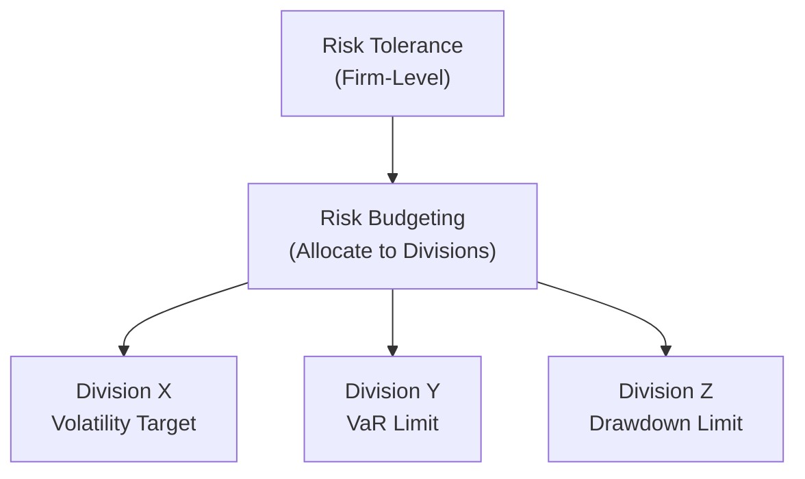
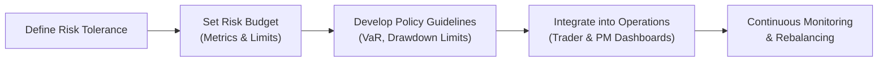

## Introduction

Risk management, at its core, hinges on deciding how much uncertainty an individual or organization is willing to accept in order to achieve certain goals. This threshold of uncertainty—often referred to as risk tolerance—impacts everything else in the investment process. Once this tolerance is clear, we can distribute risk across different asset classes, strategies, or divisions through a technique known as risk budgeting. Eventually, all these elements get woven into a comprehensive policy framework that dictates what is allowed, what is off-limits, and how to maintain alignment with broader strategic objectives.

When I first started working in asset management, I remember being somewhat mystified by how senior managers decided which portfolio manager could take on more risk or which hedge strategy was too aggressive. Over time, I realized they had a clear method for distributing these “risk units,” almost like handing out limited tickets to a theme park ride. That’s effectively risk budgeting—ensuring everyone knows how many “risk tickets” they can spend while ensuring the total risk doesn’t exceed the overall tolerance of the firm. This approach provides guardrails but also ensures people have the freedom to innovate within those limits. It’s pretty neat.

In what follows, we’ll explore the essential concepts of risk tolerance, risk budgeting, and how they integrate into formal policies. We’ll look at real-world examples, consider pitfalls, and weave in some metrics you might see in practice, such as VaR (Value at Risk), drawdown limits, and volatility targets.

## Glossary of Key Terms

Risk Tolerance:  
The degree of risk that an individual or organization is prepared to accept in pursuit of its objectives. This hinges on factors like the firm’s capital structure, liquidity needs, regulatory constraints, and stakeholder expectations.

Risk Budgeting:  
A process by which an organization allocates its overall capacity for risk (or “risk budget”) among various units, asset classes, or strategies. The goal is to maximize return for a given level of total risk.

Policy Integration:  
Embedding predefined risk parameters, guidelines, and metrics into everyday operational workflows. This ensures consistency and makes sure the entire organization is adhering to the same risk standards.

Drawdown Limit:  
A threshold denoting the acceptable peak-to-trough loss over a specific period, above which managers must take measures to limit further damage.

## Understanding Risk Tolerance

Like a foundation sets the boundaries for a building’s structure, risk tolerance establishes the outer limits of uncertainty a portfolio or firm can bear. If we exceed that limit, we compromise our stability—maybe even solvency. If we remain too far below that limit, we may fall short of return objectives.

Risk tolerance is influenced by:  
• Capital Structure: Organizations with higher equity cushions or robust capital reserves may tolerate bigger losses without jeopardizing their survival.  
• Liquidity Needs: Some businesses can’t afford periods of illiquidity. If they need speedy access to large amounts of cash to meet obligations, their risk tolerance may be lower.  
• Stakeholder Expectations: If stakeholders value capital preservation highly, management is likely to be more conservative. Meanwhile, some might push for aggressive growth, leading to a higher risk tolerance.

There’s often a moment when new participants in the market realize that risk isn’t just theoretical. I recall a colleague who invested in a highly volatile emerging market fund for short-term gain. He discovered the hard way that the firm’s guidelines were stricter than he realized. Eventually, compliance flagged the position, and the risk manager asked him to reduce it. The experience illustrated that risk tolerance is not just about personal preference. It’s about safeguarding the collective well-being of the entire organization.

## Risk Budgeting Basics

Risk budgeting is a straightforward yet powerful concept: it’s like dividing up a household budget, except instead of money, we’re rationing the total risk the firm can accept. Each “expense” is the risk you take in a particular sector, strategy, or portfolio.

Managers might have a certain volatility target or be permitted a certain drawdown limit. The sum of these smaller “budgets” must not exceed the organization’s total risk tolerance. This process is strategic because it forces a discussion about the best use of risk capital. If a certain division can achieve higher returns with lower risk, it might be allocated more “risk budget.” If another division’s strategy is more volatile, it might receive a smaller portion. Risk budgeting thereby promotes a culture of accountability and efficiency in risk-taking.

### Practical Example of Risk Budgeting

Let’s say we have a multi-asset portfolio with an overall volatility target of 10% annualized. We can assign 4% volatility to the equity portion, 2% to fixed income, 3% to a commodities strategy, and leave 1% as a buffer for opportunistic plays. If the equity portion experiences an increase in volatility beyond 4%—maybe due to a market downturn or a big sector bet—the risk budgeting framework flags it. Managers then decide to scale back or redistribute risk, ensuring the total portfolio still aligns with the 10% limit.

Below is a simple schematic representation in Mermaid format, illustrating how overall risk tolerance flows into risk budgeting across three hypothetical divisions:



Each division receives a share of the total risk budget. In practice, you’d have more granular slicing of these risk units, but the concept is the same.

## Policy Integration

Policy integration is where the rubber meets the road. Even the greatest risk frameworks are pointless if they exist only in a document no one reads. Successful policy integration involves weaving risk parameters into daily workflows, reporting, and performance measurements. So if your risk policy says that you can’t exceed, say, a 10% annual drawdown, that limit must be programmed into your trading systems and risk models. If your bond desk has a 3% tracking error limit, it should be actively monitored by the firm’s risk engine.

Organizations typically lay out their overall risk policy in documents accessible to all relevant personnel. This ensures there’s no confusion about what constitutes acceptable risk. People often ask, “Isn’t that a bit restrictive?” Actually, well-defined policies can empower managers by giving them clarity. They know exactly what the guardrails are, so they can innovate freely within them. It’s like having lines on a highway—yes, they limit your lane options, but they also prevent collisions and keep traffic flowing smoothly.

## Key Metrics to Track Adherence

Risk budgeting frameworks use several metrics to ensure a division or strategy stays within its allocated budget:

• Value at Risk (VaR): Attempts to quantify potential losses at a given confidence level.  
• Volatility Targets: Mandates that the standard deviation of returns not exceed a specified level.  
• Drawdown Limits: Caps maximum losses from a peak. Once that limit is hit, the manager must scale down or adjust positions.  
• Stress Tests: Simulate extreme market events to see if any divisions exceed their allocated risk budget.

In practice, the formula for VaR at a 99% confidence level might be expressed (in a very simplified sense) as:


\text{VaR}_{0.99} = \mu - z_{0.99}\times\sigma


where:

• \\(\mu\\) is the expected return,  
• \\(\sigma\\) is the standard deviation of returns (volatility),  
• \\(z_{0.99}\\) is the z-score associated with the 99% confidence interval (commonly around 2.33 for a one-tailed test).

Some firms track multiple VaR methodologies (like historical simulation, parametric VaR, or Monte Carlo simulation) to gain a more holistic view of potential tail outcomes.

## Monitoring and Rebalancing

Risk tolerance and risk budgets are not static. Markets shift abruptly, and an organization’s goals can evolve. Regular monitoring is crucial:

• Daily or Weekly Dashboards: Automated risk reports showing current vs. allocated risk.  
• Quarterly Check-Ins: Senior management reviews big-picture adherence to the risk budget.  
• Rebalancing Mechanisms: If a strategy creeps above its limit or if the market environment has changed drastically, risk managers may rebalance allocations—pull back risk from one area, allocate more to another, or even hold it in reserve if conditions remain uncertain.

I’ve personally seen situations where a corporate strategy pivot—like an upcoming merger—required adjusting the risk budget. Suddenly, the firm’s credit risk tolerance got smaller because we were about to assume new liabilities. Everyone had to dial back exposures to more volatile holdings. Sure, it might have been frustrating to reduce some profitable positions, but the broader corporate objective demanded it.

## Putting It All Together with Policy Integration

Below is a simple Mermaid diagram showing how risk tolerance flows through a policy integration framework:



This flow is iterative. If changes arise (maybe new business lines are introduced), management goes back to Step A or B to refine the tolerance or budget.

## Common Pitfalls and Challenges

• Overly Rigid Limits: If the risk policy is too rigid, it can hamper flexibility. Markets can turn in unexpected ways, and managers need some room to maneuver.  
• Communication Gaps: Sometimes, the risk departments set budgets, but front-line traders aren’t aware or fail to grasp them. This disconnect can lead to accidental breaches.  
• Inconsistent Enforcement: If you have a policy but only enforce it occasionally, you create moral hazard. Managers learn that they might get away with breaches.  
• Inadequate Stress Testing: Relying solely on historical data or simplistic volatility budgets can overlook black swan events.  
• Legacy Systems and Data Issues: Integration fails when technical infrastructures can’t collect or analyze real-time data effectively.  

## Python Snippet for a Simple Risk Budget Check

Imagine a scenario where we want to track if specific portfolios exceed their allocated volatility. Here’s a quick example in Python-like pseudocode:

```python
import pandas as pd

risk_allocations = {
    'Equities': 0.04,  # 4% volatility
    'FixedIncome': 0.02,
    'Commodities': 0.03
}

current_vols = {
    'Equities': 0.045,  # 4.5% volatility
    'FixedIncome': 0.015,
    'Commodities': 0.025
}

df = pd.DataFrame({'Allocated': risk_allocations, 'Current': current_vols})

df['Status'] = df.apply(lambda row: 'Exceeded'
                        if row['Current'] > row['Allocated'] else 'Within Limit',
                        axis=1)

print(df)
```

The output might highlight that Equities exceeded its volatility budget (since 0.045 > 0.04), prompting the risk manager to reduce equity exposure or adjust the asset mix.

## Real-World Scenarios

• Hedge Fund with Multiple Strategies: Each strategy (e.g., global macro, long-short equity, credit arbitrage) is allocated a portion of the risk budget. The manager carefully monitors each strategy’s VaR and drawdown. If the global macro desk is nearing its limit, the manager restricts new positions or reassigns capital.  
• Pension Fund with Long-Dated Liabilities: The plan sponsor sets a low risk tolerance due to the critical responsibility of meeting retiree payouts. The risk budgeting process might allocate a modest risk portion to alternative assets, restricting high-volatility exposures.  
• Corporate Treasury Management: Non-financial firms often hold surplus cash in short-term investments. They might set a minimal risk tolerance for liquidity reserves but be more adventurous with “excess” capital, subject to robust guidelines and stress tests.

## Best Practices for Successful Implementation

• Involve Senior Management from the Start: They set the tone and must be on board with the risk tolerance.  
• Communicate Clearly: Everyone, from portfolio managers to operations staff, needs to know what the budgets and limits are.  
• Frequent Calibration: As market conditions change, revisit your risk models and budgets.  
• Automate Where Possible: Real-time dashboards, automated alerts, and systematic rebalancing keep the process agile.  
• Scenario Planning: Use forward-looking stress tests (economic downturn, geopolitical shocks) to validate if your risk budget is realistic.

## Final Exam Tips

• Understand the “Why” Behind Risk Tolerance: CFA exam questions may ask how an organization’s capital base or stakeholder objectives shape risk limits. Be prepared to discuss it in a constructed-response format.  
• Know the Math for VaR and Volatility: You might see item set questions requiring you to compute or interpret these metrics. Keep formulas and interpretations clear.  
• Be Able to Discuss Policy Integration: In essay-type questions, show how a firm enforces risk limits through guidelines, internal reporting, and compliance checks.  
• Provide Examples of Rebalancing Mechanisms: The exam often focuses on how risk budgeting interacts with changing market environments.  
• Avoid Overlooking Soft Factors: Cultural aspects, like better communication or consistent enforcement, can appear in scenario-based questions. The exam might ask you to identify how behavioral or organizational issues undermine risk policies.

## References and Further Reading

• Grinold, R. C., & Kahn, R. N. (2000). Active Portfolio Management: A Quantitative Approach. McGraw-Hill.  
• CFA Institute Research Foundation. (2019). Practices and Practicalities of Risk Budgeting.  
• Poblacion, J. (2017). Asset and Risk Management. Palgrave Macmillan.  

## Mastering Risk Tolerance and Policy Integration: Quiz



### A portfolio manager discovers she has exceeded her volatility target. Which immediate action best aligns with a risk budgeting framework?

- [ ] Increase leverage to compensate for the breach.
- [x] Reduce holdings or shift to less volatile assets.
- [ ] Report the breach at year-end only.
- [ ] Ignore the breach unless losses are realized.

> **Explanation:** Risk budgeting calls for active adjustments when limits are exceeded. Scaling down positions or shifting to more stable assets ensures adherence to the established risk tolerance.

### Which factor does NOT directly influence an organization’s risk tolerance?

- [x] The personal risk attitude of a single back-office staff member.
- [ ] The firm’s long-term capital structure.
- [ ] The liquidity needs to meet short-term obligations.
- [ ] Stakeholder expectations for returns and safety.

> **Explanation:** Risk tolerance is set by broader organizational constraints, not by one individual’s personal comfort level (unless that individual happens to be the sole stakeholder).

### A firm sets a maximum drawdown limit of 15% for each of its three strategies. Strategy A draws down 10%, Strategy B draws down 12%, and Strategy C draws down 16%. How should the firm respond?

- [ ] Increase the budget for Strategy C because it’s high-potential.
- [ ] Do nothing since only one strategy exceeded the limit.
- [x] Restrict or rebalance Strategy C until it falls within the 15% threshold.
- [ ] Immediately close positions in all three strategies.

> **Explanation:** Risk budgeting means each strategy has to operate within predefined limits. Strategy C must be adjusted because it exceeded the limit.

### In the context of policy integration, which of the following tools helps enforce risk guidelines across the trading floor?

- [ ] Sole reliance on after-the-fact year-end reviews.
- [x] Real-time dashboards that track risk metrics.
- [ ] Eliminating the concept of “risk budget” entirely.
- [ ] Setting no formal guidelines to allow flexibility.

> **Explanation:** Real-time dashboards embedded in daily workflow let traders and managers see their standing against limits, ensuring ongoing compliance.

### Which of the following best describes a risk budgeting approach?

- [ ] Allocating capital to the highest-return strategies irrespective of volatility.
- [x] Allocating the permissible risk across different strategies to optimize risk-adjusted returns.
- [ ] Decreasing investment in all risky assets at random intervals.
- [ ] Moving to cash whenever the market falls by 5%.

> **Explanation:** Risk budgeting focuses on distributing a total risk capacity among various strategies in a manner that aims for maximum risk-adjusted performance.

### An investor invests in multiple strategies each with its own VaR limit. Collectively, they exceed the overall organizational VaR threshold. Which principle is violated?

- [ ] The risk tolerance principle, as each strategy individually is within limits.
- [ ] The performance attribution principle, since each strategy is overperforming.
- [ ] The diversification principle, as they are clearly correlated.
- [x] The risk budgeting principle, because the sum of individual allocations exceeds the total risk tolerance.

> **Explanation:** The sum of all strategy risks can’t exceed the overall limit set by the organization's risk tolerance. This is precisely the concept of risk budgeting.

### What is the primary objective of a well-documented risk policy?

- [ ] Discourage managers from seeking returns.
- [x] Clarify acceptable vs. unacceptable risks and integrate practices firm-wide.
- [ ] Shift accountability solely to compliance officers.
- [ ] Show regulators the firm meets minimum standards (only).

> **Explanation:** A well-documented risk policy aims to define clear standards for acceptable risk and embed them in every aspect of the firm’s operations.

### Which of the following best explains why continuous monitoring is essential in risk budgeting?

- [x] Market conditions and organizational objectives can shift, requiring rebalancing.
- [ ] Risk tolerance is static and cannot be changed once set.
- [ ] High-risk strategies should never be scaled back.
- [ ] Drawdown limits do not apply in volatile markets.

> **Explanation:** Risk budgeting is dynamic. Changing market conditions or strategic priorities might require re-allocations to keep the overall risk in line with tolerance.

### Which statement is true regarding stress tests?

- [ ] They only matter for long-term liabilities and not for equity portfolios.
- [ ] They replace the need for historical VaR data.
- [x] They help assess potential losses under extreme scenarios beyond normal volatility.
- [ ] They require daily repetition to be valid.

> **Explanation:** Stress tests simulate worst-case scenarios and are crucial for ensuring the firm can handle rare but severe market disruptions.

### True or False: Policy integration ensures that risk limits exist only in theory, not in day-to-day operations.

- [ ] True
- [x] False

> **Explanation:** Policy integration brings theoretical limits into everyday processes, making sure managers can see and adhere to guidelines in real time.


