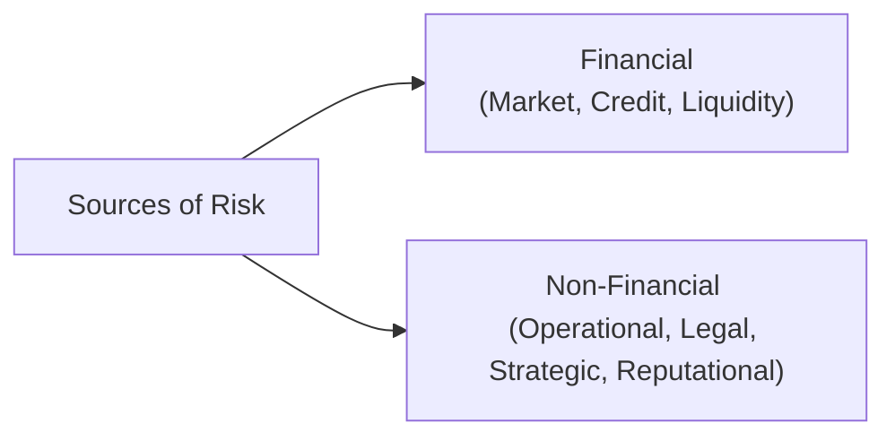

## Understanding Financial and Non-Financial Risks

When folks think of "risk" in investing, they often leap straight to the possibility of losing money in the markets. But if there’s one thing my experience as a risk manager taught me, it’s this: risk is so much broader than just watching share prices bounce up and down. Real risk management means mapping out an institution’s entire risk landscape—both financial and non-financial. In essence, it’s a holistic look at every factor that could set your portfolio, or even your entire organization, off-balance.

Below, we explore the main categories of financial and non-financial risks, demonstrate how each can impact your portfolios, and offer some practical insights into managing them. This section ties closely into the broader discussion of risk management frameworks (see Section 6.2), as understanding sources of risk is the first step in constructing robust controls (Section 6.6) and shaping enterprise-wide oversight structures (Section 6.7).

## Classification of Risk Sources

A helpful place to begin is to visualize how these sources all fit together:

Financial risks, on the left, are wrapped up in the uncertainty surrounding markets, credit events, and liquidity constraints. Non-financial risks, on the right, can stem from operational processes, legal constraints, or even intangible factors like public perception. Let’s go step by step.

## Financial Risks

### Market Risk

Market risk usually shows up in the form of asset price fluctuations—equities go up or down, bond yields spike or drop, interest rates shift, or foreign exchange rates swing wildly. If you’re a portfolio manager holding a variety of instruments, each one might be exposed to different market variables. Let’s say you’re holding a 10-year government bond, a corporate bond, and a basket of global equities. Here are examples of how market risk can creep in:

• Equities: Sudden downturns in stock indices due to economic shocks.  
• Bonds: Rising interest rates that reduce bond prices.  
• Foreign Exchange: A surprise devaluation of a major currency in your portfolio.  

Even small changes in volatility can affect the daily swings in your portfolio’s value. In practice, we might measure market risk using Value at Risk (VaR). A simplified parametric VaR model could look like:


\text{VaR}_{\alpha} = \mu - z_{\alpha}\sigma,


where  
• \\( \mu \\) is the expected return,  
• \\( \sigma \\) is the standard deviation of returns,  
• \\( z_{\alpha} \\) is the z-score for a given confidence level \\(\alpha\\).  

In normal markets, it’s common to pick confidence levels like 95% or 99%. However, the actual methods can get more complex and often incorporate historical simulations or Monte Carlo methods (see Section 6.5 on Measuring Risk).

### Credit Risk

Credit risk is the chance you won’t get paid back. The obvious scenario is that a borrower defaults on a loan or corporate bond. But credit risk seeps into many corners of finance, including derivative contracts and counterparty exposures (e.g., a swap dealer not fulfilling its obligations). 

I remember a time when I was analyzing a family-owned business bond issue—everything looked good on paper, but then we discovered that the owners had overextended their credit lines. This drastically changed the credit assessment. Suddenly, the probability of default was higher than our initial estimate. This story shows how important fundamental due diligence can be.

In practice, credit risk is managed through credit ratings, diversification (not putting all your eggs in one issuer’s basket), and by setting exposure limits (often known as “credit risk limits”). Stress tests (for instance, applying severe recession assumptions) can help you see if your portfolio suffers major losses in an extreme default scenario.

### Liquidity Risk

Liquidity risk relates to the ease of converting investments into cash without incurring a significant loss. During normal markets, selling positions might be straightforward. But in times of stress, liquidity can vanish fast. You might see wide bid-ask spreads, or even no buyers at all for a particular type of bond. 

Consider a small emerging market bond. Under normal conditions, you might offload it in a day. In a turmoil scenario, it might take weeks. And if you’re forced to sell quickly, you’ll often do so at a steep discount. This forced-sale discount can devastate your portfolio, especially if you’re large enough that your trades move the market. Maintaining a buffer of cash-like assets or building strong relationships with market makers can mitigate these issues. Also, you can structure your portfolio so that assets with lower liquidity align with longer investment horizons—this is sometimes called “liquidity matching.”

## Non-Financial Risks

### Operational Risk

Operational risk is the risk of loss from messed-up internal processes, system failures, or even human error. Think about a cybersecurity breach shutting down your trading systems (that’s external infiltration but an internal process vulnerability), or an environmental disaster damaging one of your main offices. From an asset management viewpoint, such operational hiccups can disrupt trade execution, settlement, or financial reporting. Even a small glitch in your portfolio management software might cause mispricing that flows through your entire strategy.

Minimizing operational risk demands strong internal controls, thorough training for staff, robust IT infrastructures, and contingency planning. That means everything from regularly testing your backup servers to ensuring your employees aren’t all on vacation at once (you’d laugh, but I once saw a trade team severely understaffed in a crucial week because of poor scheduling).

### Legal/Regulatory Risk

Legal and regulatory risk emerges from possible violations—or even perceived violations—of laws, rules, or guidelines. This can lead to lawsuits, fines, or sanctions that not only hurt finances but also tarnish your firm’s reputation. In heavily regulated sectors like banking or asset management, staying compliant is critical and can become quite complicated. Different governments have different regulatory frameworks, and cross-border operations can multiply the complexity.

If you inadvertently fail to disclose material information to investors, or if your fund managers are found in contravention of insider trading regulations, the consequences might involve huge fines or even criminal charges. As we see in Chapter 7, compliance processes are a key part of the daily routine of any investment professional. Well-structured legal support and continuous monitoring of rule changes (such as new data privacy regulations) help avoid costly legal entanglements.

### Strategic Risk

Strategic risk arises when a firm’s strategy fails or is rendered obsolete by competition or market conditions. Sometimes, you might invest in new technology that simply doesn’t pay off. Or you might expand your fund into a new geographical market only to discover that local investors prefer a different product type. Portfolio managers can face strategic risk if they concentrate too heavily on one style of investing—like value vs. growth—and the market environment shifts drastically. This can lead to poor returns and a tarnished track record over time.

### Reputational Risk

Reputational risk is probably one of the most intangible yet damaging forms of non-financial risk. It involves the potential damage to a firm’s brand, trust, or goodwill due to negative publicity or controversial actions. Even a rumor or a single tweet can spark a wave of investor withdrawals if clients believe your firm’s brand is compromised.

For instance, imagine your asset management firm is linked (even loosely and without direct fault) to a scandal involving a major corporate client. Headlines might quickly spread: “Asset Manager Allegedly Connected to Fraud.” If the firm doesn’t address the situation transparently or fails to get out in front of the story, the downward spiral can be swift. Clients lose trust, funds see outflows, and share prices plummet—if the firm is publicly listed. A well-structured crisis management plan and consistent corporate communications strategy are crucial to contain and mitigate these events.

## Mapping Risks

In advanced risk management, it’s not enough to know these risk types in isolation. You need an integrated “risk map” that pinpoints where each risk is coming from, how it might propagate, and what controls are in place. If you find blind spots in your mapping, that’s a huge red flag. The goal is to provide an early-warning system that triggers the necessary error corrections or protective measures before an incident becomes a full-blown crisis.

One approach is to systematically conduct risk identification exercises with all relevant stakeholders—portfolio managers, compliance officers, IT specialists, operations staff, and so on. You can then compile a risk register (sometimes called a risk log) that catalogs every identified risk, its likelihood, and potential severity, plus your plan to mitigate it or handle it if it becomes real.  

## Practical Example: End-to-End Risk in a Corporate Bond Fund

Let’s do a quick case study. Suppose you manage a corporate bond fund:

• Market Risk: Fluctuations in interest rates and overall bond market sentiment. If rates surge unexpectedly, the value of your bond holdings might decline.  
• Credit Risk: Several holdings might be at risk of downgrades or default if an economic downturn hits.  
• Liquidity Risk: During a market panic, the secondary market for corporate bonds can dry up, forcing the fund to sell at disadvantageous prices.  
• Operational Risk: Outages in the trading platform or an error in the rating system that misclassifies the bonds’ credit quality.  
• Legal/Regulatory Risk: If you invest in cross-border holdings, you might run afoul of local regulations or fail to meet certain disclosure requirements.  
• Strategic Risk: If the fund’s yield-based strategy underperforms relative to peers for too long, investors could exit in search of better returns.  
• Reputational Risk: Negative press from one large default might tarnish your track record, making new investors skeptical.

By mapping the above, you can decide on hedging strategies (to limit interest rate movements), maintain diversified credit exposures, schedule liquidity stress tests, invest in robust operational controls, stay up-to-date with regulations, keep a flexible strategy, and communicate effectively with stakeholders.

## Best Practices, Pitfalls, and Mitigation Strategies

• Best Practices  
  – Create a dedicated risk committee to monitor major risk categories.  
  – Use scenario analyses and stress tests to understand potential losses under extreme conditions.  
  – Maintain robust policies and procedures to ensure regulatory compliance.  

• Common Pitfalls  
  – Ignoring correlations between risks. For instance, credit risk often increases during market downturns and can be coupled with liquidity risk.  
  – Relying too heavily on historical data for risk modeling, assuming the future will mirror the past.  
  – Underfunding operational resilience measures (like backup IT systems or training).  

• Mitigation Strategies  
  – Diversification across asset classes, regions, and counterparties.  
  – Establishing clear escalation protocols for operational incidents, legal disputes, or reputational hits.  
  – Building a strong compliance culture that rewards ethical behavior and transparency.  

## Exam Tips and Final Thoughts

In the context of Level I, you should be able to identify, define, and offer examples of financial and non-financial risks. Expect exam vignette questions where you must pinpoint risks relevant to a specific scenario—maybe an emerging-market investment with potential political unrest, or a bond portfolio facing interest rate fluctuations. You might also see theoretical questions about risk mapping and integrated risk management frameworks.  

Time management and clarity matter: if you see a multi-part question tackling different risk types, structure your answer so each risk is clearly identified and linked to the scenario. Jumping around or mixing risk categories can confuse the grader. Summaries and bullet points often help show you understand the distinct nature of each risk.

---

## Glossary

• Market Risk: The risk of losses arising from movements in market variables such as prices, interest rates, or volatilities.  
• Credit Risk: The risk that a borrower or counterparty will default on its obligations.  
• Operational Risk: The risk of loss resulting from inadequate or failed internal processes, people, or systems, or from external events.  
• Reputational Risk: Potential harm to a company’s goodwill/branding due to negative news or public perception.  

## References and Further Reading

• Hull, J. (2018). Risk Management and Financial Institutions (5th ed.). Wiley.  
• Basel Committee on Banking Supervision. (2006). Basel II: International Convergence of Capital Measurement.  
• Jorion, P. (2007). Value at Risk: The New Benchmark for Managing Financial Risk (3rd ed.). McGraw-Hill.  

---

## Test Your Knowledge: Financial and Non-Financial Sources of Risk



### A firm invests heavily in manufacturing technology that immediately becomes obsolete once a competitor releases an advanced alternative. This best exemplifies: 
- [ ] Liquidity Risk
- [ ] Operational Risk
- [ ] Reputational Risk
- [x] Strategic Risk

> **Explanation:** The risk arises from a failed or outdated corporate strategy, which is the defining feature of strategic risk.

### If a portfolio of emerging market bonds experiences freezing trading conditions during a crisis, the manager is most directly concerned about:
- [ ] Interest Rate Risk
- [ ] Unit Root Risk
- [x] Liquidity Risk
- [ ] Basis Risk

> **Explanation:** The difficulty in quickly selling the bonds without heavy discounts points to liquidity risk.

### Which of the following is a key characteristic of reputational risk?
- [x] It can be triggered by events only tangentially related to the firm’s direct activities
- [ ] It is purely measured by quantitative metrics
- [ ] It is typically contained within the finance department
- [ ] It is easily mitigated through derivatives

> **Explanation:** Reputational risk often arises from external perceptions or secondary events that may have little to do with core operations.

### In a typical parametric VaR calculation, zα refers to:
- [ ] The issuer’s credit quality
- [x] The z-score corresponding to a chosen confidence interval
- [ ] The proportion of liquidity reserves
- [ ] A random probability used in scenario testing

> **Explanation:** The zα factor is the standardized z-score capturing the probability cutoff (e.g., 1.65 for 95%).

### Which activity is most likely to increase a bank’s operational risk?
- [x] Inadequate employee training leading to data-entry errors
- [ ] Increasing a bond position amid rising rates
- [x] Overreliance on a single rating agency
- [ ] Launching a new marketing campaign

> **Explanation:** Operational risk stems from failures in processes and people. Poor training and overreliance on one rating source are examples that highlight potential internal control weaknesses.

### In times of market panic, the spread between bid and ask on a high-yield bond widens dramatically. This phenomenon primarily exemplifies:
- [x] Liquidity Risk
- [ ] Strategic Risk
- [ ] Regulatory Risk
- [ ] Sovereign Risk

> **Explanation:** A widened spread indicates lower liquidity, forcing sellers to accept lower prices or wait with the risk of further price drops.

### A rumor that a credit rating agency might downgrade a large tech company can initially escalate:
- [x] Market Risk
- [x] Credit Risk
- [ ] Liquidity Risk
- [ ] Reputational Risk

> **Explanation:** This rumor can change market sentiment and also sparks concern about default. Both market and credit risk can be affected.

### A portfolio manager invests in an innovative derivative product without fully understanding its payoff structure. This situation primarily reveals:
- [x] Operational Risk
- [ ] Reputational Risk
- [ ] Systematic Risk
- [ ] Concentration Risk

> **Explanation:** The inadequate internal process—failing to analyze or train staff on the product—echoes operational risk.

### A regulatory authority imposes a fine on a fund for failing to disclose material investment risks properly. This scenario is most closely an example of:
- [ ] Market Risk
- [ ] Liquidity Risk
- [ ] Reputational Risk
- [x] Legal/Regulatory Risk

> **Explanation:** The fine arises from non-compliance with legal or regulatory requirements.

### True or False: Market risk only applies to equity instruments, not bonds. 
- [ ] True
- [x] False

> **Explanation:** Changes in interest rates, yield spreads, and other market variables directly affect bond valuations, so market risk extends to multiple asset classes, not just equities.


