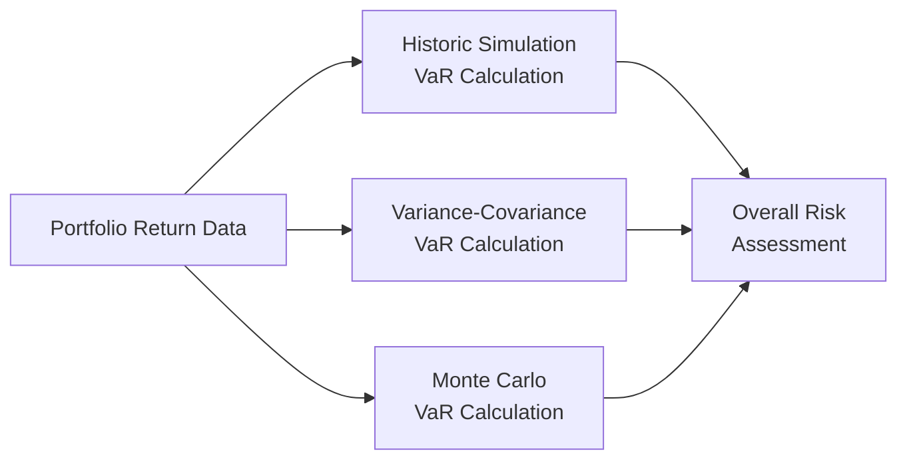

## Introduction

Measuring risk can sometimes feel like trying to see around a dark corner—you never quite know what lurks on the other side. I remember the first time I attempted to quantify the potential downside of a reasonably complex bond portfolio; I must have refreshed those spreadsheets a dozen times, half-convinced my computer was messing with me. But measuring risk is fundamental to effective portfolio management, so we roll up our sleeves and tackle it head-on.

This section breaks down three critical methods that you, as an aspiring or practicing portfolio manager, will draw upon to evaluate potential losses: Value at Risk (VaR), Stress Testing, and Scenario Analysis. Each technique has its strengths and shortcomings, and (here’s the kicker) none of them capture the full picture on their own. They’re best used together, supplemented by plenty of sound judgment and a bit of humility.

## Value at Risk: Key Concepts

Value at Risk (VaR) is one of the most talked-about statistical tools in risk management, often introduced in a single breath alongside “maximum expected loss” or “confidence interval.” In plain language, VaR attempts to answer the question: “How much can I lose with X% probability over a specific time horizon?” 

If you’re thinking about your portfolio’s one-day 99% VaR, you’re trying to find a threshold such that there’s only a 1% chance of exceeding that loss in a single day. As you might guess, VaR can be calculated in several ways, each requiring different mathematical assumptions and computational overhead.

Commonly, VaR can be approached via:
• Historic Simulation  
• Variance-Covariance  
• Monte Carlo Simulation  

We’ll look at each method in more detail shortly.  

### Key Assumptions and Interpretations

Before diving into the math, it’s worth spelling out some assumptions embedded in VaR:

• Stable Historical Patterns: Variance-Covariance and Historical Simulation rely on historical return distributions holding some predictive power for the future.  
• Normal or “Near-Normal” Distributions: Some methods assume normality in returns which, as real-world crises have proven, is often not the case.  
• Single-Period Analysis: VaR is generally computed for a single time horizon (e.g., one day, ten days). If you hold positions for the long run, you might need more dynamic or multi-period risk measures.  

Keep in mind: VaR doesn’t capture the magnitude of worst-case losses beyond the “cutoff” point. A common criticism is that if your 99% VaR is $10 million, you know there’s a 1% chance you’ll lose more than $10 million, but not exactly how much more. That’s why you might see an increased emphasis on Expected Shortfall or Conditional VaR (explored later in other chapters) to address deeper downside risks.

## VaR Calculation Methods

Below are the three main ways to calculate VaR. Which method you choose can depend on data availability, computational constraints, preference for parametric vs. non-parametric approaches, and your appetite for complexity.

### Historic Simulation

Historic Simulation is the “let’s see what would have happened if we repeat past market movements” approach. Essentially, you collect a historical series of portfolio returns (or factor exposures) and then observe the distribution of actual changes to see how frequently large losses occurred.  

• Steps for Historic Simulation:  
  1. Compile a sequence of historical returns for your portfolio (say, daily for the last two years).  
  2. Order these returns from worst to best.  
  3. Identify the cutoff point at your desired confidence level. For instance, if you have 500 observations and you’re targeting a 95% confidence interval, look for the 5th percentile.  
  4. The return at that percentile is typically your VaR estimate (multiplied by the portfolio value).  

• Pros:  
  – Uses actual historical data.  
  – Simple to explain to colleagues or clients.  

• Cons:  
  – Assumes the future will resemble the past.  
  – Provides limited insight if data is insufficient or historical volatility is unrepresentative of future conditions.  

A quick reality check: A historical sample from a relatively calm period will underestimate potential tail risk if a crisis beyond that sample occurs again.  

#### Mini Python Example

```python
import numpy as np

daily_returns = np.array([...])  # fill with your daily return series

confidence_level = 0.95
sorted_returns = np.sort(daily_returns)  # ascending order

index_5th = int((1 - confidence_level) * len(daily_returns))
var_estimate = -sorted_returns[index_5th]  # VaR is the absolute loss

print(f"Historic Simulation VaR at 95%: {var_estimate:.2%}")
```

In the snippet above, we’re sorting returns, then picking the 5th percentile from the worst daily returns as an approximate 95% VaR measure.  

### Variance-Covariance Method

Variance-Covariance is your more “parametric” approach. It’s sometimes called the delta-normal method because it often assumes normal (or near-normal) return distributions. You estimate standard deviations of returns (volatilities) and correlations among assets in the portfolio, apply the covariance matrix, and then derive an overall distribution of potential portfolio outcomes.

• Steps for Variance-Covariance Method:  
  1. Calculate (or estimate) the mean and standard deviation of your portfolio.  
  2. Assume returns are normally distributed (or use some other parametric distribution).  
  3. Compute VaR as the product of the standard deviation and a z-score tied to your desired confidence level (e.g., for 95%, z is ~1.65; for 99%, z is ~2.33).  

  For a one-day 95% VaR:

  VaR ≈ (z-score) × σ × Portfolio Value

  where σ is the portfolio’s standard deviation of daily returns.

• Pros:  
  – Computationally light and quick to update.  
  – Easy to do sensitivity analyses on correlations and volatilities.  

• Cons:  
  – Usually assumes normality in returns, which can underestimate tails.  
  – Highly sensitive to correlation estimates that might shift during stress markets.  

In practice, many risk managers refine the standard normal assumption by using distributions with fatter tails (e.g., Student’s t). If you deviate from normal, you’ll need to incorporate that in your kurtosis or skewness parameters.

### Monte Carlo Simulation

Monte Carlo Simulation is the big-hammer approach for risk measurement. You create thousands (or millions) of random scenarios for underlying asset returns (often based on parameterized distributions or factor models) and then see how your portfolio performs in every scenario—like replaying potential futures, not just the historical one.

• Steps for Monte Carlo Simulation:  
  1. Model the statistical characteristics (mean, standard deviation, correlation structure) of each asset or factor in your portfolio.  
  2. Generate a large number of random draws from those distributions.  
  3. Price the portfolio under each simulation.  
  4. Sort the outcomes to find the cutoff at your confidence level.  

• Pros:  
  – Very flexible; you can incorporate non-linear payoffs or optionality.  
  – Allows for advanced custom distributions, including scenario-based calibrations.  

• Cons:  
  – Computationally intensive.  
  – Heavily reliant on the accuracy of input assumptions (garbage in, garbage out).  

Here is a simple Mermaid diagram to illustrate how these three VaR methods feed into a final risk assessment:



## Stress Testing

While VaR gives you a sense of what might happen in “normal-ish” times (even at high confidence), Stress Testing goes a step further. It forces your portfolio to experience hypothetical extremes or historical fiascos—like if interest rates spike by 500 basis points overnight or if the market sees a meltdown reminiscent of the Global Financial Crisis.

Stress Testing might include:  
• Factor Shocks: Evaluate the portfolio if inflation jumps by 3%, if the yield curve inverts, or if equity prices drop by 20%.  
• Reverse Stress Tests: Start with a doomsday outcome (e.g., losing 30% of your portfolio) and figure out which combination of events gets you there.  
• Historical Replay: Re-run the 1987 crash, the 2008 financial crisis, or the 2020 pandemic shock on your current portfolio positions.  

Remember, the aim is to see how your portfolio might react in severe but plausible conditions, highlighting vulnerabilities. Stress testing also helps you configure capital buffers or rebalancing strategies for those uncertain times.

## Scenario Analysis

Scenario Analysis is somewhat like Stress Testing but often broader or more thematically oriented. Where Stress Testing might revolve around a single extreme event, Scenario Analysis typically packages together multiple variables and explores how they might co-move under a variety of potential future states over a longer horizon.

This can include:  
• Macroeconomic Scenarios: Suppose there’s a drastic shift in monetary policy that triggers persistent inflation and rising unemployment.  
• Industry-Specific Scenarios: For an oil & gas–heavy portfolio, consider a breakdown in OPEC negotiations leading to a supply glut or a geopolitical tension spiking energy prices.  
• Climate Change Scenarios: Evaluate how a carbon tax or extreme weather events could reshape asset valuations in your portfolio.  

Scenario Analysis is famously used by large financial institutions to demonstrate resilience (or identify shortfalls) in their capital positioning. The more imaginative and relevant the scenario, the better prepared you are if that scenario moves from “hypothetical” to “reality.”

## Integrating Qualitative Judgment

Ah, yes—the intangible side of risk measurement: experience and intuition. Despite the array of quantitative models, you’ll want to lean on qualitative judgment as well. 

• Data Gaps: If your data is incomplete or from an unrepresentative period, common sense can flag potential blind spots.  
• Market Regime Changes: If you suspect a major policy shift or a sudden liquidity crunch, the historical data might not reflect that.  
• Behavioral Factors: Investors can react irrationally during crises, and no purely statistical measure will capture fear-driven selling perfectly.  

Balancing hard data against your sense of market conditions and potential policy shifts speaks to the old adage that models should guide but not slavishly dictate decisions.

## Limitations and Complementary Measures

No single measure—VaR, Stress Testing, or Scenario Analysis—dominates the others in all respects. Each has blind spots:

• VaR often fails to capture tail risks beyond the chosen confidence level.  
• Stress Tests might not reflect probability or frequency.  
• Scenario Analysis requires carefully constructed (and sometimes subjective) scenarios.  

To fill these gaps, risk managers often complement these with tools like Expected Shortfall (CVaR), Probability of Ruin analysis, or liquidity risk measures. The interplay of multiple metrics provides a more robust risk picture.

## Practical Examples and Case Study

Imagine you have a $200 million multimanager equity portfolio. You run a 99% one-day VaR using the variance-covariance method and get an estimate of $5 million. However, upon performing a stress test that posits a sharp 25% drop in global equities plus a flight to quality in government bonds, you discover the potential loss could exceed $15 million in that scenario (because of high correlation among your managers’ strategies). You then refine your scenario analysis to see how that meltdown, if coupled with a spike in volatilities, might cause an even bigger drawdown due to leveraged positions you held. 

That’s precisely why risk management can’t stop at VaR. This complementary analysis might prompt you to hedge some portion of the portfolio or allocate more to defensive equity strategies.

## Summary and Exam Tips

• VaR is a pillar measure that attempts to quantify potential losses at a given confidence level but does not inform you of the depth of extreme losses.  
• Stress Testing explores dramatic events or market-disruptive events, often focusing on single-factor or multi-factor shocks.  
• Scenario Analysis expands that approach, weaving multiple macroeconomic or geopolitical factors into coherent narratives for your portfolio’s future.  
• Though each tool has limitations, a layered approach combining them is central to robust risk oversight.  
• In the exam, be prepared to do quick back-of-the-envelope VaR calculations (especially variance-covariance) and interpret the results in scenario-based questions. Don’t forget to discuss the limitations and the importance of complementing VaR with stress tests and scenario analysis.  

## Glossary

• Value at Risk (VaR): A statistical measure that quantifies the maximum expected loss over a specific period with a given confidence level.  
• Stress Testing: The process of evaluating the resilience of a portfolio or institution under severe but plausible adverse conditions.  
• Scenario Analysis: A forward-looking approach where factors (e.g., macroeconomic variables, policy changes) are altered to see how outcomes affect performance.  

## References and Further Reading

- Jorion, P. (2007). Value at Risk. McGraw-Hill.  
- IMF Public Financial Management blog (various articles on crisis and stress testing):  
  https://www.imf.org/en/Blogs  
- Basel Committee on Banking Supervision. (2009). Principles for sound stress testing practices and supervision.  

## Practice Questions: VaR, Stress Testing, and Scenario Analysis



### Which of the following best describes Value at Risk (VaR)?

- [ ] An estimate of the exact worst-case loss in any portfolio.
- [x] A statistical measure that estimates the maximum expected loss over a given time horizon at a specified confidence level.
- [ ] A guaranteed measure for capturing all extreme market events.
- [ ] An alternative name for scenario analysis.

> **Explanation:** VaR is not an exact worst-case loss, but rather a threshold at a given confidence level. It does not account for losses exceeding that threshold.

### Which VaR calculation approach typically assumes a normal distribution for asset returns?

- [ ] Historic Simulation
- [x] Variance-Covariance
- [ ] Monte Carlo with a fat-tailed distribution
- [ ] Reverse Stress Test

> **Explanation:** The Variance-Covariance (or delta-normal) method usually assumes normality for simplicity, making it potentially less accurate during periods of market turbulence.

### Which VaR method is known for being the most computationally intensive but flexible?

- [ ] Variance-Covariance
- [x] Monte Carlo Simulation
- [ ] Historic Simulation
- [ ] GARCH Model

> **Explanation:** Monte Carlo simulations require large-scale scenario generation based on distributions of risk factors, which is computationally heavier but also more customizable.

### Stress Testing is primarily used to:

- [ ] Estimate the 50% probability of a portfolio’s loss.
- [ ] Confirm the precision of historical VaR estimates.
- [x] Evaluate portfolio resilience under severe but plausible market conditions.
- [ ] Ensure compliance with daily trading settlement rules.

> **Explanation:** Stress Testing deliberately focuses on rare but potentially devastating scenarios to judge if the portfolio can handle extreme shocks.

### In a stress test that examines a sudden 500 basis point interest rate increase, the primary concern is:

- [x] The portfolio's exposure to large interest rate movements.
- [ ] The mean returns of equity instruments.
- [x] How correlated assets might behave during a crisis.
- [ ] Ensuring normal distribution assumptions are suitable.

> **Explanation:** Interest rate shocks can lead to capital losses, especially in fixed-income assets. High correlation might amplify losses if multiple assets react similarly.

### One drawback of VaR is that:

- [ ] It always accounts for tail risk beyond the chosen confidence level.
- [x] It does not show how bad losses can get once you exceed the VaR threshold.
- [ ] It requires detailed hypothetical scenarios for major market collapses.
- [ ] It eliminates the need for stress testing or scenario analysis.

> **Explanation:** VaR gives you the boundary of probable losses at a specific confidence level but doesn’t quantify potential losses beyond that boundary.

### Scenario Analysis differs from Stress Testing in that:

- [x] Scenario Analysis often incorporates multiple macroeconomic or policy changes in combination.
- [ ] Stress Testing always involves using advanced factor models.
- [x] Scenario Analysis is only backward-looking.
- [ ] They are both identical in methodology.

> **Explanation:** Scenario Analysis is broad-based, forward-looking, and can integrate a wide array of economic shifts. Stress Testing frequently focuses on major single-event shocks or applying specific factor changes to reprice a portfolio.

### What is the main reason to utilize Historical Simulation for VaR?

- [ ] It always yields the most accurate forecast of future tail events.
- [ ] It guarantees a perfect normal distribution of returns.
- [ ] It allows for real-time, event-by-event simulation of the future.
- [x] It uses actual historical return patterns without imposing specific distributional assumptions.

> **Explanation:** Historical Simulation replays actual changes observed in the past, so it doesn’t assume normality, though it does assume that the future will resemble the historical record.

### Which of the following is a valid criticism of relying solely on VaR?

- [ ] It is too easy to compute for complex portfolios.
- [x] It might ignore the worst-case losses beyond the assigned cutoff.
- [ ] It focuses exclusively on extremely unlikely events.
- [ ] It fully accounts for all potential stress scenarios.

> **Explanation:** VaR sets a threshold but does not provide insight into the severity of losses beyond that threshold, which can be substantial in crisis conditions.

### True or False: Combining VaR with Stress Testing and Scenario Analysis can provide a more comprehensive view of portfolio risk.

- [x] True
- [ ] False

> **Explanation:** Each method addresses risk from a different angle. Using them in conjunction leads to a more robust and holistic understanding of potential losses.


