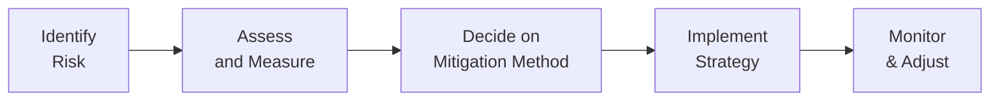

## Introduction

Risk management, as we’ve been exploring in previous sections of this book, aims to identify potential threats to a portfolio and then implement strategies to keep those threats within acceptable limits. But how, exactly, do we modify or mitigate risk once we’ve identified it? Well, that’s precisely what we’re going to delve into here. We’ll talk about approaches like risk avoidance (basically saying, “We’re not going there!”), risk reduction (diversification, hedging, and more), and risk transfer (letting someone else bear the brunt of some exposures). 

I still vividly remember an equity portfolio I studied early in my career. The management team had all their eggs in one basket—a highly volatile, small-cap biotech position. Despite the potential for astronomical returns, the risk was off the charts. After a huge drawdown, the team realized that ignoring some core risk modulation techniques can cost you big time. That memory sticks with me, and it serves as a cautionary tale for why we should carefully consider these risk modification strategies. 

Anyway, let’s jump into how to handle these issues head-on.

## Risk Avoidance

Risk avoidance means, in essence, deciding not to participate in ventures or investments that fall outside the firm’s risk appetite. It’s like saying, “No, thanks. I’m good.” For instance, a hedge fund strategy might simply refuse to trade in certain illiquid, leveraged instruments if it believes the potential downside is too large, relative to the fund’s expected returns or overall mandate.

• Example: If your investment policy statement (IPS) forbids investing in a specific region due to concerns about political instability, you’re practicing risk avoidance. The exposure is literally avoided—there’s no hedging or offsetting needed because you’re not in there in the first place.

• Trade-offs: One might lose the chance for a potentially higher return. Avoidance also might limit diversification benefits if the avoided segment could have offset your other risk exposures.

## Risk Reduction

Risk reduction is all about lowering the magnitude (and often likelihood) of negative outcomes. This is typically achieved through strategies that either broaden your exposures across multiple uncorrelated assets or hedge away certain undesirable exposures. Sometimes, risk reduction also includes good old-fashioned insurance.

### Diversification

Diversification is so fundamental that we often forget to talk about it in day-to-day portfolio management. But it’s still one of the best forms of risk reduction around. You know that old saying, “Don’t put all your eggs in one basket?” That’s basically it.

- Core idea: Spreading your money across assets that ideally have low or negative correlations can dampen portfolio volatility.  
- Important note: During market crises, correlations can converge toward 1. That’s an unfortunate reality we saw in 2008 and other severe downturns. Still, a well-diversified portfolio tends to fare better than a heavily concentrated one.

### Hedging

Hedging involves taking a position—most often through derivatives—to offset, partially or fully, the adverse price movement in another position. If your portfolio is heavily exposed to currency risk, you might enter into a currency forward contract. If you have a large equity exposure, you might purchase put options to insure against a downward move.

- Futures and Forwards: Provide symmetrical payoff profiles. A future on an equity index can offset potential losses in a diversified equity portfolio, but it also limits gains if the market surges.  
- Options: Offer asymmetrical payoffs. Purchasing a put option caps downside risk, but you retain upside potential minus the cost of the option.  
- Swaps: In interest rate swaps, for instance, you can convert variable-rate obligations to fixed rates (or vice versa). This helps control the risk of changing interest rates.

### Insurance

Insurance is a contractual form of hedging—transferring potential losses to another party in exchange for a premium. It can apply to everything from property insurance to specialized coverage for intangible risks. In portfolio terms, it may involve purchasing third-party bonds or structured products that guarantee principal if certain conditions are met.  

## Risk Transfer

Risk transfer overlaps with hedging in the sense that both involve trying to push risk away from your portfolio. But in risk transfer, the emphasis is often on fully shifting exposures off your balance sheet. Think about the difference:

- With an option-based hedge, you’re still the beneficial owner of the underlying asset; you’re just offsetting or limiting the risk.  
- With risk transfer, you might use a Total Return Swap to pass along not just the risk, but also the entire return stream of an asset (like an equity index) to a counterparty.

Common risk transfer mechanisms:
- Swaps (Interest Rate Swaps, Total Return Swaps, Credit Default Swaps)  
- Insurance policies that shift risk of default or other credit events to insurers  
- Reinsurance for large institutional players  

While risk transfer sounds like a panacea, be mindful of counterparty risk. You don’t want your swaps partner failing at the worst possible time.  

## Protective Measures in Practice

Besides these overarching frameworks, there’s a host of day-to-day protective measures that managers implement:

### Position Limits

One practical way to limit any single exposure is to cap how large a position can get in your portfolio. Many institutions have maximum allowable holdings for any given security or sector, ensuring you don’t wind up with that “all eggs in one basket” scenario.

### Stop-Loss Orders

Stop-loss orders (or stop orders) automate selling once an asset’s price declines to a predetermined level. They can also be used to trigger buys in short positions. It’s a straightforward way to mitigate ongoing losses. However, there’s no guarantee of execution at the stop price, especially in fast-moving or illiquid markets; it might slip to a much lower fill.

### Target Volatility Strategies

Some funds implement target volatility approaches, where the portfolio’s overall volatility is continuously monitored and adjusted through rebalancing, derivative overlays, or dynamic asset allocation. For instance, if realized volatility exceeds a desired threshold, the manager might scale down the equity allocation. If volatility is subdued, the manager might dial it up to capture additional returns—though we all know that “quiet” markets can turn volatile in a hurry.

## Robust Operational Controls

No risk management program is complete without addressing operational risk—the risk of loss due to failed internal processes, inadequate controls, or external events.

• Segregation of Duties: Minimizes the chance that one person can execute and confirm the same transaction. This is a mainstay in preventing fraud.  
• Routine Audits: Periodic reviews that check if your processes match your documented procedures. You’ll confirm everything from trade confirmations to regulatory compliance.  
• Strong IT Systems: Secure, well-monitored IT infrastructure wards off cyber threats and data corruption. In an age of heightened cybersecurity concerns, having reliable network defenses is no longer optional.  

These operational measures aren’t as “flashy” as fancy derivatives or portfolio theories, but they’re often the difference between a stable house and one about to collapse. One of my mentors used to say, “You can have the world’s best trading strategy, but if your back-office can’t handle it, you’re dead in the water.”

## Putting It All Together: The Risk Modification Process

Below is a simple diagram that illustrates how these risk modification steps fit within a broader risk management framework:



1. Identify Risk: First, you figure out the nature of the risk (market, credit, liquidity, operational, etc.).  
2. Assess & Measure: Use tools like Value at Risk (VaR), stress tests, or scenario analyses (see Section 6.5).  
3. Decide on Mitigation Method: Choose between avoidance, diversification, hedging, or risk transfer.  
4. Implement Strategy: Execute the trades, set up the insurance contracts, finalize position limits, and so on.  
5. Monitor & Adjust: Market conditions change, so your risk exposures evolve. Revisit them continuously.

## Quick Python Example: Volatility Reduction Through Diversification

Below is a quick snippet of Python-style pseudocode to show how one might estimate portfolio volatility and see the effect of adding an uncorrelated asset in a rudimentary way:

```python
import numpy as np

cov_matrix = np.array([[0.04, 0.00],
                       [0.00, 0.09]])  # Suppose zero correlation

weights_original = np.array([1.0, 0.0])  # 100% in asset 1
current_volatility = np.sqrt(weights_original @ cov_matrix @ weights_original.T)

print(f"Current Portfolio Volatility: {current_volatility:.2%}")

weights_diversified = np.array([0.5, 0.5])  # 50% asset 1, 50% asset 2
diversified_volatility = np.sqrt(weights_diversified @ cov_matrix @ weights_diversified.T)

print(f"Diversified Portfolio Volatility: {diversified_volatility:.2%}")
```

• If Asset 1 has 20% standard deviation (0.04 variance) and Asset 2 has 30% standard deviation (0.09 variance) with zero correlation, the combined volatility at a 50/50 allocation shows the power of diversification.

## Common Pitfalls

- Overconfidence in Correlation Assumptions: Correlations can change drastically in stressed markets.  
- Ignoring Counterparty Risk: If you transfer or hedge risk but the counterparty fails, you’re left holding the bag.  
- Operational Sloppiness: No consistent procedure for audits or segregations can lead to major losses due to mismanagement or fraud.  
- Inconsistent Stop-Loss Implementation: Orders might not be placed systematically or not triggered promptly in fast-moving markets.

## Exam Tips and Concluding Thoughts

For your CFA exam, you may be asked to apply these risk mitigation strategies to hypothetical scenario-based questions. Expect to see:

• Short-answer or constructed-response questions about how to select and rationalize a derivative hedge.  
• Case studies describing an institution’s risk appetite, where you suggest whether the recommended approach should be avoidance, hedging, or insurance.  
• Item-set questions requiring you to spot operational risk lapses (e.g., lack of segregation of duties).

It’s always wise to connect the “why” of each strategy (lowest cost, potential upside retention, or broader portfolio synergy) with the “how” (which instruments and processes to deploy). Take time to memorize essential definitions—like “diversification” versus “risk transfer”—and practice applying them under timed conditions.

## Glossary

• Risk Avoidance: Eliminating activities or exposures that introduce unacceptable risk.  
• Diversification: Reducing risk by investing in a variety of assets that are not perfectly correlated.  
• Hedging: Using financial instruments (e.g., derivatives) to offset potential losses in another position.  
• Stop-Loss Order: An automated mechanism to sell (or buy) a security once its price passes a predefined threshold, limiting ongoing losses.

## References and Further Reading

- Chance, D. M., & Brooks, R. (2015). An Introduction to Derivatives and Risk Management. Cengage Learning.  
- Hull, J. (2018). Options, Futures, and Other Derivatives. Pearson.  
- CFA Institute. (2020). Guidance on Hedging Strategies for Institutional Portfolios.

---

## Test Your Knowledge: Risk Mitigation Strategies & Tools



### Which of the following best describes "risk avoidance" in portfolio management?

- [ ] Taking positions in derivatives to offset exposure.
- [x] Deciding not to undertake a certain risky investment at all.
- [ ] Setting a stop-loss order at a predefined price.
- [ ] Offsetting part of the risk through insurance.

> **Explanation:** Risk avoidance explicitly means not entering or engaging in an activity that could result in potential losses. It involves steering clear of certain strategies altogether.

### When a manager uses credit default swaps (CDS) to shift credit risk to another entity, this is an example of:

- [ ] Risk avoidance.
- [x] Risk transfer.
- [ ] Risk retention.
- [ ] Risk measurement.

> **Explanation:** By purchasing a CDS, the manager pays a premium to transfer credit event risk to the swap provider.

### Which of the following best illustrates diversification?

- [x] Spreading allocations across multiple asset classes with low correlations.
- [ ] Concentrating on the single best-performing sector.
- [ ] Buying put options on a large-cap equity portfolio.
- [ ] Placing stop-loss orders at every 5% drawdown.

> **Explanation:** Diversification focuses on investing across a range of uncorrelated (or less correlated) assets to reduce overall volatility.

### A "stop-loss" order helps manage risk by:

- [ ] Generating a guaranteed price for a trade regardless of market conditions.
- [ ] Eliminating the possibility of large losses in turbulent markets.
- [x] Automatically triggering a sale if the price falls below a specified level.
- [ ] Hedging the price of a commodity using futures.

> **Explanation:** The stop-loss order automatically triggers a trade when the price goes beyond a specified limit, helping to limit further losses.

### Which of the following is least likely to reduce a portfolio’s risk?

- [ ] Diversifying across uncorrelated assets.
- [ ] Purchasing put options to hedge against market declines.
- [x] Taking on more leverage in a concentrated portfolio.
- [ ] Implementing stop-loss orders.

> **Explanation:** Increasing leverage in a concentrated position can magnify both gains and losses, thereby potentially increasing risk, not reducing it.

### One potential drawback of hedging with futures contracts is:

- [ ] There's no need for margin, making it too easy to trade.
- [x] Gains on the underlying asset might be offset by losses on the futures position.
- [ ] They cannot be traded on an exchange.
- [ ] They eliminate all potential risks once purchased.

> **Explanation:** A futures hedge will offset adverse price movements, but it also limits upside because the derivative and underlying asset tend to move in opposite directions.

### The practice of setting maximum position sizes within a portfolio is known as:

- [x] Imposing position limits.
- [ ] Market making.
- [x] Diversification by correlation.
- [ ] Hedging with options.

> **Explanation:** Position limits are specific rules or constraints that cap how large a single holding can be within the portfolio, thus containing exposure to any one asset.

### Which of the following best captures the essence of robust operational controls?

- [ ] Investing heavily in volatile assets for potential high return.
- [ ] Encouraging traders to execute and settle their own trades.
- [x] Having well-defined procedures with segregation of duties and routine audits.
- [ ] Completely eliminating errors through a single, all-in-one system.

> **Explanation:** Robust operational controls typically involve tasks like segregation of duties and regular auditing to prevent errors and fraud.

### A total return swap that transfers both the benefits (profits) and detriments (losses) of an index from one party to another is primarily an example of:

- [x] Risk transfer.
- [ ] Diversification.
- [ ] Risk avoidance.
- [ ] Operational risk reduction.

> **Explanation:** A total return swap moves the entire performance of the underlying index, including gains or losses, from one party to the other. This is classic risk transfer.

### True or False: "Position limits, stop-loss orders, and robust IT systems are crucial elements of operational risk measurement."

- [x] True
- [ ] False

> **Explanation:** These measures are indeed essential parts of a broader operational risk framework, even though they each address risk mitigation from different angles.


