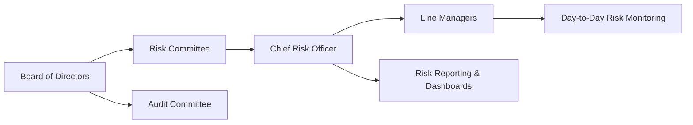

## Introduction
Risk management often sounds like a labyrinth of policies, spreadsheets, and never-ending board meetings. And, honestly, sometimes it is. But at its core, managing risk isn’t about creating administrative hurdles or generating endless paperwork. It’s about ensuring that the people who hold the largest responsibility for an organization—namely, the board of directors—have the right structures, information flow, and oversight to keep everything on track. It can be a bit nerve-racking if you’re new to these concepts, but let’s walk through the essentials together, step by step.

We’ll explore how governance structures are set up to ensure accountability at the highest levels, why specialized committees (like a Risk Committee or Audit Committee) can make or break a company’s risk framework, and how the Chief Risk Officer (CRO) fits into the puzzle. Along the way, we’ll toss in a few real-world examples and personal observations so this doesn’t feel like another rigid manual you have to memorize. Ready?

## The Board of Directors’ Fundamental Role
The board of directors is the tip of the spear when it comes to organizational risk oversight. If you recall from the glossary, the Board of Directors is a group of individuals elected to represent shareholders and—most importantly—safeguard their interests. Part of that safeguarding is about setting the company’s strategic direction and, simultaneously, making sure that the risks taken to achieve strategic objectives are measured, proportionate, and appropriately managed.

• Establishing Risk Objectives: The board is responsible for approving the overall risk governance framework. This includes formalizing the risk appetite statement, which outlines the amount of risk the organization can take without jeopardizing survival or ignoring stakeholder concerns.  
• Approving Risk Tolerance Levels: The board usually signs off on specific tolerance metrics. These tolerances might involve limits on leverage, liquidity, credit exposure, and other risk factors, aligning with the organization’s strategic goals.  
• Monitoring Performance and Strategic Alignment: The board keeps an eye on how well strategy execution aligns with risk constraints. They can’t just set risk tolerances and walk away—they need updates, consistent feedback, and robust risk reporting to confirm that daily operations haven’t gone haywire.

In practice, some boards hold quarterly sessions dedicated to reviewing risk dashboards, incident reports, and compliance updates. Others schedule specialized “risk retreats” once or twice a year to do a deeper dive. In my experience, these “retreats” can sometimes feel like being back in school, but they’re undoubtedly helpful—especially when risk papers are framed in a concise, action-oriented manner.

## Specialized Committees
Even the most diligent board can’t do everything alone. To handle the complexity and breadth of modern risk exposures (whether financial, operational, cybersecurity, or even reputational), many organizations empower specialized committees that report to the board. Two of the most common committees devoted to risk oversight include:

• Risk Committee: This committee focuses on enterprise-wide risk management (ERM). Its members examine risk policies, evaluate emerging threats, and oversee the implementation of risk controls across various business segments. They also interact heavily with the Chief Risk Officer (quite often, the CRO reports directly to this committee).  
• Audit Committee: Although typically associated with financial reporting integrity and internal controls, the Audit Committee often overlaps with risk oversight responsibilities. In many organizations, the Audit Committee ensures that internal audit functions are robust and that financial risks—such as credit risk, liquidity risk, and market risk—are being managed effectively.  

Sometimes, boards might choose to have a single, all-encompassing “Audit and Risk Committee.” That’s a perfectly fine arrangement as well, provided that the membership, expertise, and charters are adequately defined so no core risk oversight function slips through the cracks.

## The Chief Risk Officer
Now, here’s where everything starts to converge. Imagine the CRO as the conductor of a large and diverse orchestra, making sure each section (credit, operations, market risk, etc.) is playing the right notes in sync with the overall strategic tune. The Chief Risk Officer, by definition, is an executive who’s accountable for risk management strategies.

The CRO usually partners with:

• Lines of Business: They ensure front-line managers are aware of relevant risk policies and reporting requirements.  
• Finance Department: They align risk metrics with performance targets and budgeting processes.  
• Legal and Compliance: They coordinate to ensure adherence to regulatory requirements.  

A key point here is empowerment. If the CRO doesn’t have direct access to the board—or if the organization’s culture suppresses “bad news”—then those reflective dashboards of risk exposures might be overly rosy. In a healthy governance structure, the CRO has both the authority and institutional support to spotlight concerns and say, “Hey, you know, folks, we might be getting in over our heads.” 

## Transparent Reporting
Effective governance can only thrive with transparent, timely, and accurate information sharing. The idea is pretty straightforward: you can’t fix what you can’t see. In risk management, “seeing” usually translates to:

• Regular Risk Dashboard Updates: These dashboards distill complex exposures into digestible visuals. They might include top enterprise risks, color-coded rating scales (red, amber, green), trend analyses, and so forth.  
• Incident Reports: If a risk event or “near miss” occurs (e.g., a cybersecurity breach that was stopped at the last minute), the CRO and relevant committees should examine root causes to curb future incidents.  
• Emerging Risk Alerts: Rapid changes in market dynamics, macroeconomic conditions, or technology can present brand-new risks. Let’s say you operate in multiple regions: if a country experiences sudden political unrest, you’d want a well-structured process that alerts the board promptly, enabling proactive measures.  

Sometimes, boards fall into the trap of wanting to see only “bad” news—like major risk incidents. But, in reality, good governance also involves celebrating near misses or areas where risk controls are especially effective. It helps paint a more balanced picture.

## Balancing Risk and Return
Sure, boards are responsible for controlling risk, but they also answer to shareholders who want robust growth and strong returns. Balancing these two imperatives can be tricky. If an organization becomes overly restrictive, it could forgo profitable opportunities and lose market share. If it takes on excessive risk, it might face severe losses or even jeopardize its long-term survival.

This is precisely why strategic planning must integrate risk management. Rather than a board thinking, “We must always minimize risk,” it’s often healthier to say, “We want to take calculated risks that align with our competitive advantage and strategic mission.” It’s kind of like driving a car: you need to accelerate to get somewhere, but you’ve also got to keep your eyes on the brakes and traffic conditions. Over-accelerate, and you risk crashing. Go too slowly, and you won’t reach your destination on time.

## Visualizing Governance Structures
Here’s a simple diagram (in Mermaid.js) to illustrate a typical governance structure. Keep in mind every organization is different—some will have separate committees, while others combine roles. But this will give you a big-picture view of how it all might fit together.

In this flow, the Board of Directors sits at the top, with both the Risk Committee and Audit Committee providing specialized oversight. The CRO coordinates with each business unit and compiles risk data, funneling critical insights upward to the board. It might look like a simple chain of arrows, but an engaged board and empowered committees can add immeasurable value here.

## Real-World Example
Let’s talk about a hypothetical scenario (loosely based on multiple real cases) to see how governance structures can make a big difference. Picture a mid-sized financial institution that’s launching new lending products to expand market share. The board sees big growth potential, but the Risk Committee and CRO wave some cautionary flags, highlighting the potential for higher defaults if loan standards are relaxed too much.

• The board initially sets a moderate risk tolerance: the bank is willing to grow aggressively, but not at the expense of prudent underwriting.  
• The Risk Committee mandates that the CRO provide monthly updates on default rates, payment responsiveness, and potential fraud indicators.  
• A specialized sub-committee forms to track the new lending product metrics.  

Three months later, new data reveals an uptick in early delinquencies among certain customer groups. The CRO reflects this in monthly dashboards. Because the governance structure is robust, the board notices the spike early, instructs frontline managers to tighten underwriting guidelines, and invests in more advanced credit scoring models. The result? The bank still grows but at a more sustainable, well-monitored pace. This scenario isn’t rocket science—it’s simply a demonstration of how open lines of communication and clearly defined responsibilities intersect to produce better outcomes.

In my earlier career, I remember working with a firm that didn’t have a well-defined risk oversight structure. Whenever we tried to flag potential issues, it felt like we were just throwing suggestions into a void. By the time the board caught wind that credit exposures were ballooning, it was, unfortunately, too late to avoid hefty write-offs. Let’s just say I learned the importance of governance the hard way.

## Practical Tips and Pitfalls
• Avoid Over-Complexity: Too many committees can create confusion. Clarity in roles and responsibilities is paramount.  
• Build a Risk Culture: Encourage open discussion of risk events, near misses, and improvement areas across the organization.  
• Provide Adequate Support for the CRO: If the CRO’s voice isn’t heard or if they don’t have direct board access, critical warnings may never surface.  
• Align Incentives: Boards should consider compensation structures that balance short-term growth objectives with long-term stability.  
• Maintain Continuous Board Education: Risks evolve quickly. Boards should stay updated on the latest developments, whether it’s cryptocurrency volatility, environmental and social risks, or new regulatory frameworks.

## Glossary
• **Board of Directors:** Individuals elected to represent shareholders and entrusted with top-level decision-making and risk oversight.  
• **Chief Risk Officer (CRO):** Executive responsible for formulating and implementing risk management strategies; often leads risk-related discussions with the board.  
• **Risk Committee:** Board- or executive-level committee mandated to evaluate the firm’s risk exposures and ensure adequate controls.  

## Final Exam Tips
• Always connect risk governance to broader strategic objectives. On the exam, when you see a question about corporate strategy, ask yourself: “How does the board’s risk oversight role feed into this strategy?”  
• Don’t forget the difference between the Risk Committee and the Audit Committee. They sometimes overlap, but each has a unique scope.  
• Be ready to discuss the role of the CRO and the importance of transparent reporting. Real-life scenarios often hinge on these factors—especially in case study or constructed-response questions.  
• Emphasize the balance of risk and return. Boards are stewards of value creation, so risk management should never purely be about risk avoidance; it’s about alignment with strategic vision.  

## References
- Walker, D. (2009). A Review of Corporate Governance in UK banks and other financial industry entities.  
- The Institute of Directors. (2018). The Role of the Board in Risk Oversight.  
- CFA Institute. (2021). Corporate Governance and ESG: An Introduction.  

## Test Your Knowledge: Governance Structures and Board Oversight



### In a typical governance structure, what role does the board of directors primarily fulfill regarding risk management?
- [ ] They handle frontline risk monitoring and day-to-day issue resolution.  
- [x] They set the risk governance framework, approve risk tolerances, and oversee strategic alignment.  
- [ ] They replace the Chief Risk Officer in case of a cyberattack emergency.  
- [ ] They conduct internal audits weekly without the support of any committee.  

> **Explanation:** The board of directors holds the top-level responsibility for risk governance, policy approval, and strategic oversight rather than day-to-day monitoring or weekly audits.

### Which specialized committee is mostly responsible for monitoring enterprise-wide risk exposures and policy enforcement?
- [ ] The Audit Committee.  
- [ ] The Compensation Committee.  
- [x] The Risk Committee.  
- [ ] The Nomination Committee.  

> **Explanation:** The Risk Committee focuses on all aspects of organizational risk, oversees specific risk policies, and often works closely with the CRO.

### Why is having an empowered Chief Risk Officer (CRO) a critical aspect of robust governance?
- [ ] To handle all day-to-day human resource issues.  
- [ ] To reduce board liability in legal disputes.  
- [x] To ensure objective reporting of risk exposures to the board and implement risk policies.  
- [ ] To replace the CFO in case of a financial shortfall.  

> **Explanation:** The CRO must have enough authority and board access to effectively identify, measure, and report risks without organizational or cultural obstacles.

### Which of the following best describes the function of transparent reporting in risk governance?
- [ ] It’s only focused on identifying legal risks.  
- [ ] It keeps vital risk information within the Risk Committee to maintain confidentiality.  
- [x] It ensures the board gets timely, clear information on potential and emerging risks to make informed decisions.  
- [ ] It’s non-critical and to be used only when market conditions worsen.  

> **Explanation:** Transparent risk reporting is integral to proactive decision-making. Without it, boards cannot perform their oversight role effectively.

### When it comes to balancing risk and return, what is the board’s primary consideration?
- [ ] Taking no risk at all to protect capital at all costs.  
- [x] Aligning risk-taking with strategic objectives to create optimal value for stakeholders.  
- [ ] Encouraging maximum leverage to amplify potential returns.  
- [ ] Letting individual departments decide their own risk levels.  

> **Explanation:** The board needs to ensure an appropriate risk-reward trade-off that supports growth but doesn’t endanger long-term viability.

### What might you see in an effective risk dashboard update presented to the board?
- [x] Key risk indicators, a color-coded risk status, and trending data over time.  
- [ ] Only historical financial statements.  
- [ ] A single paragraph summarizing last year’s incidents.  
- [ ] Strictly forward-looking projections without any historical data.  

> **Explanation:** Effective dashboards typically include KRI metrics, color-coded status levels, and trending information to give boards a holistic view.

### Which scenario provides the strongest evidence of good governance practices?
- [x] The board quickly responds to early warning signals of elevated loan defaults and adjusts strategy.  
- [ ] The board delegates all risk decisions to a junior manager.  
- [ ] The CRO hides minor risk incidents to prevent alarming the board.  
- [ ] The Risk Committee never meets because nothing has gone wrong yet.  

> **Explanation:** A swift, proactive response to evolving risk data exemplifies strong governance and risk oversight.

### What underlying principle should guide the creation of specialized committees, such as a Risk Committee?
- [x] Clear mandates and properly defined areas of responsibility to avoid overlap and confusion.  
- [ ] Creating numerous committees so each minor risk is separately addressed.  
- [ ] Using committees only to fulfill minimum regulatory requirements.  
- [ ] Mandating that each committee function without direct access to the board to preserve independence.  

> **Explanation:** Whether it’s a Risk, Audit, or other committee, clarity in purpose and direct communication lines to the board enhance effective governance.

### If the CRO does not have direct board-level access or is discouraged from sharing “bad news,” what is the likely outcome?
- [ ] The organization will benefit from uninterrupted growth due to minimal risk constraints.  
- [x] Critical risks may go unreported, leading to potential systemic issues.  
- [ ] The Risk Committee will automatically escalate all issues to the board anyway.  
- [ ] It ensures that only the CFO addresses potential risk exposures.  

> **Explanation:** Without transparent communication channels, major risk concerns can remain hidden until they become crises.

### Best describes the board of directors’ responsibility for setting risk tolerance levels:
- [x] They define the boundaries and thresholds aligning with strategic goals, ensuring that daily decisions remain within acceptable ranges.  
- [ ] They typically delegate the setting of risk tolerances to frontline managers.  
- [ ] They only set risk tolerances for regulatory compliance and ignore strategic implications.  
- [ ] They do not get involved in risk tolerances at all.  

> **Explanation:** A fundamental role of the board is authorizing the risk appetite and tolerance framework, providing direction for management to operate within strategic parameters.


