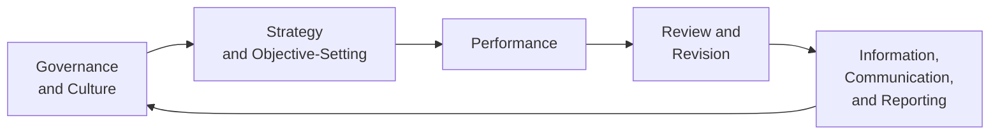
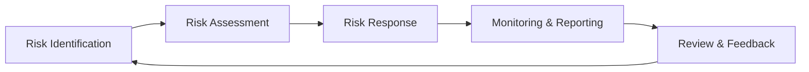

## Introduction

Let’s say you’re chatting with a colleague at a coffee shop. He’s telling you how their company had a big financial hiccup because no one connected the dots between the strategic expansion plans and some sneaky operational risks. Sound familiar? That’s precisely the kind of challenge Enterprise Risk Management (ERM) aims to prevent. ERM takes a broad look at everything that could go wrong (or right), ensures it’s aligned with what the organization wants to achieve, and integrates risk considerations into day-to-day business decisions.

In traditional financial risk management, people tend to focus heavily on market risk, credit risk, or maybe some regulatory compliance issues. But sometimes, that means ignoring the bigger picture—even though company-wide exposure could lurk in other areas such as supply chain vulnerabilities or brand reputation threats. ERM is about systematically identifying and managing all of these possible risks so that the company can stay on track toward its strategic objectives.

In this discussion, we’ll walk through the key principles behind ERM, the popular frameworks (particularly COSO ERM), and why it all matters for portfolio managers and analysts. You’ll also find some real-world anecdotes (like that coffee-shop confession), best practices, and diagrams to illustrate key concepts. By the end, you’ll see how a well-executed ERM process can help an entire organization sleep a little better at night—and maybe jump on good opportunities, too.

## Holistic Risk Management: A Unified View

Holistic risk management means viewing risk as more than just a series of unrelated threats. Imagine a business as a ship on turbulent seas. It’s not enough to check only that the hull is intact (operational risk), or that there’s enough food on board (financial risk). You also need to plot a good route considering storms ahead (strategic risk), ensure crew alignment (cultural risk), and comply with maritime rules (regulatory risk). All these facets—financial, strategic, operational, compliance—make up the enterprise risk universe.

### Why the Holistic Approach Matters
• Align Risk Appetite with Strategy: Teams identify how much uncertainty they can bear before gains become overshadowed by potential losses.  
• Enhanced Response Decisions: By looking at the whole risk landscape, leaders can pick the best risk mitigation strategies without undermining other objectives.  
• Fewer Surprises: Fewer “Wait, we didn’t consider that!” moments are always a plus.  
• Better Allocation of Resources: A holistic approach makes it easier to distribute your limited resources to the biggest vulnerabilities or the best opportunities.

## Key Pillars of ERM

While different firms might label them differently, most ERM frameworks—especially COSO ERM—shuffle around similar concepts:

• Governance and Organizational Culture: Setting the tone at the top, clarifying who has what responsibility in the risk game, and reinforcing ethical values.  
• Strategy and Objective-Setting: Integrating risk appetite into the strategic planning process.  
• Performance: Identifying, assessing, and responding to risks in a balanced way, so they align with goals.  
• Review and Revision: Monitoring results, learning from near-misses and successes, and tweaking processes accordingly.  
• Information, Communication, and Reporting: Making sure relevant info about risk is shared up, down, and across organizational lines in a timely, transparent manner.

## The COSO ERM Framework

When it comes to formalizing the approach, the “Committee of Sponsoring Organizations” (COSO) developed one of the most recognized frameworks. COSO ERM helps organizations structure how they integrate risk considerations into strategic planning and measure whether risk efforts are paying off.

### COSO ERM – A Quick Overview
COSO ERM is built around five interrelated components:
1. Governance and Culture  
2. Strategy and Objective-Setting  
3. Performance  
4. Review and Revision  
5. Information, Communication, and Reporting  

Below is a simple diagram showing how these components interact in a continuous cycle, reinforcing the notion that ERM is an ongoing process, not just a box to check once a year:

Under COSO, leadership sets the risk appetite and aligns it with strategic goals. From there, each department identifies its risks and determines how to respond (accept, mitigate, transfer, exploit, etc.). The process continues with monitoring, revisiting outcomes, refining the approach, and giving feedback so that strategic adjustments can be made alongside changes in the risk environment.

## Strategic Risk Alignment

When I first got into risk management, I practically had “credit risk,” “market risk,” and “operational risk” echoing in my head 24/7. Then I realized that strategic misalignment can overshadow all these if the top leadership’s ambitions are out of sync with risk realities. Setting a risk appetite that’s too high can lead to reckless decisions, while setting it too low may stifle innovation and growth.

### Tying It to Your Portfolio Work
If you’re a portfolio manager, aligning risk appetite with strategy means clarifying how much volatility or downside potential you’re willing to accept to chase certain returns. It’s quite similar at the enterprise level, just with more dimensions—like reputational risk, supply chain issues, or even data breaches. A strong ERM program ensures that the entire firm’s strategic thrust is guided by a well-considered tolerance for uncertainty.  

For instance, if a global manufacturer wants to expand rapidly into new markets, an ERM approach would include assessing the risk of supply disruptions, local regulations, and talent shortages. That analysis might lead them to revise the speed of expansion or to buy specialized insurance.  

## Culture and Communication

Ever heard the phrase “risk culture”? It’s basically how employees at all levels perceive and manage risk on a day-to-day basis. Some organizations have a “don’t rock the boat” culture, where employees hide possible problems for fear of blame. Others might be so full of risk-takers that no one stops to think about the potential downsides.

### Building a Risk-Aware Culture
• Consistent Communication: Leadership needs to emphasize that identifying risks is a shared responsibility—no penalty for raising concerns.  
• Training Programs: Regular workshops ensure people understand key risk concepts and know how to escalate issues.  
• Cross-Functional Collaboration: Risk doesn’t respect departmental boundaries, so neither should your approach.  

I once worked with a small asset management firm that had monthly “risk huddles”—ten-minute stand-ups where anyone could mention a new risk they spotted. These quick huddles worked wonders because folks felt free to flag potential hiccups immediately without waiting for a yearly risk assessment.  

## ERM Implementation Cycle

An ERM program typically follows a cyclical process that we can depict in a simplified high-level view. While every organization may modify it to fit their culture and structure, the general flow is consistent:

### Step-by-Step Highlights
• Risk Identification: Surfacing all known (and sometimes unknown) threats or opportunities.  
• Risk Assessment: Evaluating likelihood and impact.  
• Risk Response: Choosing how to handle each risk—avoid, accept, mitigate, or transfer it.  
• Monitoring & Reporting: Ensuring risk levels remain within tolerance and reporting them to stakeholders.  
• Review & Feedback: Updating the organization’s risk profile and approach for the next cycle.

## Practical Case Study: A Technology Firm’s ERM Journey

Let’s imagine a hypothetical global technology firm, SwiftSolutions Inc., that invests heavily in R&D for cutting-edge devices. They want to protect intellectual property, manage supply chain disruptions, and stay compliant with data-privacy regulations across multiple jurisdictions.

1. Risk Identification: SwiftSolutions identifies key categories—cybersecurity, IP theft, regulatory changes, supply chain breakdowns, brand reputation, market competition, and so forth.  
2. Risk Assessment: They rank how likely these risks are and how detrimental each could be (financially, operationally, or long-term brand damage).  
3. Risk Response: For cybersecurity, they purchase cyber-attack insurance and strengthen encryption. For supply chain disruptions, they negotiate dual sourcing. For regulatory issues, they maintain a local compliance team in each major region.  
4. Monitoring & Reporting: SwiftSolutions sets up a dashboard that tracks monthly metrics, such as number of cybersecurity threats detected, times to restore service if there’s downtime, and updates on new regulations.  
5. Review & Feedback: After about a year, they revisit their overall risk profile. They spot new opportunities to patent emerging technology and also notice an uptick in political instability in certain supply regions, prompting them to tweak their response strategies.

In this example, you can see how multiple departments come together—IT, legal, finance, marketing—and how the right ERM approach can minimize operational surprises while ensuring the firm remains agile in spotting opportunities.

## Connection to Portfolio Management Decisions

For those preparing to become portfolio managers or analysts, it might seem like ERM belongs more to the CFO or Chief Risk Officer than to an investment professional. But there’s heavy integration:

• Investment Strategies: Institutions that have a robust ERM framework often reflect potential macroeconomic risks and liquidity needs in their portfolio allocations.  
• Operational Risk in Trades: Operational breakdowns can result in significant financial losses (e.g., settlement failures, system outages), so portfolio managers should keep an eye on these.  
• Reputational and ESG Factors: More and more, a company’s approach to environmental, social, and governance considerations drives capital flows. ERM helps ensure these broader addresses are included in strategic planning, which can affect valuations and portfolio performance.

ERM fosters a cohesive picture that allows portfolio, compliance, and operations teams to coordinate effectively. In the end, everyone reaps the benefits: fewer nasty surprises and more clarity on how each risk might ripple through the entire organization and, consequently, to stakeholder returns.

## Common Pitfalls to Avoid

• Siloed Approach: Creating a separate “risk management office” that never interacts with other lines of business.  
• Inadequate Data: Without accurate data collection and analysis, risk assessments are bound to be flawed.  
• Ignoring Culture: If the CEO publicly supports ERM but managers punish employees for disclosing issues, the initiative is doomed.  
• Overcomplicating Documentation: Flooding teams with endless risk register forms can lead to “ERM fatigue.” Keep it streamlined and focused on decision-making.  
• Not Scaling for Size: A small firm with 50 employees might not need as many layers as a global conglomerate. Tailor scope accordingly.

## Best Practices for Effective ERM

1. **Tone at the Top**  
   Leadership buy-in is critical. If the board or senior executives view risk management as a strategic asset, everyone else follows.

2. **Integration with Strategy**  
   Make risk a part of strategic discussions from the get-go. Don’t wait until after plans are made to say, “Oh, we should probably do a risk assessment.”

3. **Balance Formality with Flexibility**  
   Sure, you need documented processes, but keep them nimble enough to adapt as the business (and environment) evolves.

4. **Enable Cross-Functional Teams**  
   Form risk committees or working groups that gather insights from across the company. This fosters synergy.

5. **Continuous Improvement**  
   Risk environments shift. So, schedule periodic reviews to refresh your risk register and measure the effectiveness of controls.

## Exam-Relevant Tips

If you’re sitting for a professional exam (like the CFA) and you see a question that includes scenario-based ERM analysis, keep these pointers in mind:

• Think Holistically: Link financial risk concepts (like credit risk or market risk) with operational and strategic angles.  
• Emphasize Culture and Communication: Many exam questions highlight the importance of having a “risk-aware” culture.  
• Show Off Framework Knowledge: References to frameworks like COSO ERM can earn points if you connect them correctly to the scenario.  
• Align with Objectives: You’ll often need to show how risk appetite ties back to the firm’s business strategy or investment goals.

## References and Further Reading

- COSO. (2017). Enterprise Risk Management — Integrating with Strategy and Performance.  
- Kleffner, A., Lee, R., & McGannon, B. (2003). "The Effect of Corporate Governance on the Use of Enterprise Risk Management." Risk Management and Insurance Review.  
- Fraser, J., & Simkins, B. (2010). Enterprise Risk Management: Today’s Leading Research and Best Practices for Tomorrow's Executives. Wiley.

## Glossary

• Enterprise Risk Management (ERM): A coordinated approach to managing an organization’s extensive array of risks and seizing opportunities aligned with corporate strategy.  
• COSO ERM: A widely recognized framework developed by the Committee of Sponsoring Organizations for holistic risk management.  

--------------------------------------------------------------------------------

## Test Your Knowledge: Enterprise Risk Management Concepts



### An ERM framework typically addresses which types of risks together as part of a single, holistic view?

- [ ] Only financial risks, as they directly impact the bottom line
- [x] Financial, strategic, and operational risks
- [ ] Only risks approved by the board of directors
- [ ] Exclusively compliance risks, to avoid legal problems

> **Explanation:** ERM focuses on taking an integrated look at the organization’s numerous risk categories, including financial, strategic, and operational risks, rather than treating them in isolation.

### Which of the following is a core objective of ERM?

- [ ] Minimizing all risks to zero
- [ ] Segmenting risk management activities by department
- [x] Aligning risk appetite with strategic objectives
- [ ] Limiting risk discussion to senior management

> **Explanation:** One of ERM’s primary goals is to connect the company's overall risk appetite with its broader strategic planning and objectives. It's not about eliminating all risk but managing it in line with what the organization can handle.

### What does COSO ERM emphasize in its framework for effective enterprise risk management?

- [x] Integrating risk considerations into strategic planning and performance management
- [ ] Generating maximum documentation for compliance
- [ ] Limiting risk evaluations to annual meetings
- [ ] Focusing solely on tangible asset safeguards

> **Explanation:** The COSO ERM framework calls for embedding risk management into an organization’s strategic objectives and performance metrics, ensuring a continuous process rather than an annual check-the-box exercise.

### Which of the following action items best promotes a “risk-aware culture” within an organization?

- [ ] Restricting risk disclosures to executive committees
- [ ] Penalizing teams that bring up new risks often
- [ ] Waiting until year-end to review and discuss risks
- [x] Conducting regular cross-functional risk workshops

> **Explanation:** A risk-aware culture grows when employees feel comfortable identifying and openly discussing risks. This is often supported by routine cross-functional gatherings or workshops.

### During the ERM process, which step immediately follows risk assessment?

- [ ] Monitoring and reporting
- [x] Risk response
- [ ] Review and feedback
- [ ] Risk identification

> **Explanation:** Once risks are identified and assessed, the next step is deciding how to respond (avoid, accept, share, or reduce). Monitoring and reporting comes later to track the effectiveness of these responses.

### An organization that has a very low tolerance for uncertainty might need to:

- [x] Limit strategic ventures and focus on stable, risk-averse projects
- [ ] Aggressively expand into uncharted international markets
- [ ] Eliminate oversight committees for a leaner process
- [ ] Add maximum leverage to amplify returns

> **Explanation:** If an organization establishes a low risk appetite, it will generally restrict highly uncertain or aggressive strategies and focus on more stable, lower-volatility endeavors.

### What is a common pitfall in implementing an ERM program?

- [ ] Involving too many cross-functional teams in risk discussions
- [ ] Using established frameworks such as COSO ERM
- [ ] Tailoring guidelines to the organization's unique environment
- [x] Overly segmenting risk management into departmental silos

> **Explanation:** Fragmented approaches defeat the purpose of ERM as they ignore interdependencies among different risk categories and hamper holistic decision-making.

### Why is continuous improvement essential in ERM?

- [ ] Once a risk profile is set, it never changes
- [x] Risk environments evolve, necessitating regular updates
- [ ] Board members prefer to hold more meetings
- [ ] Companies can ignore new regulations once initial compliance is reached

> **Explanation:** Risk drivers such as market conditions, regulations, and technologies change constantly. ERM must therefore remain dynamic, revisiting and refreshing risk assessments regularly.

### How do portfolio managers benefit from an organization’s robust ERM framework?

- [ ] It is irrelevant to portfolio managers
- [x] They can align investment decisions with the firm’s broader strategic and operational risk considerations
- [ ] They can ignore broader corporate governance factors
- [ ] They retain absolute autonomy in decision-making without oversight

> **Explanation:** A solid ERM framework reveals how various risks, including strategic and operational considerations, might affect portfolio returns and constraints, enabling more informed, integrated decision-making.

### True or False: ERM completely eliminates the possibility of unexpected losses.

- [ ] False
- [x] True

> **Explanation:** (Trick!) This statement is actually false. ERM does not totally eliminate unexpected losses—it aims to understand, manage, and mitigate them in line with the organization’s risk appetite, but unforeseen incidents can still occur.


