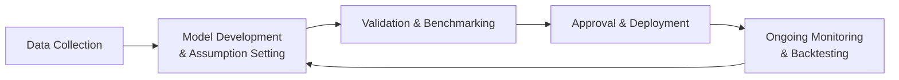

## Understanding Data Quality and Its Relevance

Have you ever dreaded a simple spreadsheet error that completely changes your analysis? It’s kind of like forgetting salt in a dish. It might still be edible, but it’s definitely not the same. In the world of portfolio management—and risk management, in particular—data quality plays a similarly unignorable role. This is crucial because, as we discussed in earlier parts of this volume, accurate and timely data underpins everything from calculating risk exposures to stress testing a portfolio’s resilience against macroeconomic storms. When data is incomplete, inaccurate, or just plain outdated, the entire risk management process can become dangerously off track.

In prior sections, we highlighted tools like Value at Risk (VaR), stress testing, or scenario analysis (see 6.5 Measuring Risk for an introduction). But no matter how sophisticated these tools are, the garbage-in–garbage-out principle rules: if we feed flawed data into the model, the outputs won’t be reliable. That’s why large asset managers invest heavily in robust data validation checks, governance protocols, and quality-control processes. Without solid data, even the best strategies can fail in practice. And for critical processes like credit risk assessment or liquidity forecasting, data errors can lead to real financial losses and, well, some sleepless nights.

## Sources of Data Quality Issues

Sometimes professionals shrug off the phrase “data quality.” But let’s be honest, poor data is a huge threat. Reminds me of a time when I was analyzing bond spreads for emerging market debt, and the historical price series turned out to have a whole chunk of missing data from one of the biggest local banks. It was basically like trying to reconstruct a puzzle that’s missing an entire set of pieces. The final analysis was worthless until we reloaded the entire dataset from a more reputable vendor.

So, how do these issues creep in? Let’s quickly go through some typical sources:

• Missing Data: Some inputs are just not recorded (or not delivered) on time.  
• Inaccuracies: Manual entries, system glitches, or vendor errors can cause inaccurate data.  
• Duplicate Records: Merging multiple sources without de-duplication can inflate positions or skew performance metrics.  
• Out-of-Date: Delays or “lagging” data that fails to reflect real-time changes.  
• Inconsistent Formats: Different business units reporting data in multiple ways—one uses decimal points, another uses commas, or different date conventions.

Each of these missteps can lead to a misestimation of risk profiles, which might be especially damaging when trying to identify the worst-case scenario for portfolio outcomes.

## Automating Data Processes to Reduce Error

One beneficial solution is automation. The irony is that many of us rely on manual processes for far too long because we “know them so well.” But as the size and complexity of portfolios expand, manual data entries create a minefield of potential mistakes.

A number of risk management software platforms allow direct feeds from data vendors, reconciliation modules, and automated checks for anomalies. For example, Python scripts can be set up to sanity-check new data as it’s ingested.

Below is a small snippet demonstrating a Pythonic approach to checking data for anomalies (just a simplified illustration, so don’t take it as an enterprise-grade solution):

```python
import pandas as pd
import numpy as np

data = {'Asset': ['AssetA', 'AssetB', 'AssetC'],
        'Price': [100.0, 105.5, 0.0]}  # 0.0 might be an anomaly

df = pd.DataFrame(data)

df['Flag'] = np.where(df['Price'] <= 0.0, 'Check Data', 'OK')

print(df)
```

It’s super simple, but it highlights an automated workflow: you see suspiciously low or zero prices, you get a “Check Data” flag. Multiply this idea across thousands of data points, along with advanced outlier detection algorithms, and you have a more robust system.

## Analyzing Model Risk

Data quality alone isn’t enough if the models that transform the data into risk estimates are flawed or built on unrealistic assumptions. In which case, we talk about “model risk”: the risk that a model might produce unreliable or incorrect outcomes, leading to suboptimal or even disastrous decisions. Maybe it’s a meltdown in your credit scoring model. Or maybe your option pricing module can’t handle real-world illiquidity. Regardless, model risk is a widespread phenomenon in risk management.

But why do we rely on models in the first place? Because, ironically, we have to. Finance is full of complexity: multi-asset portfolios, global macro risks, changing regulatory requirements, and so on. Models give us a structured way to attempt to forecast, or at least interpret, market movements and potential exposures. However, any model is a simplification of reality—like a map is to territory—and while it can be helpful, it’s never a perfect reflection. 

## Common Drivers of Model Risk

• Incorrect Assumptions: A model that assumes normal distributions even when large tail events are common can understate risk exposures.  
• Outdated Calibrations: Dynamic economies demand updated calibration of parameters. Using old data from a different regime can throw everything off.  
• Complexity/Overfitting: Models that are overly complex might be fantastic at explaining historical data but collapse in fresh market conditions.  
• Human Misapplication: Even a perfectly good model can produce nonsense if used incorrectly.  
• Technology Failures: Infrastructure issues and coding errors can contaminate the entire modeling process.

## Model Validation Practices

With so much at stake, robust model validation is a must. This typically involves:

• Benchmarking: Compare the model’s outputs to those from alternative models or reference tables. If your in-house credit risk model says a bond’s default probability is 20% but market-based credit spreads imply 2%, you might want to investigate quickly.  
• Backtesting: Assess how the model performed historically. For instance, does your VaR model consistently underestimate tail risk? If so, you might have a problem with distribution assumptions or parameter estimations.  
• Independent Review: The idea is to avoid letting the “chef” also be the “food critic.” Many risk management frameworks require a separate validation team.  
• Periodic Revision: Models shouldn’t be “set and forget.” Market conditions, as well as business strategies, evolve. Regular revision ensures the model remains fit for purpose.  

Some organizations illustrate these model validation steps via a risk management flow diagram, such as:



Notice how it loops back—because risk modeling is iterative.

## Tying Data Governance with Model Risk Mitigation

If you’re going to address model risk, you can’t ignore data governance. Data governance is the set of policies and procedures that ensure data remains consistent, accurate, and properly managed over its life cycle. It might include:

• Data Ownership: Designate a clear “owner” for each data feed or dataset.  
• Data Lineage Tracking: Know exactly how data flows from source to final use—like tracing the path of each ingredient in a restaurant’s kitchen.  
• Access Controls: Restrict who can modify or delete data.  
• Audit Trails: Keep records of changes.  
• Standard Operating Procedures: So that different teams follow the same data-handling protocols.

Some large financial institutions even have entire committees dedicated to data governance, meeting regularly to discuss anomalies, updates, and new data requirements. Although it might sound bureaucratic, the benefits are significant: it lowers the chance of catastrophic errors in risk calculations, helps different teams interpret information in the same way, and fosters a culture of accountability.

## Overcoming Pitfalls and Practical Strategies

Data quality and model risk are big topics, but sometimes you just want straightforward tips. Here are a few:

• Start with Clear Objectives: What exactly does the model aim to accomplish? By first clarifying the purpose, you can better identify the data needed and the appropriate modeling technique.  
• Documentation: Document everything—assumptions, data dictionaries, transformations, limitations of the model. This helps future analysts and external reviewers.  
• Diversity of Perspectives: Involve different teams—like quants, fundamental analysts, compliance specialists, and even client-facing folks—to review models and data. Each perspective can spot issues that others miss.  
• Testing Under Stress: In line with 6.16 Stress Testing in Extreme Market Conditions, push your models to extremes to see if they break. Real crises often reveal hidden vulnerabilities.  
• Continual Improvement Culture: Encourage teams to question data and model assumptions. And yes, it’s okay to have healthy debates about proper scenario design or parameter selection.  

Believe me, it’s so much better to find a model’s vulnerability in a scheduled stress test, rather than in the middle of a market meltdown when your positions plummet uncomfortably.

## Case Study: Equity Factor Model Gone Wrong

Let’s illustrate with a simplified example. An equity manager develops a factor model that picks underpriced growth stocks using historical data from the last five years. The model outperforms for a few quarters, and the portfolio sees strong inflows. But after a regime shift—maybe the central bank changes interest rate policy drastically—the factor that performed well in low-rate environments tanks. Returns suffer. Investors panic. The newly minted star manager is suddenly in hot water.

Digging deeper, it turns out that the underlying data used to identify growth metrics was incomplete for mid-cap and small-cap firms. The model had systematically favored large, well-known companies that had stable earnings. But in the new environment where smaller, agile firms emerged strong, the data wasn’t robust enough to capture the shift. On top of that, the factor weighting approach didn’t incorporate sector rotation risk or updated macro indicators. Something that might seem trivial—like incomplete data—rippled into major losses after the environment changed.

## Regulatory Considerations

Regulators worldwide show growing interest in both data quality and model risk. The Basel Committee on Banking Supervision, for instance, has guidelines that stress strong governance and model validation (BIS, 2018). Likewise, many regulatory bodies ask for comprehensive documentation showing how financial institutions manage data, calibrate risk models, and monitor those models over time. Meeting these requirements is more than a compliance exercise; it helps reduce the likelihood of unanticipated losses, or even a meltdown scenario that could threaten market stability.

And from the ethical side, the CFA Institute Code and Standards remind us of our duty to deliver professional services with competence and diligence. Using poor data or ignoring a model’s flaws can compromise that duty, potentially harming clients’ outcomes and trust. A thorough approach to data governance and model validation aligns with fulfilling fiduciary responsibilities.

## Final Exam Tips and Strategies

• Throughout your exam preparation, focus on how data quality influences every facet of risk measurement—particularly in example-based questions involving VaR or scenario analysis.  
• Familiarize yourself with the best practices for model validation, as questions often ask you to identify the “most appropriate next step” in the model risk management cycle.  
• Expect scenario-based items, such as a portfolio manager dealing with incomplete data feeds, or an analyst discovering a miscalibrated model for credit risk. You should be comfortable explaining the repercussions and prescribing best practices.  
• Pay attention to risk management frameworks that incorporate data governance—and be ready to articulate how ignoring data fundamentals can lead to material risk exposures.

At the end of the day, data is your foundation. If it’s on shaky ground, everything else is in danger. Couple that with robust model oversight and you’ll be equipped to handle the uncertainties that come your way—both in the exam and in real investment practice.

## References and Further Reading

• BIS. (2018). Supervisory Guidance on Model Risk Management. Bank for International Settlements.  
• Barricelli, B. R., Casiraghi, E., et al. (2019). "Human Data Interaction in Data-Intensive AI Systems." IEEE Access.  
• CFA Institute. (2022). Data Science for Investment Professionals.  

---

## Test Your Knowledge: Data Quality and Model Risk in Action



### What is one major cause of model risk in a portfolio's risk management?

- [x] Incorrect or outdated assumptions built into the model
- [ ] Abundant and high-quality reference data
- [ ] Broad diversification across many asset classes
- [ ] Strict regulatory oversight

> **Explanation:** Model risk commonly arises when the model is based on flawed assumptions or has not been updated to reflect current market conditions.

### Which best describes a primary danger of poor data quality?

- [ ] It speeds up backtesting processes.
- [x] It can produce unreliable risk estimates, leading to flawed decisions.
- [ ] It leads to higher returns in bull markets.
- [ ] It improves stress-testing accuracy.

> **Explanation:** Incomplete or inaccurate data often skews the outputs of risk and valuation models, ultimately impairing effective decision-making.

### Why is independent review an important step in model validation?

- [ ] It ensures that the same team who developed the model finds the errors.
- [ ] It only happens when the model fails.
- [x] It provides an objective assessment, reducing conflicts of interest.
- [ ] It replaces the need for backtesting.

> **Explanation:** Independent review prevents bias from the model developers, helping ensure a more objective validation process.

### Which of the following is NOT typically a data governance component?

- [ ] Data lineage tracking
- [ ] Standard operating procedures
- [ ] Defined data ownership
- [x] Eliminating all regulatory requirements

> **Explanation:** Data governance focuses on owning, tracking, and standardizing data processes. Eliminating external regulatory requirements is neither feasible nor is it part of a governance framework.

### How can automation aid data quality?

- [x] By reducing manual entry errors and providing automated checks
- [ ] By removing the need for data lineage logs
- [ ] By eliminating the need for scenario analysis
- [ ] By reducing the frequency of data updates

> **Explanation:** Automation allows you to programmatically check inputs, reconcile different data sources, and lower the risk of human mistakes.

### In the context of model risk, what is overfitting?

- [ ] Leveraging broad historical data to ensure stable predictions
- [x] Designing a model so detailed that it conforms too closely to historical patterns and may fail in new conditions
- [ ] Eliminating all noise from the data
- [ ] Applying the same model across different market regimes

> **Explanation:** Overfitted models capture random noise in historical data but lack robustness when used with new data.

### Which scenario best exemplifies “human misapplication” of a model?

- [ ] A robust model incorrectly calibrated due to outdated data
- [x] A correct model used for a purpose it was never designed to address
- [ ] A model with thorough documentation and training for all analysts
- [ ] A model lacking in complexity

> **Explanation:** “Human misapplication” arises when a perfectly valid model is deployed in the wrong context or unscrupulously used for something beyond its intended scope.

### What is the best reason to conduct backtesting?

- [ ] To find ways to ignore model risk
- [ ] To reduce the cost of data
- [ ] To eliminate the need for ongoing monitoring
- [x] To evaluate how the model would have performed against historical data

> **Explanation:** Backtesting helps teams see if the model’s performance matches real historical outcomes, identifying mismatches between predicted and actual.

### What is the role of a model validation team?

- [ ] To adopt any proposed assumption changes without question
- [ ] To avoid the use of any third-party data sources
- [ ] To ensure daily P&L targets are met
- [x] To rigorously test and challenge the model’s structure, assumptions, and outputs

> **Explanation:** A dedicated roadmap for validation reduces the likelihood of errors going unnoticed and helps ensure that models serve their intended objectives accurately.

### True or False: A well-designed data governance policy ensures that inconsistent data and flawed models are never introduced into the workflow.

- [ ] True
- [x] False

> **Explanation:** Even a strong data governance policy cannot guarantee perfection. It significantly reduces the risks but cannot eliminate them altogether.


