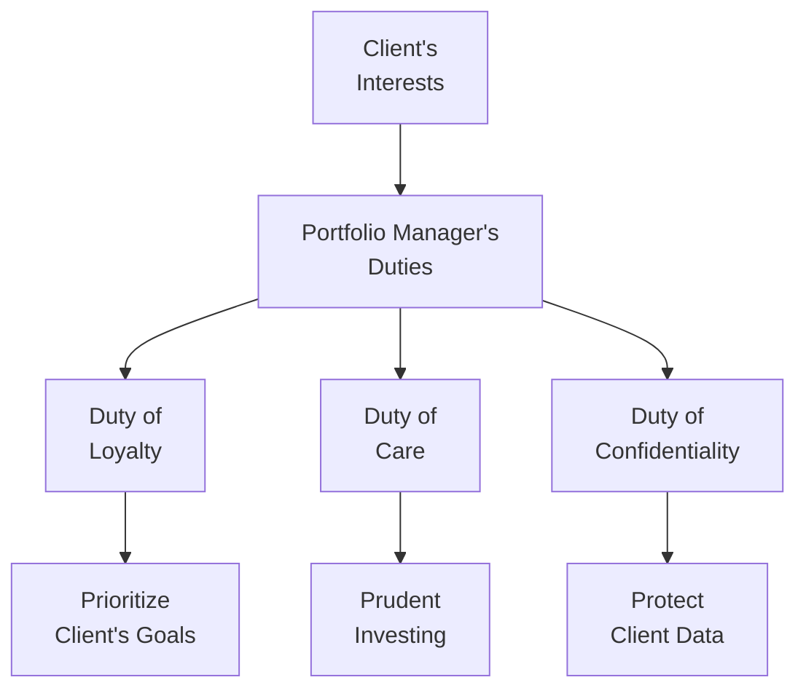

## Introduction

Fiduciary duty sits at the heart of every portfolio manager’s professional practice. When you agree to manage someone else’s money, you take on a responsibility that goes far beyond simply buying and selling securities. In fact, it’s a solemn, legal, and ethical pledge to always put the client's interests first—even ahead of your own or your firm’s.

I remember one of my earliest portfolio review meetings. A client called me out of the blue, slightly worried about market volatility. He was new to investing, so I tried to explain that my job wasn’t just about picking stocks; it was about protecting his financial future, making decisions that fit his goals, and ensuring everything was done with care. Honestly, I was a bit nervous. But looking back, that conversation underscored how vital it is for a portfolio manager to understand exactly what it means to be a fiduciary.

Below, we’ll delve into the substantive components of fiduciary relationships and how they guide your daily decision-making. We’ll talk about the legal frameworks, the importance of thorough documentation, conflict-of-interest disclosure, suitable investment strategies, and confidentiality. We will also offer best practices for balancing the sometimes-competing interests of clients and firms, all while meeting the highest ethical standards set by the CFA Institute and other regulatory bodies.

## Understanding the Fiduciary Duty

Fiduciary duty is essentially a legal and ethical principle that requires portfolio managers to act in the best interests of their clients. If you’ve heard the phrase “duty of loyalty” or the “prudent investor rule,” well, that’s what we’re talking about.

- Loyalty: Care more about the client’s objectives than your own.  
- Prudent Investor Rule: Requires you to invest as a prudent individual would, applying sound judgment and skill.

### Core Elements of Fiduciary Duty

• Duty of Loyalty:  
  This means your decisions must be free from personal bias or outside influence. If there’s any chance that a recommendation might benefit you or your firm more than the client, you’re required to either avoid that conflict or disclose it clearly.

• Duty of Care:  
  This suggests that all decisions should be made with the diligence of a reasonable person in similar circumstances. You should stay informed about market conditions, thoroughly research investment options, and document your decision-making process in a way that’s consistent with a prudent approach.

• Duty of Confidentiality:  
  Client information is private—keep it that way. This is not just about refraining from gossip. It means establishing internal processes to protect data, ensure anonymity where needed, and prevent unauthorized disclosure of trading strategies or personal details.

These principles aren’t just theoretical. They inform how you design a portfolio, how you evaluate new investment opportunities, and how you engage with clients, colleagues, and other stakeholders.

## Key Principles and Legal Framework

Fiduciary responsibilities emerge in multiple legal contexts, such as trust law and agency law. In many jurisdictions, these laws have been codified in statutes (like the Uniform Prudent Investor Act in the United States) or developed through court cases. Here are the main legal frameworks you should be aware of:

• Trust Law:  
  A portfolio manager who is handling assets in a trust must obey the trust document’s stipulations while also following general fiduciary principles to keep the beneficiary’s interests paramount.

• Agency Law:  
  In an agency relationship, the principal (the client) engages the agent (the manager) to act on their behalf. The agent is legally required to exercise due skill, care, and, of course, loyalty.

• CFA Institute Code of Ethics and Standards of Professional Conduct:  
  Standard III(A): Loyalty, Prudence, and Care equally underscores the spirit of fiduciary duty. As a CFA charterholder or candidate, you must practice with independence and objectivity while ensuring the client’s best interests come first.

You’ll also find the “Prudent Man Rule” or “Prudent Investor Rule” in these legal frameworks. This rule basically says you have to invest in the way a sensible, well-informed person would, given the objectives, constraints, and unique needs of the portfolio. If the client’s situation changes, your investment choices should change accordingly. 

## Documentation and Transparency

### Why Documentation Matters

Documentation is not just a chore; it’s evidence that you followed a rigorous process. You want a clear record of why you took or recommended specific actions. Think of it like an insurance policy for your decision-making process.

• Aligning with the Client’s Investment Policy Statement (IPS):  
  You want your actions to be consistent with the client’s stated objectives, constraints, time horizon, liquidity needs, and risk tolerance.  
• Communicating the Rationale:  
  Written documentation can clarify to the client and any other stakeholder why certain positions were added, removed, or held, especially during market gyrations.  
• Regulatory Compliance:  
  It shows regulators you performed due diligence in line with industry standards.

### What to Include

1. Investment Rationale: Summaries of research or analysis that led you to a particular stance on a security or asset class.  
2. Risk Assessment: Stress testing, scenario analyses, or any other quantitative or qualitative measures that highlight potential drawdowns or volatility.  
3. Suitability Checks: Confirm the client’s objectives, risk tolerance, liquidity demands, and how the selected instruments fit those parameters.

## Diligence, Conflicts, and Suitability

### Thorough Research

You know how you sometimes watch late-night TV ads promising fast profits from random penny stocks? Let’s just say, a prudent fiduciary stays as far away from speculation like that as possible—unless, of course, there’s a extremely compelling, well-researched reason to venture there. The point is, thorough research is the backbone of any recommendation.

• Market Analysis: Keep up-to-date with macroeconomic indicators (see Chapter 1.6), micro-level company data, and industry trends so you can be prepared to defend your choices.  
• Analytical Rigor: Many portfolio managers combine quantitative models with fundamental analysis to gain a holistic view of each prospective investment.

### Managing Conflicts of Interest

Conflicts of interest are sometimes unavoidable. Maybe your firm has an underwriting relationship with a company whose shares you want to buy. Disclosing this white elephant is crucial. Conflicts can also show up in personal trading, cross-department services, or performance-based compensation structures.

• Disclosure: Provide complete and timely information to your clients regarding any actual or potential conflicts.  
• Avoidance Where Possible: If the conflict makes it impossible to stay objective, recuse yourself or avoid that transaction.  
• Internal Policies: Many firms have personal trading “blackout periods” or pre-clearance systems to mitigate these issues.

### Suitability

Before you jump into equities, bonds, or more complex products, make sure each investment suits your client’s goals and constraints (see Chapter 4 on portfolio planning). Suitability is about applying professional judgment to align the client’s risk-return profile with the recommended instruments.

## Regular Portfolio Reviews

Even the best-laid plans can go astray if you don’t adapt to changing circumstances. That’s why regular portfolio reviews are a cornerstone of good fiduciary practice:

• Market Fluctuations: Asset allocations may drift as prices change, and that might skew the portfolio away from the targeted risk profile.  
• Client Circumstances: A new job, marriage, a windfall, or retirement can drastically alter the client’s risk tolerance or liquidity needs.  
• IPS Alignment Checks: Ensure the portfolio remains consistent with the guidelines laid out in the Investment Policy Statement.

Reviews typically involve performance measurements (using appropriate benchmarks), verifying risk exposures, and ensuring candidates remain suitable. If something’s out of line, rebalance or revise accordingly.

## Compensation Structures

Performance fees can complicate your fiduciary role if not structured prudently. Imagine you have a performance-based fee that incentivizes you to take more risk than the client is comfortable with—yikes! The key here is to align compensation in such a way that the manager’s success aligns with the client’s success, without encouraging excessive risk-taking.

• High-Water Marks: Help ensure managers only earn performance fees when the fund exceeds previous benchmarks, discouraging reckless gambles.  
• Hurdle Rates: A threshold below which no performance fee is earned, encouraging a base level of return for the client.  
• Transparent Disclosure: Make it crystal clear in the engagement letter or contract how fees are calculated.

## The Importance of Confidentiality

It’s impossible to overstate how critical it is to protect client information. Think about all the data you have—portfolio statements, trading strategies, personal financial info. A single leak can break trust, attract legal trouble, and tarnish your reputation.

• Data Protection Policies: Implement secure servers, encryption, robust passwords, multifactor authentication, and restricted access.  
• Non-Disclosure Agreements (NDAs): For third-party providers, ensure there’s a legally binding commitment to keep data confidential.  
• Regulatory Standards: Regulations like the EU’s GDPR or other global privacy frameworks can also apply, so stay compliant.

## Putting It All Together: Step-by-Step Approach

Let’s outline a straightforward approach to fulfilling fiduciary duties in daily practice:

1. Know Your Client (KYC): Understand goals, constraints, risk tolerance, and timeline.  
2. Develop or Update the IPS: Reflect those specifics in the official guidelines.  
3. Conduct Thorough Research: Analyze macro and micro factors; employ due diligence for each investment opportunity.  
4. Document Every Rationale: For each transaction, keep a concise yet complete record of why.  
5. Check for Conflicts: Disclose them or avoid them altogether.  
6. Verify Suitability: Make sure each investment fits the IPS and the client’s evolving needs.  
7. Communicate Regularly: Provide performance reports and hold review meetings.  
8. Adjust and Rebalance: Respond to market movements or life changes in alignment with the IPS.  
9. Maintain Confidentiality: Secure systems, strong NDAs, and compliance with data protection laws.  
10. Review and Improve: Internal audits and external reviews can keep you in line with the best standards.

## Best Practices and Pitfalls

### Best Practices

• Set Clear Expectations: Discuss performance goals, risks, and fees early on so there are no unpleasant surprises.  
• Peer Review: Have other team members or an investment committee sign off on key decisions or allocations, especially in complex markets.  
• Ongoing Education: Markets evolve, and so do regulations. Make time for professional development—CFA continuing education modules or other advanced courses can be beneficial.

### Common Pitfalls

• Overlooking Liquidity Needs: A mismatch between liquidity and the client’s near-term cash requirements can strain relationships and results.  
• Excessive Trading: High turnover might generate undesired transaction costs without adding real value.  
• “Siloed” Decision-Making: Failing to coordinate among departmental teams can lead to misaligned strategies or undisclosed conflicts.

## A Quick Personal Experience

I’ll never forget one client—call her “Maria”—who was determined to invest heavily in a niche real estate sector. She had read about skyrocketing returns and believed it was the path to early retirement. My role was to gently remind her of the liquidity constraints, the potential for a market downtown, and how property cycles can vary significantly. Through candid disclosure and thorough analysis (which I fully documented), we arrived at a compromise: a measured allocation to real estate funds that fit her risk tolerance. She was happy about the approach, and later, when that real estate boom bucked like a wild horse, the portfolio was still resilient thanks to its diversification. That experience underscored how documenting and aligning with the client’s best interests can make all the difference.

## Final Exam Tips

• Cite the Appropriate Standards: Be sure you know the relevant CFA Institute’s Standards of Professional Conduct by heart, especially those regarding duties to clients.  
• Walk Through the IPS Link: On exam questions, a snippet might mention a change in the client’s personal situation. Always re-check how that might alter the portfolio.  
• Conflicts of Interest: Watch for hidden traps in hypothetical scenarios. If in doubt, disclose or avoid.  
• Suitability Before Performance: The exam often tests whether you remember that an investment has to align with the client’s goals above all.  
• Document, Document, Document: If a question deals with questionable trades or underperformance, show how you would have documented the decision process.  

## References & Further Reading

• CFA Institute’s Standards of Practice Handbook:  
  https://www.cfainstitute.org/ethics-standards  
• “Prudent Investor Rule” by the Uniform Law Commission:  
  https://www.uniformlaws.org/  
• “Investment Management for Fiduciaries” by James Saxon  
• CFA Program Curriculum, Level III readings on ethical and professional standards  

---

## Test Your Knowledge: Fiduciary Responsibilities and Best Practices



### In the context of fiduciary duties, which of the following best describes the "prudent investor rule"?

- [ ] It allows high-risk strategies due to unlimited upside potential.
- [x] It requires fiduciaries to invest with the same care and judgment a prudent person would use.
- [ ] It only applies when the portfolio manager personally invests in the same fund.
- [ ] It requires investing solely in government bonds to limit risk.

> **Explanation:** The prudent investor rule requires you to invest with care, skill, and diligence that a prudent person would exercise, not simply relying on personal or reckless approaches.

---

### A portfolio manager discovers a conflict of interest related to personal holdings in a company recommended to clients. The MOST appropriate step is to:

- [x] Disclose the conflict to clients and follow firm procedures to manage or avoid the conflict.
- [ ] Ignore it if it involves less than 1% of total holdings.
- [ ] Immediately sell all personal shares.
- [ ] Withhold the information to avoid upsetting the client.

> **Explanation:** Whenever a conflict arises, it should be disclosed fully and managed according to firm policies and industry standards, ensuring transparency.

---

### What is the primary objective of maintaining thorough documentation in a fiduciary relationship?

- [ ] Fulfilling only the regulatory requirement of storing emails.
- [x] Demonstrating a consistent, prudent decision-making process aligned with the client’s IPS.
- [ ] Avoiding personal liability at all costs.
- [ ] Meeting marketing guidelines for fund performance.

> **Explanation:** Good documentation shows that decisions are made carefully, in line with the client’s stated objectives. It’s not just about compliance—it’s about best practices and demonstrating prudence.

---

### A client has a short time horizon and requires significant liquidity for upcoming expenses. Which practice best aligns with fiduciary duty?

- [x] Allocating a meaningful portion of the portfolio to liquid, low-volatility assets.
- [ ] Concentrating in long-duration bonds to capitalize on potential yields.
- [ ] Using leveraged equities to maximize returns before the expense date.
- [ ] Investing in only alternative assets to minimize correlation with stock markets.

> **Explanation:** Fiduciary duty demands aligning investments with the client’s timeline and liquidity needs, which in this case would favor more liquid, lower-risk assets.

---

### Which of the following statements about compensation structures is TRUE for a fiduciary?

- [x] Aligning compensation with client interests helps prevent excessive risk-taking.
- [ ] Defined benefit pensions require no disclosure of compensation.
- [x] Hurdle rates and high-water marks can align fees with performance goals.
- [ ] Fixed fee structures always eliminate conflicts of interest.

> **Explanation:** Compensation should motivate the manager to act in the client’s best interest. Hurdle rates and high-water marks are tools to ensure fair performance fees. However, fixed fees do not necessarily guarantee full alignment in all situations.

---

### Duty of loyalty, care, and confidentiality applies to which of the following scenarios?

- [x] All interactions with clients, including asset allocation, selection, and portfolio reviews.
- [ ] Only in cases where the digital communication is recorded.
- [ ] Only when the portfolio manager is personally investing alongside the client.
- [ ] Primarily to disclaimers in official legal documents.

> **Explanation:** Fiduciary duties apply to all aspects of client relations, from large strategic moves to minor administrative tasks.

---

### A best practice for a fiduciary portfolio manager who suspects non-public information might be involved in a recommended investment is to:

- [x] Refrain from trading based on that information and notify compliance or legal counsel.
- [ ] Immediately short-sell the stock to protect the client from possible losses.
- [x] Conduct normal trades and keep silent.
- [ ] Share the information only with top-tier clients.

> **Explanation:** Trading on material non-public information violates both fiduciary duty and market regulations. The correct approach is to defer action and escalate the concern to compliance.

---

### During a routine portfolio review, a manager notices that equity allocations have risen beyond the target range due to market appreciation. What is the ideal fiduciary response?

- [x] Rebalance the portfolio to maintain alignment with the Investment Policy Statement.
- [ ] Ignore the drift since it organically grew.
- [ ] Immediately liquidate all equity positions.
- [ ] Increase bond holdings only if the client complains.

> **Explanation:** Rebalancing ensures the portfolio adheres to the specified risk profile and policy guidelines, preserving the spirit of the fiduciary agreement.

---

### Which of the following strategies best respects the need for confidentiality?

- [x] Restricting access to client data to authorized personnel and using secure servers.
- [ ] Sharing personal details with corporate sponsors for a marketing advantage.
- [ ] Discussing client positions in social media investor forums.
- [ ] Sending all trade confirmations to a public email address for the entire department.

> **Explanation:** Limiting data access and employing secure methods are fundamental to maintaining client confidentiality.

---

### The term “suitability” in a fiduciary context implies that recommended investments and strategies:

- [x] Match the client’s risk tolerance, return objectives, and constraints.
- [ ] Are limited to exchange-traded funds (ETFs) only.
- [ ] Must outperform a preset benchmark at all times.
- [ ] Never require rebalancing once set up.

> **Explanation:** Suitability focuses on alignment with the client’s profile, not on outperforming a benchmark or selecting only certain types of securities.


