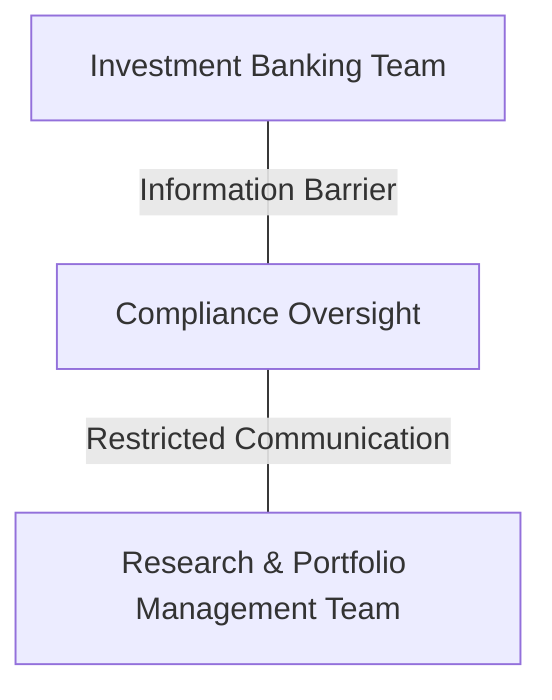
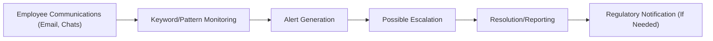

## Introduction

Let’s be honest: insider trading is one of those topics that people sometimes chat about in hushed tones—maybe you’ve heard a rumor from a friend or read about a big lawsuit in the news. And sure, it sounds a bit cloak-and-dagger. But the reality is that it’s a serious criminal offense with hefty penalties, possible jail time, and far-reaching career consequences. In a portfolio management setting, it’s especially important to understand how insider trading guidelines and surveillance systems work, because you’ll deal with increasingly sophisticated strategies, client relationships, and data flows every day.

This section tackles real-life examples, explains the concept of material non-public information (MNPI), and explores how managers install “information barriers” to keep sensitive knowledge from leaking (even by accident). We’ll talk about how to engage staff in scenario-based training, set up robust escalation procedures, and collaborate with regulators. By the end, you should have a comprehensive understanding of how to protect yourself, your firm, and your clients from the pitfalls of insider trading.

## Understanding Insider Trading

Insider trading, at its simplest, is trading securities (like stocks, bonds, or even derivatives) on the basis of material, non-public information (MNPI). You might remember reading about high-profile cases involving big names—some ended up paying multi-million-dollar fines or even serving prison time. But wrongdoing doesn’t just happen at wall-to-wall hedge funds; it can occur in small firms or among unsuspecting individuals who were “tipped” by someone in the know.

• Material: The content of the information is so significant that it could influence an investor’s decision to buy, sell, or hold a security.  
• Non-Public: The information is not readily available to the investing public.  

Individuals can be considered “insiders” by virtue of their position within a company (e.g., executives, board members) or by receiving a tip from someone who is an insider. Sometimes, third parties like attorneys, consultants, or bankers can hold insider status if they gain special knowledge while working with a firm.

### Historical Example
Remember the Raj Rajaratnam case back in the day? Traders were accused of receiving inside tips about upcoming earnings or mergers. The trades made were highly profitable, and it didn’t take long for regulators to notice that something wasn’t adding up. Surveillance flagged unusual trading volumes and patterns, and eventually, an entire web of insider contacts was exposed. That example taught the industry a massive lesson: no one is too big to be caught.

## Why Portfolio Managers Must Care

As we explained in earlier sections (for instance, 7.1 on The Portfolio Manager’s Role and Fiduciary Duties), you have a fiduciary responsibility to act in your clients’ best interests. If you trade on MNPI, you’re essentially cheating the market by giving your clients an unfair advantage (or harming other clients who don’t have access to that information). Not only does this violate basic ethical standards, it also erodes trust in capital markets—a big no-no in the finance world.

Moreover, insider trading is not just about you as a manager making trades on your personal account; it’s your entire organization that’s at risk. If your junior analyst gains inside information from a cousin who works at a biotech firm and uses that data to make trades in the firm’s client accounts, your organization can still be liable. Maintaining policies, training, and surveillance is the only way to ensure you don’t wind up with expensive legal trouble.

## Defining Material Non-Public Information (MNPI)

To illustrate what MNPI might look like, let’s say you discover that Company XYZ is about to announce an acquisition that will cause their stock price to spike. If this knowledge isn’t publicly disclosed, it’s likely material, non-public information. You’re legally prohibited from executing trades on that stock (or related securities) until the news is publicly released—and even then, regulations often require compliance with “quiet periods” or corporate blackouts to avoid any appearance of impropriety.  

You might also be prohibited from recommending that security to your clients—even a quick suggestion like “Hey, you might consider investing in XYZ soon” can be viewed as insider trading if it’s based on MNPI.  

### Grey Areas

Sometimes, you’ll come across information that doesn't seem obviously insider-like, but could be considered material nonetheless. For instance:  
• Rumors from a chat forum about a CEO’s sudden departure.  
• A phone leak that a startup is in “talks” with a major tech giant.  
• A pitch deck emailed (by mistake!) to the wrong address.  

In these situations, the best practice is to immediately consult with your compliance officer. If there’s a question about whether the information is material and non-public, it’s always better to err on the side of caution.

## Information Barriers (A.K.A. Chinese Walls)

Firms often install formal “information barriers” to prevent the spread of sensitive data between teams that might have access to MNPI (like corporate advisory or investment banking) and other units that make investment decisions (like portfolio management or research). Picture a literal wall separating groups—though in practice, it’s accomplished via restricted access to shared drives, separate physical office spaces, or specific limitations on who can attend internal meetings.

Below is a simple diagram illustrating how an investment banking team is segregated from a research and portfolio management team. Notice that there’s a compliance/oversight function that effectively “oversees” communications between them.

Such structures are critical. Why? Because banking teams might be working on mergers, acquisitions, or underwriting deals—classic sources of MNPI. Meanwhile, your portfolio management team is actively making trades. If the two groups are allowed to chat freely, even in a friendly, inadvertent manner, that could lead to illegal insider trades.

## Surveillance Technology and Periodic Audits

Surveillance technology has grown leaps and bounds in recent years. I remember during an internship at a large asset manager, we were told not to worry about “being watched.” But guess what—most everything we wrote in emails or group chats was flagged by algorithms searching for specific keywords: “acquisition,” “merger,” “secret,” “leak,” “rumor,” or certain code words. After all, regulators and compliance teams are well aware that folks use euphemisms to discuss sensitive data.

### Communication Monitoring
Here’s the gist of how modern surveillance systems work:  
• They capture electronic communications (emails, chat messages, voice logs).  
• Key terms or unusual phrasing triggers an internal alert.  
• Compliance or legal teams review flagged messages.  

Some firms use machine learning to identify suspicious patterns in trading or emails. For instance, if an individual’s personal trades or their recommended trades for a client have consistently outperformed the market ahead of major corporate announcements, an algorithm might highlight that pattern for further examination.

### Trading Activity Audits
Many companies run periodic audits of employee trading accounts. These audits look for suspicious timing—like employees who bought or sold shares right before big earnings surprises. The presence of repeated, unexplained profitable trades is a straightforward red flag for compliance to investigate.

## Developing Insider Trading Policies

### Code of Ethics
At the heart of everything is a robust code of ethics that employees must sign and understand. The code should at minimum incorporate:  
• A clear prohibition on trading based on MNPI.  
• Requirements to disclose personal trading accounts.  
• Procedures for pre-approval of certain trades by compliance.  
• Rules on tip-offs: employees must never disclose MNPI to colleagues or friends outside the firm.  

The code of ethics should also reference the broader principles found in the CFA Institute’s Standards of Professional Conduct—namely Duties to Clients and the Market, which emphasize fairness, integrity, and diligent oversight.

### Specific Guidelines and Training
You’ll usually see annual training sessions, quizzes, or scenario-based exercises that keep insider trading policies top-of-mind for staff. Everyone, from the new intern to the senior portfolio manager, needs to appreciate the seriousness of misusing MNPI. By the way, scenario-based training can be surprisingly engaging. You might see role-plays that depict real historical cases (like Galleon) or hypothetical deals (e.g., a biotech startup surging on advanced FDA approvals).

The main point: training is not a one-and-done ordeal. Many firms conduct ongoing refreshers, especially after rule updates or large enforcement actions in the industry.

## Escalation Procedures for Potential Violations

What happens if you suddenly realize you, a colleague, or an acquaintance might have inadvertently come across insider information? Or even worse: you suspect someone is actively using it? The correct response: escalate immediately. Most codes of ethics and compliance manuals contain clear instructions about who to contact and how to document the incident. Typically, you:

• Notify your immediate supervisor or compliance officer.  
• Refrain from trading until cleared by compliance.  
• Refrain from tipping or discussing the matter with non-authorized personnel.  
• Document everything thoroughly to create a timeline or record of events.  

### Firm-Wide Response
If compliance officers suspect an insider trading breach, they might freeze certain accounts, notify upper management, and determine whether external regulators (like the SEC in the U.S.) need to be informed. Working hand-in-hand with regulators right away demonstrates good faith and a willingness to cooperate, which often mitigates reputational damage and potential legal penalties.

## Collaborating with Regulators

In many jurisdictions, regulatory agencies have broad powers to investigate suspicious trades, demand access to communication records, and even conduct on-site inspections. For instance, in the U.S., the Securities and Exchange Commission (SEC) actively investigates insider trading based on market surveillance alerts or tips. If a firm’s compliance team uncovers potential wrongdoing, best practice is to coordinate with the regulator to ensure a swift and fair investigation.

Just keep in mind that regulators aren’t your enemy if you’re legitimately trying to comply with the law. In fact, they appreciate proactive steps. Firms that bury potential violations or fail to provide documentation can face harsher penalties and deeper scrutiny.

## Scenario-Based Training: Bringing It to Life

Let’s do a mini-scenario:

Imagine you’re working as an associate in portfolio management. A friend who works at a pharmaceutical giant casually mentions over dinner that their new drug just passed an important safety trial—three months ahead of schedule. That’s exciting. But is it public? She specifically says, “This is hush-hush. Please don’t share.” If you decide to buy that company’s shares first thing Monday morning, you might be engaging in insider trading. And if your friend tells you about an upcoming press release next week to confirm those results, that’s pretty much a sign you’re dealing with non-public info.

In training scenarios like this, you learn to do the following:
1. Immediately notify compliance.
2. Document what was said, by whom, and when.
3. Refrain from disclosing the info to other colleagues or clients.
4. Wait for official confirmation from the company’s public channels or a widely disseminated source.

## Practical Example of Surveillance Implementation

Below is a mermaid diagram showing an example workflow of how an internal compliance surveillance system might parse communications and highlight suspicious behavior:

1. All employee communications go through a system that flags certain words or patterns (B).  
2. If suspicious content is identified (C), compliance does a deeper review (D).  
3. If the findings suggest serious issues, the case is escalated for an internal investigation (E).  
4. Findings can lead to disciplinary action or reporting to regulatory bodies (F).

## Best Practices and Common Pitfalls

• Best Practice 1 – **Always Document**: Keep thorough records of all trading rationales. This helps demonstrate that trades were done on legitimate public information rather than unknown, secret tips.  
• Best Practice 2 – **Frequent Training**: Boring as it sounds, insider trading rules must be at employees’ fingertips. Annual scenario-based training ensures staff remain aware.  
• Best Practice 3 – **Information Barriers**: Adequate separation of sensitive teams is crucial. Don’t rely on polite requests like “Hey guys, don’t share that.” Physical separation—different floors, badge access, or even separate communication tools—helps.  
• Common Pitfall 1 – **Overconfidence**: Some managers think that if they can’t see a direct link to insider data, it’s not insider trading. That’s not how regulators see it. If you’re trading suspiciously close to material announcements, they’ll dig deeper.  
• Common Pitfall 2 – **Complacency in Smaller Firms**: Even if you’re in a niche shop with fewer employees, you’re not immune. Sometimes smaller startups face even heavier scrutiny when unusual patterns come up.  

## Exam Tips

1. Be clear on definitions. Distinguish between “material” and “non-public” in precise terms.  
2. Know the structure and purpose of information barriers. You might see scenario-based questions requiring analysis of whether an information barrier was sufficient.  
3. Familiarize yourself with the basics of surveillance technology. The CFA exam might not require you to detail coding or data analytics, but you should understand what compliance is looking for.  
4. Understand escalation procedures. If a question states that you’ve discovered potential insider info, you must recall the required actions.  
5. Practice short-answer scenarios. The exam could present a case in which a colleague casually mentions obtaining secret data. This is your moment to outline correct ethical steps.  

## References and Further Reading

• U.S. SEC, “Insider Trading” Enforcement Actions:  
  https://www.sec.gov/spotlight/insidertrading.shtml  

• CFA Institute research on ethics and insider trading  

• High-Profile Insider Trading Cases (e.g., Raj Rajaratnam, Martha Stewart)  

• Section 7.1 – The Portfolio Manager’s Role and Fiduciary Duties, CFA® 2025 Level I, Volume 9  

• CFA Institute Code of Ethics and Standards of Professional Conduct  

-----

## Test Your Knowledge: Insider Trading Guidelines and Surveillance



### Which of the following best describes material, non-public information (MNPI)?

- [ ] Information that is only valuable for short-term traders.  
- [x] Information that can influence investment decisions and is not publicly available.  
- [ ] Information solely available in corporate press releases.  
- [ ] Information that can be found in public SEC filings.  

> **Explanation:** MNPI is significant enough to affect investment decisions and is not yet generally available to market participants.

### Which action should a portfolio manager take immediately upon receiving possible insider information?

- [ ] Conduct a personal trade before others can react.  
- [x] Inform the compliance officer and halt any related trades.  
- [ ] Tell a colleague to confirm if it’s real.  
- [ ] Post it on social media for transparency.  

> **Explanation:** The correct step is to notify the compliance department right away and refrain from trading to avoid violating insider trading laws.

### Which of these is a primary function of an “information barrier” (Chinese Wall)?

- [x] Separating departments with access to MNPI from those who trade on behalf of clients.  
- [ ] Ensuring employees have open access to all organizational data.  
- [ ] Enhancing marketing by sharing insider information externally.  
- [ ] Consolidating sensitive data into a single operational team.  

> **Explanation:** Information barriers are frameworks that prevent the misuse of MNPI by segregating teams that might possess sensitive details.

### What is the likely outcome if an employee is found guilty of insider trading?

- [ ] A temporary suspension from office duties.  
- [x] Severe financial penalties, possible imprisonment, and lasting reputational damage.  
- [ ] Requirement to retake the CFA Level I exam.  
- [ ] A polite warning from regulators without major consequences.  

> **Explanation:** Insider trading violations can carry strict penalties, including large fines, jail time, and irreversible professional repercussions.

### Which of the following steps best describes an escalation procedure in suspect insider trading cases?

- [x] Halting trades, notifying compliance, and documenting the incident thoroughly.  
- [ ] Encouraging employees to trade quickly before the information is made public.  
- [x] Reporting suspicious activity directly to a personal attorney first.  
- [ ] Ignoring the suspicion until inactivity raises no red flags.  

> **Explanation:** The correct approach is to notify compliance, freeze or restrict activity, record the event, and let compliance coordinate next steps. (Note: “Reporting suspicious activity directly to a personal attorney” might not be standard corporate policy. Always follow firm-specific rules, which typically involve notifying compliance.)

### A vigilant surveillance system in a portfolio management firm will typically:

- [ ] Only monitor trades after they have settled.  
- [x] Track communication channels (email, chat) for suspicious keywords or patterns.  
- [ ] Use employees’ personal social media as a primary data source.  
- [ ] Focus solely on private wealth clients rather than portfolio managers.  

> **Explanation:** Surveillance systems flag suspicious communications (keywords, patterns) in chats, emails, and voice calls, allowing compliance to investigate before illegal activity escalates.

### True or False: Small firms do not need formal insider trading policies because they have fewer employees to monitor.

- [ ] True  
- [x] False  

> **Explanation:** Regardless of size, every firm must have insider trading policies. Smaller firms can still face the same legal and regulatory consequences if employees misuse MNPI.

### What is one of the biggest pitfalls for an employee dealing with MNPI?

- [x] Overconfidence that they can hide or disguise their trades.  
- [ ] Fear of being promoted due to ethical behavior.  
- [ ] Respecting information barriers too strictly.  
- [ ] Accepting that regulators have limited surveillance capacity.  

> **Explanation:** Employees sometimes believe they can outsmart compliance or regulators, which can lead to improper trades and legal trouble. Regulators have extensive surveillance tactics, so hiding is rarely successful.

### Which of the following is the best example of scenario-based training for insider-trading prevention?

- [x] Employees act out a simulated situation where they overhear a merger rumor and must respond according to company policy.  
- [ ] A half-page memo reminding employees to never speak confidentially in the elevator.  
- [ ] A monthly email listing punishments for insider trading.  
- [ ] Sharing a social media post that references insider trading news.  

> **Explanation:** Scenario-based training involves realistic simulations or role-plays, enabling employees to practice appropriate responses to potential ethical dilemmas.

### True or False: Collaborating early with regulators when a firm detects suspicious activity can reduce potential legal repercussions.

- [x] True  
- [ ] False  

> **Explanation:** Proactive steps like self-reporting and cooperating with regulators often mitigate penalties and demonstrate the firm’s commitment to compliance.


