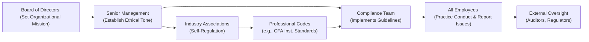

## A Culture of Professional Conduct
Let’s be honest: building a strong culture of professional conduct can feel like teaching good manners to a huge extended family—there’s always that one relative who forgets the rules. In an investment context, though, the stakes are way higher than mixing up forks on the dinner table. Indeed, demonstrating honesty, integrity, and accountability is not just about looking good in front of colleagues; it’s crucial for safeguarding the firm’s reputation, meeting clients’ expectations, and, frankly, staying in business.

Professional conduct boils down to each individual’s responsibility to uphold the highest ethical standards. One reason it’s so vital is that portfolio managers, analysts, and even back-office folks handle valuable assets and sensitive information every single day. By consistently acting with integrity—meaning by being truthful about performance, transparent about fees, and accountable for mistakes—finance professionals build trust-based relationships. And in our industry, trust can be pretty fragile.

Yet there’s an interesting human challenge: it can be easier to memorize the rules than to truly live by them when faced with real-world pressures—like a steep performance target or a client pushing for outside-the-policy trades. That’s why a well-defined professional conduct framework, consistent training, and a supportive environment are so essential. You see, a mere policy manual won’t cut it if the pressure is on and employees aren’t confident they’ll be supported for doing the right thing.

## Tone from the Top
When my mentor first taught me about the “Tone from the Top,” I wondered if it had something to do with musical pitch. But absolutely not—though it does have harmony and melody in a more figurative sense. Tone from the Top refers to how senior leadership exerts a huge influence on the ethical environment. If the C-suite prioritizes short-term gains above everything, you can bet that trickles down into daily decision-making. Conversely, if leadership openly champions compliance, invests in ethics training, and recognizes employees who speak up about potential issues, employees will feel more secure doing the right thing.

In practical terms, it means that the board of directors and top executives need to:

• Publicly promote the importance of ethics and compliance in every big announcement or strategic plan.  
• Provide resources—funds, training, staff—for compliance and whistleblower programs.  
• Lead by example. If senior management is found “massaging numbers,” folks lower down the ladder might get the impression they can do the same.  

Sometimes, new employees will read all about ethical conduct in the employee handbook. Then, in the break room, they overhear the boss bragging about “creative” ways to bend the rules. That’s how cynicism forms. So, if you’re the boss—make sure you’re setting a good example. Period.  

## Why Industry Self-Regulation Matters
We all know about government regulation. The word “SEC” or “FCA” alone is enough to make compliance officers sweat. But let’s talk about self-regulation in the asset management industry. Self-regulation means that industry associations or professional bodies come together to define best practices, codes of conduct, and sometimes disciplinary procedures. Sure, we already have government oversight, but self-regulation can swiftly adapt to market changes and can lead to even higher standards of behavior than laws require.

Professional organizations like the CFA Institute, local asset management councils, or other associations offer guidance that goes beyond just “Don’t break the law.” This might include:

• Requiring continuing education, so professionals stay updated on best practices and new ethical dilemmas brought on by changing technologies.  
• Providing advanced certifications (like the CFA or CIPM), which come with ethical vows—like the CFA Institute Code and Standards.  
• Conducting peer reviews or audits, which help spotlight weaknesses early and encourage a culture of improvement.  

If you think about how seatbelts evolved before they became legally required in every car, there was an “industry standard” set by some auto manufacturers who wanted to highlight safety as a differentiator. Likewise, self-regulation in finance can reduce compliance friction, smooth out potential conflicts, and keep participants in line long before government regulators get involved.  

## Building an Ethics-Focused Firm
Sure, all these ideas sound nice in broad strokes, but how do you actually foster ethical resonance within a large firm? For starters, it should never be only about ticking boxes on a compliance checklist. Effective ethics programs weave into every corner of the firm’s operations—hiring, onboarding, daily workflows, compensation, performance reviews, and so on.

Here are some practical ideas:

• Mandatory (but engaging) Ethics and Compliance Training: Offer scenario-based workshops that describe real cases of misconduct, and have employees brainstorm solutions. No one wants to watch a dull slideshow about rules.  
• Open-Door Policies: Senior managers and compliance officers should be approachable—this fosters an environment where employees can seek guidance or report issues without fear.  
• Whistleblower Protocols: Provide safe, confidential channels for reporting potential misconduct (hotlines, third-party reporting options). Make sure employees know they won’t face retaliation for speaking up.  
• Transparent Disclosures: Whether it’s performance results, fee structures, or conflict-of-interest disclosures, honesty is non-negotiable.  

In practical terms, you might see this in a firm’s code of conduct that employees sign, disclaimers on marketing materials about potential conflicts, or detailed footnotes in performance presentations that clarify how returns were calculated. Showing you have nothing to hide can do wonders for client trust.

## Whistleblower Protection
I once heard a colleague say, “You don’t have to worry about whistleblowers if you’re not doing anything wrong.” That’s missing the point. Even the best-intentioned firms can occasionally slip up, and employees might be unsure if certain behaviors are off-limits. Whistleblower protocols encourage employees to sound an alarm early—preventing bigger disasters later on.

Key aspects:

• Anonymous Reporting: If employees can only report issues by disclosing their identity, they may be too scared to come forward.  
• No Retaliation: Retaliation, which includes demotion, firing, or social ostracism, should be strictly banned.  
• Investigative Follow-Up: Reports shouldn’t vanish into a black hole. Have a plan for investigating them thoroughly and fixing legitimate problems.  

When employees see that management actually takes complaints seriously, it builds morale and trust internally. This isn’t just theoretical: in big fraud cases from history, whistleblowers often tried to alert authorities or management well before the meltdown, but either got ignored or suppressed. So robust whistleblower protection and follow-up processes help a firm catch small issues before they turn monstrous.

## Continuous Education and Certification Renewals
The financial industry changes faster than the weather, you know? Yesterday’s cutting-edge practice can become stale tomorrow. That’s why continuous learning opportunities are critical. Programs like the CFA Institute’s requirement for ongoing professional development, CIPM’s continuing education modules, or specialized advanced courses for certain asset classes keep your knowledge fresh.

Imagine a portfolio manager who got the CFA charter 20 years ago and then never bothered to learn anything new about, say, blockchain-based assets. They’d feel adrift if their big client asked about incorporating tokenized real estate or digital assets. Likewise, new ethical challenges emerge all the time—think about the complexities of using client data in advanced AI-driven models. That’s a brand-new bag of potential conflicts or privacy issues. Staying educated means staying prepared.

Plus, there’s a real intangible benefit to showing your clients or prospective employers that you maintain your professional credentials. It says, “I’m taking this seriously and investing in skills and ethics.” And from a self-regulation standpoint, these organizations rely on continuing education as a mechanism to keep overall industry standards high.

## External Oversight and Peer Reviews
Yes, we have compliance teams, but you can’t just mark your own homework. That’s where external oversight—like external audits—comes in. An independent review can tell if your code of ethics is truly implemented or if it’s just collecting virtual dust. Peer reviews are also powerful. There are industry groups in which companies can open themselves up to scrutiny from peers: for instance, firms might get together quarterly to critique each other’s processes in a structured, supportive environment.

These reviews typically cover:

• Compliance with professional codes and regulatory requirements.  
• Internal supervision and management oversight.  
• Performance reporting methodology.  
• Risk management processes (like whether the firm is monitoring conflicts of interest properly).  

Even though hosting a peer review can feel nerve-racking—like inviting neighbors over to critique your housekeeping—it’s normally a positive learning experience. Many times, hearing from a neutral third party that you could improve your disclosure approach for performance fees is less threatening than hearing it from a regulator. And when the peer review finds you’ve done something well, that’s a nice morale boost for your entire team.

## Transparency and Open Communication
Have you ever experienced that odd dynamic where employees only talk about negative news behind closed doors, but when the CEO asks for input in a big meeting, everyone just mumbles, “All good?” That environment can hide serious issues that might blow up later. So, an essential ingredient for professional conduct is encouraging healthy communication across the firm. Junior employees should feel comfortable speaking up if a proposed trade or marketing statement sets off alarm bells.

Moreover, firms should practice transparency externally, too. In portfolio management, this can mean clearly laying out how you generate your monthly performance figures or disclaimers about the nature of composite performance. By going the extra mile to keep your stakeholders—clients, potential clients, regulators, or even the public—well-informed, you reduce misunderstandings that could escalate into reputational nightmares.

## Practical Challenges and Pitfalls
Of course, real life is messy. Let’s be honest: there have been times when well-meaning professionals are encouraged to “just do what the client wants,” or “do anything to meet the quota,” or “work around the policy.” Let’s highlight some pitfalls:

• Compensation Structures: If bonuses hinge too strongly on short-term performance with minimal weighting on compliance or client satisfaction, employees might cut ethical corners to secure that extra reward.  
• Resource Constraints: Sometimes, compliance teams are underfunded or understaffed, leading to inadequate oversight or missed training opportunities.  
• Cultural Resistance: If the organization historically values “commission at all costs,” ethical behavior can be overshadowed by the drive for immediate revenue.  
• Lack of Enforcement: You’ll lose credibility fast if you have well-written guidelines but never enforce them.  

This is where the “tone from the top” and consistent messaging become essential. When employees see that leadership is serious about ethical lapses—meaning misbehavior is addressed fairly and swiftly—they’re less likely to rationalize their own shortcuts.

## A Quick Walkthrough Diagram
To see how different actors in the system communicate and reinforce professional conduct, let’s visualize it:

Notice how the tone from the top feeds into everything: compliance teams, employees, and even interactions with external bodies. Self-regulatory frameworks provided by industry associations shape guidelines, which compliance teams adapt into corporate policies.

## Real-World Vignette
A few years back, I was at a mid-sized asset management firm that was grappling with a conflict-of-interest scenario. The CIO had a personal relationship with a corporate executive whose company was a prime target for a big bond allocation. Even though that bond was borderline in terms of risk, the CIO was eager to go all-in. One of the junior analysts, feeling uneasy, voiced concerns to the compliance department. In an organization lacking strong professional conduct guidelines, that analyst might’ve kept quiet. Instead, because our firm had cultivated a speak-up culture—reinforced by management openly praising those who spotted potential pitfalls—the compliance officer was alerted, the trade was re-evaluated more cautiously, and we saved ourselves from making a conflict-laden investment.

That story might sound small, but it’s precisely the sort of day-to-day situation where the intangible value of a strong ethical environment becomes concrete. If employees feel safe and guided by a robust ethical framework, they’re more likely to do the right thing.

## Exam Relevance and Applications
From a CFA Level III or advanced exam standpoint, professional conduct and self-regulation often appear in scenario-based questions. You may be asked to identify violations in a hypothetical scenario, or to propose measures to improve a firm’s compliance culture. Keep these tips in mind:

• Understand the CFA Institute Code and Standards, especially regarding duties to clients and employers, and the responsibilities of supervisors.  
• Be prepared to pinpoint or correct conflicts of interest.  
• Demonstrate knowledge of whistleblower protections and self-regulatory mechanisms, such as peer reviews or professional associations.  

When facing constructed-response questions, clarity and depth matter: you might have to detail how a particular misconduct event could be prevented or how “Tone from the Top” specifically influences the scenario. That’s your chance to show you grasp the practical dynamics, not just the definitions.

## Final Thoughts on Nurturing Ethical Excellence
Think of professional conduct as the backbone of everything else you do in portfolio management. Without it, even the most sophisticated investment models or asset allocation theories lose credibility. A strong ethical culture—an environment that wholeheartedly supports employees in doing what’s right—even if it’s not easy or profitable in the short run—ultimately forms the bedrock of lasting success.

Whether you’re a veteran CFA charterholder or a brand-new entrant into finance, never underestimate the power of a well-conceived ethical program combined with robust self-regulation. This is what well-run firms do to stand out in a crowd, build trust with stakeholders, and foster a sense of shared purpose among teams. And if you think about it, that’s kinda cool—knowing that the industry at large pushes for higher standards, better transparency, and safer markets for everyone.  

## Final Exam Tips
• Cross-reference the CFA Institute Code and Standards. The real exam loves scenario questions testing your knowledge.  
• Familiarize yourself with key governance structures: board, committees, compliance, etc.  
• Practice real-world scenarios on whistleblowing, conflict-of-interest disclosures, and peer reviews.  
• Keep time management in mind for ethics questions—precision is crucial, and you don’t want to sacrifice other sections.  
• Remember that self-regulation often requires referencing documents like the GIPS (Global Investment Performance Standards) or other professional guidelines.

## References
- CFA Institute Code and Standards:  
  https://www.cfainstitute.org/ethics-standards  
- IOSCO Objectives and Principles of Securities Regulation  
- “Ethics and the Investment Industry” by CFA Institute Research Foundation  

---

## Test Your Knowledge: Professional Conduct and Self-Regulation



### Which of the following best describes why "tone from the top" is crucial in establishing a firm’s overall ethical culture?

- [x] Senior leadership’s behaviors and attitudes set the precedent that others follow.
- [ ] It prevents external regulators from auditing the firm.
- [ ] It guarantees that employees will never deviate from written policies.
- [ ] It eliminates the need for a formal compliance department.

> **Explanation:** When senior management consistently emphasizes ethics, employees throughout the organization are more likely to adhere to high standards.  

### Which of these actions most clearly aligns with best practices in industry self-regulation?

- [x] Joining professional organizations that provide codes of conduct and promote continuing education.
- [ ] Running all investment decisions through automated trading algorithms.
- [ ] Letting each investment manager create their own personal set of conduct rules.
- [ ] Blocking auditors from reviewing compliance policies.

> **Explanation:** Industry associations (such as the CFA Institute) can establish rigorous, adaptable standards, helping firms maintain ethical and professional conduct.  

### In implementing whistleblower protocols, which of the following should be a priority?

- [ ] Providing employees with a bonus for reporting even minor complaints.
- [x] Ensuring no retaliation is taken against employees who report ethically questionable behavior.
- [ ] Publicizing the names of whistleblowers to encourage accountability.
- [ ] Requesting employees first consult top management before making a formal report.

> **Explanation:** Whistleblower programs only work if employees feel safe reporting concerns. They should not fear retaliation or exposure.  

### A client pressures a portfolio manager to place trades outside the guidelines stated in the Investment Policy Statement (IPS) for higher returns. How should the manager respond?

- [ ] Follow the client’s request to maintain good client relations.
- [ ] Suggest ignoring compliance for a short term only and then returning to normal.
- [x] Refuse the request and document the incident, ensuring compliance is observed.
- [ ] Place only half the trades, hoping the client won’t notice.

> **Explanation:** Ethical practice requires compliance with the IPS. The manager must adhere to established guidelines and cannot deviate even under client pressure.  

### Which scenario would most clearly violate transparency best practices?

- [x] Hiding important performance disclosures in the footnotes, printed in very small font.
- [ ] Providing footnotes clarifying composite calculation methods.
- [ ] Making available the breakdown of fees and commissions to clients.
- [ ] Publishing an annual performance analysis with disclaimers in plain language.

> **Explanation:** Transparency requires clear, accessible disclosure. Obscuring vital information is counter to ethical best practices.  

### What is the primary benefit of peer reviews in self-regulation?

- [ ] They reduce auditing costs for the firm.
- [x] They help identify weak spots in processes and encourage continuous improvement.
- [ ] They allow employees to evade responsibility by blaming peers.
- [ ] They force regulators to lessen their scrutiny of the firm.

> **Explanation:** Peer reviews offer valuable feedback from unbiased industry professionals, revealing areas for improvement and reinforcing self-regulatory standards.  

### How does continuing education support professional conduct?

- [ ] It shifts responsibility for ethical breaches to outside vendors.
- [x] It keeps professionals informed on latest standards, practices, and emerging ethical risks.
- [ ] It replaces the firm’s code of ethics entirely.
- [ ] It focuses solely on technical knowledge, ignoring ethical guidelines.

> **Explanation:** Ongoing learning ensures that individuals remain up to date on evolving market practices and ethical frameworks, promoting consistent ethical conduct.  

### A robust whistleblower framework includes which key feature?

- [ ] Publicizing every report on the company’s website.
- [x] Guaranteeing anonymity and serious follow-up investigations.
- [ ] Offering financial incentives only for confirmed fraud cases.
- [ ] Punishing employees who skip the official chain of command.

> **Explanation:** Effective whistleblower protocols ensure safety, confidentiality, and follow-up. This encourages reporting and prevents retaliation.  

### Which of these factors can most undermine ethical behavior despite formal codes of conduct?

- [x] Excessive emphasis on short-term gains in employee compensation.
- [ ] Offering employees training on compliance and ethics.
- [ ] Providing open-door policies for ethical concerns.
- [ ] Issuing disclaimers in marketing materials.

> **Explanation:** A purely profit-driven or short-term bonus scheme can tempt employees to ignore codes of conduct.  

### An employee who reports misconduct internally and experiences no retaliation indicates the firm:

- [x] Practices a healthy speak-up culture.
- [ ] Deters employees from using external whistleblower lines.
- [ ] Lacks a formal compliance system.
- [ ] Has no need to investigate the report.

> **Explanation:** Protecting employees who speak up is a hallmark of a positive ethical culture, encouraging openness and proactive issue resolution.  


