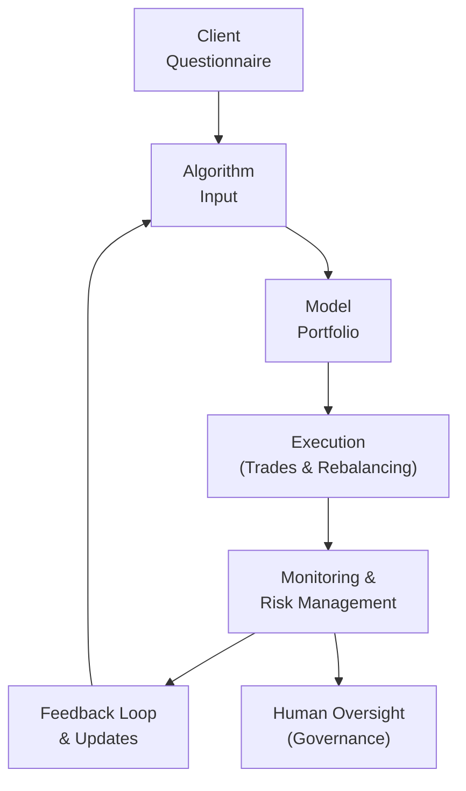

## Introduction and Context

Robo-advisors have definitely changed the investment landscape—almost overnight, it seems. Many of us recall the days when you would dial up a financial advisor (maybe even on a landline, if we go way back), set up an appointment, haul all your statements, and hope to get personalized guidance that may or may not cost you a fortune. Nowadays, you can just whip out your phone, answer a short risk tolerance questionnaire, and—voilà!—you get a portfolio in seconds. But is it really that simple, and does this type of automated service work for everyone?

In this section, we’ll explore the evolving role of robo-advisory platforms, diving into how they function, when they are most beneficial, and why human oversight remains crucial. We’ll also spotlight data security considerations, “one-size-fits-all” pitfalls, as well as ways to integrate robo-advice with high-touch human advice. Finally, we’ll circle back to best practices and a few tips relevant for the CFA® exam, especially if you’re grappling with scenario-based questions related to fintech trends in portfolio management.

## Key Features of Robo-Advisors

### Automation in Portfolio Construction

At their core, robo-advisors use algorithmic models to build portfolios that align with a client’s stated l goals (like retirement or saving for a down payment) and risk preferences. They rely heavily on the client’s responses to an intake questionnaire, which often includes questions about:
• Investment horizon  
• Willingness to take on market volatility  
• Specific income needs  
• Personal circumstances (e.g., age, major life events)

Once the questionnaire is submitted, the robo-advisor’s system recommends a “model portfolio” typically composed of diversified exchange-traded funds (ETFs). These portfolios might range from conservative (heavy in bonds, stable instruments) to more aggressive allocations (mostly equities, possibly niche exposures). Because robo-advisors are built to scale, they can instantly create thousands of such portfolios for a wide client base.

### Automatic Rebalancing and Tax Optimization

One of the major selling points of robo-advisors is the ability to automatically rebalance an investor’s portfolio to maintain a target asset allocation. If markets rally and your equity allocation overshoots its intended weight, for instance, the system will bring it back into line—often without any additional fees. There’s also algorithmic tax optimization, sometimes referred to as “tax-loss harvesting.” The idea here is that if one of your holdings drops below cost basis, the platform automatically sells to realize a taxable loss, which offsets other realized gains. Then, it’ll typically replace that holding with a similar but not “substantially identical” asset to maintain your overall market exposure while locking in the tax benefit.

I have a friend who once excitedly told me he received an email from his robo-advisor saying they’d just harvested $1,000 in tax losses for him—something he’d never have known or even considered doing manually. This kind of automated approach can genuinely help smaller investors capture opportunities historically reserved for high-net-worth or institutional clients.

## Suitability for Different Client Segments

### Lower-Cost, Tech-Driven Advice

One of the most important benefits is cost. Robo-advisors often charge fees that would have been unimaginable in the traditional wealth management space—like 0.25%-0.40% of assets under management, sometimes lower. That’s compelling, particularly for:
• Younger investors with smaller balances.  
• Tech-savvy clients who want convenience and minimal friction.  
• Individuals comfortable with online tools and less in need of hand-holding.  

These clients appreciate the ability to open accounts in minutes, track performance on an app, and take advantage of automated rebalancing and tax-loss harvesting. For them, that quick “one-size-fits-most” approach might be more than sufficient.

### Need for Human-Led Discussions

However, let’s be real: some folks have complicated estate-planning issues or own concentrated equity positions in their employer’s stock. Others might be heading into retirement with unique concerns related to medical expenses, philanthropic goals, or even trust and estate strategies. In such cases, the empathy gap of an algorithm quickly becomes apparent. A series of risk-tolerance questions cannot always capture the nuance of complicated family dynamics, major life transitions, or emotional responses to market turmoil.

For these situations, human advisors (whether fully traditional or in a hybrid model) can add value far beyond portfolio rebalancing. They can provide comprehensive financial planning, facilitate estate lawyer or tax accountant connections, and help calm nerves when markets get bumpy.

## Oversight and Governance in Robo-Advisory

### Algorithm Design and Model Portfolios

The governance behind a robo-advisor is critical to its success and integrity. Because robo-advice is typically delivered through automated systems, any errors in the algorithmic models can cascade quickly across thousands (or even millions) of portfolios. Oversight by qualified professionals—like CFA® charterholders—is essential to validate the assumptions, test for potential biases in asset allocations, and ensure continuous alignment with market data.

Below is a conceptual diagram (using Mermaid.js) that shows a simplified oversight process:

From the diagram, you can see how the client’s initial inputs flow into the algorithm, produce a portfolio, and trigger execution. Then there is ongoing monitoring at each step, with a feedback loop not only to refine the algorithm but also to incorporate human oversight. This helps ensure that model portfolios remain aligned with evolving market conditions.

### Avoiding the “One-Size-Fits-All” Risk

Robo-advisors get a bad rap for pushing standardized portfolios that do not always consider, say, a client who already has a massive equity position in her employer’s stock or who may have special liquidity needs. A well-designed questionnaire can mitigate these challenges by probing deeper into a user’s total financial picture. That said, no matter how good the questionnaire, it can’t always foresee every nuance—especially intangible stuff, like the client’s emotional stress tolerance.

Therefore, many robo-advisors either create advanced models that dynamically adapt to more sophisticated investor profiles or offer a hybrid model (with phone or chat-based human consultation) to address nuanced questions. Without some tailoring, the risk is that clients may end up with allocations that are misaligned to their real world, ultimately undermining the value proposition of “online portfolio management.”

## Communicating the Limitations of Robo-Advisory

### Empathy Gaps and Model Errors

Clients should be aware that a robo-advisor lacks the ability to sense emotional distress. It might not react if the client is anxious about market volatility. Also, any software can have bugs, mispricing data, or incorrect correlation estimates. Good governance includes a robust testing environment and fallback procedures for urgent fixes.

Advisors and platform providers should communicate these limitations clearly: “Our automated solution doesn’t weigh subjective factors like your personal bias toward certain industries or your passionate desire to support local businesses—it’s purely algorithmic.” Being transparent goes a long way toward building trust.

## Data Security Protocols

### The Cybersecurity Imperative

Let’s face it: robo-advisors hold a goldmine of personal financial data. Names, addresses, account balances, Social Security numbers, maybe even answers to security questions. That’s enough to keep any chief technology officer up at night. Platforms must adopt rigorous data protection policies (encryption, secure servers, regular penetration testing) and comply with applicable laws such as the EU’s General Data Protection Regulation (GDPR) or other local equivalents.

### Governance and Board Oversight

Many of these fintech platforms have a board or an advisory committee that includes technology experts, legal counsel, and risk management professionals. They regularly review data protection measures, escalate concerns, and handle incident response planning to deal with potential breaches. Chapter 6 (“Introduction to Risk Management”) goes into detail about enterprise risk management strategies that apply equally to tech-based solutions like robo-advisors.

## Integrating Robo-Advice with Traditional Services

### Hybrid Models

Hybrid advisors seek the best of both worlds: low-cost portfolio automation plus the reassurance of a human advisor. In practice, you might see online dashboards for daily monitoring and automated rebalancing, combined with annual or quarterly check-ins with a real-life human for big-picture planning. This is becoming quite popular for mass-affluent clients who need some specialized input but aren’t ready (or able) to pay the fees that full-service wealth managers might charge.

### Institutional Collaboration

Institutional managers also collaborate with robo-advisors to serve smaller accounts efficiently, reserving direct human engagement for the more lucrative or complex relationships. From a professional practices perspective, this synergy allows asset managers to expand services without significantly increasing overhead. At the same time, it does require robust internal protocols to ensure that the “digital advice” is consistent with the firm’s overall investment philosophy and brand reputation.

## Enhancing User Experience Through Feedback

### Performance Metrics

Robo-advisors often provide user-friendly dashboards that show investment performance in real time. However, measuring success goes beyond short-term returns. Platforms track user satisfaction, how often people log in, completion rates for questionnaires, etc. By continuously analyzing these metrics, developers can refine features to strengthen engagement—like adding new question logic for better risk profiling or improving interface design.

### Client Feedback Loops

Encouraging clients to speak up is critical. Let’s say the platform invests your money in a certain stock segment you’re uncomfortable with for personal or ethical reasons. Good robo-advisors incorporate feedback buttons, survey forms, or chat support to help refine the algorithm’s assumptions or route you to a human for specialized requests. This iterative process can significantly boost client loyalty and reduce frustration.

## Common Pitfalls and Best Practices

• Overdependence on Automation: Relying too heavily on automated signals may lead to overlooked nuances in a client’s profile.  
• Insufficient Risk Assessment: Poorly designed questionnaires can hamper the accuracy of the system’s recommended portfolios.  
• Communication Failures: Not warning clients about potential model risks leads to confusion or misplaced trust.  
• Lack of Reputational Oversight: Firms need strong governance to handle algorithmic anomalies or data breaches—both can erode the trust upon which robo-advisors rely.

On the bright side, best practices include:
• Conducting thorough backtesting and model validation.  
• Offering channels for personalized consultation.  
• Regularly updating software to react to market changes.  
• Maintaining strong data encryption, multi-factor authentication, and compliance with data privacy regulations.

## Exam Tips and Concluding Thoughts

Come exam time, especially at CFA Level III, you might face item sets discussing how to implement robo-advisory within a larger asset management firm or how to weigh the pros and cons for a particular client type. Remember these key points:

• Suitability: Does the client have complex needs or simpler goals?  
• Governance: How is the robo-advisor’s algorithm tested and overseen?  
• Risk Management: What controls exist to detect system errors or data breaches?  
• Hybrid Considerations: When do we recommend a human touch?  
• Ethical Practices: Is the platform transparent about fees, limitations, and how client data is used?

In my personal opinion, robo-advisors are a natural offshoot of fintech’s broader push to democratize finance. They give individuals with smaller portfolios a seat at the table, complete with automated rebalancing and tax strategies. But as markets shift and investor needs evolve, ensuring human oversight, empathetic client communication, and robust data security can make or break these digital platforms.

## References and Further Reading

• CFA Institute, “Robo-Advisory Trends and Their Impact on Traditional Wealth Management”  
• “Digital Wealth: An Introduction to Personal Financial Management,” Wiley Finance  
• FinTech regulatory perspectives outlined by the Monetary Authority of Singapore (MAS) and the UK’s Financial Conduct Authority (FCA)

---

## Test Your Knowledge: Robo-Advisory Platforms in Portfolio Management



### Which is a primary advantage of robo-advisors over traditional advisors?

- [ ] Greater emphasis on behavioral finance insights
- [x] Lower management fees and automated operations
- [ ] Personalized estate planning services
- [ ] Deep emotional understanding of client concerns

> **Explanation:** Robo-advisors typically charge lower fees and automate tasks like rebalancing and tax optimization. They are not usually designed to incorporate human empathy or advanced estate planning expertise.

### Which client is most likely to benefit from robo-advisory?

- [x] A young professional with a modest account balance who wants a simple, cost-effective solution
- [ ] A retiree with complex trust and inheritance goals
- [ ] An ultra-high-net-worth investor who requires specialized alternatives
- [ ] A client whose main objective is philanthropic estate planning

> **Explanation:** Robo-advisors are often well-suited for clients with simpler needs, lower account balances, and a preference for hands-off investing.

### What is tax-loss harvesting in the context of robo-advisors?

- [ ] A method of capturing unrealized gains to minimize fees
- [x] Automatically selling losing positions to realize losses and offset gains
- [ ] A technique to generate additional leverage through interest deductions
- [ ] A method used exclusively by institutional hedge funds

> **Explanation:** Robo-advisors frequently use automated tax-loss harvesting—selling securities at a loss to offset taxable gains while maintaining target asset allocations.

### How can robo-advisory platforms address the risk of “one-size-fits-all” solutions?

- [x] By enhancing the client questionnaire to capture more personal data
- [ ] By maintaining a single standard model for all clients
- [ ] By requiring an in-person meeting with every client
- [ ] By disallowing any customization of portfolios

> **Explanation:** Robo-advisors can refine their questionnaires and data collection to more accurately capture unique client needs, though full personalization often involves some human input as well.

### Which best describes a hybrid advisory model?

- [ ] Fully automated investment decisions with no human intervention
- [x] A combination of automated portfolio management and periodic human advisor consultations
- [ ] Advisory services provided solely through in-person meetings
- [ ] A platform that only offers live video chat without algorithmic tools

> **Explanation:** Hybrid models blend robo-advice capabilities—such as automation—with human advisors who can address more complex or emotional issues.

### Why is human oversight of robo-advisor algorithms crucial?

- [x] To validate assumptions and catch potential errors or biases
- [ ] To automate everything and reduce accountability
- [ ] To eliminate the need for cybersecurity measures
- [ ] To replace the model portfolio system entirely

> **Explanation:** Humans play a key role in quality control and governance, ensuring the models continue to meet regulatory and client standards while minimizing systemic risks.

### Which data security measure helps protect sensitive client information?

- [x] Encrypting data in transit and at rest
- [ ] Storing data in unsecured spreadsheets
- [x] Implementing multi-factor authentication for account access
- [ ] Granting full modification rights to all employees

> **Explanation:** Encryption and multi-factor authentication are two critical components for safeguarding personal financial data.

### A retiree with an annuity, investment property, and philanthropic intentions is likely to need:

- [x] A more comprehensive advisory approach with human support
- [ ] A generic automated questionnaire and standard portfolio
- [ ] Only a chatbot to guide philanthropic giving
- [ ] No guidance at all since they have multiple income sources

> **Explanation:** Such a retiree has multiple variables (annuity, property, philanthropy), and it’s hard for a purely automated solution to optimize across all those complexities without human input.

### What is a key limitation of robo-advisors relevant to behavioral finance?

- [x] They cannot sense or react to a client’s emotional distress or biases directly
- [ ] They force daily phone calls with clients during market crashes
- [ ] They shut down whenever volatility exceeds a threshold
- [ ] They have infinite capacity for empathy and personalized coaching

> **Explanation:** Robo-advisors lack emotional intelligence—they can’t detect or address a client’s psychological or emotional states.

### True or False: Robo-advisory platforms typically offer advanced inheritance and estate-planning services as a core function.

- [x] True
- [ ] False

> **Explanation:** This statement is actually false, but the question is a bit tricky. Most robo-advisors do NOT provide complex estate or inheritance planning as a core function; such services often require specialized human advisors. In a real exam question, be sure to carefully assess the wording!  


