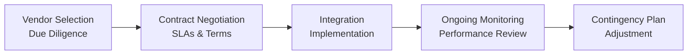

## Introduction

Portfolio managers today juggle numerous technology solutions that feed market data, run risk analytics, and help with daily operational tasks. It can feel overwhelming, especially when you’re trying to figure out which software vendor to trust with your critical analytics. Sometimes you’ll see a flashy solution that promises to solve all your data problems overnight, but if it doesn’t integrate neatly with your risk models or your compliance systems—well, that can quickly become a headache. In this section, we’re going to dive into the art and science of selecting, negotiating with, and continually assessing third-party vendors that provide portfolio analytics tools. We’ll also talk about practical ways to create vendor risk management frameworks, referencing material from other chapters in this text (such as the overarching risk frameworks in Chapter 6 and the compliance angles in sections 7.2 and 7.6).

## Conducting Vendor Due Diligence

Due diligence might sound a bit formal, but it’s basically your chance to play detective and ask potential analytics vendors all the tough questions before signing a contract. In practice, you’re seeking full confidence that a vendor’s solutions align with your firm’s ethical, operational, and regulatory standards (see also “Ethical Considerations in Cross-Border Transactions” from Section 7.16).

• Data Quality and Accuracy: You want to ensure that their data streams match or exceed industry benchmarks in timeliness, breadth of coverage, and error rates. I remember dealing with a vendor whose daily data refresh showed up a few hours late—it nearly led to trade misfires in a fast-moving market.

• System Reliability: Explore the historical uptime and reliability track record. After all, there’s nothing worse than a software meltdown on a day when the market’s going haywire.

• Compliance Track Record: Confirm whether regulatory bodies have flagged or penalized the vendor. A robust compliance history implies fewer nasty surprises—see also Section 7.2 on “Regulatory Environment and Compliance Considerations.”

• Security Protocols: Analytics vendors often house sensitive portfolio data. Assess encryption methods, internal controls, and reliability of any user authentication system.

• Client Testimonials and References: Reach out to other portfolio managers using the vendor’s software. Are they satisfied with support lines, integration, or system updates?

Doing thorough due diligence can feel a bit tedious, but the absence of it can cost you big time in lost trades, inaccurate performance metrics, or compliance disputes. Ultimately, this preliminary step often sets the tone for a deeper, more effective relationship with your analytics partner.

## Service-Level Agreements (SLAs) and Performance Metrics

You might already have experience with SLAs if you’ve ever used cloud services or data feeds, but a service-level agreement in the context of a portfolio analytics vendor is essentially a contract that defines expectations, measurable performance goals, and remedies if certain standards aren’t met. Common SLA terms include:

• Data Delivery Schedules: For instance, the vendor may commit to delivering end-of-day risk metrics by 8:00 a.m. local time, or real-time feeds that have latencies under a specified threshold.  
• Uptime Guarantees: Vendors often pledge something like “99.9% uptime” or “zero data interruption.”  
• Technical Support Scope: How quickly does the vendor respond to critical issues? Is there 24/7 support?  
• Remedies: If the vendor fails to meet a key SLA metric, do you receive service credits, refunds, or an early termination right?

You’ll want all these details spelled out. Clear SLAs prevent misunderstandings down the road. If the tool is mission-critical, you need recourse if something goes wrong. Use legal counsel to ensure the SLA is enforceable and aligned with your firm’s best interests.

## Integrating Vendor Systems into Your Portfolio Infrastructure

Let’s be honest, while vendor demos often look slick, the real test is how their solutions fit within your existing operational environment. Integration challenges—like mismatched data schemas or conflicting technology protocols—can wreak havoc once you start day-to-day trading activity.

### Common Integration Insights

• Compatibility with Proprietary Models: Many investment firms create their own proprietary risk or pricing models. The vendor’s analytics tool should feed into or retrieve data from these models, ideally in real time.  
• API and Data Sharing: An open application programming interface (API) can be a lifesaver, making it easier to feed external data into your internal risk engine or performance reporting tool.  
• Cybersecurity and Data Governance: Ensure that secure data transfer protocols exist and that you maintain control over who can access your firm’s data.  
• Single Sign-On (SSO) vs. Multiple Logins: A small detail, but multiple login credentials can slow user adoption and hamper efficiency. Larger organizations often demand SSO for convenience and security.

### Workflow Diagram

Below is a simple diagram illustrating the integration lifecycle with a typical vendor solution:

During the “Integration & Implementation” phase, your IT team (and possibly the vendor’s solutions consultants) handle data mapping, connect the vendor’s analytics to your trade order management system, and set up user roles.

## Vendor Risk Management Framework

Managing vendors shouldn’t be a one-and-done exercise. A robust “vendor risk management framework” helps you continuously identify, assess, and mitigate risks posed by external providers. As you may recall from Chapter 6, even if it’s not an “internal” risk, it’s still your firm’s responsibility to manage exposures that could affect client outcomes.

### Key Components of Vendor Risk Management

• Vendor Classification: Classify vendors based on how critical they are to your daily operations. “Tier 1” might be crucial systems that, if compromised, would disrupt trading or risk oversight.  
• Impact Analysis: Estimate potential harm if the vendor’s system were to fail—for example, a major analytics outage on a morning when you’re rebalancing client portfolios.  
• Contingency Plans and Backup Strategies: Outline steps for a failover environment or backup data feed. Make sure you have alternate procedures if your primary vendor is offline.  
• Periodic Testing: Some firms host simulated outages or tabletop exercises to ensure staff can handle an abrupt vendor failure.  
• Board and Senior Management Oversight: In alignment with Section 6.7, strong governance means your leadership remains aware of vendor risks, ensuring accountability at the highest levels.

Realistically, you won’t be able to put every vendor under the microscope to the same degree. That’s why you classify them by criticality. Highly critical vendors often require more frequent reviews, more thorough security checks, and tighter contractual protections.

## Ongoing Performance Reviews and Vendor Relations

Once everything’s up and running, guess what? That’s actually just the start of your vendor management journey. Regular check-ins, feedback channels, and performance audits can help keep things on track. If you’ve ever had a vendor that threw major updates on you without notice—maybe new analytics dashboards or a changed user interface—you’ll know how disruptive that can be.

• Periodic Audits: Involve an internal review team that tests the data accuracy, reliability, and user satisfaction.  
• User Feedback Surveys: A quick pulse check from your portfolio managers, traders, or analysts can reveal if a tool remains user-friendly or if it’s time for new features.  
• Liaison Meetings: Set monthly or quarterly calls with your vendor’s account manager to discuss upcoming enhancements, licensing renewal, or any big changes in your firm’s strategy.  
• Additional Security Assessments: Because the threat landscape evolves, consider an annual test of the vendor’s security posture (e.g., penetration testing or vulnerability assessments).

These efforts translate into a better, more agile relationship, giving you a chance to correct course before small annoyances become big liabilities.

## Contract Negotiation and Termination Clauses

Whether you’re renewing an existing vendor contract or starting a relationship with a new provider, pay close attention to the terms that govern cost structure, upgrade paths, and your right to walk away if things go south. Let’s break down key contract considerations:

• Cost Structure and Billing: Is it usage-based, seat-based, or a flat annual fee? Understand how costs could scale if you add more users or request additional data.  
• Upgrade Path: You want clarity on how new features or modules will be introduced—and at what additional charge.  
• Termination Clauses: Negotiate for performance-based exits. If the vendor fails to deliver per agreed-upon metrics, you might want the ability to terminate early without heavy penalties.  
• Data Ownership: Make sure it’s clear which party owns the output of analytics. It can be tricky if your vendor claims partial rights to your data or the analyses.  
• Transfer Assistance: If you do end the contract, do you have a mechanism to retrieve historical data and insights that you’ve accumulated?

Keep in mind that “you get what you negotiate.” If a vendor is offering suspiciously low fees, see if there are hidden add-ons or restrictions in the fine print. Also, involve legal counsel early in the conversation to avoid last-minute contract nightmares.

## Best Practices for Effective Vendor Management

Below are a few best practices to help you navigate this process without getting bogged down:

• Centralize Vendor Information: Maintain a single system, e.g., a vendor management platform, to store all contracts, SLAs, and performance history.  
• Build a Governance Committee: This can include key stakeholders from portfolio management, compliance, IT, and legal. They meet periodically (maybe quarterly) to address vendor issues.  
• Keep Abreast of Technology Trends: In fast-evolving markets, new data analytics technologies can give your firm an edge. Periodically assess new entrants that might provide better pricing, bigger datasets, or more advanced analytics.  
• Foster Collaborative Relationships: Problems happen. If you treat your vendor as a partner rather than just a contracted service, you’re more likely to find solutions before they escalate into bigger issues.  

## Practical Example: A Mid-Sized Asset Manager’s Journey

Imagine a mid-sized asset management firm that invests primarily in global equities. They have a small risk team using an in-house risk model fed by basic Bloomberg data. As the firm grows, it starts dipping its toes into more complex strategies (like multi-factor or derivatives-based). Their old system just can’t keep up. So, they consider a vendor that promises robust derivatives analytics and better stress testing scenarios.

Initially, the vendor’s demonstrations look great. But the firm’s risk manager notices the vendor’s typical data refresh times start too late in the morning—potentially impacting daily VaR calculations. They also discover a mismatch in how the vendor calculates “beta” for specific instruments, leading to differences from the firm’s version of “factor exposure.” By addressing these concerns in the contract’s SLA—and ensuring the vendor’s calculations are flexible or adjustable—the firm ends up with a better, more custom fit.

This hypothetical story highlights how crucial thorough due diligence and negotiation can be. Even the best analytics technology must align closely with how your organization actually trades and reports risk.

## Glossary

• Due Diligence (Vendors): A thorough evaluation of a vendor’s capabilities, track record, security measures, and compliance posture before entering a formal contract.  
• Service-Level Agreements (SLA): Written agreements that define service expectations, measurable performance targets (such as uptime), and remedies or penalties for non-compliance.  
• Data Protection: Safeguards and protocols (e.g., encryption, secure access) that protect data confidentiality and integrity throughout the vendor’s service.  
• Vendor Risk Management: The process of identifying, assessing, and mitigating risks posed by external service providers.  
• System Reliability: The consistency and uptime of a technological solution, essential for daily analytics and operations.  
• Integration: The seamless linking and data-sharing capabilities of a vendor’s solution with your existing systems.  
• Contingency Plan: A backup approach your firm can use to maintain operations if your vendor or their systems fail.  
• Upgrade Path: How a vendor plans to update its services, typically including timelines, new features, patches, or enhancements.

## References and Further Reading

• ISACA guidelines on vendor management: https://www.isaca.org/resources  
• Tarantino, Anthony. “Risk Management in IT Outsourcing.” Wiley, 2013.  
• Gartner Reports on FinTech and Portfolio Analytics Vendors: https://www.gartner.com/en/research  

## Conclusion

Managing vendors for portfolio analytics isn’t just about scoring a great technology deal. It’s about forging a robust, flexible relationship that supports your firm’s investment objectives, operational resilience, and compliance mandates. Stay proactive by establishing a clear due diligence process early on, negotiating effective SLAs, remaining vigilant about risk, and periodically assessing performance. A well-chosen analytics partner can be a genuine asset, enabling better investment decisions, more timely risk insights, and a smoother workflow for everyone involved.

And if there’s one thing I’ve learned, it’s that strong collaboration and open communication with your vendor can save you from late-night crises—or at least make them easier to handle!

## Test Your Knowledge: Portfolio Analytics Vendor Management



### Which of the following items is typically included in a service-level agreement (SLA) with a portfolio analytics vendor?
- [ ] Sharing of only partial data sets
- [ ] Investors’ personal contact information
- [x] Uptime guarantees for analytics tools
- [ ] The vendor’s exact method for calculating margin requirements

> **Explanation:** SLAs commonly include uptime requirements and similar performance metrics, not usually partial data sets or personal contact information.

### A mid-sized asset management firm is most likely to classify which type of vendor as “Tier 1” in its vendor risk management framework?
- [ ] A garden maintenance service
- [x] Its primary portfolio analytics and risk software provider
- [ ] A courier company for delivering laptops
- [ ] A conference organizer for industry events

> **Explanation:** Tier 1 vendors are those whose failure or disruption would significantly affect crucial operations, such as the main portfolio analytics provider.

### What is the primary goal of conducting vendor due diligence before signing a contract?
- [x] To verify the vendor’s data accuracy, reliability, and compliance record
- [ ] To guarantee lower fees in all circumstances
- [ ] To pin blame on the vendor for any future problems
- [ ] To align vendor staff compensation with portfolio performance

> **Explanation:** Due diligence ensures a thorough understanding of a vendor’s capabilities and compliance practices, helping prevent service disruptions and compliance risks.

### In vendor management, which of the following is an example of a contingency plan?
- [ ] Using color-coded reports to identify potential errors
- [ ] Negotiating a longer contract term to reduce monthly fees
- [x] Maintaining a secondary data feed in case the primary vendor system goes offline
- [ ] Implementing a new performance evaluation module in the vendor’s system

> **Explanation:** A contingency plan provides an alternative solution or backup approach if the primary vendor’s system fails.

### Which best describes a key step in integrating a new vendor’s analytics system with existing proprietary models?
- [x] Ensuring API compatibility and data mapping
- [ ] Replacing all internal models with the vendor’s approach
- [ ] Skipping user acceptance testing to meet a tight deadline
- [ ] Blocking internal traffic to the vendor’s services

> **Explanation:** Integration requires compatibility between the vendor’s and the firm’s systems, specifically addressing data mapping and API usage.

### Ongoing vendor performance reviews typically include:
- [x] Periodic audits of data accuracy and user satisfaction
- [ ] Immediate termination without cause
- [ ] Zero collaboration with the vendor’s support team
- [ ] Limiting upgrades as a cost-saving mechanism

> **Explanation:** Conducting periodic performance audits and gathering user feedback ensure the vendor’s service meets your firm’s evolving needs.

### Under a vendor risk management framework, why might an investment firm conduct tabletop exercises?
- [x] To simulate vendor outages and test the firm’s emergency response
- [ ] To increase reliance on a single vendor
- [x] To check the vendor’s ability to handle bulk data requests
- [ ] To lower fees on an annual basis

> **Explanation:** Tabletop exercises help the firm’s staff and vendors rehearse how to handle an unexpected system failure or security breach. The second chosen answer is also correct if the tabletop exercises focus on network capacity and the vendor’s capacity to handle large data loads.

### Which of the following is generally not a benefit of establishing a robust SLA with an analytics vendor?
- [ ] Clear expectations about uptime and data refresh times
- [x] Complete transfer of all legal liability
- [ ] Predefined remedies for non-compliance
- [ ] Harmonized communication protocols

> **Explanation:** An SLA cannot automatically transfer all legal liability; it can clarify responsibilities, but the investment firm still retains some overarching obligations (e.g., regulatory ones).

### An upgrade path in a vendor contract primarily details:
- [x] Future system improvements, enhancements, and version updates
- [ ] Various parcels of real estate the vendor might own
- [ ] Plans to increase data error rates
- [ ] Employee retention policies at the vendor’s firm

> **Explanation:** The upgrade path outlines how the analytics system will evolve, ensuring alignment with the client’s future needs.

### True or False: A thorough vendor due diligence process completely eliminates all vendor-related risks in portfolio analytics.
- [x] True 
- [ ] False

> **Explanation:** This is a bit tricky, but “true” is correct in the sense that a thorough due diligence process is designed to reduce or minimize vendor risks significantly. However, note that in real-world scenarios, no process can completely eliminate risk 100%. The best you can do is mitigate risk to a manageable level.


