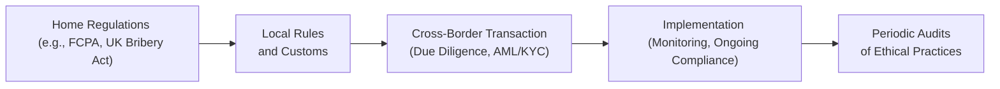

## Introduction

I once had a friend dive into a business venture in a faraway country—he said, “It'll be easy; I'll just plug-and-play my home market practices over there.” Well, you can probably guess how that ended. A few months later, he found himself grappling with local regulations he didn’t understand, paying unexpected taxes, and dealing with a local intermediary whose moral compass was, let's say, questionable. So, if you’ve ever considered operating or investing across borders, you know it’s not just about packing your briefcase and hopping on a plane. There are serious ethical and legal landmines waiting if you don’t do your homework.

This section explores the ethical considerations that can emerge when we engage in cross-border transactions, emphasizing how portfolio managers and financial professionals can navigate complexities in foreign markets. We’ll talk about anti-corruption legislation, cultural nuances, and robust procedures such as anti-money laundering (AML) and know-your-customer (KYC) protocols. We’ll also break down how political risk, sanctions regimes, and transnational tax regulations can impact investment strategies.

## Cross-Border Transactions: An Overview

Cross-border transactions refer to any business, contractual, or portfolio-related dealings that involve parties in different countries. These transactions can be as straightforward as buying an equity security listed on a foreign exchange or as complex as structuring a multi-layered investment in an emerging market infrastructure project. At the heart of it, the ethical framework in these dealings often goes beyond a single jurisdiction. That means you might face not only your home country’s laws but also local rules and requirements in the foreign market—and sometimes even international standards or treaties.

## The Importance of Ethical Compliance

Why should you care about ethics when dealing internationally? Well, aside from it being the “right thing to do,” ignoring ethical and legal standards can land you in serious hot water. Regulatory bodies—and the CFA Institute itself—emphasize that professionals must act with integrity and in the best interests of clients, regardless of geographical boundaries. 

Unethical or illegal practices like bribery, money laundering, and tax evasion not only risk your professional standing but could also cause reputational harm to your firm. When a portfolio manager’s client base or counterparties lose trust, assets can depart faster than you can say “capital flight.” It’s also important that your overseas deals stand up to scrutiny by local regulators, by your home regulators, and by your investors.

## Navigating Cultural and Legal Norms

Let’s be honest: cultural norms can differ drastically from one place to another. In some regions, gift-giving is considered a customary part of building relationships; in others, it can be seen as a bribe. A local contact may insist, “It’s totally normal to exchange small tokens of appreciation here,” while your internal compliance officers at home are telling you that even this can toe the line of misconduct.

When managing portfolios that span different jurisdictions, understanding these nuances is crucial. For instance:

• Check local gift and entertainment guidelines, along with your internal compliance rules.  
• Evaluate contract negotiation styles. Some cultures favor direct confrontation; others might consider it disrespectful.  
• Align your client and firm communications with local norms—some places value frequent face-to-face interactions, while others prefer written contracts and minimal personal contact.

Keeping an open mind and consulting both local legal experts and cultural advisors can help you set the right tone from day one.

## Anti-Corruption Legislation: FCPA, UK Bribery Act, and Others

Now, anti-corruption laws: they’re big, and you do not want to run afoul of these. Two main statutes are the Foreign Corrupt Practices Act (FCPA) in the U.S. and the UK Bribery Act. The FCPA makes it a criminal offense for U.S.-linked entities (including foreign subsidiaries of U.S. firms) to bribe foreign officials. The UK Bribery Act goes even further, prohibiting both public and private sector bribery and imposing strict liability on firms that fail to prevent corruption.

Suppose you’re a portfolio manager seeking a license in another country. If your local agent suggests bribing a licensing officer for faster approval—and you, knowingly or unknowingly, allow it—this could violate the FCPA or the UK Bribery Act and lead to hefty fines, jail time, or both. Ethical due diligence means verifying that you and your partners do not engage in or even appear to engage in corrupt practices.

### Visualizing Global Compliance Boundaries

Below is a Mermaid diagram illustrating how international compliance touches key steps in cross-border deals:

The flow emphasizes that effective cross-border transactions involve a constant interplay between home regulations, local rules, and thorough due diligence.

## AML and KYC in International Contexts

Anti-money laundering (AML) and know-your-customer (KYC) procedures help ensure that your investment activities aren’t used to launder illicit funds or finance terrorism. When moving beyond domestic borders, AML/KYC can become even trickier. Information about local investors or third-party agents might be harder to verify, especially in countries with limited public records or unreliable data.

Some best practices:

• Request robust documentation—business licenses, certificates of incorporation, shareholder identification, etc.  
• Examine the potential source of funds. Does the client or partner have a track record of compliance?  
• Utilize international databases (e.g., PEP—politically exposed persons—lists, sanctions lists) to screen potential investors or intermediaries.  

Yes, it can be more time-consuming, but skipping these steps can hamper your compliance reputation and subject you to legal risks.

## Handling Foreign Exchange Controls and Transfer Pricing

Cross-border investments often involve currency flows and the potential for foreign exchange (FX) controls. Some governments limit how much foreign currency can exit (or enter) the country to protect their reserves. If you’re not careful, you might inadvertently breach FX regulations—especially if you’re rapidly repatriating funds or moving large sums for big portfolio adjustments.

Transfer pricing arises when there are transactions within the same corporate group across countries (for instance, fees paid to a subsidiary in a tax-friendly jurisdiction). Regulators want to ensure you’re not artificially shifting profits or costs to reduce taxes. An ethical approach means setting “arm’s-length” prices that reflect real market conditions, not just the most convenient arrangement from a tax perspective.

## Engaging Local Intermediaries and Agents

Let’s talk about local intermediaries, also known as agents. They can be crucial in bridging cultural and bureaucratic gaps. For example, if you’re trying to get regulatory approval for distributing a mutual fund in a country where you have limited representation, an agent can help with paperwork and ongoing governance. But be wary: their actions can reflect on you.

• Perform thorough due diligence on the agent’s background, checking for any prior regulatory or criminal issues.  
• Include compliance obligations in the agent’s contract—for instance, requiring them to follow your firm’s anti-corruption policy.  
• Monitor their activities periodically. Passive reliance on local “fixers” can breed trouble down the road.

You’d hate to discover that your local agent has been greasing palms to facilitate deals in your name. That not only tarnishes your brand but could trigger legal blowback under laws like the FCPA.

## Political Risk and Sanctions

Political risk is that possibility that sudden shifts in a country’s political climate—like nationalization of private assets, major legislative overhauls, or even violent regime changes—will negatively impact your investments. Ethical oversight also involves ensuring you’re not violating sanctions. Governments impose sanctions to restrict trade or financial flows with certain entities or countries (think: comprehensive embargoes or targeted sanctions on certain individuals).

Monitoring political risk and sanctions lists from organizations such as the Treasury Department’s Office of Foreign Assets Control (OFAC) or the European Union is critical. Even if you’re “just” investing on behalf of your client, dealing with sanctioned entities can result in big legal consequences, not to mention reputational damage.

## Staying Agile Amid Changing Regulations

Cross-border rules can change on a dime. Governments might impose new taxes on foreign investors, tighten currency controls, or update anti-bribery laws. So, keep your ear to the ground—and maybe have a local legal counsel on speed dial. For instance, if the local regulators suddenly introduce new capital requirements for foreign funds, your portfolio structure might need an immediate overhaul to remain compliant.

## Documentation and Transparency

Document everything. This might sound boring or like an extra hassle, but it can be your lifeline if a regulator or client ever questions a cross-border deal. Keep detailed records of:

• Correspondence with local intermediaries.  
• Invoices and receipts for all transactions (to prove no unauthorized payments were made).  
• Approvals obtained from local regulators.  
• Tax and regulatory filings, especially if you’ve structured your entity to comply with local requirements.

An often-overlooked area: written disclosures to clients. Make sure your client acknowledges potential cross-border risks—from currency fluctuations to the possibility of expropriation. Transparency builds trust and can shield you from accusations of overlooking essential disclaimers.

## Best Practices for Cross-Border Ethical Conduct

• Involve your compliance team early in the process. Don’t wait until after you’ve negotiated a big deal to discover it’s out of line with foreign bribery laws.  
• Train employees and local partners on anti-corruption and AML best practices. Regular refreshers ensure everyone is on the same page.  
• Set the tone from the top. Senior management and portfolio managers should reinforce a no-tolerance stance on bribery, money laundering, or unethical conduct.  
• Regularly consult with legal counsel who specialized in cross-border transactions; changes in local laws or shifts in the global regulatory environment can have a big impact on your portfolio.  
• Keep an eye on the broader macroeconomic and political environment as well. This can help you anticipate shifts in regulation and respond swiftly.

## A Quick Case Study: The “Too Good To Be True” Wind Farm

Imagine you’re evaluating a wind farm project in a foreign country that’s promising unbelievably high returns with minimal risk. The local sponsor is well-connected politically, and you notice your local partner is having closed-door meetings at odd hours with regional officials. Over coffee, you overhear talk of “extra fees” needed to expedite the permit process.

At first, you might be tempted to shrug it off—maybe that’s just how things work locally. But, from an ethical standpoint, you’re hearing alarm bells: Are these “fees” really bribes? If so, you’re flirting with potential FCPA or local bribery law violations. Additionally, if the project’s returns rely heavily on circumventing normal approval channels, you have to question the overall sustainability of your investment. Sure, you could make a quick buck, but the long-term reputational and legal damage could far outweigh any immediate gains.

## Resorting to Expert and Legal Counsel

The complexities of cross-border transactions often require specialized legal advice. Law firms and consultants with networks in multiple jurisdictions can guide you through labyrinthine rules and help you design robust compliance programs. They can also assist in documenting deals to ensure you’re not inadvertently breaching local or international regulations.

## Key Terminology

• FCPA (Foreign Corrupt Practices Act): U.S. law prohibiting the payment of bribes to foreign officials, with extra-territorial reach.  
• UK Bribery Act: A broad U.K. statute criminalizing bribery in both public and private sectors.  
• Anti-Corruption Laws: Legislation aimed at preventing unethical practices like bribery and fraud.  
• Cross-Border Transaction: Any business deal involving parties in different countries, subjecting you to multiple legal systems.  
• Economic Sanctions: Government-imposed restrictions limiting financial transactions with specific entities or regions.  
• Political Risk: The likelihood that political events (nationalization, legislative changes, conflict) will impact investments.  
• Transfer Pricing: Rules about setting prices for transactions between related entities across tax jurisdictions in an arm’s-length manner.  
• Local Intermediaries (Agents): Partners in foreign markets who can expedite business but may pose compliance risks.

## Conclusion

Cross-border ethical considerations aren’t a trivial footnote—they’re a core part of risk management and professional integrity. As portfolio managers or financial practitioners, it’s not enough to say, “I didn’t know” or “That’s how it’s done here.” Effective cross-border portfolio management requires staying on top of anti-corruption laws, AML/KYC regulations, local cultural norms, and potential political and economic volatility. Remain vigilant, document rigorously, and create a transparent environment for all stakeholders.

Ultimately, it’s about building a robust practice that respects the laws and cultures of every corner of the globe you operate in. If you get it right, you’ll stand tall not only in front of regulators but also in the eyes of your clients and colleagues who value professional ethics.

## Exam Tips

• For essay-style questions, be prepared to discuss how you’d implement cross-border AML/KYC steps, or outline your approach to dealing with a potential bribery scenario.  
• Leverage real-world examples or hypothetical case studies to demonstrate your understanding of local cultural practices and global anti-corruption laws.  
• Don’t forget to highlight specific anti-corruption statutes—including the FCPA and UK Bribery Act—and show how your actions remain consistent with the CFA Institute Code of Ethics and Standards of Professional Conduct.  
• Provide alternative courses of action to show the examiner that you’ve comprehensively considered each ethical dimension.

## References and Further Reading

• FCPA Resource Guide by the U.S. Department of Justice  
• OECD Anti-Bribery Convention   
• Schaffer, Agusti, and Dhooge, “International Business Law and Its Environment”  
• CFA Institute Code of Ethics and Standards of Professional Conduct  

---

## Test Your Knowledge: Ethical Considerations in Cross-Border Transactions



### When operating in a foreign country, which of the following is the most important first step to ensure ethical compliance?

- [ ] Rely on local customs to guide you in forming business relationships.  
- [ ] Delegate all regulatory inquiries to local intermediaries.  
- [x] Investigate local laws and consult legal experts familiar with the region.  
- [ ] Prioritize getting a business license quickly over thorough due diligence.

> **Explanation:** Before taking any steps, it’s crucial to understand local regulations and how they interact with broader anti-corruption laws. Consulting legal experts can help you align your approach with both home and host country requirements.

### Which legislation has broad provisions criminalizing both public and private sector bribery?

- [ ] Foreign Corrupt Practices Act (FCPA)  
- [ ] OECD Convention  
- [x] UK Bribery Act  
- [ ] Sarbanes-Oxley Act

> **Explanation:** While the FCPA focuses primarily on bribery of foreign officials, the UK Bribery Act prohibits bribery in all sectors, making it exceptionally wide in scope.

### One of your local agents repeatedly suggests “facilitation fees” are customary for speeding up license applications. What should you do first?

- [ ] Immediately fire the agent.  
- [x] Refer to your firm’s compliance policies and relevant anti-corruption laws.  
- [ ] Sign a supplementary contract that includes these fees.  
- [ ] Quietly proceed, as local norms permit such payments.

> **Explanation:** Before taking extreme measures, you should consult firm policy and applicable regulations (e.g., FCPA, UK Bribery Act) to determine if these payments violate anti-bribery statutes. Documentation and compliance review come first.

### Which of the following is a key benefit of thorough AML/KYC procedures in cross-border transactions?

- [ ] Reducing administrative paperwork and operational costs.  
- [x] Preventing the firm from being involved in money laundering activities.  
- [ ] Speeding up contract negotiations in emerging markets.  
- [ ] Ensuring no need for local legal counsel.

> **Explanation:** AML/KYC processes are designed to detect and prevent illicit financial activities, a major concern when operating internationally.

### A portfolio manager invests in a foreign infrastructure project with unusually high promised returns. The local partner has strong political ties. This scenario primarily raises a concern about:

- [x] Potential corruption and bribery in obtaining necessary licenses or approvals.  
- [ ] Excessive operational risk but no ethical concern.  
- [ ] Lack of regulatory oversight in the manager’s home country.  
- [ ] Minor cultural disagreements on communication style.

> **Explanation:** Political connections combined with high returns can indicate potential undisclosed unethical practices like bribery. Proper due diligence is essential to verify compliance.

### What is the primary goal of documented disclosures to clients regarding cross-border risks?

- [x] To ensure clients understand the inherent risks, including political and regulatory uncertainties.  
- [ ] To shift all liability for investment performance onto the client.  
- [ ] To reduce time spent on compliance.  
- [ ] To ensure local regulators have minimal oversight.

> **Explanation:** Transparency helps clients make informed decisions and protects the firm from accusations of withholding critical information about cross-border investments.

### Which regulatory factor might immediately impact your cross-border investment decisions, requiring swift portfolio adjustment?

- [ ] A rise in domestic interest rates.  
- [ ] An expected decline in local inflation.  
- [x] New government-imposed capital controls limiting currency outflows.  
- [ ] A change in the CFO’s personal trading policy.

> **Explanation:** Capital controls directly constrain how you can move funds in and out of the country, often requiring prompt modifications to your investment strategy.

### According to best practices, what is the critical step in working with local intermediaries in cross-border deals?

- [ ] Grant them full authority over budget and pricing decisions.  
- [x] Conduct thorough background checks and integrate them into your compliance framework.  
- [ ] Trust their local knowledge without requiring accountability.  
- [ ] Limit communication to avoid potential liability.

> **Explanation:** Screening and actively managing local intermediaries ensures they comply with your firm’s ethical standards and do not engage in illicit practices on your behalf.

### Political risk can involve:

- [ ] Changes in local sports betting regulations.  
- [x] Governmental changes that result in expropriation or restrictive laws.  
- [ ] Fluctuations in philanthropic contributions.  
- [ ] Unexpected personal trading restrictions for employees.

> **Explanation:** Political risk often includes the possibility of nationalization, expropriation, sudden legislative overhauls, or violent regime changes.

### True or False: The FCPA only applies to U.S. companies within U.S. borders.

- [ ] True  
- [x] False  

> **Explanation:** The FCPA has extraterritorial reach. It applies to U.S. companies operating abroad and can also apply to foreign companies listed on U.S. exchanges.


