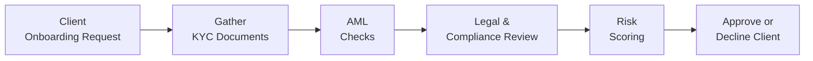

## Introduction

It’s funny how, in the early days of my career, I thought compliance was just a bunch of “avoid this, document that” rules. I figured it all boiled down to filling out forms and checking off boxes. But wow—once you dive deeper, you discover it’s actually a dynamic, high-stakes arena where regulatory changes can alter your daily processes practically overnight. The truth is, regulatory frameworks and compliance considerations are the lifeblood of professional portfolio management. They keep us in line with best practices, protect client interests, and shape how we operate in the global financial markets.

Messing up in the compliance area is no joke. Even minor oversights can land you (or your firm) in hot water with regulatory agencies like the Securities and Exchange Commission (SEC) in the United States, the Financial Conduct Authority (FCA) in the U.K., or the European Securities and Markets Authority (ESMA) in the EU. These regulatory bodies monitor portfolio management activities, license professionals, and enforce guidelines designed to uphold market integrity. Let’s explore some best practices, potential pitfalls, and practical strategies that help ensure you’re on the right side of the law—and keep you sleeping well at night.

## Regulatory Bodies and Supervisory Oversight

Global and local regulatory authorities have wide-reaching oversight powers that shape the day-to-day operations of portfolio managers. Even though the specific rules may vary from region to region, there’s a consistent theme: protect investors, promote fair and transparent markets, and maintain systemic stability.

The Securities and Exchange Commission (SEC) in the U.S. is perhaps one of the most recognized. It sets guidelines for licensing, mandates periodic disclosures, and enforces securities laws (like the well-known Securities Exchange Act of 1934). Over in the U.K., the Financial Conduct Authority (FCA) takes charge by setting capital requirements, licensing portfolio management firms, and conducting supervisory visits. Meanwhile, the European Securities and Markets Authority (ESMA) is the EU-level organization that works with national regulators to issue directives, guidelines, and standards that must be uniformly applied across member states.

Aside from these major authorities, local jurisdictions often have their own regulatory bodies. If you’re operating in multiple regions, guess what? You’ll likely need to juggle a mix of local requirements as well. This makes it critical for any firm with international operations to coordinate with local legal counsel and compliance experts early and often.

## Building Internal Compliance Programs

A robust internal compliance program is the beating heart of a successful—and law-abiding—portfolio management firm. Think of it like this: if regulators are the traffic cops, your compliance framework is your car’s engine, seat belt, airbags, and all the mechanical checks that ensure safe driving. Without it, good luck staying on the road for very long.

Key components typically include written supervisory procedures (WSPs), a formal code of ethics, and ongoing staff training. WSPs detail precisely how day-to-day tasks must be performed to align with regulations. A code of ethics sets the moral compass, ensuring employees prioritize client interests and adhere to professional conduct guidelines—many of which are laid out by the CFA Institute Code of Ethics and Standards of Professional Conduct.

When developing these policies, flexibility and clarity are crucial. You’ll want each department or function—like trading, research, or sales—to understand what their responsibilities look like. Ongoing training sessions, whether monthly, quarterly, or annually, keep compliance front and center. And it’s not just about memorizing rules. You’re fostering a culture where compliance is second nature, not an afterthought.

## Anti-Money Laundering (AML) and Know-Your-Customer (KYC)

Let’s talk about AML. I had a buddy who worked in a small asset management firm where a new client tried to wire in a suspiciously large sum of money from an offshore bank account. No official documentation. No explanation. The firm’s AML program flagged it, triggered a deeper investigation, and eventually led them to decline the relationship. That story always reminds me how serious AML and KYC requirements can be.

AML regulations generally require firms to detect and report any activity that might be tied to terrorism financing, organized crime, or other illicit behavior. Meanwhile, KYC processes make sure you properly identify clients, understand their source of funds, and gauge their risk tolerance. Combining AML and KYC means implementing robust client onboarding checks—like verifying personal identification, cross-referencing watchlists, and requiring documentation of where funds originate.

These regulations aren’t just about checking boxes. They help seal off financial markets from big-time criminal exploits. By maintaining a thorough AML and KYC program, you’re not only safeguarding your firm’s reputation but also demonstrating your commitment to upholding the law.

## Cybersecurity and Data Protection

It’s tempting to think compliance is all about forms and standard operating procedures. In reality, cybersecurity is now top-of-mind for regulators. From the minute you store client data on your servers (or the cloud), you’re exposed to possible breaches—especially given the sophistication of modern cyberattacks.

Firms are expected to protect client information through encryption, secure backups, and well-defined breach response plans. Regulators might demand to see your policies, documented vulnerability assessments, and evidence that you’re training staff to spot phishing attempts or suspicious system behaviors. You may hear references to data protection regulations like the General Data Protection Regulation (GDPR) in the EU, which imposes hefty penalties on firms failing to protect personal data.

Believe me, the worst time to learn about your cybersecurity weaknesses is after a breach happens. Integrating robust cybersecurity protocols into your compliance framework can help mitigate those “Oh no” moments that you hope will never occur.

## Trade Reporting and Best Execution

Trade reporting obligations focus on transparency. Regulators require timely, accurate disclosures about executed transactions. This means portfolio managers must capture comprehensive details—from order timestamps to the final execution price. In many jurisdictions, misreporting trades can lead to stiff penalties.

Alongside that, best execution standards require you to secure the most favorable terms for the client under prevailing market conditions. It’s not just about immediate price; it can also involve minimizing market impact, scrutinizing transaction costs, and ensuring speed and reliability of execution. Clear records and disclosures surrounding commissions, spreads, and fees are game-changers in proving your compliance with best execution. After all, you can’t measure what you don’t monitor, right?

## Regulatory Audits and Internal Risk Reviews

Regulatory examinations can feel stressful, but they’re a fact of life in portfolio management. A typical audit might involve on-site or remote reviews of your firm’s policies, procedures, trade records, and even client communications. If an auditor points out deficiencies, you’ll need to act promptly to correct them.

Routine internal risk reviews are your prep sessions for these exams. By performing self-checks on everything from your AML protocols to your portfolio decisions, you’re aiming to address potential issues before a regulator flags them. Many firms set up internal committees—involving compliance, risk, IT, and operational leads—that meet regularly to discuss new developments, control weaknesses, and any market changes that require a regulatory response.

## Record-Keeping and Disclosure

Maintaining detailed records is essential. From the regulators’ perspective, “If it’s not documented, it didn’t happen.” That means every piece of your decision-making process—trading logs, email correspondence with clients, meeting minutes for your investment committee—should be recorded meticulously.

Record-keeping also extends to disclosures. Transparency with clients about your fees, potential conflicts of interest, and the basis for investment decisions is fundamental to building trust. In many markets, regulators specify minimum time frames (often in years) that you must retain client records. Cloud storage solutions or dedicated compliance software can simplify this, but the guiding principle is making sure everything is easily accessible, organized, and safe from data loss.

## Collaborating with Legal and Compliance Roles

Navigating the regulatory jungle can be challenging, especially if you operate in multiple jurisdictions. Keeping up with amendments to securities laws, capital requirements, or new compliance demands can feel overwhelming. That’s why a close collaboration between portfolio managers, compliance officers, and legal counsel is so essential.

Some firms establish committees or working groups to evaluate laws affecting new products, marketing materials, or trade strategies. In these meetings, compliance officers may express operational concerns while legal counsels interpret the fine print of new regulations. By working together, you can adapt your business model and keep your portfolio strategies both innovative and compliant.

## Visual Overview of a Compliance Process Flow

Below is a simplified Mermaid diagram illustrating how a compliance process might flow when onboarding a new client. This diagram can help you see how AML/KYC, legal review, and final approvals interconnect:

## Key Terms

• AML (Anti-Money Laundering): Regulations designed to stop illicit funds from entering legitimate financial channels.  
• KYC (Know-Your-Customer): Processes ensuring that financial institutions understand a client’s identity and risk profile.  
• SEC (Securities and Exchange Commission): The primary regulator for U.S. securities markets.  
• FCA (Financial Conduct Authority): A U.K. regulator overseeing financial markets and protecting consumers.  
• ESMA (European Securities and Markets Authority): An EU authority that safeguards the stability of the financial system.  
• Best Execution: Obligation to execute client trades at the most favorable terms possible under prevailing market conditions.  
• Record-Keeping: Systematic documentation of activities and communications relevant to compliance and oversight.  
• Cybersecurity: Measures and protocols to protect digital systems and data from unauthorized access or attacks.

## Exam Tips

• Master the Core Concepts: Understand how each regulatory body influences portfolio management. The CFA exam will expect you to differentiate between major players like the SEC, FCA, and ESMA.  
• Practical Scenarios: Practice scenario-based questions about AML/KYC. You might be asked to spot red flags in client onboarding or to discuss best execution protocols in real trading examples.  
• Documentation Is Key: For constructed-response (essay) questions, emphasize how record-keeping, disclosures, and internal oversight processes link to compliance best practices.  
• Integrate Ethics: The CFA Program heavily underscores the alignment of ethical conduct with regulatory compliance. Be sure to cite relevant CFA Institute Standards when explaining how you’d handle conflicts of interest or client confidentiality.  
• Stay Up to Date: The exam might touch on emerging issues like data protection laws or technology-based compliance solutions. Keep an eye on the evolution of cybersecurity threats and how they intersect with portfolio management operations.

## References and Further Reading

• Securities Exchange Act of 1934:  
  https://www.sec.gov/  

• FCA Handbook:  
  https://www.handbook.fca.org.uk/  

• ESMA Guidelines & Technical Standards:  
  https://www.esma.europa.eu/

• CFA Institute Code of Ethics and Standards of Professional Conduct:  
  https://www.cfainstitute.org/ethics-standards/code-of-ethics-standards-of-conduct  

• GDPR Overview (EU Data Protection Framework):  
  https://ec.europa.eu/info/law/law-topic/data-protection_en  

## Test Your Knowledge: Regulatory Compliance Essentials for Portfolio Managers



### 1. Which of the following best explains the primary role of global regulatory bodies such as the SEC, FCA, and ESMA?

- [x] They promote fair, transparent markets and protect investors through the enforcement of securities laws.
- [ ] They execute client trades in exchange for commission fees.
- [ ] They establish tax rates on capital gains and dividends.
- [ ] They generate official economic forecasts for investors.

> **Explanation:** These entities are tasked with supervising investment activities, creating guidelines, and enforcing securities laws to protect investors and uphold market stability.

### 2. A robust internal compliance program typically includes:

- [x] Written supervisory procedures, codes of ethics, and ongoing staff training.
- [ ] Reliance solely on external auditors for compliance verification.
- [ ] Discretionary client onboarding with no documented process.
- [ ] Unrestricted employee trading without official guidelines.

> **Explanation:** Firms must implement clear procedures, ethical frameworks, and continuous education to foster a trustworthy and legally compliant environment.

### 3. Which primary objective does AML regulation help achieve?

- [x] It prevents illicit funds from flowing into legitimate financial channels.
- [ ] It stabilizes currency exchange rates for multinational corporations.
- [ ] It encourages banks to grant higher-risk loans.
- [ ] It enforces better cybersecurity standards only for hedge funds.

> **Explanation:** AML stands for Anti-Money Laundering, requiring firms to identify and report suspicious activities that might be connected to terrorism financing or organized crime.

### 4. An example of a KYC control is:

- [x] Verifying a client’s identity and understanding the source of their funds.
- [ ] Disclosing all employee salary details to clients.
- [ ] Reducing brokerage commissions through third-party rebates.
- [ ] Engaging in insider trading for immediate transaction benefits.

> **Explanation:** KYC processes ensure a firm knows the true identity and risk profile of the client, which helps detect and prevent fraud or money laundering.

### 5. From a regulatory perspective, best execution refers to:

- [x] Trading securities under the most favorable terms for the client.
- [ ] Using the fastest telecom lines for high-frequency trades.
- [ ] Maximizing the broker’s profit on every transaction.
- [ ] Executing trades only when market volatility is low.

> **Explanation:** Best execution means securing the optimal combination of factors such as price, speed, and transaction cost to serve the client’s best interest.

### 6. Which measure helps protect client data and meet cybersecurity compliance?

- [x] Encrypting sensitive information and planning for breach responses.
- [ ] Limiting security software to only front-office operations.
- [ ] Conducting unrecorded trades outside regulatory scrutiny.
- [ ] Storing client data only on unsecured personal laptops.

> **Explanation:** Encryption, breach response plans, and staff training on cyberthreats are essential components of a robust cybersecurity framework.

### 7. One common goal of regular internal risk reviews is:

- [x] Identifying compliance gaps before a regulatory audit occurs.
- [ ] Boosting sales by ignoring suspicious client activities.
- [ ] Filing trades in an unstructured and undocumented way.
- [ ] Eliminating all firm-wide compliance resources to reduce costs.

> **Explanation:** By performing internal checks, firms can correct issues early and prepare for external audits effectively, minimizing the risk of regulatory penalties.

### 8. Record-keeping requirements generally dictate that:

- [x] Firms must systematically store and securely maintain historical trading records and client communications for predefined periods.
- [ ] Companies can delete any emails or documents older than 30 days.
- [ ] Managers may only keep daily statements and discard monthly summaries.
- [ ] Documentation is unnecessary if clients verbally confirm transactions.

> **Explanation:** Regulations typically require an extended retention of business-related documents. These records demonstrate compliance and provide transparency in case of future audits or inquiries.

### 9. Collaboration with legal counsel and compliance officers helps a firm:

- [x] Stay informed about regulatory changes and adapt operational processes accordingly.
- [ ] Justify avoiding KYC checks for longtime clients.
- [ ] Hide relevant disclosures from investors when offering new products.
- [ ] Rely solely on marketing personnel for compliance updates.

> **Explanation:** Legal teams and compliance officers interpret new regulations and guide the necessary operational or procedural adaptations.

### 10. True or False: Cybersecurity is now a core regulatory focus that often requires documented vulnerability assessments and staff training.

- [x] True
- [ ] False

> **Explanation:** Regulators worldwide increasingly emphasize cybersecurity. Firms must document their strategies for protecting client data and train staff to reduce risk.


