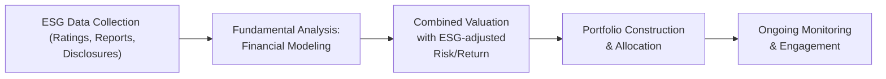

## Introduction

So, let’s get this out there right away: ESG isn’t just a catchy acronym anymore—environmental, social, and governance considerations are shaping how we analyze, select, and manage investments. Maybe a decade ago, some investors shrugged and thought, “Well, ESG is a nice concept, but does it really affect returns?” Today, ignoring ESG can actually mean overlooking significant risks or missing out on new opportunities for value creation. In this section, we’ll talk through the frameworks, best practices, and potential pitfalls of sustainable investing. And trust me, there are a few pitfalls. (Ever heard of greenwashing? We’ll get to that.)

From a high-level perspective, ESG integration has become a universal trend, embraced by both large institutional players and more boutique investment managers. In earlier parts of this book, we’ve discussed how portfolio managers collaborate with analysts (Chapter 1.11) and how risk management frameworks fit into the broader investment process (Chapter 6). Now, we’ll take that knowledge and apply it to the world of ESG and sustainable investing, capturing not just quantitative metrics but also those “intangibles” like corporate culture or carbon efficiency.

## Understanding the Building Blocks of ESG

### Environmental Factors
“Environmental” might conjure up images of solar panels and wind turbines, but it goes further. Investors look at a company’s carbon footprint, energy consumption, waste reduction strategies, and resource usage. ESG rating agencies might measure how effectively a company reduces greenhouse gas emissions or uses renewable energy. Some might incorporate data from frameworks like the Global Reporting Initiative (GRI), the Task Force on Climate-Related Financial Disclosures (TCFD), or even newly proposed International Sustainability Standards Board (ISSB) guidelines under IFRS. This helps gauge whether a business is aligned with a more sustainable future or is stuck in a polluting past.

### Social Factors
Social factors revolve around stakeholder relationships, employee well-being, community engagement, and product safety. Does a company respect labor rights across its value chain? How robust are its diversity and inclusion practices? In the era of social media, brand reputation can skyrocket—or tank—based on how the firm addresses gender pay gaps or philanthropic initiatives. Think of social metrics as capturing a firm’s moral “thumbprint” on society, focusing on relationships with employees, suppliers, customers, and local communities.

### Governance Factors
Governance addresses board composition, executive compensation, shareholder rights, audit integrity, and transparency in financial reporting. If you recall from Chapter 1.10, corporate governance is critical for oversight. Poor governance can spell trouble, especially when management’s interests aren’t aligned with shareholders’. Voting rights, accountability structures, and strategic oversight all form part of the governance mosaic. Many investors consider governance to be the foundation upon which environmental and social policies are built.

## The Rise of Responsible Investing Frameworks

### The UN Principles for Responsible Investment (UN PRI)
Ever heard someone talk about “signing the UN PRI”? That means an investment house has endorsed a set of voluntary guidelines encouraging the incorporation of ESG issues into investment practice. By supporting the UN PRI, signatories commit to uphold principles like seeking appropriate disclosures on ESG issues by companies and promoting acceptance of these principles within the industry. It’s a bit like joining a club: you publicly commit to standards, and your stakeholders expect you to abide by them.

### Sustainable Development Goals (SDGs)
These 17 ambitious goals tackle a wide range of global challenges—everything from zero hunger to quality education. While governments have a huge role to play, private capital is also essential to financing SDG-aligned projects. As a portfolio manager, you may find opportunities to invest in companies or initiatives that directly contribute to these goals (e.g., green energy projects aligned with SDG #7: Affordable and Clean Energy), while potentially capturing long-term growth and mitigating certain environmental risks.

## Integrating ESG into the Investment Process

You might be thinking, “OK, it’s great to know about ESG, but how do I actually incorporate these factors into a portfolio?” The reality is that there’s no single magic bullet. Integration is a nuanced process—like layering intangible data onto the standard fundamental analysis. One way is to combine third-party ESG scores with your usual financial metrics.

### Negative Screening
Negative screening is one of the earliest forms of socially responsible investing. You simply exclude companies or industries that violate certain ethical, environmental, or social criteria. Common exclusions include tobacco, weapons, and gambling. This approach is straightforward, but it might limit your investable universe. Still, for certain clients or mandates—think faith-based organizations—it remains a popular first step.

### Positive Screening and Best-in-Class
While negative screening weeds out the offenders, a positive screening (or best-in-class) approach focuses on identifying top ESG performers within each industry. So, if you must invest in, say, chemicals, you might choose the chemicals company that has leading environmental and worker safety practices, even if the sector as a whole has challenges.

### Thematic Investing
Here, portfolios target a specific ESG theme—like clean water, renewable energy, or gender equality. Thematic investing aligns capital with solutions-oriented companies. Although it can be more volatile (since themes often focus on narrower market segments), the potential upside is that you’re riding a wave of innovation. You also get a clear narrative to share with clients about the positive impact you’re aiming for.

### Impact Investing
I remember the first time I really dove into impact investing. I was examining a small microfinance institution that offered loans to women entrepreneurs in underserved regions. It was a real eye-opener: not only was the financial return profile sound (albeit with higher risk than conventional lending), but the social impact was measurable and tangible—improved livelihood for thousands of people. Impact investors seek quantifiable positive outcomes in areas like affordable housing, healthcare, or education. Remember, though, that robust measurement frameworks are crucial—otherwise, “impact” can become just another marketing buzzword.

### ESG Integration into Traditional Valuation
If you’re a fundamental analyst, try weaving ESG factors directly into revenue forecasts, discount rates, or expense projections. For instance, a company with solid environmental practices might anticipate fewer regulatory fines or brand damage, which can mean better margins or lower beta. Alternatively, poor labor rights or weak governance can signal potential lawsuits or operational hiccups—so factor in that risk premium. Some analysts adjust discount rates to reflect a firm’s ESG risk level; others refine their free cash flow projections to include the costs of environmental compliance or the potential revenue boost from a strong brand reputation.



## Shareholder Engagement and Stewardship

### Voting and Dialogue
One of the most direct ways to influence corporate behavior is shareholder engagement. If you hold equity, you can exercise your voting rights to push for changes—like increased board diversity or climate risk reporting. Sometimes, investors team up to file shareholder resolutions, amplifying their collective voice. Proactive dialogues with management can also encourage greater disclosure or changes in corporate strategy.

### Leveraging Collaborative Platforms
Organizations such as Climate Action 100+ bring together investors to collectively push high-emission companies toward more robust climate strategies. This collaborative approach allows even smaller asset managers to join forces and get a real seat at the table. It’s not just about complaining; it’s about suggesting constructive steps to improve ESG performance.

## Common Pitfalls: Greenwashing and Data Inconsistencies

### Detecting Greenwashing
Greenwashing occurs when a company (or a fund) misleads investors about its environmental practices or labels. Maybe they publish glossy “sustainability” brochures but keep investing heavily in dirty coal. As a portfolio manager, you want to verify claims through reliable data, third-party audits, or recognized frameworks like the GRI. Scrutinize the track record, not just the marketing slogans. Engaging with multiple ESG rating agencies (e.g., MSCI, Sustainalytics, Refinitiv) and comparing their assessments can help. If the fund or company makes big claims with minimal disclosure, that’s a red flag.

### Variations in ESG Data Methodologies
ESG rating agencies often use different scoring systems or weighting factors. It can be perplexing when one agency rates the same company “A” and another rates it “B-.” The mismatch arises due to differences in metrics or data collection methods. You want to understand each agency’s methodology to see which best aligns with your investment philosophy (or your clients’ preferences). Some managers even build proprietary scoring models, blending and normalizing data from multiple sources.

```python
import pandas as pd

esg_data = pd.DataFrame({
    "CompanyID": ["ABC", "XYZ", "DEF"],
    "ESGScore": [75, 50, 85]
})
financial_data = pd.DataFrame({
    "CompanyID": ["ABC", "XYZ", "DEF"],
    "FinancialQualityScore": [80, 45, 90]
})

merged_data = pd.merge(esg_data, financial_data, on="CompanyID")
merged_data["OverallScore"] = (merged_data["ESGScore"] * 0.7 
                               + merged_data["FinancialQualityScore"] * 0.3)
print(merged_data)
```

This snippet is a simple illustration of blending ESG scores with financial quality scores. In practice, each would likely be broken down into more granular factors, and you’d incorporate weighting that reflects your own judgment or your client’s risk tolerance.

## Green Bonds, Sustainable Funds, and Other ESG Instruments

### Green Bonds
Green bonds fund projects with clear environmental benefits—renewable energy, eco-friendly infrastructure, reforestation, etc. An issuer may be a government or a corporation, but the capital raised goes to distinct “green” projects. Watch for certifications like the Climate Bonds Standard or other third-party verifications to ensure the bond proceeds are used as claimed.

### Sustainable Funds
Asset managers now offer mutual funds and ETFs that purport to follow strict ESG guidelines. Some incorporate negative screening (excluding fossil fuels, for instance), while others emphasize best-in-class approaches. Before recommending or investing in such funds, dig into their methodology to confirm they’re consistent with their marketing. Reading the statement of investment policy (or prospectus) can help you spot any misalignment between stated goals and actual holdings.

### Impact Investing Vehicles
Impact funds measure and report tangible social or environmental outcomes, such as the number of affordable housing units built or the reduction in carbon emissions from portfolio companies. They might even align with SDGs. When structuring these strategies for clients, highlight the double bottom line: financial returns plus measurable impact.

## Communicating ESG to Clients

Clients are diverse. Some want purely “do-good” investing (like philanthropic foundations), while others just want risk-adjusted returns but understand that ignoring ESG factors is short-sighted. Tailor your messaging—provide quantifiable data about how ESG integration can reduce tail risk or highlight how a green bond allocation aligns with the client’s personal values. Offer regular updates on ESG performance alongside the usual financial metrics. Show them how their portfolio interacts with issues like climate change or social equity. Remember, transparency fosters trust, and that’s key in any advisory relationship.

## Best Practices and Future Outlook

• Stay up to date with evolving regulations. Certain jurisdictions already mandate climate disclosures (e.g., the EU’s Sustainable Finance Disclosure Regulation).  
• Continuously refine your data sources. The ESG data landscape is expanding—look for vendors using alternative data (like satellite imagery or supply chain analytics).  
• Avoid pure box-ticking. ESG is about ongoing improvement, dialogue, and nuance.  
• Keep an eye on technological advancements (like blockchain) for tracking supply chain sustainability or verifying carbon credits.  
• Encourage companies to produce standardized reports using frameworks such as GRI or SASB. The more consistent the data, the less guesswork for you.

## Exam Tips

• Concrete Examples: You might see scenario-based questions asking you to judge if a certain “green bond” is truly green, or which ESG rating source is most reliable. Be ready to compare methodologies.  
• Risk–Return Balanced: Demonstrate how you would integrate environmental risk or social controversies into your discount rate or expected return calculations.  
• Engagement Strategies: The exam may present a situation where you hold shares in a company with questionable labor practices and ask how you would use engagement or proxy voting.  
• “Greenwashing” Red Flags: Watch out for inconsistent disclosures and superficial claims.  
• IPS Alignment: Show how to incorporate ESG preferences into the Investment Policy Statement (IPS), as seen in Chapter 4.1.  
• Ethical Considerations: Tie in your knowledge from earlier chapters on fiduciary duty (Chapter 7.1) and regulatory compliance (Chapter 7.2).  

## References and Further Reading

• UN Principles for Responsible Investment: https://www.unpri.org/  
• Global Reporting Initiative (GRI): https://www.globalreporting.org/  
• “ESG Integration in Investment Management” by CFA Institute  
• Climate Bonds Initiative: https://www.climatebonds.net/  
• TCFD (Task Force on Climate-Related Financial Disclosures): https://www.fsb-tcfd.org/  

---

## Test Your Knowledge: ESG Integration and Sustainable Investing Quiz



### Which of the following best describes a “negative screening” approach to ESG investing?

- [x] Excluding companies based on specific ethical or sustainability criteria.  
- [ ] Selecting only the top ESG performers within each sector.  
- [ ] Investing exclusively in green bonds.  
- [ ] Engaging in proactive dialogue with company management.  

> **Explanation:** Negative screening filters out companies or industries that violate certain moral or environmental policies, such as producers of tobacco or weapons.

### A fund that seeks measurable positive social and environmental outcomes alongside financial returns is best described as:

- [ ] A best-in-class fund  
- [x] An impact investment  
- [ ] A negative-screened investment  
- [ ] A passive index fund  

> **Explanation:** Impact investments explicitly aim for measurable positive impact (e.g., microfinance for female entrepreneurs), aligning returns with tangible social or environmental results.

### An ESG rating agency assigns a high environmental score to a company, while another agency assigns only a mid-level score. Which factor most likely explains this discrepancy?

- [ ] A difference in the company’s fundamental operating results  
- [ ] A data error by one of the rating agencies  
- [x] Different ESG scoring methodologies  
- [ ] The effect of currency exchange rates  

> **Explanation:** ESG rating agencies vary in weighting criteria (e.g., emission reduction vs. product lifecycle). As a result, they often produce different scores.

### Which of the following would be considered a red flag for “greenwashing” in a company’s sustainability report?

- [ ] Achieving ISO 14001 certification  
- [x] Vague environmental claims without quantifiable data  
- [ ] Third-party audits of corporate sustainability practices  
- [ ] Alignment with the GRI reporting standards  

> **Explanation:** Companies that make broad or unsubstantiated claims, without offering data or independent verification, may be engaging in greenwashing.

### According to the UN PRI, which action is NOT a principle for responsible investing?

- [x] Maximizing short-term returns by any means necessary  
- [ ] Incorporating ESG issues into investment decision-making processes  
- [ ] Seeking full disclosure on ESG issues from invested firms  
- [ ] Promoting the acceptance of ESG principles in the industry  

> **Explanation:** The UN PRI framework promotes sustainable and responsible investment over purely maximizing short-term profits or ignoring ESG policies.

### Choosing only the top ESG performers in each sub-industry or sector is known as:

- [x] Best-in-class approach  
- [ ] Negative screening  
- [ ] Positive fundamental analysis  
- [ ] Shareholder activism  

> **Explanation:** A best-in-class strategy selects the top ESG companies within each industry, ensuring diversification while focusing on ESG leaders.

### Which of the following is a potential benefit of ESG integration in portfolio construction?

- [x] Improved risk management by identifying hidden sustainability risks  
- [ ] Guaranteed outperformance in every market cycle  
- [ ] Elimination of all reputational risk  
- [ ] Lower regulatory costs without needing to consider compliance  

> **Explanation:** ESG integration helps spotlight risks that might otherwise go unnoticed (e.g., environmental liabilities, labor controversies), improving overall risk management.

### If an investment manager actively votes and engages with company management to improve governance practices, this is referred to as:

- [ ] Negative screening  
- [x] Shareholder engagement  
- [ ] Thematic investing  
- [ ] Passive ownership  

> **Explanation:** Shareholder engagement involves using ownership rights (e.g., proxy voting, direct dialogue) to influence corporate governance and policies.

### A green bond is best described as:

- [ ] A standard corporate bond with no specific environmental focus  
- [ ] A bond issued by governments only  
- [x] A fixed-income instrument intended to fund projects with environmental benefits  
- [ ] A bond that is low risk due to its sustainability label  

> **Explanation:** Green bonds direct capital toward eco-friendly projects, such as renewable energy, wastewater management, or conservation initiatives.

### True or False: ESG data from different providers can vary significantly due to differing methodologies and weightings.

- [x] True  
- [ ] False  

> **Explanation:** Each rating agency uses different metrics and data sets, leading to potentially divergent ESG scores for the same security.


