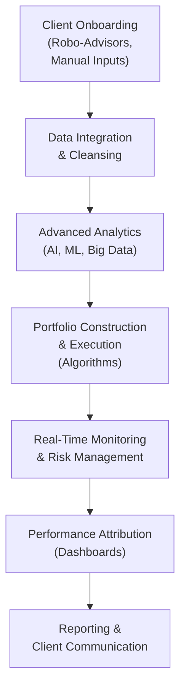

## Introduction

FinTech, or financial technology, has rapidly become a driving force in how modern portfolios are structured, monitored, and optimized. You might have seen the rise of robo-advisors on mobile apps or read about portfolio managers using artificial intelligence (AI) for predictive analytics, and perhaps even wondered if all these innovations are buzzwords or genuine game-changers. Spoiler alert: they’re absolutely changing the entire landscape. The push toward automation, data-driven insight, and online accessibility is reshaping client expectations and forcing practitioners to adapt new skill sets. In my opinion, ignoring these developments is no longer an option—doing so could leave you way behind in today’s competitive market environment.

The following sections break down various dimensions of FinTech and data analytics in portfolio management, with a particular emphasis on how these emerging technologies can bolster performance, enhance client servicing, and streamline risk examination. We’ll use some personal snippets, illustrative case studies, diagrams, and high-level Python examples to keep everything both practical and engaging.

## The Emergence of FinTech in Portfolio Management

FinTech solutions comprise digital innovations that address traditional financial services challenges, or so the story usually goes. In the context of portfolio management, these innovations extend across:

• Automated advice through robo-advisors.  
• Algorithmic trading and real-time execution.  
• Online platforms that allow seamless portfolio oversight.  
• Blockchain-based settlement models promising quicker and more transparent clearing.

A robo-advisor, for instance, can systematically gather details about a client’s risk tolerance and objectives, then propose an asset allocation strategy in minutes without mandatory human intervention. But that doesn’t mean portfolio managers are going extinct. On the contrary, many combine robo-advisors with human oversight, forming a “hybrid advising” approach. The technology handles the number-crunching and rebalancing, while the manager focuses on strategic guidance, relationship-building, and nuanced decision-making that requires human judgment. 

## Big Data and Advanced Analytics

One of the biggest leaps forward in FinTech is the use of big data. This term refers to exceptionally large or complex data sets—like granular trade records, social media sentiment, economic indicators, satellite images of farmland yields, or geolocation data from smartphones. And these data sets can be analyzed, often in real-time, to discover hidden market patterns and correlations.

### Identifying Market Patterns
You could, for example, use daily credit card spending data (millions of transactions a day) to predict short-term consumer demand or glean signals about corporate performance from raw shipping records. Maybe your portfolio invests heavily in retailers or shipping companies, so gleaning these early signals can be a big advantage. The insights you pull from big data tools might confirm or challenge your initial fundamental analysis.

### Use of Python for Data Handling (Simple Snippet)

Below is a very short (and obviously simplified) Python snippet that shows how one might begin handling large data sets in a portfolio management context:

```python
import pandas as pd
import numpy as np

data = pd.read_csv('equity_prices.csv')

data['Daily_Return'] = data['Close'].pct_change()

mean_return = data['Daily_Return'].mean()
volatility = data['Daily_Return'].std()
print("Mean daily return:", mean_return)
print("Volatility:", volatility)
```

In a real-world scenario, advanced analytics would integrate machine learning models to detect patterns, classify investment opportunities, or run predictive tasks. But even these small steps—like quickly computing returns and volatility on huge data sets—demonstrate the power of modern data-processing tools that scale far beyond Excel spreadsheets.

## Tools and Techniques for Real-Time Risk Monitoring

Automated trading platforms and robust risk analytics engines give portfolio managers nearly instantaneous feedback on potential exposures. Let’s face it: markets move unbelievably fast, and manually calculating your risk metrics might feel like watching reruns from last year’s sitcom.

Common risk monitoring tools involve:

• Real-time Value at Risk (VaR) updates.  
• Automated compliance checks that detect breaches of investment guidelines.  
• Intraday position tracking across multiple asset classes.  
• Performance attribution dashboards that track alpha sources minute by minute.

### Mermaid Diagram: Real-Time Feedback Loop


This flow roughly illustrates how new market data is fed into an automated risk engine, which constantly scans your live positions for anomalies. When it spots a concerning pattern (e.g., a sudden jump in volatility), it sends alerts to the manager or triggers a pre-set algorithmic adjustment. The manager can then review potential changes, approve them, or investigate further.

## AI for Portfolio Optimization

If big data is the canvas, AI is the brush. AI-enabled tools can dramatically improve asset allocation decisions by learning from large data sets, identifying patterns people can’t see, forecasting returns under different economic regimes, and even optimizing trades for minimal market impact.

### AI Techniques That Are Gaining Ground

• Machine Learning (ML): Algorithms such as random forests, gradient boosting, or neural networks allow the system to “train” on historical data, then adapt to new information.  
• Natural Language Processing (NLP): Extracting thematic meaning from analyst reports, social media, or business news—potentially used for sentiment analysis in portfolio allocation.  
• Reinforcement Learning: Algorithms that self-adjust based on rewards or penalties from real-time outcomes (sort of like how a toddler figures out how to walk with trial and error).

But caution is vital. AI has to be carefully validated, calibrated, and tested out of sample to confirm that it’s not just fitting random noise. Overfitting your training data is a pitfall that can be unbelievably tempting because it’s super easy to cherry-pick algorithms that performed well historically but then flop in real markets.

## Data Governance: Quality, Privacy, and Ethics

This might not be the most glamorous topic, but data governance is the silent backbone of every successful FinTech initiative. It’s basically the management of data’s entire life cycle—ensuring that the data is accurate, consistent, and used ethically.

### Key Aspects 

• Accuracy and Completeness: Gaps or errors in data can lead to wrong conclusions.  
• Privacy Compliance: Regulations like the GDPR or local data privacy laws define how client info is stored, shared, and processed.  
• Ethical Use of Data: E.g., not exploiting personal data for undisclosed uses or inadvertently enabling discriminatory lending or investment algorithms.  
• Security: Systems must protect sensitive data, especially in a climate of increased cybersecurity risks.

Let’s say a manager relies on gleaning from client chat transcripts to improve risk-profile classifications. That might raise serious privacy questions if clients aren’t aware that their messages are being parsed for investment analytics. So yes, it goes beyond just having the coolest technology—you also need to respect clients’ rights and meet local, regional, or global privacy laws. That’s a big part of your professional and fiduciary duty.

## Blockchain in Settlement and Clearing

Blockchain, the technology undergirding cryptocurrencies, basically functions as a decentralized ledger that can track transactions securely and transparently. In portfolio management, blockchain-based systems can:

• Speed up settlement processes that currently take T+1 or T+2 days (or longer).  
• Provide near real-time recordkeeping for cross-border transactions.  
• Reduce counterparty risks because all participants share the same transaction record.  
• Enhance transparency in asset provenance, especially for alternative investments.

Nowadays, there are pilot programs at major financial institutions for “tokenizing” assets on blockchain networks. That could mean a fraction of real estate, a private equity investment, or a painting is represented by digital tokens. You might not see this used in everyday portfolio rebalancing just yet, but the field is moving quickly. Personally, I find these developments super intriguing because they might reshape liquidity considerations and open up new ways to diversify.

## The Competitive Landscape and App-Based Investing Platforms

Retail investors are more tech-savvy than ever—many prefer an intuitive, gamified experience on trading apps to the traditional phone-and-meetings approach. These platforms can:

• Offer micro-investments with fractional shares.  
• Provide personalized “nudges” based on behavioral finance research.  
• Integrate social features (friends can share or compare strategies).  
• Accelerate the adoption of new assets, from cryptocurrencies to thematic ETFs.

For a portfolio manager overseeing an institutional book, this might sound tangential—yet these apps shape retail flow, and retail flow can occasionally drive or disrupt market trends (crypto rallies come to mind). Additionally, an institutional manager might glean insights about demographic preferences or consumer sentiment from the user data on such platforms.

## Collaboration with IT and Data Science

Even if you’re a portfolio manager with formidable finance chops, working closely with IT experts and data scientists is pivotal in harnessing all these new capabilities. In many firms, cross-functional “squads” are formed: investment professionals, developers, data engineers, quants, compliance officers, and product managers. They co-develop tools to slice data sets, refine algorithms, handle application programming interfaces (APIs), and ensure everything aligns with the firm’s investment philosophy.

Frankly, the best ideas sometimes emerge from a synergy of domain knowledge. The portfolio manager might notice a pattern that “feels” relevant, while the data scientist has the coding skill to test or scale that intuition in a rigorous manner.

## Continuous Skill Development and Vendor Relationships

Tech is evolving faster than we can say “disruption.” That means your learning can’t stop. You might need to:

• Attend specialized FinTech conferences or online courses.  
• Regularly evaluate new data providers and analytics vendors.  
• Keep an eye on how your competitors are integrating AI or automated solutions.  
• Build internal processes to quickly pilot new technologies and scale them if successful.

Some large asset managers partner with external analytics vendors who feed them curated data sets or custom factor models. Others build everything in-house to maintain control and proprietary insight. Each approach has trade-offs. External vendors can reduce time to market but also create dependencies or limit customization. In-house solutions allow deeper tailoring but often require heavy investments in infrastructure and staff.

## Practical Case Study: AI-Driven Tactical Allocation

Let’s imagine a mid-sized asset management firm that invests primarily in global equities. The firm wants to incorporate short-term market signals to tilt allocations upward or downward around a strategic benchmark. They adopt a machine learning model that integrates:

• Macroeconomic data (GDP growth, interest rates).  
• Sentiment data from news feeds (NLP-based).  
• Equity market technical signals (momentum, mean reversion indicators).  
• The firm’s own proprietary factor model (value, growth, quality, etc.).

After ingesting all this data daily, the AI produces a recommended “tilt factor” for each region. For instance, maybe it suggests overweighting emerging markets by +1.5% and reducing large-cap growth stocks by -1.0%. A cross-functional committee meets daily to review these “AI signals,” interpret them alongside fundamental inputs, then decide if the tilt is warranted. Over time, they track how much alpha these signals contribute and whether the model’s predictive power is truly adding value.

## Diagrams for Conceptual Understanding

Below is a generic process flow of how FinTech and data analytics might tie together in a portfolio management lifecycle:



## Common Pitfalls and Strategies to Overcome Them

• Over-reliance on Algorithmic Outputs: Blindly trusting model outputs can be dangerous. Always cross-check with qualitative insights.  
• Data Overload: Not all data is useful. Much of it can be noise. Adopt processes to filter out or aggregate data smartly.  
• Regulatory Compliance Gaps: As new FinTech tools are introduced, ensure all usage is aligned with local and international laws.  
• Vague Data Governance: A lack of clear policies leads to messy or compromised data sets. Formalize structures for validation and security.  
• Insufficient Testing: If you skip backtesting, forward testing, or stress testing, you could end up with an inaccurate or overfit solution.

## Final Exam Tips

• When confronted with a question on robo-advisors, highlight both the technology’s automation benefits and the fiduciary implications.  
• For scenario-based essays on AI or advanced analytics, mention the importance of validating model assumptions, controlling for overfitting, and aligning tools with portfolio objectives.  
• If you see an item-set question on blockchain, be ready to explain how distributed ledgers can reduce settlement times and operational risk.  
• Don’t forget to tie in the ethical standards from earlier chapters: ensure you can articulate data privacy and fiduciary responsibilities in a FinTech environment.  
• Practice time management: multi-part item sets can delve into big data, AI, and compliance angles simultaneously.

## References & Further Reading

• CFA Institute Research Foundation publications on FinTech:  
  https://www.cfainstitute.org/research/foundation  

• “FinTech in Investment Management” by Wiley Finance Series  

• Global RegTech solutions overview by BIS (Bank for International Settlements):  
  https://www.bis.org/

## Test Your Knowledge: FinTech and Data Analytics in Portfolio Management



### Which of the following best describes the key advantage of using Big Data in portfolio management?

- [ ] It guarantees accurate returns.  
- [x] It helps uncover hidden market patterns and correlations.  
- [ ] It reduces the importance of risk controls.  
- [ ] It eliminates execution costs.  

> **Explanation:** Big Data techniques can reveal new insights by analyzing massive datasets for patterns, correlations, and predictive signals that traditional methods might miss.

### When integrating robo-advisors into a portfolio management practice, which is most critical for an investment professional to consider?

- [ ] Marketing campaigns that promote only automated advice.  
- [x] Fiduciary and suitability responsibilities to clients.  
- [ ] Replacing human advisors entirely to cut costs.  
- [ ] Shortening the onboarding questionnaire.  

> **Explanation:** Even with robo-advisors, investment professionals must ensure compliance with ethical and fiduciary standards, especially regarding investor suitability and informed consent.

### A major pitfall of AI models in portfolio management is:

- [ ] They are always too conservative in risk estimation.  
- [ ] They have no usage in emerging markets.  
- [x] They can overfit historical data and fail out of sample.  
- [ ] They eliminate all manual tasks.  

> **Explanation:** Overfitting occurs when a model is tuned too specifically to historical data, undermining its predictive power on new data sets.

### Which of the following features is most closely associated with blockchain’s appeal in clearing and settlement?

- [ ] The need for physical documents in transactions.  
- [ ] The T+10 settlement cycle.  
- [x] A decentralized ledger recording transactions securely and transparently.  
- [ ] Complete anonymity of all parties.  

> **Explanation:** Blockchain provides a decentralized ledger that updates instantly across all participants, increasing transparency and potentially speeding up settlement times.

### An example of leveraging real-time risk monitoring might include:

- [x] Automated VaR calculations triggered after each trade.  
- [ ] Annual compliance reports that come months later.  
- [ ] Ignoring intraday market movements until a monthly review.  
- [ ] Avoiding technology to focus purely on fundamentals.  

> **Explanation:** Real-time calculations of Value at Risk and other risk metrics enable prompt identification of exposures, facilitating timely interventions.

### In building an AI-driven strategy for tactical asset allocation, which step helps confirm the model’s true predictive ability?

- [ ] Gathering only in-sample data.  
- [ ] Optimizing the model continuously for historical periods.  
- [x] Testing the model on out-of-sample or forward-looking data.  
- [ ] Ensuring that the model has as many parameters as possible.  

> **Explanation:** Out-of-sample testing is crucial because it evaluates how the AI model performs on data that were not used in the initial training, revealing its genuine predictive power.

### When dealing with triple-digit terabytes of data from multiple sources (e.g., news feeds, satellite data, consumer transactions), a portfolio manager should:

- [ ] Block this data to avoid overcomplexity.  
- [ ] Use only manual analysis.  
- [ ] Shred older data to reduce storage costs.  
- [x] Implement a robust data governance framework and analytics approach.  

> **Explanation:** Handling gigantic volumes of data requires systematic governance and efficient analytics solutions to extract meaningful, reliable insights.

### A potential benefit of app-based investing platforms for traditional asset managers is:

- [ ] Guaranteed outperformance of active funds.  
- [ ] Immediate elimination of all fees.  
- [x] Access to retail flow insights and broader demographics.  
- [ ] No compliance burdens whatsoever.  

> **Explanation:** Even though these apps primarily serve individual investors, the data on user behaviors and flows can offer insights into broader market sentiment.

### Collaborating with IT and data science teams is crucial because:

- [ ] IT alone should dictate portfolio strategy.  
- [ ] Data scientists are intended to replace portfolio managers entirely.  
- [ ] The front office and the engineering departments don’t need to interact.  
- [x] Combining domain expertise with technical skills can lead to effective and agile innovations.  

> **Explanation:** The best FinTech solutions arise from a blend of investment expertise and technical development, ensuring products are both robust and relevant to portfolio goals.

### True or False: FinTech and AI solutions absolve investment firms from adhering to privacy regulations because these technologies are novel.

- [x] True  
- [ ] False  

> **Explanation:** This is a trick question. It might be tempting to think new technologies operate without constraint. However, the correct answer is actually "False" in real life. Firms must still comply with all relevant privacy and data-protection standards regardless of the technology used. The question was a little misleading, showing how exam questions might test basic compliance knowledge.  



---

You’ve now seen how FinTech and data analytics can radically enhance the way we manage portfolios, from real-time risk assessments to dynamic client engagement. Yet the technology must be blended with ethical due diligence, robust governance, and ongoing skill development. In sum, by embracing these innovations with caution and strategic planning, you can offer your clients more customized, efficient, and forward-looking portfolio solutions. And that, ultimately, is what professional excellence is all about.
