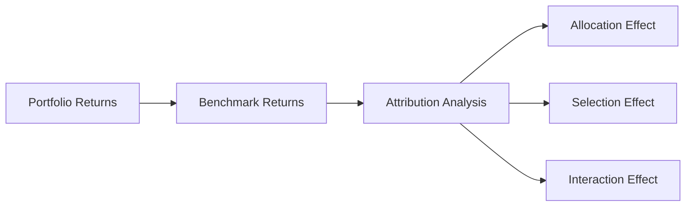

## The Value of Clear Client Communication

Ah, so here’s the deal. Every strong client–portfolio manager relationship thrives on open, honest, and consistent communication. From what I’ve seen over the years, if there’s one place where misunderstandings frequently arise, it’s in the gap between a client’s expectations and how they interpret their portfolio’s performance. Because, let’s be real, clients often feel anxious about market volatility or short-term losses. That’s where purposeful, understandable reporting steps in—it alleviates stress and cements trust.

• Accuracy: Figures on returns, risk metrics, and benchmarks must be correct. Seems obvious, but even minor errors can seriously undermine client confidence.  
• Clarity: Minimize technical jargon. Sure, you may want to detail the finer points of alpha decomposition, but confirm your audience can follow your explanation.  
• Timeliness: Offer updates at appropriate intervals (monthly, quarterly, or on demand), and be ready to react quickly when markets move in unexpected ways.

When you handle these three factors—accuracy, clarity, and timeliness—clients usually become more confident, more informed, and more aligned with the firm’s long-term approach.

## Essentials of Timely Reporting

Timely reporting is more than just ticking a box each quarter. It’s about sending signals of reliability. If you’re late or appear disorganized, clients might suspect negligence or question your stewardship.

Common reporting intervals:
• Monthly or quarterly updates that summarize portfolio performance, major transactions, and updated valuations.  
• Ad hoc reports after significant market events (like a bout of high volatility or a geopolitical shock) to further assure clients of your attentiveness.  

In practice, timeliness also involves responsiveness to client questions. If your client calls unexpectedly, inquiring about currency swings impacting her portfolio, you want to be prepared to address her concerns promptly—no clueless fumbling.

## Performance Attribution: Explaining the “Where” and “How” of Returns

Performance attribution pinpoints precisely where portfolio returns are coming from, as compared to a benchmark. This is especially crucial if you want to demonstrate how you’re adding value—or identify the places you may need to improve.

### A Quick Overview of the Brinson Model

The Brinson model (from Gary Brinson and colleagues) divides return sources into two main effects:  
• Asset Allocation Effect: Did you strategically choose to overweight or underweight particular asset classes relative to your benchmark?  
• Security Selection Effect: Within each asset class, did you choose securities that out- or underperformed their respective sub-benchmarks?

Some expansions add a “timing” or “interaction” effect, which assesses whether you made allocation changes at advantageous times. Here’s a quick snapshot in a flowchart:

In plain language, if your portfolio has a higher weighting in equities than the benchmark, and equities outperform other asset classes, you can chalk up a positive asset allocation effect. But if your chosen equities underperform their sector average, that security selection effect could be negative, offsetting some of the gains.

### Why Attribution Matters

Well, imagine you’re meeting an institutional client who wants to know if paying an active management fee is justified. If you can show that your skillful sector rotation or security choices delivered a consistent alpha, you’re reinforcing the value proposition. Conversely, if results are below par, it clarifies your plan of action (or your rationale for continuing with certain strategies).

## Presenting Performance in Compliance with GIPS

Global Investment Performance Standards (GIPS) exist to make performance presentations consistent and comparable across firms, so it’s crucial to align with these standards for credibility. GIPS compliance signals integrity and reliability in performance measurement and fosters a sense of trust for sophisticated clients, especially institutions.

Key GIPS guidelines revolve around:
• Consistent calculation methods (i.e., time-weighted return vs. money-weighted return, as appropriate).  
• Full disclosure of fees and expenses.  
• Detailed composite construction that groups similar portfolios for performance reporting.  

It can sound a little dull, but in my experience, when you tell an institutional prospect, “Yes, we’re GIPS-compliant,” you often see their shoulders relax a bit. It’s a sign you’re serious about risk controls and measurement consistency.

## Tailoring the Depth of Information

Just between us, I once made the mistake of sending a thoroughly technical performance report to a new retail client. I’ll never forget the wide-eyed look on her face. She wasn’t a financial pro and didn’t have time to decipher standard deviation metrics and correlation heatmaps. Instead, she just wanted to know if she was on track to retire in 15 years. Lesson learned.

Different clients need different details:
• Retail clients might want a simple summary that shows whether they’re on target for major life goals.  
• High-net-worth (HNW) individuals may be comfortable with more detail, especially around tax implications.  
• Institutional investors usually require in-depth analyses covering attribution (asset allocation, selection, typically in the Brinson style), factor exposures, drawdowns, stress tests, and disclaimers for forward-looking projections.  

## Keeping Language Clear and Focused

Everyone—no matter how sophisticated—appreciates clear language. Using obscure portfolio analytics lingo may sound fancy, but it can muddy your message. That said, you might occasionally slip in advanced terms if you know the client base expects them, or if you specifically define them within the report. Combine that with plain English explanations, and you’re golden.

The truth is, a bond immunization strategy might be second nature to you, but to a client, it can read like a strange biology experiment. So do them (and yourself) a favor: explain that immunization is about managing interest rate risk and matching certain cash flows—then they’ll understand why it helps keep certain portfolio liabilities covered.

## Forward-Looking Statements: Handling with Care

Looking ahead is exciting yet hazardous. Overpromising can damage your credibility if the markets don’t cooperate. Instead, approach forecasts with disclaimers:
• State the assumptions behind your capital market expectations (e.g., interest rate projections, growth forecasts, inflation scenarios).  
• Emphasize that these forward-looking statements are not guarantees but rather best estimates based on current conditions and historical data.  

If you do it right, clients appreciate that you’re sharing a sense of direction. If you shoot for the stars with ambiguous disclaimers, that fosters mistrust when actual performance diverges from rosy forecasts.

## Encouraging Regular Interactive Sessions

A hallmark of successful client relationships is the feedback loop. Market conditions and personal circumstances can change quickly, so scheduling calls or meetings every quarter—or more frequently, if warranted—helps keep your approach fresh and relevant.

Some advisors also encourage annual or semi-annual deep-dive reviews to reassess long-term objectives. It’s at these sessions that you can discuss performance attribution in more detail, highlight any new products or strategies, and reevaluate risk profiles.

## Technology for Real-Time Performance and Risk Monitoring

Thanks to modern tech platforms, even smaller investment teams can build digital dashboards that present real-time or near real-time performance data. These dashboards often allow clients to:
• Drill down into holdings by region, sector, or style.  
• Track risk metrics like Value-at-Risk (VaR) or portfolio beta.  
• See comparisons against custom or standard benchmarks.  

When done well, dashboards become a powerful client retention tool. And, from the manager’s perspective, they help cut down on repetitive question-and-answer sessions—the data is right there for the client to see. Of course, you should confirm the security, data accuracy, and user-friendliness of the interface before rolling it out.

## Case Study: A Simple Attribution Example

Imagine you manage a balanced portfolio with an 80% equity allocation and a 20% allocation to investment-grade bonds. The S&P 500 is your equity benchmark, and the Bloomberg U.S. Aggregate Bond Index is your fixed-income benchmark.

• Allocation Effect: Suppose the equity portion soared due to a crucial overweight in technology stocks. You had allocated 85% to equities, while the standard balanced benchmark had only 80%. Because equities outperformed bonds, that extra 5% equity weighting gave you a positive allocation effect.  
• Selection Effect: Within the equity sleeve, you favored certain technology stocks that outperformed the broader S&P 500. This further enhanced performance.  
• Interaction Effect: If you increased your tech overweight right before a surge in risk appetite, well, that’s timing at play, giving you positive alpha from your decision’s timing.  

By breaking down the returns into these categories, your clients see exactly which decisions added (or subtracted) value relative to a reference point. Clients love to know that you didn’t just “get lucky” but actually made strategic calls that panned out.

## Key Terms

• Performance Attribution: A framework to identify how different decisions (asset allocation, security selection, timing) contribute to overall return.  
• Brinson Model: A method of performance attribution that separates returns into allocation and selection components.  
• Timeliness (Reporting): Providing portfolio updates at regular intervals and ensuring quick responses amid market events.  
• Forward-Looking Statements: Projections about potential future financial performance, always accompanied by disclaimers on uncertainties.  
• Risk Metrics: Tools (e.g., volatility, tracking error, VaR) that measure a portfolio’s risk exposure.  
• Client Dashboard: A digital interface allowing clients to check holdings, returns, and risk data, often in real-time.  
• Benchmark: A reference index or a composite measure used to gauge how well a portfolio has performed.  
• Jargon: Specialized language that may confuse clients and should usually be minimized.

## Best Practices and Common Pitfalls

• Best Practices:  
  – Ensure your performance reports are consistent with recognized standards like GIPS.  
  – Use plain language, and define or simplify technical concepts.  
  – Provide layers of detail so clients can “dig deeper” if they want.  
  – Incorporate forward-looking guidance responsibly, with disclaimers.  

• Pitfalls:  
  – Overattributing success to skill when it could be market beta or plain luck.  
  – Withholding unfavorable info or burying it deep in footnotes—always be forthright.  
  – Flooding clients with data. Too much detail or overly complex analyses can obscure the big picture.  
  – Ignoring clients’ emotional or behavioral biases in how they understand performance.

## Conclusion and Exam Tips

You can probably see that effective client reporting boils down to being transparent, correct, and timely. Performance attribution is a vital tool to describe the efficacy of your investment decisions, demonstrate how you’ve met or exceeded benchmarks, and pinpoint areas for improvement. Also, remember to maintain compliance with high-level reporting standards: GIPS is top of the list for many. On the CFA exam, you’ll likely face scenario-based questions requiring you to interpret a portfolio’s performance or attribute results to selection or allocation. The question might ask you to outline how you would communicate these findings to a retail-versus-institutional audience. Be sure to practice explaining technical analytics in plain language, because the exam—and real life—often hinge on clarity.

----------

**References & Further Reading:**  
• CFA Institute. “Manager Selection and Performance Attribution.”  
• Lawton, Philip, and Todd Jankowski. “Investment Performance Measurement.”  
• BlackRock White Papers on Client Reporting.  
• Vanguard Insights on Timely and Transparent Client Communication.  

## Test Your Knowledge: Performance Attribution and Client Communication



### Which key attribute supports strong client communication and helps build trust?

- [ ] Using highly technical analytics without explanation
- [ ] Presenting data infrequently to avoid overwhelming the client
- [x] Providing accurate, clear, and timely information
- [ ] Sending only performance results, ignoring risk metrics

> **Explanation:** Accuracy, clarity, and timeliness are vital signs of strong client management. Without these factors, trust quickly erodes.

### In the Brinson model of performance attribution, which of the following is typically analyzed?

- [x] Asset allocation and security selection effects
- [ ] Leverage and liquidity effects only
- [ ] Regulatory and tax effects alone
- [ ] Manager compensation structure

> **Explanation:** The Brinson model splits return sources into asset allocation, security selection, and potentially interaction effects.

### GIPS compliance primarily helps achieve which of the following outcomes?

- [ ] Maximizes the portfolio’s expected return
- [ ] Guarantees forecasting accuracy
- [ ] Ensures zero tracking error
- [x] Provides standardized and credible performance reporting

> **Explanation:** GIPS is focused on standardizing performance measurement and promoting transparency and comparability, not guaranteeing specific outcomes.

### When reporting to retail clients, which practice is most recommended?

- [x] Use approachable language and context-based explanations
- [ ] Provide equation-heavy charts with minimal interpretation
- [ ] Focus primarily on industry jargon and advanced metrics
- [ ] Avoid any mention of benchmarks or risk

> **Explanation:** Retail clients often need easily digestible information, free of overly complex jargon.

### Which of the following statements about forward-looking projections is most appropriate?

- [ ] They should be specific enough to guarantee performance outcomes
- [ ] They should never be shared with clients
- [x] They should be offered with clear disclaimers and uncertainty acknowledgments
- [ ] They must always be based on a single, deterministic scenario

> **Explanation:** Forward-looking statements can be helpful but must include clear disclaimers explaining uncertainty and assumptions.

### What is a notable benefit of using digital dashboards for client communication?

- [x] Clients can access near real-time performance and risk updates
- [ ] It completely prevents market volatility
- [ ] It replaces the need for performance attribution
- [ ] It guarantees regulatory compliance automatically

> **Explanation:** Dashboards provide convenient, on-demand insights, though they do not eliminate the fundamentals of volatility or the need for professional oversight.

### Which is a common pitfall in client reporting?

- [ ] Offering multiple levels of detail
- [x] Glossing over negative performance or burying it in fine print
- [ ] Aligning reporting with GIPS
- [ ] Including disclaimers about economic uncertainties

> **Explanation:** Hiding underperformance erodes trust and can violate ethical standards.

### In performance attribution, the interaction effect typically refers to:

- [ ] The direct result of fees and transaction costs
- [x] The additional return from timing decisions in both allocation and security selection
- [ ] The stimulus from central bank policy changes
- [ ] The synergy from combining risk metrics and forward-looking statements

> **Explanation:** The interaction effect measures how the timing of allocation and selection decisions influences overall portfolio returns.

### When an institutional client requests more granular data on sector allocation:

- [x] Provide the detail, explaining how each sector contributed to performance relative to the benchmark
- [ ] Decline to disclose the breakdown to maintain confidentiality
- [ ] Summarize only total portfolio return
- [ ] Convert the data into a single M² figure

> **Explanation:** Institutions typically require and appreciate sector-level detail for deeper analysis.

### True or False: Performance attribution helps identify whether a portfolio’s outperformance was driven by luck or by the manager’s actions.

- [x] True
- [ ] False

> **Explanation:** Performance attribution pinpoints the sources of returns, showing the impact of specific decisions relative to market actions.


