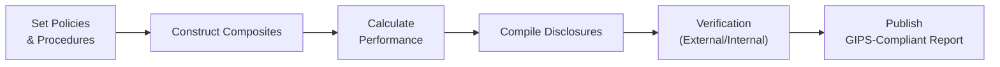

## Why GIPS Matters
It’s easy to get excited when your portfolio returns exceed the competition’s, right? But how do you know if all managers measure and present performance the same way? A few years ago, I chatted with a friend who boasted about their firm’s “incredible track record.” After digging a bit, I found out they sometimes excluded underperforming accounts from that track record. Oops. That’s part of what the Global Investment Performance Standards (GIPS) aim to prevent—“cherry-picking” the good stuff and hiding the bad. GIPS basically says: let’s all play by the same performance-reporting rulebook so investors can have apples-to-apples comparisons.

## The Underlying Purpose
Think of GIPS as a universal language for investment performance. It was developed by the CFA Institute to solve the problem of inconsistent and, let’s be honest, sometimes misleading performance reporting practices. When a firm claims GIPS compliance:
• It commits to transparent calculation and presentation of historical returns.  
• It doesn’t get to selectively omit losers from the track record.  
• It groups similar portfolios into what’s called a “composite.”  

The big plus? Investors gain confidence that a GIPS-compliant firm is telling the full story of how it manages money.

## The Heart of Performance Measurement
So, how do managers calculate their performance under GIPS? Let’s spotlight a couple of concepts:

• Time-Weighted Return (TWR): This approach weights each sub-period based on the portfolio’s value, reducing the effect of large cash inflows or outflows. GIPS typically recommends TWR for standard performance reporting.  
• Money-Weighted Return (MWR): Also known as the Internal Rate of Return (IRR), more suitable when the manager actually controls the timing of cash flows. But due to complexities, TWR remains the GIPS “go-to” in most typical circumstances unless you’re dealing with private equity or certain real estate assets.

For example, in Python, you might quickly check a TWR calculation:

```python
import numpy as np

returns = [0.05, -0.02, 0.04, 0.06]

growth_factors = [1 + r for r in returns]
twr = np.prod(growth_factors) - 1

print("Time-Weighted Return:", f"{twr:.2%}")
```

This little snippet sequentially multiplies each (1 + period return) factor to get the overall TWR. GIPS helps standardize how you’d present something like this to a client.

## Understanding Composites
Portfolios with a similar investment objective or strategy are typically grouped into what's known as a “composite.” Suppose a firm has six international equity portfolios. It must include each of these in an international equity composite if these portfolios have discretionary mandates (i.e., the manager is free to invest or divest as they see fit). The main GIPS mantra here: “All actual, fee-paying, discretionary portfolios must be included in at least one composite.” No playing hide-and-seek with poor performers.

If you accidentally exclude a struggling portfolio from a composite or misclassify it under a different strategy for the sake of boosting your performance presentation, that’s the kind of cherry-picking GIPS is designed to prevent.

## Ensuring Fair Valuation
GIPS insists on fair value methodologies for all investments, from liquid stocks to illiquid real estate. Now, we’ve all seen markets get crazy, which can make “fair value” feel like guesswork. But GIPS has your back:
• Managers are required to define (and consistently apply) credible valuation methods.  
• Many managers rely on independent appraisers or recognized pricing models.  
• For private equity and alternatives, GIPS details additional guidelines (like using valuations in line with the International Private Equity and Venture Capital Valuation (IPEV) Guidelines).  

Perhaps you’re wondering, “What if the investment is a unique piece of real estate with no comparable sales?” GIPS wants you to document a robust approach—like a specialized appraisal—to ensure you’re not inflating the numbers.

## Required Disclosures
GIPS leaves no room for vagueness in how you show performance. Managers must openly discuss:
• The specific strategies or styles of each composite.  
• The fees applicable (management fees, performance fees, etc.).  
• The currency used (it can be USD, EUR, GBP, anything, but you have to say which one).  
• The relevant benchmarks (and if no benchmark is appropriate, you must say so).  

In effect, it’s the difference between a cryptic “we returned 10%” and a thorough “our composite achieved 10% net-of-fee returns in USD over the last 12 months, compared to a 9% rise in the XYZ benchmark.”

## The GIPS Verification Process
There’s something reassuring when an independent party says, “Yes, you’re doing everything right.” Enter GIPS verification. Firms hire a third-party verifier to review:
• Policies and procedures related to composite construction.  
• Calculation methods for returns.  
• How firms comply with the entire GIPS framework.

Verification is not mandated by GIPS, but it sure adds credibility. If a firm’s marketing claims “We are GIPS-compliant, and we have been verified,” it usually instills greater trust among institutional clients. Some firms also do internal checks, but an external verification is typically more respected.

## A Quick Visual
Here’s a little flow diagram showing a firm’s GIPS compliance process:



Think of it as a repeatable loop: the better your documentation and methodology, the smoother each cycle will be.

## Implementation Challenges and Best Practices
From experience, I recall the time a small asset manager balked at the complexity of GIPS. They had only five portfolios yet found themselves buried in the details. Honestly, the best tip: start small. Document each step meticulously, use consistent software or spreadsheets for calculations, and confirm every portfolio belongs to a relevant composite.

Best practices also involve:
• Training teams in GIPS guidelines.  
• Automating data collection and reconciliation to reduce the risk of manual errors.  
• Setting up a robust compliance calendar to keep an eye on changes to GIPS.  

## Evolving Standards for ESG and Alternatives
GIPS is never static. It gets revamped to address new frontiers in finance. From private debt funds to impact investing strategies, GIPS constantly evolves. If you manage ESG-focused portfolios, you must be mindful of additional or nuanced disclosures—like how you apply negative screens or measure carbon footprint. You might see upcoming GIPS guidance on presenting these specialized metrics so that everything remains consistent worldwide.

## Marketing Claims the Right Way
Let’s face it: claiming GIPS compliance can be a great marketing advantage. But GIPS is clear on how these claims can be phrased. For instance, saying you are “GIPS-certified” is a no-go because GIPS doesn’t “certify” anyone. The correct approach is something like: “ABC Asset Management claims compliance with the Global Investment Performance Standards (GIPS).” Make sure to avoid overselling, and ensure you are fully in compliance. Otherwise, the potential damage to your reputation is massive.

## Practical Example
Imagine your firm manages three composites:
• Composite A: Large-cap growth strategy (three portfolios)  
• Composite B: Small-cap value strategy (eight portfolios)  
• Composite C: Fixed income strategy (two portfolios)  

Under GIPS, you’d produce a compliant presentation for each composite. For each, you’d highlight:
• The net-of-fee return for each year in the track record (at least five years initially, building up to ten).  
• The benchmarks used.  
• The number of portfolios in the composite and total assets.  
• Any events that affected performance (like a manager transition).  

If you tried to remove a portfolio that simply flopped in 2023, you’d breach GIPS. Each composite must include all discretionary portfolios for that strategy, full stop. Investors can then see the good, the bad, and the (hopefully not too) ugly.

## Common Pitfalls
• Inconsistent Valuation Methods: Using one approach for your “star” portfolio and a different approach for the rest is a no.  
• Partial Reporting: Presenting only partial periods or skipping months can mislead performance.  
• Mixing Gross vs. Net Returns: Failing to clearly show how fees factor into returns can confuse or mislead clients.  
• Incorrect Benchmark Comparisons: Must align the benchmark with the strategy.  

## Linking GIPS to Broader Portfolio Management
In earlier chapters, you saw how we measure risk and return (see Chapters 2 and 3 on risk/return). GIPS picks up where those frameworks leave off, ensuring that performance presentation is consistent, accurate, and globally comparable. Investors, analysts, and regulators want confidence that the numbers they see reflect robust calculation methods (Chapters 2.3 and 3.4 might come to mind).  

## Exam Tips for GIPS Compliance
Exam questions often revolve around:
• Recognizing what’s allowed vs. what’s prohibited under GIPS.  
• Identifying whether certain disclosures (fees, composites) are mandatory.  
• Understanding verification, marketing claims, and fair-value applications.  
• Spotting issues like “cherry-picking” or improper composite inclusion.  

When faced with (constructed response) exam prompts, watch for tricky details. If a firm omitted a newly-founded portfolio from a composite on the grounds that it had only one month of data, is that GIPS-compliant? Probably not—most likely, you must include it once it meets your defined composite criteria.  

And time management matters, so structure answers clearly: mention the relevant GIPS guidelines, apply them to the scenario given, and conclude succinctly.

## Recommended Reading
• Global Investment Performance Standards (GIPS):  
  https://www.cfainstitute.org/ethics-standards/gips  
• “Global Investment Performance Standards Handbook” by CFA Institute  
• GIPS Guidance Statements on the CFA Institute website  

## Test Your Knowledge: GIPS Compliance and Performance Reporting



### Which of the following best describes a composite in the context of GIPS?

- [ ] A grouping of all portfolios in an asset management firm, regardless of strategy.
- [x] An aggregation of portfolios managed under a similar approach or mandate.
- [ ] A measurement tool that evaluates only the top-performing accounts.
- [ ] An external body that verifies GIPS compliance on behalf of asset managers.

> **Explanation:** Under GIPS, a composite is a group of portfolios managed under a similar investment strategy or objective. It includes all eligible (i.e., discretionary) portfolios that fit the composite definition.

### In a GIPS-compliant presentation, which type of return calculation is generally preferred for publicly traded equity portfolios?

- [x] Time-weighted return (TWR).
- [ ] Money-weighted return (MWR or IRR).
- [ ] Simple average return of month-end balances.
- [ ] Gross return ignoring any management fees.

> **Explanation:** The time-weighted return (TWR) is regarded as the standard for most equity (and other liquid asset) portfolios because it removes the impact of external cash flows over which the manager typically has no control.

### Which of the following issues would most likely violate GIPS disclosure requirements?

- [ ] Including annual benchmarks for each composite.
- [ ] Reporting performance net of fees.
- [ ] Omitting the firm's total assets under management in the performance presentation.
- [x] Excluding currency information and presenting all returns without specifying an exchange rate or base currency.

> **Explanation:** GIPS requires that presentations disclose critical information, such as currency used for performance calculation. Failing to specify the currency can mislead or confuse investors.

### Which statement correctly identifies a firm’s right to claim GIPS compliance?

- [x] “We claim compliance with GIPS and have adhered to its policies and procedures.”
- [ ] “We are GIPS certified for 2023-2024 by the CFA Institute.”
- [ ] “We comply with the GIPS code solely for our popular composites.”
- [ ] “We are partially compliant and exclude certain result periods from the analysis.”

> **Explanation:** Under GIPS, a firm should properly indicate that it “claims compliance” with GIPS, rather than saying it’s “certified.” Compliance must be firm-wide, not just for certain composites or time periods.

### When incorporating private equity and real estate investments under GIPS, which of the following practices is crucial?

- [x] Using appropriate fair value methodologies or independent appraisals for each investment.
- [ ] Valuing each property at its original purchase price until sale.
- [x] Applying an internal rate of return model for performance measurement if appropriate.
- [ ] Eliminating underperforming real estate assets from the composite.

> **Explanation:** Private equity and real estate necessitate special care in valuations. GIPS typically requires an independent or consistent fair value approach, and money-weighted returns (IRRs) are often used. Manager must also include all relevant assets in the composite.

### What is one key purpose of the GIPS verification process?

- [x] To have an independent reviewer assess whether a firm’s policies and procedures comply with GIPS standards.
- [ ] To have the CFA Institute directly audit a firm’s returns.
- [ ] To remove the need for any internal audits of performance data.
- [ ] To guarantee higher returns for the firm’s portfolios.

> **Explanation:** GIPS verification is an external review (though not performed by the CFA Institute itself) that confirms the firm’s processes are designed to comply with GIPS.

### A firm must disclose all fees in GIPS-compliant presentations, including which of the following?

- [x] Management fees explicitly charged to the client.
- [ ] Only performance fees if performance is negative.
- [x] Performance-based fees that might apply to certain portfolios.
- [ ] Office maintenance and technology fees.

> **Explanation:** GIPS mandates disclosure of all fees that directly affect investor returns, such as management and performance fees. Overhead costs like technology or office rent are typically not required in performance presentations unless they directly reduce returns.

### What is the potential risk of using unverified GIPS compliance statements in marketing?

- [x] Diminished credibility if compliance is challenged.
- [ ] Automatic acceptance by conservative institutional investors.
- [ ] Elimination of the need for a prospectus.
- [ ] Reduced transparency regarding methodology.

> **Explanation:** Firms that claim GIPS compliance without third-party verification may lose credibility if their compliance is disputed or an internal process is found lacking.

### Which of the following best demonstrates GIPS-compliant treatment of a new portfolio added mid-year?

- [x] Include the portfolio in the appropriate composite as soon as it meets discretionary requirements.
- [ ] Exclude the portfolio from every composite until it has a full year of performance.
- [ ] Only include the portfolio if it performs better than the composite’s existing average.
- [ ] Include the portfolio once it accumulates at least three consecutive months of negative returns.

> **Explanation:** GIPS requires that all eligible (discretionary, fee-paying) portfolios be included in the relevant composite as soon as they meet the composite’s definition. Arbitrary exclusion or waiting for better or worse performance is not permitted.

### GIPS primarily seeks to enhance:

- [x] Transparency and comparability of performance data across investment firms.
- [ ] The confidentiality of private equity fund data.
- [ ] Marketing restrictions on hedge fund returns.
- [ ] The absolute level of investment returns by eliminating fees.

> **Explanation:** GIPS exists to establish a standardized, transparent, and globally consistent framework for calculating and presenting investment performance, facilitating fair comparisons among asset managers.


