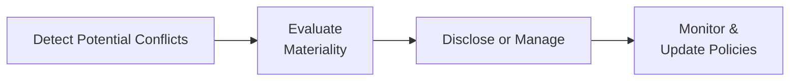

## Introduction

Have you ever been at a family gathering where, say, your cousin is quietly lobbying you to invest in his new start-up while you’re torn between wanting to help and not really believing his idea is all that brilliant? It’s a tricky spot. In professional finance, we have similar tight spots—just on a bigger scale. These are called “conflicts of interest.” A conflict of interest arises when a financial professional’s personal or corporate incentives could compromise—or appear to compromise—their objectivity and integrity.

This section addresses the nature of conflicts of interest, why they occur, and why they’re so critical to avoid (or at least manage). We’ll also cover what an effective conflict-of-interest policy should look like and how to uphold a strong compliance culture. Yes, it can be a bit tedious—like reading instructions before you use a new gadget—but mastering these principles is absolutely crucial for long-term success and credibility in portfolio management.

## Identifying Common Conflicts of Interest

Before we talk about dealing with conflicts, we should recognize their usual suspects. Most revolve around money or influence. Below are a few you’re likely to see in professional practice:

Compensation Structures  
When someone’s compensation depends on commissions or product sales, that professional could be tempted to push riskier or more expensive solutions on clients. Picture a junior investment advisor who earns a higher bonus if they sell certain niche products: the natural (though not laudable) inclination might be to favor these products, even if there are better options for the client.

Proprietary Trading  
Proprietary trading occurs when a firm invests its own capital, potentially running counter to a client’s best interests. For example, the firm might prioritize its own trades to take advantage of market movements before executing client trades. That’s obviously not the reputational headline any firm wants.

Selling In-House Funds or Products  
Many investment management companies have their own mutual funds or exchange-traded funds (ETFs). If your firm is heavily incentivized to sell only its in-house selection, you may ignore third-party products that could be a better fit for the client. Again, that’s a conflict: your goal is to serve the client, not to push your firm’s brand for the sake of brand loyalty alone.

Relationships with Affiliated Firms  
In a large financial conglomerate, you might have sister companies that do investment banking, auditing, or real estate underwriting. These affiliated businesses might share leads or pass you internal deals. This cross-referral can lead to subtle pressures: “Hey, pass them a good rating on their equity issuance—remember, they’re affiliated with us.” If that pressure isn’t handled ethically, it can degrade the quality of research or advice and undermine client trust.

## Crafting a Robust Conflict-of-Interest Policy

Let’s say you’ve identified potential trouble spots. That’s good, but it’s only half the battle. The next step: developing a formal policy that sets standards for detecting, managing, and disclosing these conflicts.

Key components typically include:

• Detection Procedures  
Outline how employees and the compliance team should identify conflicts. Some firms use questionnaires, others rely on periodic self-reports. Still others build data analytics platforms that flag unusual P&L or suspicious trading patterns.

• Management Guidelines  
Recognize that not all conflicts are created equal. Some conflicts can be managed through robust processes (e.g., restricting or pre-clearing certain trades), while others are strictly prohibited (e.g., front-running client trades).

• Disclosure Requirements  
Require that all actual or potential conflicts be shared with compliance personnel, relevant regulators if necessary, and—importantly—clients. For instance, clients should be clearly informed if your compensation is higher for in-house products or if the firm’s proprietary trading desks might trade the same securities on different timelines. Clients can’t evaluate or consent to risk they don’t know about.

Below is a simple diagram outlining a policy lifecycle:

## Managing and Disclosing Conflicts

After detection and classification, a firm usually decides how best to handle the conflict in question. At times, it’s more of a “contain-and-control” approach; at others, it’s best to bar the activity entirely. Many compliance officers have a fundamental principle: if you can’t confidently explain the arrangement to a client—and how it won’t harm them—then it probably shouldn’t happen.

• Prohibition of High-Risk Activities  
Some firms prohibit employees from investing in clients’ IPO allocations (initial public offerings) due to conflict potential. Others ban personal trading in the same securities covered by the research department. Prohibitions can feel heavy-handed, but they’re particularly helpful for high-risk conflicts.

• “Chinese Walls” or Informational Barriers  
Imagine a firm that does both investment banking and asset management. The investment banking side might be loaded with confidential information about upcoming deals or acquisitions, while the asset management side invests in similar or the same companies. To avoid illegal or unethical cross-pollination of information, these departments operate under “Chinese walls.” It’s basically a fancy term for “don’t talk to each other about sensitive stuff.” In practice, this means physically separating teams and restricting shared IT systems, among other controls.

• Clear, Plain-Language Disclosures  
We see too many disclaimers these days—some so dense that you’d need an attorney and a pot of coffee to decipher them. Disclosures, though, should be meaningful, working in plain language like: “We receive compensation from [Company X] if you purchase their funds. Though we select funds in good faith, you should be aware of this arrangement.” Transparency fosters trust and lets clients decide if the conflict is tolerable.

## Encouraging a Robust Compliance Culture

Compliance goes far beyond a policy manual collecting dust on a shelf. It involves building an environment where ethical conduct is prized and employees feel empowered to speak up. That said, sometimes employees are afraid if they speak up, they’ll get in trouble or rock the boat. So, cultivating trust and open communication is crucial.

• Ethics Training and Scenario-Based Exercises  
Much like sports teams that run drills over and over to prepare for game day, employees benefit from real-world “drills”—ethics training sessions featuring plausible conflict scenarios. For instance, an employee might be encouraged to “just do what it takes” to keep a prized client from leaving. By rehearsing these scenarios, advisors can later handle them with composure and integrity in real life.

• Reporting Channels and Whistleblower Protections  
It’s important to offer secure and confidential ways for employees to raise potential or actual conflicts. Internal hotlines or third-party ombudsman services can help. The easier it is to report, the more likely employees will do so before conflicts fester.

• Leadership Engagement  
When senior leaders emphasize and reward ethical behavior, employees pay attention. A culture of compliance has to come from the top; if executives cut corners, no training program will fix the culture.

## Real-World Examples and Applications

Below are a few real-style illustrations (in simplified form) that often come up in practice:

• Proprietary Trading Prioritization:  
A big investment bank places trades for its clients in, say, the oil sector. Meanwhile, the bank’s proprietary trading desk also invests heavily in oil companies, often front-running client trades to glean profits for the firm. This leads to client trades receiving worse pricing. Over time, clients discover these suspicious patterns and shift their business elsewhere. Regulatory fines ensue, too.

• Selling In-House Funds:  
A brokerage firm aggressively markets its line of target-date retirement funds, offering sales bonuses to advisors. Advisors push clients into these funds despite cheaper and equally effective alternatives. Upon an audit, regulators find that the firm never disclosed these incentives to clients, resulting in forced restitution and significant reputational damage.

• Family Connections:  
A portfolio manager invests client assets in a real estate development. Turns out, her spouse is a major investor in that development. She doesn’t reveal this tie, and ironically, the project is later revealed to be fraught with mismanagement. Clients lose significant capital; lawsuits follow. The manager can’t claim ignorance because the connection was personal and easy to disclose upfront.

## Emerging Conflicts and Ongoing Monitoring

Financial services do not stand still. New product lines or partnerships will come along, and with them, new conflicts. Perhaps your firm starts to offer robo-advisory or a new digital-asset product. How do you ensure the recommendation algorithms remain unbiased when the firm also profits from certain vendor relationships?

Firms need to revisit their conflict-of-interest policies whenever they expand into new areas. A good practice: require each proposed business venture to undergo a “conflict stress test” to see if you might inadvertently incentivize unethical conduct. Proactive thinking now can save a mountain of trouble later.

## Best Practices and Final Exam Tips

• Develop and regularly update conflict-of-interest policies. Keep the language fresh and relevant to your business environment.  
• Maintain strong leadership and tone at the top—this can’t be just lip service.  
• Provide easy channels for employees to seek guidance or report potential conflicts.  
• Use scenario-based training to keep staff engaged and prepared.  
• Remember: disclosure is vital. If clients don’t know about conflicts, they can’t protect themselves (or at least make informed decisions).  

For exam takers (and let’s be honest, for real-life practitioners) focusing on how conflicts of interest can arise in investment management is key. On the exam, you might see scenario-based questions that require you to spot a potential conflict and then recommend proper disclosures or procedures to address it. The best approach? Understand the underlying principles, not just memorized checklists. That principle-based method helps you handle the real, messy world of finance—both on the test and in your career.

## References

• CFA Institute Code of Ethics and Standards of Professional Conduct  
• IOSCO (International Organization of Securities Commissions) Conflict of Interest Guidelines:  
  https://www.iosco.org/  
• “Ethical Decision Making in Finance” by John R. Boatright  

## Conflicts of Interest Mastery Quiz



### A portfolio manager is compensated through performance-based fees. Which of the following is a valid concern regarding conflicts of interest?

- [ ] Performance fees generally yield lower returns for clients.  
- [ ] The manager is mandatorily forced to invest only in low-risk assets.  
- [x] The manager may focus on high-risk investments to maximize performance fees.  
- [ ] The manager has no incentive to exceed benchmark returns.  

> **Explanation:** Performance-based fees can lead managers to take on excessive risk to boost returns (and therefore fees), which might go against certain client objectives.

### Which policy element best addresses how to react when a staff member encounters a conflict of interest?

- [ ] Documenting the conflict without disclosing it to the client  
- [x] Management guidelines that provide procedures to mitigate or prohibit certain activities  
- [ ] Reducing the investment in question to an immaterial amount  
- [ ] Aggregating all conflicts into a single monthly report  

> **Explanation:** Management guidelines clearly specify how employees should act (or refrain from acting) when conflicts are discovered.

### Which of the following statements best describes an informational barrier (Chinese Wall)?

- [ ] It is an employee rotation program to increase productivity in different units.  
- [ ] It is the process of storing confidential data in a shared database for easy access.  
- [x] It is a separation of certain business units to prevent sharing non-public or sensitive information.  
- [ ] It is a device to allow more efficient communications between research and sales teams.  

> **Explanation:** A “Chinese Wall” aims to keep sensitive information within the proper team and prevent conflicts that arise when inside information leaks to other parts of the firm.

### A firm’s compliance culture is strong when:

- [x] Employees feel comfortable raising issues without fear of consequence.  
- [ ] Only employees in the compliance department know conflict-of-interest policies.  
- [ ] The firm invests primarily in low-risk funds.  
- [ ] Clients are held responsible for identifying conflicts.  

> **Explanation:** A robust culture encourages open reporting of ethical concerns. If employees fear retaliation, potential conflicts often go unreported.

### A conflict-of-interest policy that requires employees to pre-clear personal trades between specified blackout windows is primarily aimed at addressing:

- [x] Front-running or insider trading.  
- [ ] Performance-based fees.  
- [x] Excessive market speculation.  
- [ ] Fiduciary standard requirements for all clients.  

> **Explanation:** By controlling the timing of employee trades, you reduce the chance that employees can exploit forthcoming trades or inside knowledge.

### A portfolio manager who receives a bonus for selling proprietary mutual funds without disclosing it to clients is:

- [x] Violating disclosure principles and risking a conflict of interest.  
- [ ] Complying with standard fee structures as mandated by regulators.  
- [ ] Eliminating any conflict by providing only the firm’s products.  
- [ ] Protected by safe-harbor laws on compensation.  

> **Explanation:** Failing to disclose that compensation is directly linked to the products sold compromises objectivity and is a clear conflict of interest.

### When a firm’s brokerage affiliate recommends the asset management division’s funds to clients and obtains a direct commission, what action is most appropriate?

- [ ] Refrain from offering the asset management funds at all.  
- [x] Disclose the nature of the fee arrangement to the client clearly and manage or mitigate if necessary.  
- [x] Report the practice only internally, as it’s not material to client decisions.  
- [ ] Eliminate the brokerage affiliate entirely.  

> **Explanation:** Firms that are affiliated should either avoid these arrangements entirely or disclose the relationship and fee structure, so clients understand potential conflicts.

### What is the main purpose of a “conflict stress test” when launching a new line of business?

- [ ] Calculating capital adequacy ratios for the new product.  
- [x] Identifying how any new conflicts might arise and planning ways to address them.  
- [ ] Ensuring that employees can handle the new technology.  
- [ ] Eliminating the need for further compliance reviews.  

> **Explanation:** Performing a conflict stress test helps anticipate new conflicts and sets controls to mitigate them early.

### Which scenario best exemplifies a conflict of interest requiring disclosure?

- [x] A portfolio manager invests in a company where her sibling is CEO.  
- [ ] A portfolio manager invests personally in an index fund.  
- [ ] A portfolio manager invests in government bonds following client instructions.  
- [ ] A portfolio manager invests in a company’s stock after it was downgraded by multiple analysts.  

> **Explanation:** A direct family relationship can cloud objectivity and must be disclosed to the firm (and often to clients).

### True or False: A thorough conflict-of-interest policy can eliminate the need for ethics training.

- [ ] True  
- [x] False  

> **Explanation:** Even the best policy won’t help if employees lack an ethical mindset or don’t understand how to apply the policy. Ethics training remains essential.


