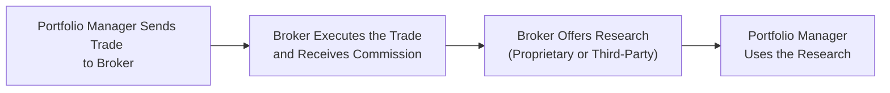

## Introduction to Soft Dollar Arrangements

Imagine you’re managing a client’s portfolio, and your broker says, “Hey, place your trades through us, and in return, we’ll give you some research reports that could help you spot emerging market trends more quickly.” That, in a nutshell, is a soft dollar arrangement. In more technical terms, soft dollar arrangements occur when brokerage commissions—paid out of a client’s securities transactions—are used to acquire research or other services. This should (theoretically) benefit the client by aiding investment decision-making.

There’s also a bit of a puzzle here: you’re paying commissions anyway, but are the research and services you get in return genuinely helping the client? Or are they just freebies that might lead to conflicts of interest? Sorting that out is one of the big responsibilities a portfolio manager grapples with when deciding whether to enter a soft dollar arrangement. In this article, we’ll explore what soft dollars are, their key benefits (and pitfalls!), and best practices for making sure these arrangements uphold professional standards.

## Why Soft Dollars Matter

Soft dollar arrangements can be a meaningful component of a portfolio manager’s toolkit. It’s like trading convenience: instead of paying hard cash out of the firm’s budget for research, managers use brokerage commissions (client money) to get those services. But with convenience comes responsibility—ensuring that these arrangements genuinely serve the client’s interests.

From a historical perspective, soft dollars gained popularity as brokers began bundling research with their execution services. Over time, comprehensive guidelines emerged (thanks in large part to the CFA Institute Soft Dollar Standards and regulatory mandates such as MiFID II in the EU) to keep these arrangements transparent and aligned with fiduciary duties.

## The Fiduciary Angle

One of the biggest points to remember is that the commissions funding the soft dollar goodies aren’t coming from the portfolio manager’s own pocket; they come right out of the client’s trades. So the manager stands in a fiduciary role. You have to confirm that any product—whether it’s research, analytics tools, or even a fancy software platform—directly bolsters portfolio decision-making for that client. Spending inflated commissions on random “perks” that do nothing for the portfolio is a big no-no.

## Key Principles of Soft Dollar Arrangements

### Seek Best Execution First
When a portfolio manager routes trades solely to secure research, there’s a risk that the actual execution quality might suffer. Commissions may be higher than they need to be, or fill prices may be less competitive. Trust me, regulators and clients will look to see whether you prioritized best execution. Best execution means you’re getting the best possible outcome for the client, taking into account price, speed, likelihood of execution, and overall cost.

### Use Soft Dollar Benefits for the Client
Ever had that moment where you think, “Oh, I could repurpose that research for my marketing slides or for some internal training that’s only tangentially related to client needs”? Well, that’s exactly what you can’t do. If the soft dollar arrangement is supposed to support the client’s portfolio decisions, then that’s how you use it—period.

### Clear and Ongoing Documentation
It’s not enough to say “we trust the broker is giving us good research.” You’ll need to keep a paper trail explaining:
• Why you chose a particular broker.  
• The nature of services or research received.  
• How these services directly contributed to investment choices.  
• How you verified commission rates were fair and competitive.  

And yes, as you might guess, regulators will want to see these records if there’s ever any question about conflicts of interest or less-than-ideal trading practices.

### Disclosure to Clients
Just like you wouldn’t want to surprise your best friend with hidden costs, you definitely don’t want to surprise your client. Incorporate your soft dollar policies in your Investment Policy Statement (IPS) or relevant disclosures. Clients need to know:
• That you use soft dollar arrangements.  
• The criteria you employ to select brokers offering these arrangements.  
• Potential conflicts of interest—especially how you mitigate them.  

Sometimes folks get squeamish about sharing details, but being up-front with clients fosters trust. Everyone loves transparency!

## Types of Soft Dollar Research and Services

In practice, soft dollar arrangements provide a range of resources. Here’s a quick breakdown:

### Proprietary Research
Proprietary research is created by the broker-dealer itself. Maybe they have an in-house team of analysts performing fundamental research or quantitative modeling. If they’re good, great! But you’ll want to ensure that the broker’s proprietary research meets quality standards and addresses your client’s portfolio needs.

### Third-Party Research
This is when a broker-dealer provides research from an external source, such as an independent research outfit. A portion of your commissions effectively fund that external research. The big question here? Is the third-party research accurate, unbiased, and robust? Don’t rely on it blindly; ensure it fits with your investment philosophy and processes.

### Online Data and Analytics Tools
Some brokers might offer specialized analytics packages that help you monitor real-time pricing or run portfolio stress tests. If those tools help your investment process, they can be perfectly legitimate. Just confirm they’re not duplicates of something you’re already paying for as an organization. And always make sure the cost behind these tools is commensurate with the value they provide to clients.

## Balancing Commissions and Value

One thing that sometimes trips managers up is figuring out if they’re paying “reasonable” commissions. You might pay a slight premium above rock-bottom rates if you believe that better execution or more relevant research is worth it. But you have to be able to demonstrate that the extra cost translates into real, demonstrable client benefits. Otherwise, you’re just padding the broker’s wallet without a strong justification.

Below is a simplified approach that some managers use to track commission allocation relative to perceived research benefit:

```python

import pandas as pd

data = {
    'Trade_ID': [101, 102, 103],
    'Notional_Value': [500000, 300000, 700000],
    'Commission_Rate_bps': [3, 2, 4],   # bps = basis points
    'Estimated_Research_Value': [150, 70, 300]  # subjectively assigned
}

df = pd.DataFrame(data)

df['Commission_Cost'] = (df['Notional_Value'] * df['Commission_Rate_bps']) / 10000

df['Value_minus_Cost'] = df['Estimated_Research_Value'] - df['Commission_Cost']

print(df)
```

Of course, that’s a naive approach. In real life, you’ll have more complex inputs—execution quality metrics, slippage analysis, performance attribution, and so on. But the gist is, you’re quantifying whether the arrangement truly delivers more benefits than the marginal commission you’re paying.

## Best Execution Commitments

It’s wise to formalize how you measure best execution. Maybe you regularly sample trades and compare them to a Volume-Weighted Average Price (VWAP) benchmark or some other recognized yardstick. If your trades consistently fall within an acceptable band, that helps substantiate that you’re not sacrificing execution quality to chase research benefits.

When it comes to compliance reviews, if an examiner sees poor trade execution combined with persistent usage of the same broker for soft dollar perks, you may have some serious explaining to do. So it’s a good idea to keep a performance log, or at least a record of average execution metrics, as part of your normal portfolio oversight.

## Flow of Soft Dollar Benefits

Let’s illustrate a standard flow of a soft dollar arrangement:



1. The portfolio manager decides to place an order with a broker.
2. The broker executes the trade and charges commissions.
3. The broker makes its research (or a third party’s research) available to the manager.
4. The manager applies the research to inform ongoing client portfolio decisions.

The real question behind each arrow is: is the manager appropriately selecting the broker? Are these services in the client’s best interest?

## Case Studies: Real-World Usage

Let’s get slightly practical and talk about two hypothetical (but very common) scenarios:

– Firm A invests in small-cap equities and wants advanced screening tools that rank these stocks based on certain factors. Firm A chooses Broker X, paying slightly higher commissions, because Broker X offers excellent factor analytics. Over the next 12 months, Firm A’s performance improves relative to its benchmark, and they demonstrate that the analytics were integral to better stock selection. Clients are satisfied, compliance is satisfied, and everything’s transparent.

– Firm B invests in global equities but uses a local brokerage that doesn’t have global reach or robust trade capabilities abroad. However, this brokerage’s soft dollar arrangement includes general macroeconomic newsletters from a major research brand. Firm B notices its trades have higher slippage and that the newsletters are rarely used in day-to-day decisions. Over time, clients complain about underperformance relative to global peers. The moral? You still need best execution. No extra research piece is worth sacrificing execution quality.

## Common Pitfalls and How to Avoid Them

• Over-reliance on Soft Dollars: Relying too heavily on soft dollar research can create a conflict of interest if you’re letting it overshadow your own fundamental analysis or robust due diligence.  
• Lack of Documentation: Regulators and clients want to see logs of how you evaluated brokers and used the research. Document, document, document.  
• Vague or Outdated Disclosures: If your soft dollar policy is buried in fine print and hasn’t been updated in five years, that’s likely a red flag.  
• No Independent Verification: Sure, you want cost-effective brokerage services, but you also want objective, high-quality research. Periodic reviews of the research’s accuracy and relevance help ensure you’re not paying for fluff.

## Designing a Soft Dollar Policy

A well-thought-out policy is your North Star. You might think of something like this:

• Purpose: State why your firm engages in soft dollar arrangements (e.g., to acquire specialized research that can improve client returns).  
• Selection Criteria: Outline the process for picking broker-dealers (including best execution metrics, research quality assessments, etc.).  
• Governance: Describe who reviews the arrangements, keeps track of the services obtained, and ensures everything aligns with compliance.  
• Disclosure: Summarize how you communicate the arrangement in your IPS or other client-facing documents.  
• Review Cycle: Establish a timeline (semiannual, annual) to evaluate the continuing value of any research or service.

## Embedding Soft Dollar Guidelines Into the IPS

In Chapter 4 of this volume, we talk about the structure of an Investment Policy Statement. One best practice is to explicitly mention how commissions are used, including references to soft dollar arrangements. For instance:

• “The manager is authorized to direct brokerage transactions in exchange for research that directly supports our investment strategy…The manager will periodically review and document the cost-effectiveness and contribution these research services have on client outcomes.”  

This clarity helps set expectations from day one about how your firm handles these relationships.

## Ongoing Monitoring and Compliance

Periodic reviews are essential. You could form a small internal committee (or assign it to your existing compliance team) to verify:
1. Are we still receiving benefits from the research that legitimately help decision-making?  
2. Are we satisfied with execution quality?  
3. Are the commissions still fair for the breadth and caliber of research?  

If the answer to any of these questions is “No,” it’s time to revisit or renegotiate the arrangement.

## Looking Ahead: Regulatory Shifts and Trends

The European Union’s MiFID II regulations caused a stir by effectively “unbundling” research costs from commissions, forcing asset managers to pay for research directly rather than funneling it through commission arrangements. While not all jurisdictions mandate unbundling, global trends are moving toward increased transparency. It’s possible that other markets might adopt similar standards. So keep an eye on developments—they may significantly reshape the future of soft dollar practices and push managers worldwide to itemize or justify research expense differently.

## Final Thoughts and Exam Tips

Soft dollar arrangements can be fantastic if they provide tangible benefits to client portfolios. But you need to follow your fiduciary duty like a hawk. Ensure flexible but robust policies, carefully track best execution, keep thorough records of the data and analytics you use, and be open to external scrutiny. In an exam context (particularly the short-answer vignettes or item sets at CFA Level III), you’ll likely see scenarios that test your knowledge of how to handle these arrangements ethically and effectively. Focus on:

• Properly identifying and disclosing conflicts of interest.  
• Demonstrating that best execution is not compromised.  
• Explaining how the research is integral to enhancing client outcomes.  

Keeping these fundamentals in mind will set you up for success both on the exam and in real-world portfolio management.

## References

– CFA Institute Soft Dollar Standards  
– MiFID II Regulations: https://www.esma.europa.eu/  
– “Brokerage and Soft Dollars: Best Practices” White Paper by various asset management firms  

## Mastering Soft Dollar Arrangements: A Practical Quiz



### Which of the following best describes a soft dollar arrangement?

- [ ] A direct cash payment made by clients to obtain research services.  
- [ ] A discount on brokerage commissions that the broker provides to the manager.  
- [x] An arrangement allowing the use of client commissions to acquire research or other services.  
- [ ] A contractual guarantee that trade execution prices will always be below market rates.  

> **Explanation:** A soft dollar arrangement uses client brokerage commissions to fund research or other services.  

### How does best execution relate to soft dollar arrangements?

- [ ] Best execution is entirely separate and unrelated to soft dollar practices.  
- [x] Managers must ensure the quality of trade execution is not compromised by pursuing research benefits.  
- [ ] Best execution is achieved only when commission rates are zero.  
- [ ] Soft dollars automatically guarantee best execution.  

> **Explanation:** Reviewing best execution is critical. Managers cannot justify poor execution just to secure research services.  

### When disclosing soft dollar practices to clients, which action is most appropriate?

- [x] Explicitly outlining how commissions fund research and how clients benefit.  
- [ ] Only discussing soft dollars if clients directly ask about them.  
- [ ] Hiding all fees within broader brokerage charges.  
- [ ] Minimizing the mention of soft dollars to avoid client confusion.  

> **Explanation:** Full transparency ensures clients understand how their commissions are used.  

### Which of the following is a key advantage of third-party research in a soft dollar program?

- [x] Access to diverse perspectives without incurring explicit out-of-pocket costs.  
- [ ] Lower commissions for the client’s trades.  
- [ ] Guaranteed objectivity from the external research provider.  
- [ ] The absolution of any fiduciary obligations for the manager.  

> **Explanation:** Third-party research can broaden the investment perspective, although you must still ensure its relevance and quality.  

### What is a primary concern when a manager chooses a broker-dealer mainly for its soft dollar research?

- [ ] The research provider might become a competitor.  
- [x] The manager may ignore best execution, leading to higher trading costs for clients.  
- [ ] The broker might reject further business if data demands grow.  
- [ ] The manager might receive too many research reports to handle.  

> **Explanation:** Overemphasizing research at the expense of order execution can negatively affect trading costs and client returns.  

### Which of the following best defines “proprietary research” in the context of soft dollars?

- [ ] Research purchased solely from external firms.  
- [ ] Research focusing on intangible factors like brand reputation.  
- [x] Analysis developed in-house by the broker-dealer itself.  
- [ ] Research compiled by the investment manager.  

> **Explanation:** “Proprietary research” refers to research services produced in-house by brokers or dealers.  

### What is a recommended step for ongoing monitoring of soft dollar arrangements?

- [ ] Eliminating all written records of the broker’s performance to preserve confidentiality.  
- [ ] Maintaining indefinite loyalty to one broker that offers the largest set of research resources.  
- [x] Periodically auditing the execution quality, commissions paid, and research utility.  
- [ ] Having different managers in the firm handle the same broker relationship.  

> **Explanation:** Ongoing audits help ensure the arrangement remains fair, competitive, and beneficial to the client.  

### How might a manager demonstrate the value of a soft dollar arrangement?

- [x] By documenting how specific research was used in investment decisions and improved outcomes.  
- [ ] By only highlighting cost savings from commissions.  
- [ ] By referencing the social events sponsored by the broker.  
- [ ] By comparing the manager’s personal out-of-pocket expenses.  

> **Explanation:** Concrete demonstrations—like linking research to actual portfolio decisions— justify soft dollar expenses.  

### Which of these scenarios might suggest a conflict of interest involving soft dollars?

- [ ] A manager who stops using broker-dealer research whenever it ceases to be helpful.  
- [ ] A manager who uses an unbiased third-party for specialized economic forecasts.  
- [x] A manager who routes most trades to a broker for free event tickets rather than relevant research.  
- [ ] A manager who invests sufficient time verifying the quality of research over cost.  

> **Explanation:** Event tickets or non-investment-related perks do not generally help client portfolios, indicating a conflict of interest.  

### True or False: Managers always benefit from higher commissions because it directly leads to better research quality.

- [x] True  
- [ ] False  

> **Explanation:** This is a tricky one. “Benefit” here is used cautiously: a manager might get more/better research, but the question is whether the client benefits—and that is the key fiduciary requirement. It’s not inherently beneficial to pay higher commissions unless it verifiably supports better decisions that aid the client’s portfolio.  


