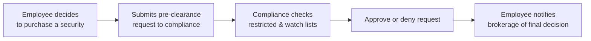

## Introduction

So, imagine you’re at your desk managing client portfolios. You see a huge order coming in, and you realize it might have a big impact on a specific stock’s price. Then a thought creeps in: “What if I place a personal trade in that same stock before executing the client’s order?” Clearly, that’s front-running—and it’s also a massive no-no. Personal trading policies exist precisely to prevent these sorts of conflicts. They aren’t just about laying down the law; they’re also about preserving trust, demonstrating ethical conduct, and protecting clients’ interests.

In this section, we’ll talk about why firms have personal trading restrictions, how they set up safeguards like pre-clearance rules and watch lists, and what happens if employees—accidentally or intentionally—breach these regulations. We’ll also reference some earlier discussions from this chapter, such as general fiduciary duties (see Section 7.1) and conflicts of interest (see Section 7.7), and explore how personal trading policies fit within the broader regulatory frameworks introduced in Section 7.2. By the end, you’ll have a clear idea of how to shape, follow, and enforce these policies—whether you’re a junior analyst or a senior portfolio manager.

## Objectives and Importance of Personal Trading Policies

The ultimate goal of personal trading policies is to ensure that employees act in the best interest of clients, in line with ethical commitments and regulatory obligations. When employees trade on their own behalf, there’s a risk of unethical or illegal activities such as insider trading, front-running, or scalping. Even unintentional slip-ups—maybe you forgot to mention you had beneficial ownership in a stock—can erode client trust.

Below are some reasons personal trading policies are so critical:

• Protect Client Interests: Clients’ trades and confidentiality come first.  
• Maintain Market Integrity: Unethical trades can distort market fairness.  
• Avoid Conflicts of Interest: Reduce situations where employees might put personal profit before a client’s needs.  
• Comply With Regulatory Standards: Regulatory bodies—and the CFA Institute’s Code of Ethics—expect robust policies to deter misconduct.  
• Preserve the Firm’s Reputation: Trust is everything in finance. Even one scandal can ruin a firm’s standing.

## Core Provisions in Personal Trading Policies

### Pre-Clearance Requirement

Pre-clearance is the cornerstone of personal trading compliance. Before executing a personal trade, employees must file a request—often electronically—detailing the security, transaction size, and intention. Compliance officers then verify whether the proposed trade conflicts with ongoing client transactions or whether the security is on a restricted list.

Honestly, in practice, pre-clearance can feel cumbersome. I remember working at a boutique firm where we had to fill out a form for every single trade (including trades in large-cap, highly liquid stocks). But once I understood it was all about safeguarding clients, I saw why it mattered. These small steps not only prevent questionable trades, but they also highlight a willingness to adhere to ethical guidelines.

### Minimum Holding Periods

Another critical rule you’ll commonly see is the minimum holding period. This policy states that any security an employee buys must be held for a specific time—30 days, 60 days, or even 90 days—before selling it. The idea is to discourage short-term speculation (often called “scalping”) based on insider or special knowledge.

Minimum holding periods:

• Force employees to adopt a more long-term perspective.  
• Reduce the temptation to quickly profit off a short-term price bump they might anticipate if they know about a big client trade.  
• Make compliance monitoring easier—fewer short-term trades to review.

### Disclosure of Beneficial Ownership

Employees need to fully disclose beneficial ownership—meaning any direct or indirect influence that might make them a financial beneficiary. Beneficial ownership includes accounts held by spouses, children, or family trusts in which the employee is a trustee. Transparent disclosures ensure the firm knows when employees have a stake in a company that the firm or its clients might also be trading.

### Prohibitions on Front-Running and Scalping

The big culprits we always warn about:

• Front-Running: Placing a personal trade right before a large client trade. Maybe the employee knows a client will buy a substantial amount of shares in XYZ Corp., so they buy it first, counting on the subsequent demand to raise the share price. This is strictly prohibited.  
• Scalping: Very short-term trades aiming to profit from small price increments, sometimes exploiting sensitive information. This can overlap with front-running, especially if employees trade multiple times per day to exploit knowledge of impending transactions.

### Restricted and Watch Lists

Firms typically maintain two types of lists:

• Restricted List: Securities that employees aren’t allowed to trade at all—often due to pending client orders or non-public information.  
• Watch List: Securities that are under active internal or client research. Employees often need to consult compliance or obtain special approval before trading these.

I once saw a well-meaning analyst add three promising stocks to our watch list after reading about them in competitive analysis reports. A compliance officer promptly clarified: “Now that it’s on the watch list, you’ve got to check in with us before you do anything personally with those stocks.” At first, the analyst was a bit surprised, but over time, they realized it’s simply part of building trust and ensuring no one is exploiting inside intel.

### Consequences for Non-Compliance

Any policy without consequences is basically an open invitation for people to ignore it. That’s why personal trading compliance typically includes a range of disciplinary actions, from:

• Formal Reprimands: Written or verbal warnings.  
• Fines: Monetary penalties deducted from the employee’s pay or bonus.  
• Suspension: Temporary prohibition from trading or from working at the firm.  
• Termination: In the most severe cases, the employee can be fired.  

In some jurisdictions, violations might also lead to civil or criminal liability—especially if they involve insider trading. So, yes, serious stuff.

### Periodic Compliance Training

Ensuring that everyone at the firm understands the policy is half the battle. Many firms hold periodic compliance trainings—quarterly or annually—to remind employees about the procedures, highlight any regulatory updates, and discuss real-life case studies. Training sessions often incorporate hypothetical scenarios (like a manager who invests in a stock right before a massive client buy order) to drive home how serious these issues can be.

### Electronic Surveillance Systems

Many firms deploy automated solutions to monitor employee trades, cross-referencing them against client trades. Such systems:

• Flag trades made shortly before large client orders.  
• Match employee transactions with restricted lists.  
• Identify unusual trading patterns, like repeated short-term trades or inconsistent disclosures of beneficial ownership.

Some employees might feel uneasy about technology watching over their shoulders. But remember, these systems are in place for the same reason a seat belt is in a car: precaution and safety. Properly used, this surveillance fosters a culture of transparency.

### Communicating the Rationale Behind the Policy

It’s not enough just to say “don’t do this.” Firms need to explain why. Demonstrating how these policies protect clients—and, by extension, strengthen the firm’s credibility—makes staff more likely to abide by them. When people understand the underlying rationale, they’re more inclined to cooperate. Indeed, a well-informed employee is usually an empowered one—less likely to commit accidental breaches and more likely to hold themselves accountable.

### Updates and Evolution of Personal Trading Policies

Regulatory landscapes shift, new trading platforms emerge, and novel financial instruments appear all the time. If you think about how cryptocurrency or decentralized finance soared into the mainstream over the last few years, that’s a perfect example. Personal trading policies need to adapt to these changes:

• Incorporate new product lines (e.g., cryptocurrency or tokenized assets).  
• Adjust for changes in local and global regulations.  
• Adopt best practices from evolving industry standards.

It’s helpful to schedule a policy review—maybe once a year. That way, you can catch any new developments, see if there were issues in the prior year, and refine your guidelines accordingly.

## Process Flow Example

Below is a sample flowchart (in Mermaid) to illustrate how a trade pre-clearance process might work at a firm:

## Practical Scenarios and Case Studies

Consider the following scene:

• A junior analyst gets excited about a biotech firm’s new drug approval. They have non-public info (the approval will be announced next week) shared during a client meeting. The analyst does a quick personal purchase “just in case.” The next week, the stock price jumps 30%. That’s a violation of insider trading laws, no question. If the firm had robust personal trading policies (including restricted lists and pre-clearance) in place, that analyst would likely have been blocked from making the trade.  

• An experienced portfolio manager learns that a major institutional client is about to unload millions of dollars in a particular security. The manager personally shorts the same stock a day before the block trade hits the market. That is textbook front-running. Without a thorough personal trading policy (and some electronic surveillance), the manager might temporarily escape detection—but not for long. The moment compliance cross-references trade timestamps, they’ll see the suspicious pattern and begin an investigation.

## Best Practices and Potential Pitfalls

• Keep Communication Open: If you’re unsure whether something violates policy, ask compliance first.  
• Don’t Rely on Memory: People get busy and might forget which stocks were on the watch list. Always refer to current lists.  
• Monitor Trading Platforms: Especially for new digital assets, employees should confirm they’re allowed to trade certain cryptocurrencies or derivatives for personal accounts.  
• Watch Out for Family Accounts: Employees might inadvertently think a spouse’s or sibling’s account “doesn’t count” as beneficial ownership. Typically, it does.

Pitfalls frequently occur when:

• Firms fail to update lists or share them widely enough.  
• Employees don’t realize a weekend trade still needs Monday morning pre-clearance.  
• Minimal or outdated training leaves employees confused about what’s allowed.  
• Disciplinary processes are unclear, leading employees to think violations carry no consequences.

## Regulatory Context and Cross-References

Personal trading restrictions align with general ethical standards and specific legal requirements:

• CFA Institute Standards of Professional Conduct (notably Standard II(A): Material Nonpublic Information, and Standard VI(B): Priority of Transactions).  
• SEC rules on insider trading, including Rule 10b5-1 (see https://www.sec.gov/).  
• Investment Adviser Association (IAA) best practices on personal trading compliance.  
• Local regulations in various jurisdictions that impose strict control on insider trading, conflict of interest, and market manipulation.

For more on how these policies relate to broader compliance structures, consult Section 7.2 (Regulatory Environment and Compliance Considerations) and Section 6.1 (Definition and Scope of Risk Management). Also, see Section 7.7 regarding Conflicts of Interest in Practice for an in-depth look at how personal trading can intersect with other ethical challenges.

## Exam Relevance and Final Tips

CFA Level I can test you on definitions (front-running, beneficial ownership, etc.) and standard practices (like minimum holding periods). The exam might present a scenario where you have to identify a breach of personal trading policies, or say how to mitigate potential misconduct. Common pitfalls include:

• Failing to recognize front-running in scenario-based questions.  
• Mixing up the difference between restricted and watch lists.  
• Missing that beneficial ownership extends beyond personal accounts.  

When tackling exam questions:

• Carefully analyze the scenario. Is there potential insider information? Are employees pre-clearing trades?  
• Look for short-term trades that might constitute scalping.  
• Watch out for “red flags” like trades happening right before a large client trade is executed.  

Time management goes a long way—so systematically check each angle: is there an ethical standard broken? Is it about insider info, or is it about prioritizing personal gain over client interest?

## References and Further Reading

• CFA Institute Standards of Professional Conduct on personal trading  
• SEC “Insider Trading and 10b5-1” rules: https://www.sec.gov/  
• Industry best practices in personal trading compliance, e.g., IAA (Investment Adviser Association)  
• Section 7.2 of this volume (Regulatory Environment and Compliance Considerations)  
• Section 7.7 of this volume (Conflicts of Interest in Practice)  

---  

## Test Your Knowledge: Personal Trading Policies & Restrictions



### Which of the following best describes the purpose of a minimum holding period in personal trading?

- [ ] To allow employees to respond quickly to short-term market fluctuations
- [x] To reduce the likelihood of short-term speculation or scalping
- [ ] To guarantee employees cannot realize trading losses
- [ ] To incentivize employees to engage in frequent portfolio turnovers

> **Explanation:** Minimum holding periods prevent rapid trades that might exploit non-public or client-related information, reducing speculation-based compliance risks.

### Which statement best characterizes “front-running”?

- [ ] Employees trading after a security is placed on the watch list
- [ ] Buying shares to offset potential capital gains taxes
- [x] Trading in advance of a large client order to profit from expected price changes
- [ ] Trading in personally owned foreign currencies

> **Explanation:** Front-running involves placing personal trades ahead of a large client trade, aiming to exploit the anticipated price move for personal gain.

### A personal trading policy requires employees to disclose beneficial ownership. Which of the following accounts does this typically include?

- [x] Any account owned by a spouse or children
- [ ] Only the accounts directly in the employee’s name
- [ ] Accounts the employee has no ability to influence
- [ ] Accounts belonging to distant relatives

> **Explanation:** Beneficial ownership usually extends to immediate family members, such as spouses and dependent children, because the employee has or may have an indirect economic interest.

### Which is a key function of restricted lists?

- [ ] Encouraging employees to buy undervalued securities
- [x] Prohibiting employees from trading certain securities due to non-public information
- [ ] Recommending employees purchase high-yield bonds
- [ ] Classifying stocks based on trading volume

> **Explanation:** Restricted lists keep employees away from securities that the firm has inside information on or that the firm is actively trading on behalf of clients, reducing the risk of insider trading.

### What consequence is most likely if an employee is found scalping repeatedly?

- [ ] A small wrist-slap letter with no further action
- [ ] An automatic stock buyback from the employee
- [ ] Probation without pay
- [x] Potential termination or severe disciplinary actions

> **Explanation:** Firms take scalping and similar unethical trades seriously and typically have policies allowing termination if violations persist.

### Which of the following is not an element of an effective personal trading policy?

- [ ] Pre-clearance systems
- [ ] Watch and restricted lists
- [ ] Minimum holding periods
- [x] Confidential promotions for employees who trade frequently

> **Explanation:** Encouraging employees to engage in frequent personal trades contradicts the spirit of ensuring client priority and reducing conflicts of interest.

### Compliance training sessions serve what primary purpose in personal trading policies?

- [ ] Explaining how to use insider information ethically
- [x] Educating employees about rules, policy updates, and potential violations
- [ ] Encouraging employees to bypass watch lists for favorable trades
- [ ] Minimizing the number of trades employees can place

> **Explanation:** Compliance trainings ensure employees understand the regulations and firm policies, thus preventing unintentional or intentional breaches.

### Why might a firm employ electronic surveillance of personal trades?

- [ ] To grant employees discounts on commissions
- [ ] To share personal trade data with marketing for promotions
- [x] To automatically detect suspicious trades and match them against client trades
- [ ] To restrict employees from leaving the company

> **Explanation:** Electronic surveillance tools match employee trades against client trades in real time to detect possible conflicts (e.g., front-running).

### An employee who trades a stock one day before a large block order on behalf of a major client is most likely guilty of:

- [ ] Watch-list compliance
- [ ] Beneficial ownership oversight
- [ ] Scalping exclusively
- [x] Front-running

> **Explanation:** Trading just before a large client trade suggests front-running, which is explicitly prohibited.

### True or False: If an employee’s trade does not violate local regulations, it is automatically acceptable under the CFA Institute Standards of Professional Conduct.

- [x] True
- [ ] False

> **Explanation:** This is actually a trick: The statement is typically considered FALSE in practice, according to the CFA Standards. Compliance with local laws is not enough if the action breaches higher ethical standards set by the CFA Institute. However, the question as phrased incorrectly states “It is automatically acceptable.” The better approach is recognizing that the CFA Standards can be stricter than local regulations.


