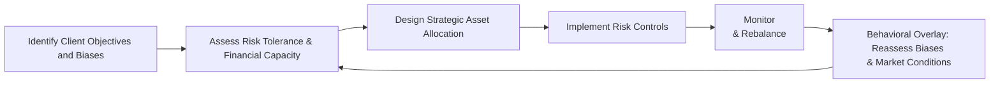

## Overview

When it comes to putting theory into practice, the classic pillars of portfolio management—asset allocation, risk controls, and client objectives—don’t always capture what’s really going on inside an investor’s head. In fact, many of us have seen clients, or even ourselves, make investment decisions that make zero sense in hindsight. So, let’s bring behavioral insights into the mix. By integrating a clear asset allocation framework with an understanding of how emotional and cognitive biases work, we can design portfolios that both meet long-term objectives and help keep investors (ourselves included) on track through the inevitable ups and downs of the markets.

Below, we’ll explore what it means to incorporate behavioral assessments, set up robust risk controls, and, frankly, keep an eye on those hard-to-spot investor quirks that can make or break an investment plan.

## Recognizing Behavioral Biases in Asset Allocation

Behavioral biases, such as loss aversion and overconfidence, exert a substantial influence on portfolio decisions. Now, you might be wondering, why does it matter if someone hates losing money more than they love making it? Well, it matters a lot: investors who exhibit high loss aversion might overly concentrate in cash or stable assets, potentially missing out on the growth they need to meet their goals.

• Loss Aversion  
People tend to feel the pain of losses more acutely than the pleasure of equivalent gains. This can lead to selling winning positions prematurely or clinging to losing ones in hopes of breaking even. An extreme example could be a retiree who refuses to invest in equities after a market downturn, jeopardizing their ability to outpace inflation.

• Overconfidence  
Overconfident investors often underestimate the probability of adverse events and believe their skill alone can lead to exceptional returns. “Ah, I’m sure this is the right pick,” they say, ignoring potential warning flags. This can manifest as aggressive equity allocations, insufficient diversification, or impulsive trading.

• Confirmation Bias  
If you ever saw a friend reading only articles that reinforce their existing investment beliefs, that might be confirmation bias at work. It can prevent them from considering new or contradicting data, skewing the asset allocation process.

• Anchoring  
Anchoring occurs when investors fixate on irrelevant reference points—like the price at which they bought a security—and let it affect future decisions. For example, “I won’t sell until the stock gets back to my original purchase price,” even if market fundamentals have changed drastically.

One of the best ways to uncover these biases is to use a combination of investor questionnaires and open-ended conversations. In the long run, building trust and rapport goes a long way toward identifying the specific behavioral patterns that might call for a “behavioral overlay,” which we’ll discuss in a bit.

## Designing a Holistic Asset Allocation

After you’ve gotten a handle on the investor’s behavioral drivers, it’s essential to revisit the fundamentals of asset allocation:

• Establish Clear Objectives and Time Horizon  
Many of us, at one point or another, have discovered that an investor’s stated objective (“I want to retire in 10 years with enough to travel the world!”) may not line up with their comfort level when confronted with market volatility. Setting realistic objectives—and clarifying the time horizon—lays the groundwork for deciding how much equity, fixed income, or alternative exposure is appropriate.

• Evaluate Risk Tolerance  
You might define a client’s risk tolerance using standard questionnaires or historical analysis. But be prepared to adjust these initial impressions once you blend in the behavioral findings. For instance, a client might claim moderate risk tolerance in a neutral market environment, yet they become extremely anxious as soon as markets dip 5%. That signals a mismatch between stated and revealed risk tolerance.

• Strategic Asset Allocation (SAA)  
We anchor the portfolio to a long-term target: for example, 60% equities, 30% fixed income, 10% alternatives. This SAA is guided by expected returns, investor objectives, and risk constraints. But it’s not set in stone. Incorporating behavioral insights means we may “tilt” allocations to preempt or counteract the investor’s known biases. An investor with high loss aversion, for instance, might benefit from strategies that limit downside exposures—like protective puts or a higher allocation to defensive stocks—while still providing some growth potential.

Below is a simple Mermaid diagram illustrating a process flow that integrates these steps:

In this iterative loop, a behavioral overlay ensures that biases and market movements don’t derail the long-term plan.

## Integrating Risk Controls

### The Role of Quantitative Measures

Integrating behavioral insights doesn’t mean abandoning the tried-and-true quantitative approaches to risk control. You might use metrics like Value at Risk (VaR) to get a snapshot of potential losses over a given time horizon at a certain confidence interval. In more advanced scenarios, you might run stress tests or scenario analyses to see how the portfolio might hold up if, say, credit spreads surge or equity markets tumble 20%.

Here’s a simplified VaR formula:


\text{VaR}_\alpha = \mu_p - z_\alpha \cdot \sigma_p


Where:  
• \\(\mu_p\\) = expected portfolio return  
• \\(z_\alpha\\) = z-score for chosen probability, say 1.65 for 95% confidence  
• \\(\sigma_p\\) = standard deviation of portfolio returns  

If your VaR at 95% confidence is, for instance, –\$50,000 for a \$1 million portfolio over a month, it means there’s a 5% chance the portfolio will lose more than \$50,000 in that period. It’s far from perfect—especially when markets go haywire—but it provides a risk yardstick that can be combined with scenario analyses to shape or adjust allocations.

### Scenario Analysis and Stress Testing

If you’re building an equity-heavy portfolio for an overconfident client, it’s probably a good idea to illustrate scenarios of a significant market correction or a sustained bear market. Stress tests can help counteract overconfidence by highlighting what could happen if broad markets or a specific sector experiences a worst-case scenario drop.

### Portfolio Construction Tools

Risk controls might include:  
• **Stop-Loss Orders**: Automatic sell orders if prices dip below a threshold.  
• **Derivatives**: Options or futures to hedge exposures.  
• **Target Volatility Mechanisms**: Reducing equity exposure if volatility breaches a certain level.  
• **Sector and Geographic Limits**: Caps on concentration in any one region or industry.

## Dynamic Rebalancing and Ongoing Adjustments

Even a terrific plan can be upset by changes in the market or by shifts in the client’s personal situation. That’s where dynamic rebalancing comes into play. For instance, suppose a certain position has rallied sharply, and the portfolio is now sitting with an equity weight that’s 10% above the recommended target. Systematic rebalancing means trimming back to target (maybe taking some gains off the table) and redeploying into asset classes that have underperformed. Think of it as the discipline that helps us avoid greed (like letting winners ride until they possibly crash) and fear (like panic-selling when the market drops).

A dynamic approach also accounts for changes in risk tolerance. Maybe the client undergoes a life event—an inheritance, job loss, or new responsibilities—and suddenly their capacity for risk is very different. That’s why there should be built-in periodic reviews, not just a once-a-year system.

## Behavioral Overlay in Practice

A behavioral overlay is a set of strategies that actively mitigate the negative impacts of behavioral biases:

• **Regular Check-Ins**: If your client is prone to panic in downturns, schedule more frequent (but short) communications when markets are volatile. Simple updates like, “Yes, the market is down 10%, but we’ve planned for this,” can reassure clients.

• **Visual Aids**: Show easy-to-read charts that map out portfolio returns over time, highlighting how short-term noise rarely impacts long-term objectives. Many folks respond better to pictures than they do reams of numerical data.

• **Preemptive Reminders**: At the very start of the relationship, note the potential biases you suspect. Remind them: “Recall that you identified yourself as someone who fears losses. If we see a market correction, our plan is to rebalance and stay the course.”

• **Document Everything**: Keep track of times the client wanted to exit or chase returns. Did they succeed or was it a reversal of fortune? Having a record can curb repeated mistakes.

**Example of a Behavioral Bias and Possible Solution Table:**

| Behavioral Bias  | Common Investor Reaction                 | Potential Solution                          |
|------------------|------------------------------------------|--------------------------------------------|
| Loss Aversion    | Selling winners too soon, avoiding risk  | Use protective puts, highlight probabilistic outcomes, focus on long-term goals |
| Overconfidence   | Over-trading, excessive equity exposure  | Scenario analysis showing potential losses, set trading constraints             |
| Anchoring        | Refusing to sell if below purchase price | Shift focus to fundamentals, not the past   |

## Feedback Loops and Transparency

It’s crucial to maintain an ongoing dialogue with your client (or yourself, if you’re the investor). Document the portfolio’s performance, track risk exposures, and keep an eye out for behavior changes. If you notice the client is showing more anxiety in turbulent markets than they initially claimed, you might need to dial down the risk—or reinforce the plan with carefully presented data. Transparency fosters trust and can reduce emotionally driven decisions.

## Bringing It All Together

At the end of the day, our goal in portfolio management is not just to maximize returns while staying within risk constraints—it’s to design strategies that real people can stick with. Integrating asset allocation frameworks (like strategic asset allocation and rebalancing) with behavioral insights (uncovering loss aversion, overconfidence, etc.) and robust risk controls (VaR, stress testing, hedging, etc.) helps ensure that the portfolio remains both resilient and aligned with the client’s long-term goals. It’s a delicate balance, but when done effectively, it instills confidence and discipline, even in the face of market turbulence.

## Exam Tips and Common Pitfalls

• Always start with client objectives and risk tolerance. Incorporating behavioral insights should never override fundamental suitability and investment policy statement (IPS) constraints.  
• Recognize that biases can shift over time. Keep an open channel for re-evaluation.  
• Combine both qualitative and quantitative approaches to risk measurement. VaR alone isn’t enough.  
• In an exam setting, be prepared to illustrate how you would recommend adjustments to asset allocation when a client exhibits a specific bias. For instance, show how you might incorporate a partial hedge or more conservative assets for a highly loss-averse investor.  
• Watch out for overcomplicating the solution with too many hedges or overlays. Complexity can introduce other risks, especially operational risk.

## References

• CFA Institute, “Behavioral Finance and Investment Management,” CFA Program Curriculum.  
• Kahneman, D. & Tversky, A. (1979). “Prospect Theory: An Analysis of Decision under Risk.” Econometrica.  
• Montier, J. (2010). “Behavioral Investing: A Practitioner’s Guide to Applying Behavioral Finance.” Wiley.  

------------

## Test Your Knowledge: Integrating Asset Allocation, Behavioral Insights, and Risk Controls



### Which of the following statements best describes loss aversion?

- [ ] A preference for high risk in pursuit of high returns
- [x] The tendency to feel the pain of losses more deeply than the joy of equivalent gains
- [ ] Excessive confidence in one’s own investing skills
- [ ] A reluctance to incorporate new evidence that contradicts existing beliefs

> **Explanation:** Loss aversion describes how individuals fear losses more strongly than they appreciate gains of the same size.  

### A client who constantly trades based on “gut feeling” and dismisses negative market signals is most likely exhibiting which bias?

- [ ] Loss aversion
- [ ] Anchoring
- [x] Overconfidence
- [ ] Availability

> **Explanation:** Overconfident investors tend to ignore potential downside risks and trade excessively based on their self-belief rather than objective data.

### In a typical Value at Risk (VaR) calculation for a portfolio:

- [ ] Only the best possible return is considered
- [x] There is a specified confidence interval used to estimate potential losses
- [ ] Emotion and risk preferences take precedence
- [ ] It measures only credit risk, not market risk

> **Explanation:** VaR estimates the potential loss over a specific time frame given a certain confidence interval. It is a quantitative measure of downside risk, useful for forming baseline risk estimates.  

### Dynamic rebalancing can help mitigate which of the following investor tendencies?

- [x] The inclination to let winners run and ignore rebalancing
- [ ] The tendency to hold highly diversified portfolios
- [ ] The desire to lock in significant losses
- [ ] The use of scenario analyses for risk forecasting

> **Explanation:** Dynamic rebalancing helps prevent investors from deviating too far from their target allocations, especially helpful if their bias is to let profitable positions keep growing regardless of risk.

### When constructing a portfolio for a client who is highly loss averse, which approach is most suitable?

- [x] Incorporate some downside protection strategies, such asoptions or lower-volatility assets
- [ ] Concentrate entirely in growth stocks to maximize returns
- [ ] Eliminate bonds to avoid interest rate risk
- [ ] Use only historical averages for risk estimates

> **Explanation:** Loss-averse clients generally benefit from protection against severe drawdowns (e.g., hedging positions), which aligns better with their psychological comfort.  

### Which of the following is an example of a behavioral overlay technique?

- [x] Periodic reviews to assess emotional reactions to market volatility
- [ ] Ignoring investor questionnaires
- [ ] Eliminating all risk metrics to rely solely on conversation
- [ ] Automating rebalancing with no communication after the initial meeting

> **Explanation:** A behavioral overlay often involves ongoing client communication and adjustments to address biases through feedback loops.

### A major advantage of combining quantitative metrics (like VaR) with qualitative insights (e.g., interviews) is:

- [x] You gain a more complete picture of the investor’s risk profile and possible biases
- [ ] You eliminate all biases permanently
- [ ] You never have to worry about market anomalies
- [ ] It ensures no regulatory oversight is needed

> **Explanation:** Blending both types of data helps in capturing factors that purely quantitative methods or purely qualitative methods might overlook.

### When a client fixates on the original purchase price of a stock and refuses to sell below that price, which bias is most relevant?

- [ ] Loss aversion
- [ ] Overconfidence
- [x] Anchoring
- [ ] Availability

> **Explanation:** Anchoring occurs when an investor relies too heavily on initial information (like the purchase price) and fails to adjust to new market realities.

### Why is transparency in reporting risk metrics especially beneficial to clients prone to panic during market volatility?

- [x] It helps set realistic expectations and reduces emotional decision-making
- [ ] It forces them to invest in risky assets
- [ ] It eliminates the need for scenario analysis
- [ ] It makes the portfolio automatically rebalance without consent

> **Explanation:** Clear communication and relevant risk metrics demystify what’s happening in the portfolio, helping to keep investors calm when markets turn turbulent.

### True or False: A strong feedback loop involves documenting a client’s reactions and adjusting the portfolio only when markets reach new highs.

- [x] True
- [ ] False

> **Explanation:** A proper feedback loop captures client behavior and performance data continuously, although you might adjust the portfolio at various triggers or intervals. Highs or lows can be major times to reevaluate, but the main point is to monitor feedback continuously.


