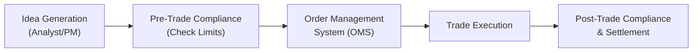
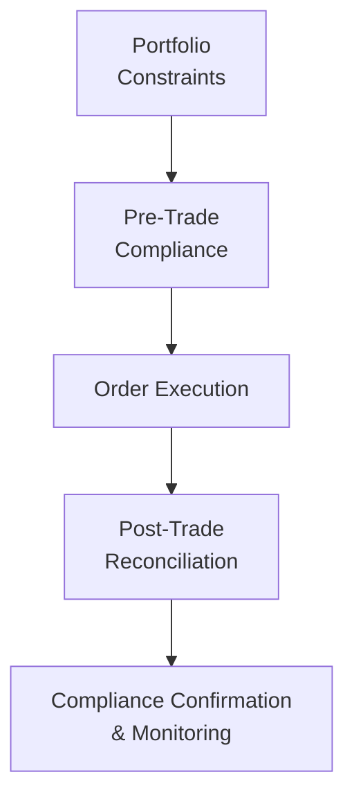

## Introduction

Efficient portfolio implementation isn't just about picking assets; it's about how you execute trades, control hidden costs, ensure compliance, and manage operational bottlenecks. Honestly, I’ve seen carefully crafted investment ideas fall apart because of poorly executed trades—like placing a large order in an illiquid market and watching execution costs devour half the expected alpha. So, let’s explore techniques to make sure your beautifully constructed portfolio actually delivers results in the real world.

## Balancing Position Sizing with Returns and Liquidity

At its core, “position sizing” refers to deciding how much of each security (or strategy) you’ll hold in your portfolio. You might recall from earlier sections of this Volume (e.g., Chapter 4 on Portfolio Planning and Construction) how we discuss the investment policy statement (IPS) constraints, risk tolerance, and return objectives. Those form the big-picture boundaries. Now, we zoom into the practical side: how to actually size positions in a way that balances prospective returns with transaction costs and liquidity requirements.

• Market Impact vs. Holding Period: If you have a relatively short holding period, you can’t afford to pay massive market-impact costs. Smaller position sizes may reduce slippage but could also reduce exposure to potential gains.  
• Minimum Liquidity Thresholds: For large portfolios, it’s generally a good idea to set a threshold for daily volume or average bid-ask spreads. This helps ensure that you can unwind or adjust positions promptly if market conditions change.  
• Risk Budget Allocation: Position sizing also interacts with your risk budget. If an asset is extremely volatile, your position size might be smaller to keep portfolio-wide volatility in check.

In practice, you’ll need to juggle these factors—like spinning plates—for each trade. A well-structured Order Management System (OMS) can help you (and your compliance folks) keep track of your rebalancing, ensuring you don’t overstep liquidity constraints or cross the dreaded line where your trades push the market around.

## Harnessing Rebalancing Software and Pre-Trade Compliance

Efficiency in portfolio implementation isn’t just about “not messing up trades.” It also links to rebalancing intervals, technology platforms, and real-time compliance checks. In Chapter 4 we chatted about rebalancing approaches and tactical shifts, but let’s dig deeper into how software can be your best friend during implementation.

### Order Management Systems (OMS)

An OMS is specialized software that helps you automate the entire lifecycle of trades—starting from the moment your analyst or portfolio manager suggests a trade, all the way to execution and settlement. An OMS typically:

• Integrates pre-trade compliance checks to prevent placing trades that violate concentration limits or restricted lists.  
• Keeps an audit trail of approvals, modifications, and final allocations.  
• Coordinates with back-office systems (or custodians) for settlement.  

Picture the following simplified flow in a mermaid diagram:

If everything checks out, your trade sails through. If something is amiss—like a portfolio limit on certain bond durations or a restriction on a particular sector—the system halts the trade. That’s how you prevent those embarrassing compliance breaches.

## Transaction Cost Analysis (TCA): Uncovering Hidden Costs

Even if you’re trading the most liquid stocks in the market, there’s always some friction. Typically, you’re dealing with:

• The Bid-Ask Spread: The difference between the price a buyer is willing to pay (bid) and what a seller is willing to accept (ask). Thinner spreads are better.  
• Market Impact: If your order is large, you risk pushing the price up when buying or pushing it down when selling. Often, this can be more significant than the bid-ask spread, especially in less liquid assets.  
• Brokerage Fees: Commission, exchange fees, and other explicit costs.  
• Slippage: The difference between the price you expect and the actual price at which your trade executes.

Transaction Cost Analysis (TCA) is a tool you can use to measure and control these. It’s sort of like performing an autopsy on your trades: comparing the paper (theoretical) cost, the actual execution price, and the market conditions to figure out where the leaks are. 

### Example: Implementation Shortfall Calculation

One common TCA approach is to measure implementation shortfall, comparing the paper return you’d have gotten if your order filled instantaneously at a benchmark price versus your actual return from real trades over time. The difference can highlight:


\text{Implementation Shortfall} = \frac{\text{Paper Return} - \text{Actual Return}}{\text{Paper Investment}}


If you see high figures, that’s a red flag: your order execution approach might be inefficient. Maybe you should break up the order using an algorithmic strategy (e.g., VWAP—Volume Weighted Average Price) or schedule it over multiple sessions to reduce market impact.

## Using Program Trading and Algorithmic Strategies

If you’ve ever considered executing a bunch of trades at once, program trading (sometimes also called basket trading) might be a good solution. You might have an equity portfolio that you rebalance every quarter with a large batch of trades. Doing them one by one could be super expensive and time-consuming—plus your trades might move prices. Program trading uses a system that simultaneously buys and sells a predefined basket of stocks, often replicating or offsetting an index. This tends to reduce partial fills and helps control transaction costs.

### Algorithmic Trading Tactics

Algorithms like VWAP, TWAP (Time-Weighted Average Price), or POV (Percentage of Volume) aim to control the pace and execution while minimizing the market impact. Often, large institutions prefer these methods in liquid markets to systematically fill large orders.  
• VWAP tries to get you the average price weighted by trading volumes over a specific period.  
• TWAP breaks your order into equally sized portions and executes them at intervals.  
• POV tries to adapt your trade rate to a target percentage of real-time market volume.

I remember a scenario where I used a TWAP algorithm over a busy trading session in a mid-cap stock. The partial fills were so minimal that we almost perfectly matched our benchmark price. It saved the portfolio thousands of dollars in slippage.

## Custodian Structures and Settlement Processes

It may not be glamorous, but choosing an efficient custodian setup can save you from settlement delays, high fees, or even operational nightmares (lost share certificates anyone?). Custodians hold your securities on your behalf and handle settlement—an area ripe with potential mistakes. A few things to consider:

• International vs. Domestic Custodians: Holding emerging market positions might require local sub-custodians who understand local regulations and clearing processes.  
• Timely Settlement: This ties into your liquidity management. If settlement is T+2 (trade date plus two business days) but you need funds in 24 hours, you must plan carefully.  
• Operational Risk: Make sure your custodian has robust cybersecurity measures and business continuity plans. Operational risk is real; it involves losses from failed processes, staff errors, or system breakdowns.

## Active vs. Passive Implementation

Now, you’ve certainly encountered the eternal debate between active and passive approaches in equity and fixed-income management. Implementation efficiency is a critical dimension of this debate.

• Passive Indexing: When you replicate or closely track an index, your trade frequency might be lower, except for periodic reconstitution or rebalancing. That often keeps transaction costs in check. You’re less prone to large, sudden trades that could generate big market-impact costs.  
• Active Strategies: Yes, you might capture extra alpha, but you’ll trade more frequently. This can skyrocket your transaction costs, especially if your strategy relies on short-term price dislocations. That’s why robust TCA and skilled traders are even more critical for active managers.

Pragmatically, many portfolios combine both approaches—think “core-satellite,” where the core might be a passive index fund, and smaller satellite positions are actively managed.

## Tax Implications and Tax-Loss Harvesting

If you’re managing portfolios for taxable investors, be mindful of Uncle Sam (or whichever tax authority looms in their jurisdiction). No matter how cleverly you place trades, you could wind up returning less to the investor if capital gains taxes chew up your performance.

### Tax-Loss Harvesting

Selling securities at a loss to offset realized capital gains is a popular strategy. For instance, if you have $10,000 in realized gains on one position, you might look for a position that’s sitting at a $10,000 paper loss and sell it to offset the gain. Done strategically, you can maintain similar exposure (by switching to a correlated asset) but reduce taxes significantly. Be sure to watch out for wash-sale rules in some jurisdictions, which disallow the immediate repurchase of the same or substantially identical securities within a restricted window.

### Asset Location

In some cases, how you locate your assets across taxable and tax-advantaged accounts (like IRAs and 401(k)s in the US) matters a lot. You might prefer to keep high-turnover or high-dividend assets in tax-sheltered vehicles to minimize current tax bills.

## Pre-Trade Compliance Checks and Ongoing Oversight

Pre-trade compliance is the practice of verifying all constraints—investment guidelines, regulatory restrictions, internal risk controls—before your order flows into the market. This can be integrated right into your OMS so you don’t have to remember a laundry list of rules each time. 

Once the trade is executed, you also want ongoing post-trade compliance. This is a second check to ensure your new positions haven’t caused unintentional exposures outside your policy limits. Combining pre-trade checks, TCA, and automated rebalancing is like having a multi-layer security system that helps keep your strategy from drifting off course.

## Best Practices and Common Pitfalls

• Start with a Plan: A well-documented trading plan (part of your overall IPS discussion) clarifies how often you rebalance, which algorithms you might use, and how you measure success.  
• Pick the Right Liquidity Window: Liquidity can fluctuate during the trading day or based on news cycles. If you’re trading emerging market equities, it might be more cost-effective to trade when local markets are at peak liquidity rather than forcing a trade at an inconvenient time.  
• Beware of Overtrading: Frequent trades might generate more costs than any potential alpha.  
• Use TCA Proactively: Don’t wait until quarter-end to see if you got burned by execution slippage.  
• Monitor Wash-Sale and Similar Tax Rules: Especially important if you’re doing tax-loss harvesting.  

## Brief Case Study: Large-Cap Equity Transition

Imagine you’re transitioning a $200 million large-cap equity portfolio from one strategic tilt (value stocks) to another tilt (growth stocks). You might have:

1. Selected a program trade to replace a basket of value stocks with growth stocks simultaneously.  
2. Chosen a volume-driven algorithm (like VWAP) if some of these growth stocks trade heavily midday.  
3. Used TCA to monitor slippage in real time.  
4. Checked pre-trade compliance to ensure the shift doesn’t violate your 30% sector concentration limit.  
5. Engaged the custodian early so settlement timing is organized—particularly if you’re dealing with multiple markets.  
6. Executed partial tax-loss harvesting on a few value names that have an unrealized loss, offsetting gains from your existing winners.

At the end, you compare your actual cost with a reference implementation benchmark; if it’s significantly lower, congrats—you’ve effectively implemented the new tilt with minimal erosion of returns.

## Exam Tips and Real-World Reminders

• Implementation shortfall, transaction cost analysis, and best execution are popular exam topics. Make sure you understand the formulas and the conceptual rationale behind them.  
• Don’t forget to link these ideas to the broader portfolio objectives—especially around rebalancing frequency, tax considerations, and compliance constraints.  
• The CFA exam might involve scenario-based questions: they could give you a portfolio transition scenario and ask how to minimize transaction costs. Be ready to discuss algorithmic trading approaches, TCA metrics, and pre-trade compliance.  
• In real life, watch out for the operational details. A system or communication error can sometimes lead to missed trades or late settlement.  

## References and Further Reading

- Kissell, R. (2013). “The Science of Algorithmic Trading and Portfolio Management.” Academic Press.  
- CFA Institute, “Trading, Performance Evaluation, and Manager Selection,” CFA Program Curriculum.  
- Grinold, R. C., & Kahn, R. N. (2000). “Active Portfolio Management: A Quantitative Approach.” McGraw-Hill.  

-----

## Test Your Knowledge: Efficient Portfolio Implementation Techniques



### Which of the following best describes the purpose of Transaction Cost Analysis (TCA)?

- [ ] To calculate internal rate of return for private equity investments
- [x] To identify and measure hidden costs like slippage and market impact
- [ ] To label each transaction as compliant or non-compliant
- [ ] To evaluate only bid-ask spreads

> **Explanation:** TCA is used to understand and mitigate hidden costs associated with trading, including slippage, market impact, commission, and other fees, to enhance execution efficiency and overall returns.

### When placing large trades in liquid equity markets, which approach is most likely to reduce partial fills and execution slippage?

- [ ] Manual order entry spread out over multiple days
- [ ] Placing a single large market order
- [x] Program or algorithmic trading using VWAP or similar tools
- [ ] Only using limit orders set far above the current market price

> **Explanation:** Program trading, especially algorithmic approaches like VWAP, helps ensure trades match average market volume throughout the day and minimize partial fills, thus reducing market impact and slippage.

### A portfolio manager wants to minimize tax liabilities for a client by offsetting capital gains with capital losses. Which technique is the manager using?

- [ ] Pre-Trade Compliance
- [x] Tax-Loss Harvesting
- [ ] Spreading out trades over multiple market sessions
- [ ] Laddering bond maturities

> **Explanation:** Tax-loss harvesting involves selling positions at a loss to offset realized gains, thus reducing the investor’s taxable capital gains.

### Which of the following statements is most accurate regarding active vs. passive portfolio implementation?

- [x] Active strategies generally involve higher transaction costs due to more frequent trading
- [ ] Passive managers typically trade more frequently than active managers
- [ ] Passive strategies always outperform on a net-of-fees basis
- [ ] Active strategies are immune to liquidity concerns

> **Explanation:** Active strategies often trade more frequently to capture mispricings, thus incurring higher transaction costs. Passive strategies usually match a benchmark with minimal trading.

### What is the first step in pre-trade compliance?

- [ ] Confirming the settlement date with the custodian
- [ ] Negotiating brokerage fees
- [x] Checking the intended trade against portfolio constraints and regulations
- [ ] Establishing the historical beta of the stock

> **Explanation:** Pre-trade compliance involves verifying that the proposed trade meets all legal, regulatory, and IPS constraints before sending it to the marketplace.

### Which of the following is a feature commonly supported by Order Management Systems (OMS)?

- [x] An audit trail of all trade orders
- [ ] Automated fundamental equity research
- [ ] Guaranteed zero transaction costs
- [ ] Replacing custodial services entirely

> **Explanation:** OMS platforms commonly keep a full audit trail, integrate pre-trade compliance, and facilitate the life cycle of each order. They do not replace custodial services or guarantee zero transaction costs.

### Why might a manager use program trading to rebalance a portfolio?

- [ ] It guarantees a profit in every rebalance
- [x] It allows simultaneous execution of large groups of trades, reducing operational friction
- [ ] It is only used for short selling strategies
- [ ] It eliminates all trading costs

> **Explanation:** Program trading executes a group of stocks in one basket trade, helping reduce partial fills, operational risk, and overall trading costs.

### What is a typical risk associated with large trades in illiquid markets?

- [ ] Enhanced probability of short squeezes
- [ ] Reduced regulatory scrutiny
- [x] High market impact costs
- [ ] Elimination of settlement risk

> **Explanation:** In illiquid markets, large orders can significantly move prices, causing higher market impact costs and potential slippage.

### Which of the following best describes the role of a custodian?

- [x] Holding and settling securities on behalf of a client
- [ ] Providing stock recommendations based on fundamental analysis
- [ ] Eliminating corporate governance risks
- [ ] Guaranteeing overnight margins

> **Explanation:** Custodians primarily safeguard the assets, facilitate settlements, and handle operational tasks. They do not provide fundamental analysis or guarantee investment returns.

### A manager notices that actual execution prices consistently differ from the paper benchmark prices. This difference is called:

- [x] Implementation Shortfall
- [ ] Duration Gap
- [ ] Tracking Error
- [ ] Arbitrage Spread

> **Explanation:** Implementation shortfall measures the difference between the theoretical (paper) trade cost or return and actual realized cost or return, capturing market impact and other execution frictions.


