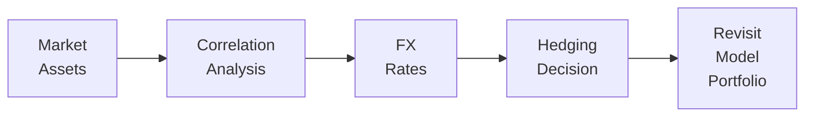

## Why Currency Exposure Matters

I still remember the first time I saw a well-diversified portfolio lose most of its gains because the investor hadn’t fully considered currency swings. The client was pleased with the global equity performance, but a sudden shift in the U.S. dollar relative to the currencies of the underlying foreign assets effectively wiped out a big chunk of the returns. This story underscores the significance of currency exposure in a model portfolio.

When we talk about “model portfolios,” we mean strategic asset allocations that guide investment decisions, often for clients who want consistent, methodical approaches across various markets. As soon as you bring in assets from multiple countries (or even from companies that generate revenue in multiple countries), currency risk becomes part of the equation. Managing that risk effectively—rather than leaving it to pure chance—can significantly alter both upside potential and downside protection.

Currency management isn’t just about hedging away all foreign-exchange (FX) risk. Sometimes you might even want to increase exposure to a currency you expect to appreciate. The key lies in understanding your portfolio’s overall objectives, your client’s comfort with fluctuations, and the various tools and techniques at your disposal.

## Assessing Foreign Currency Exposure

The first step often involves identifying precisely what slice of the portfolio is at the mercy of exchange rate movements. This might include:

• Direct Foreign Holdings: Stocks, bonds, or real estate in other jurisdictions, denominated in a currency different from the investor’s home currency.  
• Indirect Exposures: Businesses that operate globally and earn revenue in multiple currencies may carry currency risk in ways not immediately obvious by just looking at the ticker symbol.  
• Asset Classes With Embedded Currency Elements: Some commodities or derivative structures can have built-in exposure to foreign exchange swings.

One approach is to look at each position and break down its currency denomination. Then you can check whether the business itself is heavily dependent on global supply chains or overseas sales. You’ll sum these pieces up to form a picture of your total “foreign currency risk.” You might realize that only 15% of your holdings are in actual euro-denominated assets, but your global equity ETFs might have 40% of their revenue streams tied to Asia and Latin America. That can shape your hedging strategy quite differently than if you simply used the nominal currency breakdown from your brokerage statements.

## Tools and Techniques for Hedging Currency Exposure

Once you know how much currency exposure you have, the next question is what to do about it—if anything. Hedging strategies vary in complexity and cost, and they range from actively managed overlays to simpler static positions.

### Forward Contracts

One of the most common methods is using forward contracts: private agreements to buy or sell a currency at an agreed-upon rate on a future date. A forward can help lock in an exchange rate, protecting you from adverse moves (but also potentially causing you to miss favorable ones). For example, if you hold euro-denominated bonds but your base currency is the U.S. dollar, you might enter into a forward contract to sell euros and buy U.S. dollars at a set date. When that date arrives, any exchange rate fluctuation that occurred in the meantime won’t affect your principal.

Mathematically, the forward price F for a currency pair can be approximated by the interest rate parity concept:


F = S \times \frac{(1 + i_d)}{(1 + i_f)}


Where:  
• \\( S \\) is the current spot rate (e.g., USD/EUR).  
• \\( i_d \\) is the domestic interest rate.  
• \\( i_f \\) is the foreign interest rate.

### Currency Futures

Currency futures are standardized, exchange-traded contracts that work similarly to forwards but come with standardized contract sizes and margin requirements. They’re often used for hedging large or relatively liquid positions in currencies where robust futures markets exist, such as the euro, British pound, Japanese yen, and Australian dollar. However, if your currency exposure is more niche—maybe you’re dealing with a small emerging market currency—these might not be as efficient or accessible.

### Options on Currencies

Currency options give you (or your client) the right, but not the obligation, to exchange currency at a predetermined rate. They can be more expensive than forwards or futures because of the premium required. But the flip side is flexibility—if the exchange rate moves in your favor, you can choose not to exercise the option and enjoy the upside. For instance, a multinational wanted to hedge exposure to a weakening euro could buy a put option on the EUR/USD pair. If the euro falls, the put option gains in value. But if the euro actually strengthens, they wouldn’t exercise the option and still profit from the gain in the underlying asset.

### A Quick Python Example for Forward Hedging

Sometimes, teams run quick calculations to see how currency hedging impacts portfolio returns. Below is a minimal Python snippet demonstrating a rough idea of how one might compare hedged vs. unhedged outcomes. Don’t worry—this is a simplistic example, but it highlights how technology can be used to estimate scenarios.

```python
import numpy as np

portfolio_returns = np.array([0.02, 0.01, -0.005, 0.015])  # 4 months of local currency returns
exchange_rate_changes = np.array([0.01, -0.02, 0.005, 0.003])  # changes in FX rate

unhedged_returns = (1 + portfolio_returns) * (1 + exchange_rate_changes) - 1

# If we perfectly hedge, the currency change effect is neutralized
hedged_returns = portfolio_returns

print("Unhedged returns:", unhedged_returns)
print("Hedged returns:", hedged_returns)
print("Total unhedged return:", np.product(1 + unhedged_returns) - 1)
print("Total hedged return:", np.product(1 + hedged_returns) - 1)
```

In practice, you’d model your real currency exposures and hedge ratios, plus factor in the actual cost of hedging. But the snippet shows how easy it is to run scenario analyses.

## Partial and Dynamic Hedging

Some portfolio managers intentionally do not hedge 100% of their currency exposure:

• Partial Hedging: They might hedge only 50%–70% of the nominal FX risk, hoping to benefit from any favorable currency movements but still reducing the worst of potential losses.  
• Dynamic Hedging: This approach adjusts hedge ratios in response to factors like technical signals, macroeconomic indicators, or changes in volatility. Maybe you hedge heavier when currency markets are choppy and lighten up when conditions seem calmer.

Partial and dynamic hedges can feel more “balanced”—like you’re not going “all-in” on a currency bet nor are you ignoring currency completely. But keep an eye on hedge tracking errors and the overhead cost of continually rolling derivative contracts.

## Monitoring Correlation Patterns

Currency exposures can amplify or dampen volatility in your overall portfolio, depending on how exchange rates move relative to your other holdings. If your foreign equities are rising at the same time your domestic currency is depreciating, that compound effect might be a double boost—or likewise a double whammy if your equities fall while your currency appreciates.

Correlations can shift quickly during times of crisis or when central banks change monetary policy. At one point, the U.S. dollar might move inversely to local equity markets; other times, the relationship can unexpectedly turn positive. Monitoring these patterns helps you decide if currency exposure is acting as a diversifier or if it’s a risk amplifier.

You could visualize currency correlation in a straightforward diagram:



This chart is a high-level representation: you analyze how market assets and FX rates correlate, then you make an informed hedging decision, and finally integrate those findings back into your model portfolio structure.

## Cost Considerations: Swap Points and Rollover

All these hedging strategies come with transaction costs. It’s important to weigh the benefits gained from hedging versus the potential drag on performance. A few notable charges:

• Spread: The difference between the bid and ask price when entering derivatives.  
• Swap Points/Forward Points: Adjustments derived from interest rate differentials. If your domestic interest rate is lower than the foreign rate, you might pay a premium on forward contracts.  
• Rollover Expenses: If you hold a hedge position over multiple periods (e.g., rolling forward contracts every 3 months), you incur ongoing fees or spreads each time you “roll” the position.

Especially in low-volatility markets, these hedging costs might overshadow the actual currency risk. So, you’ll want to check that your hedge is cost-effective. The simplest rule of thumb: if you don’t have a strong conviction about the direction of the currency, or if the cost is minimal relative to the risk mitigated, a straightforward hedge might be best. If costs are too high, you might consider partial hedging or no hedging at all, depending on your appetite for currency risk.

## Evaluating Local Currency Fundamentals

Sometimes you might choose not to hedge—or choose a partial hedge—because you have a bullish outlook on a currency’s fundamentals. This is more relevant to active managers who incorporate macroeconomic insights:

• Interest Rate Differentials: If you expect, for instance, that the foreign interest rate might rise and attract capital, the currency could appreciate.  
• Inflation Outlook: High inflation can weaken a currency over time.  
• Political and Economic Stability: A stable governance environment can strengthen investor confidence in that currency.  
• Central Bank Policy: Sudden shifts in monetary policy or unconventional policy tools (e.g., quantitative easing) can alter currency values dramatically.

In other words, currency exposures can sometimes serve as alpha sources, not just risk factors. And that can be unbelievably exciting—if you’re comfortable with being wrong every once in a while.

## Incorporating Currency Risk into Asset Allocation Decisions

Currency risk plays a big role in strategic and tactical asset allocation. Some clients have a home bias: they prefer minimal exposure to foreign exchange fluctuations, especially if their liabilities (like retirement spending) will be denominated in their local currency. Others may be more globally oriented or might have future liabilities in different currencies.

When building a model portfolio, you can incorporate a currency bucket in the overall risk budget. Think of it as an additional asset class requiring its own strategy. For instance:

• Strategic Allocation: You might decide a portion of the portfolio should remain unhedged for diversification benefits, especially if the currency exposure historically moves inversely to domestic assets.  
• Tactical Tilts: If a central bank is signaling significant rate hikes, you might temporarily hedge more so you’re not caught off guard.

## Ongoing Reassessment and Adaptation

The global currency landscape is dynamic. Interest rate differentials change, monetary policy shifts, trade imbalances worsen or improve, and political news can roil FX markets overnight. So, it’s critical to:

• Review currency exposures regularly—some managers do this quarterly, others even monthly.  
• Stay updated on macroeconomic indicators that can impact exchange rates.  
• Adjust hedging strategies if markets shift, always balancing costs and potential outcomes.  
• Keep clients informed. When they see exchange-rate headlines, they want to know you’re on top of it.

## Common Pitfalls

• Ignoring Hidden Exposures: Underestimating or overlooking how multinational companies’ revenue streams introduce currency risk.  
• Over-Hedging at the Wrong Time: Locking in forward contracts when the currency is temporarily depressed or ignoring potential upside.  
• Failing to Monitor Hedges: Letting forward contracts roll over without checking if the strategy still aligns with the portfolio’s needs.  
• Underestimating Costs: Not accounting for spreads, swap points, or margin when determining whether your hedge truly adds value.  

## Best Practices for Currency Management

• Thoroughly assess direct and indirect exposures before deciding on any hedge strategy.  
• Create a written plan outlining hedge ratios, triggers for adjusting hedges, and cost parameters.  
• Supplement your plan with scenario analyses, both historical and forward-looking.  
• Make sure everyone who’s involved in the portfolio’s oversight, from research analysts to the CFO, understands the currency risk approach and why certain hedging tools have been chosen.

## Conclusion

Managing currency exposure in a model portfolio involves a balancing act between reducing unwanted volatility, avoiding excessive costs, and seizing potential currency-driven opportunities. By systematically identifying currency risk, choosing the right hedging tools, monitoring correlations, and staying alert to macroeconomic shifts, you can significantly improve the resilience and predictability of your overall portfolio returns.

Approach currency hedging with humility—markets may not follow your carefully researched predictions. But a well-structured and regularly monitored currency management plan should keep your portfolio’s downside in check while leaving room for upside gains.

## References and Further Reading

• Shapiro, A. C. (2014). “Multinational Financial Management.” Wiley.  
• CFA Institute, “Currency Risk Management,” CFA Program Curriculum.  
• Dufey, G., & Giddy, I. (1994). “The Management of Foreign Exchange Risk.” The Journal of Portfolio Management.  

• For deeper exploration, also consider:  
  – Books or articles on global macroeconomic policy and currency markets.  
  – Online tutorials demonstrating Python-based scenario testing for currency hedging.  
  – Educational content on specific derivatives strategies from reputable platforms.  

Remember, currency management is not about being right all the time; it’s about being prepared most of the time. A thoughtful strategy can help ensure your global investments fulfill their primary purpose—delivering consistent, risk-adjusted returns without succumbing to erratic exchange rate movements.

## Time-Saving Exam Tips

• On the CFA exam, expect scenario-based questions where you’re given details on interest rate differentials, currency exposures, and client preferences. Demonstrate your understanding of how currency forwards, futures, or options might fit a given scenario.  
• Show you can evaluate the cost-benefit trade-off of various hedging strategies.  
• Practice writing concise constructed response answers that articulate both the mechanics of a hedge and its potential pitfalls if underlying assumptions change rapidly.

## Test Your Knowledge: Currency Risk Hedging and Model Portfolio Strategies



### Which of the following best describes partial hedging in a currency context?

- [ ] Hedging all of the currency exposure over only a short horizon.
- [ ] Eliminating all risk by trading forward contracts at the spot rate.
- [x] Hedging only a portion of the total foreign currency exposure.
- [ ] Buying currency options and exercising them shortly after purchase.

> **Explanation:** Partial hedging involves limiting, but not completely eliminating, exposure to currency risk. By hedging only a share of exposure, investors balance cost considerations and potentially favorable currency movements.

### Which transaction cost specifically arises due to interest rate differentials between two currencies when using forwards?

- [ ] Short sale fees.
- [x] Swap or forward points.
- [ ] Commission overrides.
- [ ] Foreign exchange premium tax.

> **Explanation:** Swap points, also known as forward points, reflect the interest rate differential between two currencies and are a key factor in determining forward prices.

### Which best characterizes the key advantage of using options over forward contracts for currency hedging?

- [ ] Options backdate the currency exchange rate based on historical data.
- [x] The right but not the obligation to transact can allow participation in favorable currency moves.
- [ ] Options cost less than forwards.
- [ ] They are more liquid than exchange-traded futures contracts.

> **Explanation:** A currency option provides the right, not the obligation, to exchange currencies, so investors can benefit if the spot exchange rate moves in their favor.

### When currency correlation with other asset classes is negative, what general effect can that have on the portfolio?

- [x] It can enhance diversification by offsetting some risk of other assets.
- [ ] It leads to immediate outperformance in all market conditions.
- [ ] It guarantees a lower variance at no extra cost.
- [ ] It means the currencies are pegged to each other.

> **Explanation:** Negative correlations imply that the asset classes tend to move in opposite directions, potentially offsetting overall portfolio volatility.

### In dynamic hedging, managers typically:

- [x] Adjust hedge ratios based on market indicators or economic signals.
- [ ] Randomly close and reopen hedges to time the market.
- [x] Use partial hedges and systematically change them daily.
- [ ] Avoid setting any guidelines for adjusting hedge positions.

> **Explanation:** Dynamic hedging strategies involve changing the hedge based on real-time market conditions or signals. This usually entails partial hedges or systematic adjustments.

### An investor with a strong expectation that a currency will soon appreciate should:

- [x] Consider not fully hedging that currency exposure to capture potential upside.
- [ ] Hedge 100% of that currency exposure to lock in immediate gains.
- [ ] Avoid investing in that currency to minimize transaction costs.
- [ ] Automatically short the currency to reduce portfolio variance.

> **Explanation:** If you believe a currency will gain value, you may prefer not to fully hedge it, so you can participate in the anticipated currency appreciation.

### Which cost arises specifically when an investor extends or renews a forward contract to cover a new period?

- [ ] Exercise fee.
- [x] Rollover expense.
- [ ] Margin call fee.
- [ ] Brokerage surcharge.

> **Explanation:** Rollover expense is incurred when an existing contract is closed and a new contract for a later date is opened. This can lead to additional spread costs or administrative fees.

### For a U.S.-based investor with substantial euro-denominated holdings, purchasing a EUR/USD put option:

- [x] Provides downside protection if the euro depreciates against the dollar.
- [ ] Guarantees profits if the euro appreciates.
- [ ] Acts as a partial hedge for rising interest rates.
- [ ] Eliminates transaction costs for the hedge altogether.

> **Explanation:** A EUR/USD put option gives the holder the right to sell euros (and receive dollars) at a predetermined strike price, protecting against euro devaluation.

### What is the primary purpose of monitoring correlation patterns between foreign exchange rates and other portfolio assets?

- [ ] To ensure that the assets are always perfectly correlated.
- [ ] To identify short squeezes in currency futures.
- [ ] To guarantee a fixed limit on the daily profit or loss.
- [x] To understand how currency exposure might affect overall portfolio risk.

> **Explanation:** Monitoring correlation allows investors to see how currency moves might help or hurt overall portfolio volatility, informing better hedging decisions.

### To ensure that currency hedging aligns with a portfolio’s overall goals, a manager should:

- [x] Reassess the currency exposures regularly, especially after major macroeconomic shifts.
- [ ] Hedge every currency pair in the portfolio automatically and indefinitely.
- [ ] Only adjust hedges when the exchange rates are favorable.
- [ ] Avoid using derivatives such as forwards or options, as they are always too costly.

> **Explanation:** Periodic reassessment of currency positions in light of market changes or strategic shifts helps maintain hedging strategies that continue to serve the broader portfolio objectives.


