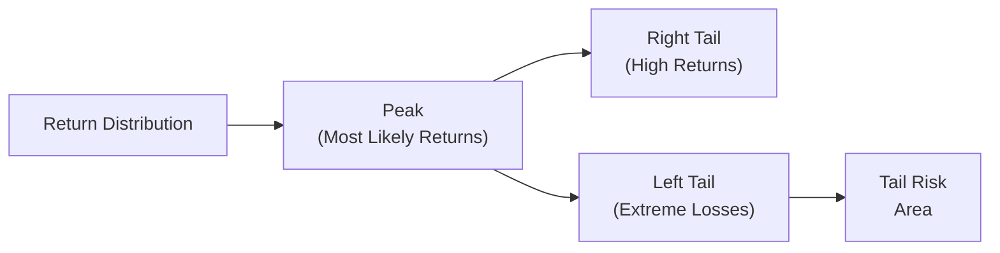

## Introduction

Well, let me start by saying that protecting portfolios against those heart-stopping market declines—those “it can’t possibly get any worse, right?” moments—can feel a bit like trying to buy insurance right after your basement has already flooded. Sometimes it’s too late, sometimes it’s too expensive, and sometimes you’re not even sure what you’re insuring against. We often talk about “tail risk” as the sort of risk that sits in the far left portion of a portfolio’s return distribution—uncommon but potentially devastating. From a practical perspective, tail risk hedging involves a balanced combination of quantitative modeling, strategic planning, and a dash of situational awareness.

It’s actually kind of fun to see how the concept of tail risk has become a high-priority discussion in every major portfolio management meeting over the past few years. This heightened awareness came in the aftermath of several market crises, where markets dropped so sharply—and so unexpectedly—that traditional diversification strategies weren’t always enough to protect investors.

Below, we’ll dive into how you can structure tail risk hedges, what instruments and strategies are commonly used, and how they can be integrated with broader portfolio objectives. We’ll even talk about the dreaded “cost” of tail risk hedging, because let’s face it: like any type of insurance, you’re probably going to pay for peace of mind.

## Understanding Tail Risk

Let’s be absolutely clear about what we mean by tail risk. In standard finance theory, returns on many assets are often modeled as (roughly) normal distributions. The “tail” of a distribution refers to the extremes—either extremely high (right tail) or extremely negative (left tail). Tail risk focuses more heavily on the left tail because negative extreme returns can have an outsized impact on an investor’s net worth, a pension plan’s solvency, or an endowment’s ability to fund operations.

If we want to be more rigorous about it, tail risk is reflected in higher “kurtosis” than that predicted by a normal distribution. In other words, real asset returns tend to have “fat tails” that standard bell curves do not fully capture. This difference underlies why many risk managers rely on alternative measures such as Value at Risk (VaR), Conditional Value at Risk (CVaR), or essential stress tests to identify unexpected but highly impactful events.

## Mermaid Diagram: Return Distribution and Left Tail

Below is a simple Mermaid diagram illustrating how extreme loss events (the left tail) can be singled out in a distribution curve:

This shows a simplified structure of a distribution, marking the potentially severe left tail where tail risk resides.

## Common Tail Risk Hedging Tools

When it comes to hedging the left tail, there is no one-size-fits-all solution. Rather, a variety of instruments exist, each with its own set of pros, cons, and complexities. Below is a quick overview of some popular approaches:

### Out-of-the-Money (OTM) Put Options
These puts have a strike price below the current market price of the underlying asset. They become valuable—or “in the money”—only if the market price drops below that strike. Because they’re out-of-the-money initially, their premiums are generally lower than at-the-money or in-the-money options. But be careful: if the market never reaches that lower strike price, your hedge might expire worthless, meaning the cost of protection can stack up if purchased repeatedly.

Sometimes I recall the first time I tried OTM puts as protection in a client portfolio. Market volatility was high, so the premiums felt steep, but the client wanted peace of mind. In the end, that quarter turned out fairly mild, and the options expired worthless. The client—who was paying attention to the costs—was torn between relief (because we avoided a crash) and frustration (because the insurance “cost a lot”).

### Protective Collars
A collar strategy combines holding the underlying asset, buying a put option for downside protection, and simultaneously selling a call option to help finance that put purchase. This approach can significantly reduce net cash outlay, but it comes with a trade-off: if markets surge, your gains are capped by the sold call. In normal or bullish markets, your portfolio might lag behind. But hey, during a massive drawdown, you’ll be grateful for that put option.

### Systematic Volatility-Targeting
Volatility-targeting adjusts exposure when volatility is higher. Think of it like an auto-dimmer for your lights at home—if the environment becomes uncertain (read: volatility spikes), you reduce your “light” (read: exposure to the market). Then, you might dial the exposure back up when things calm down. The challenge: it can lead to buying high and selling low in choppy markets, or cause you to de-risk at precisely the wrong moment. But used consistently over time, it can mitigate the amplitude of drawdowns.

### Dynamic Hedging
Dynamic hedging seeks to respond to real-time changes in market variables, such as implied volatility or momentum indicators. The manager constantly recalibrates the hedge, either by futures, options, or volatility instruments. This approach requires significant know-how (and sometimes advanced technology) because it’s basically rebalancing the hedge daily (or even intraday). It might help you catch big declines early, but watch out: transaction costs can spike, and guess what? You just might chase whipsaws in the market if you’re not careful.

### Defensive Equity Positions
While not strictly “traditional hedges,” many investors tilt toward consumer staples, utilities, or healthcare stocks in times of uncertainty. Historically, these sector exposures have shown a weaker correlation to economic cycles, though that’s never guaranteed. The phrase “flight to quality” sometimes includes large-cap, dividend-paying companies with stable cash flows. It’s a less direct way to reduce your left-tail risk profile but can be simpler to explain and maintain—especially for those reluctant to learn complex derivatives.

### Long Volatility ETFs
Several exchange-traded products—such as certain VIX-based ETFs—move in the opposite direction of large equity price drops. The concept is that, as stock markets fall, volatility tends to spike, so going “long volatility” might offset some losses. The big “gotcha” is that these ETFs carry significant roll-cost risk, and in stable or rising markets, they can bleed value. So, you have to be prepared that such an ETF might look downright ugly for, say, three years—right up until there’s a sudden meltdown, and it becomes the hero of the portfolio.

### Alternatives like Gold
People sometimes talk about gold as the “safe haven” asset. Historically, gold’s correlation to equities is relatively low, sometimes negative. During crises marked by fear of currency debasement or inflation, gold can perform well. Yet gold’s performance is by no means guaranteed in every market meltdown. Its price can be driven by multiple macro factors, such as interest rates, consumer demand, or even political shifts. It’s worth noting it can become a correlated asset in certain liquidity crises, when investors sell everything—even gold.

## Balancing the Costs and Benefits

Now, insurance can be quite expensive if you buy it all the time. Same with tail risk coverage. You might find that consistently rolling out-of-the-money puts leads to “premium decay” where you’re perpetually spending money on something that never (or rarely) pays out. This can translate into meaningful performance drag over time.

On the flip side, there’s an undeniable psychological and strategic benefit to hedging. If you’re a pension fund with retirees depending on stable payouts, or an endowment that absolutely must protect the principal, the comfort of not taking a huge loss during a meltdown is invaluable. Some institutions even have a legal or policy-driven requirement to limit the maximum drawdown. In such cases, the question is less “Should we hedge?” and more “How much are we willing to pay for this hedge?”

One approach to mitigating cost is to adopt protective collars, where selling a call helps offset part of the put premium. Another approach is timing: you might wait to buy puts when implied volatility (and premiums) are relatively low, though ironically that’s often exactly when everybody feels more confident, so they skip hedging.

## Integrating Tail Risk Hedging into Portfolio Construction

Tail risk hedging should not happen in a vacuum. It’s best done in harmony with the broader portfolio management process. As we’ve learned in earlier chapters (such as Chapter 4 on Portfolio Planning and Construction), you typically begin with an Investment Policy Statement (IPS) that defines your risk tolerance, objectives, constraints, and rebalancing approach.

• If your client (or your firm) can’t stomach volatility at all, you might consider a more permanent hedge program, accepting the ongoing cost.  
• If a moderate drawdown’s no big deal, but extreme drawdowns are catastrophic, you might require targeted hedges only when volatility crosses a certain threshold (systematic or dynamic approach).  
• If the client is comfortable with some equity risk but also wants peace of mind, a collar approach or partial hedging might strike a balance.

A good rule of thumb is to measure the portfolio’s “cost of carry” for hedges. This cost can be expressed as a percentage of total portfolio value or as a drag on expected returns. Being transparent with stakeholders—particularly if they are outside the finance world—can help them appreciate the trade-offs. That clarity fosters trust.

## How Tail Hedges Behave in Normal Markets

If you have a tail hedge on, you probably want to see big losses in the rest of your portfolio to offset that hedge cost. That sounds ridiculous, but that’s basically how it works: any protective asset tends to detract from performance in stable or bullish conditions. The upshot is that a proper tail hedge can save the day during extreme sell-offs.

Below is a simplified matrix to visualize a tail hedge:

| Market Condition    | Hedge Outcome                  | Portfolio Impact                     |
|---------------------|--------------------------------|--------------------------------------|
| Strong Bull Market  | Hedge cost likely wasted       | Potential performance drag           |
| Mild Market Growth  | Hedge cost may be partially offset by minor volatility  | Modest performance impact            |
| Flat/Choppy Market  | Hedge may lose premium cost    | Ongoing expense can feel frustrating |
| Moderate Sell-Off   | Hedge starts to pay partially  | Losses reduced, but at a net cost    |
| Extreme Drawdown    | Hedge pays out significantly   | Significant downside protection      |

It’s fairly natural for clients to ask, “Why are we losing money on this hedge every year if the market never crashes?” As a portfolio manager, you have to carefully manage expectations, explaining that you cannot time all crises to perfection, and that the payoff from tail hedging is typically realized only under truly extreme drawdowns.

## Systematic Approaches to Tail Risk

These approaches revolve around adjusting risk exposures in a rules-based manner. A typical structure might look like:

1. Establish a volatility threshold (e.g., 20% annualized volatility).  
2. If realized or implied volatility spikes above that threshold, reduce equity exposure or buy put spreads.  
3. Reassess at each period end (weekly, monthly, or other).  

Another systematic approach might be momentum-driven: if the equity index crosses below a certain moving average, shift to a safer asset mix. In theory, these rules-based methods remove emotional bias. In practice, they can be tricky: the markets may whipsaw, leaving you out of the market during a sudden rebound. Furthermore, your system might get “caught” in false signals—periods where volatility spikes briefly but doesn’t herald a deeper crisis.

## Dynamic Hedging Considerations

Dynamic hedging is akin to having a pit crew constantly adjusting the car’s setup during a race. You can have refined triggers—like changes in the VIX term structure or intraday price movements—to scale your hedge up or down. While it can be more precise, it’s also more operationally intense and costly. Any approach that trades frequently or deals in derivatives faces bid-offer spreads, liquidity issues, and the possibility of slippage, especially under stressed conditions.

## Potential Challenges and Pitfalls

1. Cost Overruns: Continuously rolling put options or rebalancing a dynamic hedge can create a substantial drag on returns.  
2. Hedge Slippage: In a rapid crash, you might not have enough time to adjust the hedge, or the derivative might not track precisely.  
3. Liquidity Freeze: In a real crisis, even normally liquid instruments (like S&P 500 futures) can see large bid-offer spreads, so your hedge might not be executed at a favorable price.  
4. Model Error: Overreliance on historical data that doesn’t include truly unprecedented shocks can produce illusions of safety.  
5. Correlation Breakdown: Assets thought to be “uncorrelated” can suddenly move in tandem in a severe market downturn.

## Case Study: Extreme Market Event

Picture a global equity fund that had a moderate tail risk hedge via OTM S&P 500 puts. In a crisis environment (like the 2008 financial crisis), equity markets collapsed, but implied volatility spiked massively. Because these were long put options, their price soared. The hedge offset a portion of the fund’s losses, ensuring that the fund’s net asset value (NAV) ended down “only” around 15%, compared to a non-hedged portfolio that could have fallen 30% or more.

In the bullish runs during 2005–2006, however, the manager had to bear the cost of these puts. Investors at the time complained about “unnecessary expenses.” Yet, once the crisis arrived, the same investors were thrilled with the manager’s foresight. This dramatic switch in sentiment underscores why investor communication is crucial.

## Communicating Tail Risk Concepts with Clients

Open communication is everything. Many clients (especially those less steeped in finance) see “insurance” as a necessity for their homes and cars but don’t always translate that logic into their investment portfolio. Here are some best practices:

• Periodically highlight “worst-case scenario” analyses in client reports.  
• Use plain language—avoid heavy jargon.  
• Emphasize that hedges are there for catastrophic protection, not for normal daily or monthly fluctuations.  
• Carefully track and disclose the costs of these hedges. An investor who sees that you’re spending 0.5% of the portfolio per year on hedging might accept it if they truly understand the downside risk scenarios.

## Putting Tail Risk Hedging in Context

It’s critical to integrate tail risk hedging with other risk management measures. For instance, Chapter 6 of this volume discusses broader risk management frameworks that include operational risk, liquidity risk, and compliance risk. Tail risk hedging is a slice of that bigger pie. Moreover, in Chapter 5 (Behavioral Biases of Individuals), we see how fear of losses can be amplified by emotional biases. Proactively adopting tail risk strategies can help mitigate detrimental panic-driven decisions.

In modern portfolio management, tail risk hedging aligns nicely with the concept of risk budgeting (see Chapter 4), where you allocate a portion of your risk budget specifically to catastrophic coverage. You might also incorporate ESG or sustainability overlays, ensuring that the instruments used for hedging align with the investor’s ethical framework.

## Exam Tips: Tail Risk Hedging in CFA-Style Questions

• Work through scenario-based analysis: Understand how a mild downturn vs. a large collapse affects each kind of hedge.  
• Be ready to do quick calculations of option payoff and how it offsets losses in a given scenario.  
• Expect to see multi-part exam questions that ask you to identify an appropriate hedging strategy while considering cost, liquidity, rebalancing, and investor preferences.  
• For item sets, practice reading the “IPS constraints” carefully to understand the maximum drawdown tolerance.  
• Don’t forget to consider the possibility of correlation spikes in crises—exam questions often test your understanding that many asset classes become more correlated during market turmoil.

## References for Further Reading

• Taleb, N. N. (2009). Fooled by Randomness. Random House.  
• Briere, M. (2020). “Tail Risk Hedging Strategies.” The Journal of Portfolio Management.  
• CFA Institute, “Derivatives and Risk Management,” CFA Program Curriculum.  

## Conclusion

Tail risk hedging, in all its forms—from plain-vanilla puts to complex dynamic hedges—serves as an important layer of protection against extreme market events. Now, I’ll be honest, it can also be one of the more contentious conversations with clients: hedges typically cost money, and in a calm market, that feels like a wasted expense. However, in that rare instance when markets spiral downward, these hedges can be the difference between losing big and just enduring a glancing blow. Ultimately, it all comes down to your risk tolerance, your objectives, and your ability to educate stakeholders on the comfort and value of insurance.

Stay diligent with ongoing evaluations, and never forget to factor in the total cost. As with any hedge, try to find a balance that aligns with the portfolio’s broader ambitions. By deeply understanding how each hedge type works, how it might complement your existing allocations, and how to communicate it effectively, you position yourself—and your clients—to weather the storms that inevitably come.

## Tail Risk Hedging Knowledge Check



### Which of the following describes “tail risk” most accurately?

- [ ] The risk of missing out on positive outlier returns.
- [ ] The risk of all correlation assumptions failing, irrespective of distribution tails.
- [x] The potential for extreme outcomes in the far left side of the return distribution.
- [ ] The volatility that occurs on standard trading days.

> **Explanation:** Tail risk refers primarily to extreme, negative outlier events (often in the left tail of a return distribution).  

### Which of the following strategies combines a long position in the underlying asset, a purchased put, and a sold call for downside protection?

- [ ] Covered call
- [ ] Straddle
- [x] Protective collar 
- [ ] Butterfly spread

> **Explanation:** A protective collar involves owning the underlying, buying a put, and selling a call.  

### A manager wants to dynamically hedge tail risk based on real-time volatility signals. Which key challenge might they face?

- [x] High transaction costs and potential whipsaws.
- [ ] Impossibility of modeling volatility at all.
- [ ] Very limited liquidity in equity index options.
- [ ] Zero correlation between assets in crisis.

> **Explanation:** Dynamic hedging can lead to high transaction costs and whipsaw risks if volatility triggers are frequently reached and undone.  

### Why might continuous hedging via out-of-the-money put options create a performance drag over time?

- [ ] Because puts cause the underlying asset to decline in value.
- [ ] Because equity prices always go up in the long run.
- [ ] Because put options have a zero cost when purchased far in advance.
- [x] Because the investor pays premiums repeatedly, which can sum to a sizable cost if markets do not fall significantly.

> **Explanation:** Continuously paying option premiums drains the portfolio’s return if the puts expire worthless.  

### Which of the following best describes a volatility-targeting approach?

- [x] Adjusting portfolio exposures to maintain a desired volatility level.
- [ ] Using exclusively defensive equities across all market regimes.
- [ ] Buying a single large out-of-the-money put each month regardless of volatility levels.
- [ ] Writing calls to augment return in flat markets.

> **Explanation:** Volatility-targeting involves resizing portfolio exposure based on fluctuations in volatility, thereby balancing risk across different market conditions.  

### One advantage of a protective collar over a simple long put hedge is:

- [ ] It can provide unlimited upside potential.
- [x] Its net cost is lower because of the premium received from the sold call.
- [ ] It never requires rebalancing or rolling.
- [ ] It offers perfect protection against losses at all levels.

> **Explanation:** The call premium offsets some of the put premium cost, lowering the net expense of the hedge.  

### Which of the following might be considered a potential “alternative hedge” for tail risk?

- [x] Long positions in gold or precious metals.
- [ ] Short positions in consumer staples.
- [ ] A time-weighted pay-later option.
- [ ] A guaranteed 8% yield asset.

> **Explanation:** Some investors consider gold (and other precious metals) as non-correlated or negatively correlated hedges in certain crisis periods.  

### What is a key limitation of long volatility ETFs as a tail risk hedge?

- [ ] They tend to rise substantially only in flat markets.
- [x] They can incur high roll costs and may lose value in stable periods.
- [ ] They are not accessible to retail investors.
- [ ] They don’t move inversely during market declines.

> **Explanation:** Long volatility ETFs often suffer from significant roll yields and can erode value if volatility remains low or normal for extended periods.  

### In a severe crisis, correlations can:

- [x] Rise sharply, causing multiple asset classes to decline simultaneously.
- [ ] Remain constant regardless of market conditions.
- [ ] Always drop to zero, providing perfect diversification.
- [ ] Become negative for all global equities.

> **Explanation:** Empirical evidence has shown that in market crashes, correlations tend to spike between various asset classes, reducing the benefit of normal diversification.  

### True or False: Maintaining tail risk hedges can help mitigate catastrophic losses but may lower average returns in normal market conditions.

- [x] True
- [ ] False

> **Explanation:** By design, tail risk hedges provide downside protection in extreme markets but often result in a drag on returns otherwise.


