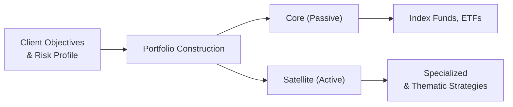

## Overview

It’s funny how often people ask, “Should I go fully active or fully passive?” as though it’s some sort of never-ending ping-pong match. In reality, there's a spectrum of approaches between the two extremes. This section dives into the factors that influence when to use an active strategy, when to rely on passive solutions, and how to integrate both into a robust model portfolio.

Why is this important? Well, the choice between active and passive implementation can shape everything from cost structure to alpha potential and even your day-to-day stress levels as a portfolio manager. It’s also something that pops up frequently in real-life conversations with clients who want to know whether it’s worth paying higher fees for active management or if an index fund might suffice. 

Below, we address key elements like market efficiency, cost sensitivity, and the popular “core-satellite” approach. You’ll see references to earlier chapters (like risk measurement from Chapters 2 and 3) and risk management frameworks from Chapter 6, tying them all together into how you might build or refine a model portfolio for actual clients.

## Setting the Stage: Active vs. Passive Essentials

Active management tries to outperform a benchmark through expert stock picking, timing decisions, or factor tilts that aim to capture extra returns (often called alpha). Passive management, by contrast, seeks to match a benchmark index and typically involves much lower costs. The efficiency of the market, along with a client’s specific goals and budget, plays a huge role in deciding what combination of these tactics to apply. 

Alpha (α) can be formally captured by:

\alpha = R_{p} - R_{b}

where \\( R_{p} \\) is the portfolio return and \\( R_{b} \\) is the benchmark return. If you’re generating positive alpha, that’s a sign your active strategies might be paying off. If alpha is consistently negative, well…it might be time to shake things up (or rely more heavily on passive strategies).

## Considering Market Efficiency

Market efficiency refers to how quickly and accurately current prices reflect available information. Highly efficient markets—such as large-cap U.S. equities or major developed government bond markets—are typically tough for active managers to outperform on a consistent basis after fees. On the other hand, less efficient spaces, for instance small-cap frontier markets or specialized niches, can provide alpha opportunities for skilled managers.

• In a highly efficient market (think of the S&P 500), the case for passive management strengthens. Transaction costs, management fees, and the inherent difficulty of consistently beating the market can eat into returns.  
• In less efficient or specialized markets (e.g., small caps, emerging frontier markets, or niche strategies in real assets), well-executed active management may uncover mispriced securities and drive outperformance.

## Balancing Cost Sensitivity With Alpha Potential

Clients often focus on the difference in fees between active and passive strategies. Passive index funds or ETFs can have expense ratios close to zero in some markets, whereas an active strategy might charge upwards of 1% to 2% (or even more for certain niche hedge fund strategies). So it’s important to ask if the expected alpha from an active fund will exceed that fee difference—and possibly the added transaction costs and tax drag from higher turnover.

I once had a client who was extremely cost-conscious because of limited liquidity needs and a target to fund future philanthropic endeavors. We ended up going with primarily passive vehicles for the “core” portion of the portfolio, then added one small actively managed emerging markets fund. Despite the higher fees for that niche strategy, the potential outperformance in that less-efficient space justified the cost. This approach let us keep overall expenses low while not completely giving up on alpha potential in certain segments.

## Passive Approaches in Model Portfolios

Passive implementations typically involve choosing index funds, ETFs, or other vehicles that replicate popular benchmarks (e.g., the MSCI World Index for global equities or Bloomberg U.S. Aggregate Bond Index for fixed income). Here’s why passive solutions are compelling:

• Low Fees and Lower Operational Costs: Less overhead in research, portfolio turnover, and staff compensation.  
• Transparency: An investor can easily track day-to-day performance against the benchmark.  
• Reduced Turnover: Typically, index replication strategies only change constituents when the index does, making it more tax-efficient and decreasing transaction costs.  
• Benchmark Alignment: Returns closely match the selected index, minus a small expense ratio. 

However, keep in mind certain pitfalls. If the underlying benchmark is less liquid—like a high-yield bond index in a crisis period—reconstitution might get trickier or more expensive. And some specialized passive products carry higher internal costs or hidden complexities (like synthetic replication of an index using derivatives).

## Active Approaches in Model Portfolios

Active management can vary widely, from discretionary mutual funds to algorithmic hedge funds chasing high-frequency patterns. When constructing model portfolios, active funds are usually brought in to:

• Exploit Market Inefficiencies: Skilled managers may capitalize on mispriced securities.  
• Implement Thematic or Specialized Strategies: For instance, a manager might focus on small-cap biotech or distressed debt.  
• Achieve Specific Factor Tilts: Managers might deliberately overweight value, momentum, or volatility factors to outperform the benchmark.

### Evaluating Active Managers

Don’t jump into active management blindly. You want to look at:

• Performance vs. Benchmark: Is the manager generating positive alpha over multiple market cycles?  
• Risk-Adjusted Returns: Check metrics like Sharpe Ratio, Jensen’s Alpha, or Treynor Ratio—introduced in Chapter 3—to see if that outperformance justifies the extra risk.  
• Manager Style Consistency: Verify the manager hasn’t experienced style drift, which could unexpectedly alter risk exposures in your overall portfolio.  
• Fees and Turnover: High turnover can increase transaction costs, which are rarely fully itemized.  

One aspect that catches many newer investors off guard is style drift. Maybe a fund that originally claimed to be a “small-cap growth” strategy starts investing in mid-cap or large-cap “value” names. This shift can change the entire risk profile and affect how your model portfolio lines up with the client’s goals.

## Core-Satellite Approach

A common method for integrating both management styles in one cohesive portfolio is the core-satellite method. You keep a large “core” allocated to passive investments, ensuring a strong alignment with market returns, stable costs, and dependable tracking of broader market performance. Then, you surround that core with “satellites,” which are smaller allocations to active, alternative, or thematic strategies. These satellites are designed to pursue alpha in areas where active management might outperform.

Here’s a quick diagram illustrating the concept:

In practice, the core-satellite balance could be 70% passive core and 30% active satellites, or 80%-20%, or even 50%-50%, depending on:

• The investor’s tolerance for tracking error relative to standard benchmarks.  
• The investor’s desire to seek alpha.  
• The cost constraints and tax considerations.  
• The time horizon (shorter horizons might not favor active strategies with high fees and volatility).

## Monitoring and Rebalancing

Periodic check-ins are essential (and you’ll see a direct tie to Chapter 4 on rebalancing policy). Some major tasks:

• Confirm Active Managers’ Alignment: Ensure there isn’t unexpected style drift or high turnover that inflates costs.  
• Check Benchmark Comparisons: Is the active manager out- or underperforming their relevant benchmark? A consistent underperformance might argue for a passive replacement.  
• Evaluate Market Changes: Maybe a market that was once inefficient has become more efficient over time. This could reduce alpha opportunities.  
• Rebalance to Target Weights: Bring the portfolio back to its desired core-satellite structure if weightings drift due to market fluctuations.

## Tax Efficiency and Transparency

Passive funds generally have lower turnover, which can result in lower realized capital gains distributions. For taxable accounts, that’s a big deal. Meanwhile, active funds may see frequent capital gains events if the manager actively trades. Plus, it can be simpler to track a passive index fund’s performance or replicate it with separate accounts, making it more transparent to the client.

That said, some active managers employ tax-loss harvesting strategies, especially if the investor is living in jurisdictions with complex tax structures. Be sure to do a net benefit analysis—sometimes an experienced active manager can add alpha while also being mindful of tax efficiency. But typically, passive is the straightforward path if minimal tax drag is a top priority.

## Real-World Scenario: Putting It All Together

Suppose you have a moderate-risk client who wants global diversification:

• You decide to allocate 60% of their equity portion to a low-cost global equity index ETF that tracks the MSCI ACWI. This chunk represents the passive “core.”  
• The remaining 40% of equities is split into three satellites:  
  1) A concentrated active emerging markets fund (seeks alpha in frontier economies).  
  2) An active small-cap fund focusing on technology disruptors in the U.S.  
  3) A thematic climate-focused equity fund that invests in renewable energy stocks (another “active” tilt with a specialized focus).  

The bond side might be similarly structured. Maybe 80% sits in a passive total bond market index, and 20% invests in an active global bond fund that hunts for higher-yield opportunities with an event-driven approach. This integrated approach tries to harness alpha in certain pockets without ballooning fees across the entire portfolio.

## Common Pitfalls

• Overpaying for mediocre active managers in highly efficient markets.  
• Failing to monitor active funds for style drift.  
• Underestimating turnover and transaction costs.  
• Letting individual preference or “chasing star managers” overshadow the client’s actual goals.  
• Neglecting to reevaluate the strategy when market conditions or client objectives change.

## Best Practices

• Start with a thorough Investment Policy Statement (IPS) that sets a clear approach to active vs. passive.  
• Choose a reliable benchmark and measure performance consistently against it.  
• Use “core-satellite” or other structured methods to maintain clarity in your allocations.  
• Benchmark active managers not only on performance but also on risk metrics and consistency with their stated style.  
• Keep a watchful eye on costs, especially in markets where alpha is tough to come by.  
• Communicate regularly with clients—sometimes, even an actively managed fund that’s underperforming for a quarter or two might bounce back. But you need to set realistic expectations and keep them informed.  

## Revisiting the Active-Passive Mix

Just because you designed your model portfolio with a certain mix of passive and active strategies doesn’t mean it’s locked in forever. Market regimes evolve, client priorities shift, and managers can leave or retire. It’s helpful to reevaluate the active-passive blend at least annually (or more frequently if you notice style drift in a fund or a dramatic upending of the market environment). 

## Applying This in the CFA Exam Context

For CFA Program exam purposes (especially Level III), you need to demonstrate the ability to weigh client objectives, weigh alpha potential, and pick an allocation approach that’s consistent with the Investment Policy Statement. You might see scenario-based questions where you’re presented with a portfolio, the manager’s track record, and a set of client constraints (tax concerns, liquidity, risk tolerance). Be prepared to recommend adjustments to the active-passive mix and justify your choices based on fees, market efficiency, performance data, or risk metrics.

A typical item-set question could ask: “Based on the manager’s consistent underperformance and high fees in a liquid segment of the U.S. equity market, should the portfolio’s large-cap exposure be replaced by an index fund?” If you have data showing persistent negative alpha and an environment with minimal mispricing opportunities, you might say yes, the switch to passive is advisable.

## Final Exam Tips

• Clarify the rationale for choosing active in certain segments—what inefficiency or alpha driver do you see?  
• Stress the importance of performance attribution. Make sure you know how to break down a manager’s returns into skill vs. luck in different market conditions.  
• Emphasize the advantage of cost savings and lower tax drag when you recommend passive.  
• Understand the concept of the core-satellite approach inside and out—it’s a mainstay in portfolio construction.  
• Provide thorough justifications grounded in client objectives, market conditions, and performance data.  

## References

- Bogle, J. C. (2009). Common Sense on Mutual Funds. Wiley.  
- Sharpe, W. F. (1991). “The Arithmetic of Active Management.” Financial Analysts Journal.  
- CFA Institute. “Equity Portfolio Management,” CFA Program Curriculum.

## Active vs. Passive Implementation Quiz



### In which market condition are passive strategies typically favored?

- [ ] Markets with substantial liquidity constraints
- [ ] Markets facing short-selling restrictions
- [x] Highly efficient and liquid markets
- [ ] Frontier markets with low analyst coverage

> **Explanation:** Highly efficient markets, such as large-cap developed-equity markets, generally reduce the potential for active managers to outperform after fees, making passive approaches more attractive.

### Which of the following is a typical advantage of passive funds?

- [ ] Higher alpha generation due to skilled managers
- [x] Lower turnover and reduced tax implications
- [ ] Greater liquidity in all circumstances
- [ ] Guaranteed higher returns than active funds

> **Explanation:** Passive funds aim to track an index with minimal trading and lower costs, which often leads to lower realized capital gains and thus a more tax-efficient structure.

### Style drift refers to a manager’s tendency to:

- [x] Deviate from the stated investment mandate
- [ ] Outperform only in rising markets
- [ ] Only invest in value-oriented stocks
- [ ] Sacrifice risk-adjusted returns for lower fees

> **Explanation:** Style drift occurs when the investment strategy or style changes from what was originally presented, potentially altering the portfolio’s risk and return characteristics.

### When comparing active and passive strategies, the cost difference is particularly relevant because:

- [x] High fees can erode excess returns from active management
- [ ] Passive funds are only suitable for high net worth investors
- [ ] Active managers never adjust their strategies
- [ ] Passive strategies impose excessive transaction costs

> **Explanation:** Active strategies often come with higher fees; if these fees are not justified by equally high or higher alpha, they can significantly reduce overall net returns.

### A core-satellite approach would most likely include:

- [x] A main passive allocation and smaller active allocations
- [ ] Exclusively alternative funds in the portfolio
- [ ] A fully active approach across all asset classes
- [ ] No rebalancing or manager oversight

> **Explanation:** Core-satellite allocates a larger “core” portion to passive vehicles, while smaller “satellite” slices take on active or thematic strategies poised for higher alpha potential.

### Which of the following commonly leads to higher turnover in active funds?

- [x] Frequent buy/sell decisions as the manager seeks mispriced assets
- [ ] Passive replication of a broad market index
- [ ] Regulatory limitations on trading
- [ ] Investing strictly in government bonds

> **Explanation:** Active managers tend to trade more frequently, aiming to capitalize on perceived mispricing or market shifts, leading to higher turnover.

### In a highly efficient market, the alpha potential for active managers often is:

- [x] Reduced, making it challenging to outperform net-of-fees
- [ ] Increased, given more mispriced securities
- [x] Moderately improved by style drift
- [ ] Unchanged from less efficient markets

> **Explanation:** Highly efficient markets incorporate information rapidly, reducing mispricing opportunities and making it harder for active managers to beat the benchmark after costs.

### Why might an investor consider an actively managed frontier markets fund?

- [x] Potential to exploit inefficiencies in less covered markets
- [ ] Lower management fees than an S&P 500 index
- [ ] Guaranteed capital protection
- [ ] Zero risk of style drift

> **Explanation:** Frontier markets are often less covered by analysts and potentially offer more opportunities to find mispriced assets, which skilled active managers may exploit.

### Which factor is generally most important when evaluating an active manager’s performance?

- [x] Risk-adjusted return relative to a comparable benchmark
- [ ] Marketing efforts and brand recognition
- [ ] Absolute returns independent of any benchmark
- [ ] Fund size and assets under management

> **Explanation:** Assessing whether a manager generates sufficient alpha on a risk-adjusted basis, compared to an appropriate benchmark, is crucial in determining the manager’s skill.

### Active management is typically preferred for:

- [x] Less liquid or niche segments where market inefficiencies may exist
- [ ] All segments of the equity market under any condition
- [ ] Very short-term holding periods only
- [ ] Passive replication of established benchmarks

> **Explanation:** Active management can add value in markets that are less efficient and have higher potential for uncovering mispriced assets, such as small-cap or specialized niches.


