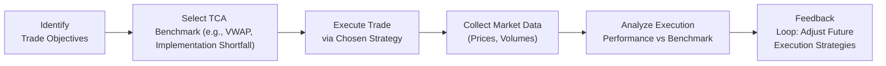

## Overview

You might know the feeling: you’ve thoroughly researched a stock, your analysis shows compelling upside, and it’s time to place your trade. Yet, the minute you press that button, you start worrying: “Will I get a good price?” “How quickly will it fill?” “What if the trade size causes the price to swing?” These jitters aren’t just nerves; they reflect the core challenge of execution quality. Execution isn’t just about getting trades done—it's about getting them done at the best possible combination of price, speed, and cost.

In this section, we delve into the key factors that influence execution quality. We’ll examine why some trades can move the market while others sneak in quietly, why certain venues might be better than others for big orders, and how real-time analytics help ensure you get a fair deal. Plus, we’ll look at how technology and settlement processes shape the entire chain of events from placing an order to final settlement. Let’s jump in.

## Best Execution Is Multi-Dimensional

“Best execution” might sound like an obvious objective: get the best price, right? But as many of us have discovered, especially in times of market volatility, price is just one aspect. Best execution also encompasses:

• Cost: This involves explicit costs (commissions, fees) and implicit costs (market impact, bid-ask spreads).  
• Speed: How quickly your order can be executed, which matters if you’re trading in volatile conditions or on time-sensitive information.  
• Likelihood of Execution: You can aim for the perfect price, but if your order never fills, it’s not all that perfect.  
• Reliability of Settlement: Even if you execute at a great price, you need a smooth settlement process to complete the transaction without unexpected delays or errors.

Imagine you’re trying to buy a block of shares in a less liquid small-cap stock. Even if you have a price target in mind, placing a large market order might shove the price up (known as market impact), meaning you end up buying shares at a higher average cost than anticipated. On the other hand, a limit order might protect you from overpaying, but can lead to partial fills or no fill at all.

## Advanced Analytics and Venue Selection

We hear “analytics” and think big data, machine learning, and all that fancy stuff. Truth is, analytics can help decide everything from which trading venue to use to how to slice big orders into smaller chunks.

• Venue Comparison: Different trading venues—exchanges, alternative trading systems (ATS), dark pools—offer different liquidity levels, fees, and anonymity. For large institutional trades, dark pools may diminish the market impact since order size isn’t displayed publicly. However, they also carry a risk of not finding enough counterparties at your desired price.  
• Algorithmic Trading Tools: Use these to break big orders into smaller “child” orders. The algorithms determine how to pace the trades based on real-time market conditions. This is often called “slicing and dicing.” (I once had a portfolio manager friend who literally used a “slicing” analogy like he was cutting a giant birthday cake: carefully distributing the slices so no one single slice is so big it spoils the party.)

### A Quick Glimpse into Dark Pools

Dark pools may sound ominous, but they’re simply private trading venues that do not display order book data. They aim to lessen the problem of big orders moving the displayed market price. Traders typically use dark pools for large transactions. However, there can be less clarity about who’s on the other side of the trade, and sometimes filling a large order can be slow if the pool lacks sufficient liquidity.

## Trade Cost Analysis (TCA) and Execution Benchmarks

To ensure we’re truly meeting best execution standards, we rely on robust metrics:

• Volume-Weighted Average Price (VWAP): A measurement of the average price weighted by volume traded over a particular period. If you can beat the VWAP consistently, you’re likely doing well.  
• Implementation Shortfall: The difference between the theoretical “paper” portfolio and the actual results, factoring in the delay, partial fills, and market movement. The more you can shrink this gap, the better your execution.  
• Slippage: The difference between the expected price of a trade (when the order was placed) and the actual executed price. A smaller slippage is good news.

### Mermaid Diagram: TCA Flow

Below is a simple diagram illustrating the flow of implementing a TCA process.



As you can see, TCA is a continuous improvement cycle. After your transaction, you gather data, compare results to benchmarks, and refine your tactics for next time.

## Monitoring Liquidity and Market Impact

I once tried to trade a thinly traded small-cap after hours, hoping to capitalize on an earnings release. Guess what? The bid-ask spread was so wide you could drive a truck through it, and my order ended up filling at a higher price than I liked. The moral here is: trading isn’t just about being right on the fundamentals. If liquidity is scarce, you can pay a significant premium.

Thin liquidity means fewer counterparties at each price point. When your trade hits the market, it can push the price up (for buys) or down (for sells), leading to market impact. For large orders, chunking them out carefully using algorithms or taking them to a dark pool can reduce this impact. Also, pay attention to average daily volume (ADV). If you’re trading a position that’s, say, 20% of that day’s anticipated volume, you probably need to be more strategic to avoid unnecessary slippage.

## Broker and Execution Platform Considerations

Choosing a broker or trading platform may not be as exciting as picking the next big tech stock, but it can profoundly affect performance. A few factors to keep in mind:

• Technology and Reliability: Does your broker offer stable infrastructure with minimal downtime? Is it using advanced routing technology to source liquidity from multiple venues?  
• Research Support: Some brokers provide market structure research or TCA reports. Others specialize in certain instruments or have strong global coverage.  
• Compliance and Regulation: Remember that best execution is also a regulatory requirement in many jurisdictions. If your broker lacks robust compliance measures, it could pose operational and reputational risks.

## Order Types and Market Environments

Market, limit, stop, stop-limit… choosing the right order type is almost like picking the right club in golf. Each has advantages and trade-offs:

• Market Orders: Provide speed of execution but no guaranteed price. In extremely volatile conditions, you might end up with a fill far from the last quoted price.  
• Limit Orders: Guarantee a maximum (or minimum, if you’re selling) price, but you risk partial fills or no fill if the market moves away.  
• Stop Orders: Useful for risk management, triggering an order only once a certain price is reached. But a stop order can become a market order when triggered, so big price slippage might occur in fast-moving markets.  
• Stop-Limit Orders: Combine the attributes of stop and limit orders. This ensures execution only occurs at (or better than) your limit price, but the trade-off is you could miss the trade if the price moves too quickly.

If you’re in a hurry to exit a position—perhaps negative news just hit the wires—you might place a market order to ensure you can sell. But if you believe the market is fairly stable, you might prefer a limit order to avoid a shocking fill price.

## Volatile Markets and Execution Tactics

Volatility can be a friend or a foe. During high volatility, the bid-ask spread often widens, and quotes can change in a blink. Adjusting your tactics here is critical:

• Using Limit Orders: This can stop you from overpaying, but you might not get filled if the price whipsaws.  
• Breaking Up Orders: Large trades might be broken into multiple smaller blocks to minimize market impact.  
• Real-Time Adjustments: Many algorithmic platforms automatically recalibrate slice size or price aggression based on volatility spikes.  
• Dark Pool Use: Since dark pools mask the size, trying them in a volatile market might reduce the risk of traders front-running your large order. Of course, the flip side is lower transparency and uncertain fill times.

## Settlement Processes and Reducing Operational Risk

You’ve done the trade, you got a decent price, so you’re all set, correct? Well, not entirely. There’s the settlement process—confirming the transaction, exchanging cash and securities, and updating records. Different markets have different settlement standards, such as T+2 or T+1, meaning the trade finalizes one or two business days after the trade date.

A shorter settlement cycle, like T+1, can reduce counterparty risk (less time for something to go wrong). But operationally, you need robust processes to handle the more rapid settlement. This includes ensuring your custodians can handle the flow of funds and positions swiftly. Delays or errors can introduce extra costs and risks, so it’s important to keep an eye on your broker’s or platform’s track record for settlement efficiency.

## Case Study: Controlling Implementation Shortfall

Let’s walk through an example scenario of Implementation Shortfall to illustrate how these concepts fit together:

You decide to acquire 50,000 shares of XYZ Corp, trading at $20.00. You plan to buy your shares in smaller chunks over the next trading day:

• The opening price is $20.00, and you manage to purchase 10,000 shares at that price.  
• After some positive industry news, the price jumps to $20.20 by midday. You buy another 20,000 at an average of $20.18.  
• By late afternoon, volume dwindles, the spread widens, and the price hovers at $20.35. You carefully place smaller bids for the final 20,000 shares, ending up with an average fill at $20.33.  

Your overall average price is $20.25. Meanwhile, if you’d placed a single market order early in the day, you might have gotten everything at $20.00 or might have caused a giant spike. Conversely, if you’d tried to be too conservative with strict limit orders (say $20.00 limit the entire day), maybe you’d have missed shares when the market price ran up. Your final Implementation Shortfall is the net difference between $20.00 (your initial “paper” target) and your realized $20.25, plus any additional transaction costs, over the volume purchased.

## Python Code Example: Measuring Simple Slippage

Below is a short snippet of Python code that illustrates how you might measure slippage relative to a target price. This is a basic approach; more sophisticated methods (like Implementation Shortfall calculations) will include other cost elements.

```python
# Let's say you have a list of executed prices and a target price

executed_prices = [20.05, 20.10, 20.20, 20.00, 20.15]
target_price = 20.00

slippage_values = [(price - target_price) for price in executed_prices]
average_slippage = sum(slippage_values) / len(slippage_values)

print(f"Slippage per trade: {slippage_values}")
print(f"Average Slippage: ${average_slippage:.2f}")
```

Running this code might reveal how each fill differs from your target. If your average slippage is consistently large, it’s time to adjust trading strategies or look at alternative order types and venues.

## Practical Exam Tips

It’s common for CFA Level III exam questions to present a scenario and ask you to evaluate the effectiveness of an execution strategy. Maybe you’ll have a small table with a hypothetical TCA analysis, or you’ll be asked to outline how you’d approach a thinly traded stock. Some tips:

• Know Your Benchmarks: Be prepared to explain the difference between VWAP, Implementation Shortfall, and other TCA metrics.  
• Understand Why Execution Strategies Vary: Don’t just memorize definitions; show how you’d pick a strategy for low-liquidity or high-volatility scenarios.  
• Consider the Regulatory and Ethical Dimensions: The CFA Code of Ethics emphasizes best execution for clients, so be aware of standards and compliance.  
• Watch the Time: In essay questions, be concise but thorough. You might be asked to briefly propose a trading strategy and justify it with references to cost, speed, and fill probability.  
• Use Real Examples: If the question references a large block trade, mention potential market impact. If it references fast-moving markets, mention slippage and limit orders.

## Conclusion

Trading is exciting, but it’s also multifaceted. You’re not just matching wits with the market’s fundamentals. You’re also grappling with liquidity, volatility, order types, and technology. Achieving best execution is as much an art as it is a science, blending big-picture strategy with real-time analytics. Whether you’re operating in a quiet midday market or braving the storm of a high-volatility session, the core principles—managing costs, timing, and reliability—remain the same.

Remember to keep refining your approach: measure your outcomes, analyze them with TCA, and adapt. Appreciate that each security has its own liquidity profile and each trading venue offers unique advantages. This ability to pivot is what differentiates a top-notch portfolio manager from the rest. From my own experience, I’ve scoured the markets in times of calm and chaos, and the one constant is the value of planning, measurement, and continuous improvement.

And honestly, that’s part of the fun—no two days are the same. Anyway, good luck tapping into best execution for your portfolio!

## References

- CFA Institute, “Trading and Execution in Equity Markets,” CFA Program Curriculum.  
- Kissell, R. (2013). The Science of Algorithmic Trading and Portfolio Management. Academic Press.  
- Harris, L. (2003). Trading and Exchanges: Market Microstructure for Practitioners. Oxford University Press.

## Test Your Knowledge: Execution Quality Essentials



### Which of the following best describes a “dark pool”?

- [ ] A pool of stocks with lower-than-market interest rates
- [x] A private trading venue where large orders can be executed with minimal market visibility
- [ ] An unregulated exchange that does not require an order book
- [ ] A centralized database of pending limit orders

> **Explanation:** Dark pools are private venues designed to reduce market impact by not displaying order book details publicly, enabling large trades to be executed with lower transaction visibility.

### What key factor drives “implementation shortfall” in executing large trades?

- [x] The delay between the decision to trade and actual trade execution
- [ ] The brokerage commissions only
- [ ] The end-of-day price being lower than cost
- [ ] Lack of market data from the previous day

> **Explanation:** Implementation shortfall measures the difference between the decision price (paper portfolio) and the actual execution price, including the impact of delay, partial fills, and market movements.

### In high-volatility markets, which execution tactic may mitigate excessive price movement while trading a large order?

- [x] Splitting the order into multiple smaller trades
- [ ] Using an “all-or-nothing” market order
- [ ] Only placing market orders during closing auction
- [ ] Waiting until after-hours and placing all large orders at once

> **Explanation:** Breaking a large order into smaller trades can reduce market impact in volatile times, avoiding sudden and extreme price moves.

### Which metric is often used as a benchmark in Trade Cost Analysis (TCA)?

- [x] Volume-Weighted Average Price (VWAP)
- [ ] Free cash flow
- [ ] Beta
- [ ] Dividend yield

> **Explanation:** VWAP is frequently used in TCA to gauge how execution prices compare to the weighted average price over a specified time.

### What is one advantage of placing a market order over a limit order?

- [x] Speed of execution
- [ ] Guaranteed price
- [x] Possibly lower slippage
- [ ] No transaction fees

> **Explanation:** A market order is executed swiftly at the best available price, offering speed, although you sacrifice price certainty. It might reduce slippage if you execute quickly before a large price move, but you can’t guarantee the final fill price.

### Why might T+1 settlement reduce counterparty risk compared to T+2?

- [x] The shorter settlement cycle decreases the period during which a default or non-delivery could occur
- [ ] The faster cycle increases the broker’s commission costs
- [ ] The broker has more time to find counterparties
- [ ] It prevents trades from being canceled

> **Explanation:** A T+1 cycle closes out transactions faster, reducing the time window in which counterparty defaults or operational errors can occur.

### Which factor is most likely to cause significant “market impact” for a trade?

- [x] Large order size relative to the security’s average daily volume
- [ ] A small order in a highly liquid security
- [x] Highly stable market conditions and narrow bid-ask spreads
- [ ] Trading a very large portion of the S&P 500

> **Explanation:** When an order is large compared to the average trading volume of a security, it can push the price higher or lower, creating market impact.

### If an investor wants to avoid paying more than a certain price for shares, which order type is most appropriate?

- [x] Limit order
- [ ] Market order
- [ ] Stop order
- [ ] All-or-none order

> **Explanation:** A limit order sets a maximum purchase price (or minimum selling price) and won’t fill at a worse level than specified.

### Which of the following best describes slippage?

- [x] The difference between the expected price of a trade and the actual execution price
- [ ] A negotiated commission discount
- [ ] A form of dividend reinvestment
- [ ] A regulatory penalty for trading after market hours

> **Explanation:** Slippage is the gap between the price at order placement and the actual executed price, often increased by volatility or market impact.

### True or False: Using dark pools completely eliminates the risk of market impact.

- [x] True
- [ ] False

> **Explanation:** Dark pools aim to reduce market impact by keeping order size hidden, but they can’t guarantee zero impact. Large trades may still move prices as the pool attempts to find counterparties.


