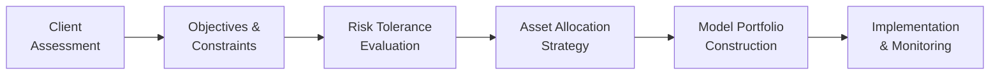
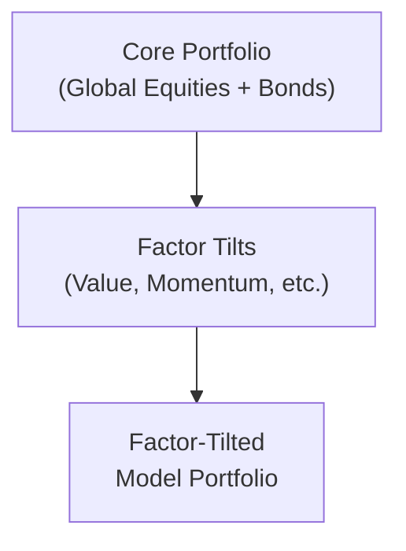

## Introduction

Let’s be honest—constructing model portfolios can be both exciting and, well, a little daunting. Perhaps you’ve experienced that moment when a client’s specific situation just doesn’t fit the standard “textbook” template. In this section, we’re going to step through real-life client scenarios and demonstrate how to craft model portfolios that align with each client’s unique goals, risk tolerances, and constraints. We’ll blend practical insights from the trenches (yep, I’ve had my fair share of messy portfolios!) with the theoretical frameworks you’ve likely seen in earlier chapters.

We’ll also explore factor-based investing angles—like tilting toward value, momentum, or small-cap “factors”—to see how they can target specific risk/return profiles. Throughout, we’ll keep an eye on tax implications, liquidity constraints, compliance with Investment Policy Statements (IPS), and the dreaded “market stress” scenario. By walking confidently through these examples, we’ll discover best practices, potential pitfalls, and ways to stay flexible and resilient in our portfolio allocations.

## Understanding Model Portfolios in Practice

A model portfolio is a representative investment mix crafted to illustrate an approach for a typical investor archetype. In practice, you often adapt these “templates” to each client’s unique situation. While theoretical frameworks—like mean-variance optimization—help shape the starting point, the real art of portfolio construction lies in weaving together constraints, behavioral factors, transaction cost considerations, and client preferences.

Below is a high-level Diagram (in Mermaid) highlighting how an advisor moves from client discovery to final model portfolio deployment:

Model portfolios typically consider several investor attributes:

• Risk Tolerance: The ability and willingness to take risk.  
• Time Horizon: Longer horizons often allow for more growth-oriented or higher-volatility assets.  
• Liquidity Needs: The need to access cash can drive asset selection.  
• Special Circumstances: For instance, a planned large purchase or an unexpected medical expense.  
• Factor Tilts: Value, momentum, quality, and size tilts, among others.  

Next, let’s visit some practical case studies. We’ll strip away unnecessary complexity and focus on the “how” and “why” of portfolio allocation. Each case will include:  
• A short investor profile.  
• A proposed allocation across equity, fixed income, and alternatives.  
• Potential factor tilts.  
• Rebalancing tactics.  
• A “what-if” scenario for market stress.

## Case Study A: The Young Professional Accumulating Wealth

Picture Chris, a 30-year-old professional who’s consistently saving for retirement, has stable income, and minimal short-term liquidity needs. Chris wants to capitalize on growth opportunities, is comfortable with higher volatility, and has a long time horizon—maybe 30+ years until retirement. We suspect Chris can stomach equity-heavy allocations.

### Proposed Asset Allocation

• Equities: ~70–80%  
• Fixed Income: ~15–25%  
• Alternatives: ~5–10%  

Equity Slice:  
• 60% broad market index (e.g., global equity mix).  
• 20% factor tilt to “value” (Chris likes the idea of investing in undervalued stocks).  
• 20% small-cap momentum strategy (slightly more aggressive tilt).  

Fixed Income Component:  
• Primarily investment-grade bonds with intermediate duration.  
• Small exposure to high-yield for additional yield pickup (say 10–15% of fixed income component).  

Alternative Assets:  
• A modest REIT or real estate fund exposure for diversification.  
• Possibly some exposure to commodity or private equity vehicles if Chris is comfortable with longer lockup periods.  

### Rationale

Chris’s primary objective is long-term capital accumulation. Since he has decades to go, the equity tilt is more aggressive. The factor-based tilt toward value might offer potential outperformance over the long run, especially if the broader market is frothy. Momentum in small caps can add additional high-risk/high-return potential. The real estate piece, while modest, can offer some form of diversification away from pure equity risk.

### What-If Market Stress Scenario

If equity markets drop significantly—like a 2008-style crisis—this portfolio is going to experience substantial volatility. Chris, however, has time to ride out market cycles. So the main action is to:

• Avoid panic-selling.  
• Potentially rebalance into equities if stocks drop below target allocations.  
• Continue systematic contributions (dollar-cost averaging).  

### Rebalancing Strategy

Chris’s portfolio might benefit from an annual rebalance. Alternatively, a threshold-based rebalancing approach (say 5% deviation from targets) could systematically buy low and sell high.

### Lessons Learned

• Ensure that the potential drawdowns are within Chris’s risk tolerance.  
• Communicate that short-term spikes in volatility can be normal.  
• Factor tilts need to be carefully sized—aggregating multiple tilts can unintentionally magnify risk.

## Case Study B: The Retiree Seeking Steady Income

Now consider Sofia, a 65-year-old retiree whose top priority is preserving capital and generating enough income to cover living expenses. She’s not as keen on volatility and has a shorter horizon, though it’s not zero—she could easily have a 20-year horizon, but with lower risk tolerance. The liquidity need is moderate because she may need income to meet monthly living costs.

### Proposed Asset Allocation

• Equities: ~30–40%  
• Fixed Income: ~50–60%  
• Alternatives: ~0–10%  

Equity Slice:  
• 70% large-cap dividend-paying stocks (for income and stability).  
• 30% diversified global equity index (to maintain some growth potential).  

Fixed Income Component:  
• Core bond portfolio with intermediate to short duration to reduce interest rate risk.  
• Some allocation to inflation-protected securities (e.g., TIPS) if inflation is a concern.  
• Possible smaller segment in corporate bonds or high-yield, but carefully sized.  

Alternative Assets:  
• Possibly a small exposure to alternative credit or a private real estate strategy that pays stable dividends.  

### Rationale

Sofia’s main goal is stable income and capital preservation. Dividend-oriented equities can provide a mix of growth and regular cash flow. A core bond allocation helps dampen equity volatility. The lower overall equity weighting reduces the risk of a major drawdown. Meanwhile, a small alternative allocation might provide uncorrelated returns or inflation protection.

### What-If Market Stress Scenario

In a market downturn, the retiree must ensure sufficient liquidity to avoid selling assets at depressed prices. Harvesting the fixed income piece for living expenses, if it’s less affected by equity drawdowns, might be wise. Shifting to risk-free assets for some portion (e.g., money market) is also an option if risk tolerance has changed.

### Rebalancing Strategy

Retirees often use an income-oriented rebalancing approach—where natural distributions (dividends, bond coupons) are used to fund living expenses. If an asset class drifts outside a certain band (like ±5% from the target), the retiree might rebalance. A big part of the rebalancing conversation, though, is making sure there is a readily accessible “cash bucket” that could cover living expenses for 6–12 months if markets swoon.

### Lessons Learned

• Communication is key; retirees can get anxious about portfolio dips.  
• Focus on liquidity for ongoing expenses to avoid forced sales.  
• Remember that inflation can erode purchasing power—especially over a 20-year horizon.  

## Blending Equity, Fixed Income, and Alternatives

As we’ve seen in both case studies, an asset mix is rarely just “stocks and bonds.” Sometimes, it’s stocks, multiple types of bonds, real estate, private equity, commodities, and more. Factor-based investing can be layered on top:

• Value vs. Growth Stocks.  
• Momentum vs. Quality.  
• Small-Cap Tilt vs. Large-Cap.  
• Duration vs. Credit Risk in Fixed Income.  
• REITs, Infrastructure, or Commodity Plays.  

The key is correlating these decisions back to the Investment Policy Statement (IPS). If the IPS states a maximum of 10% in alternative assets, you can’t breach that—no matter how tempting it might be to chase a hot private equity fund.

## Integrating Factor-Based Strategies

Now, let’s talk about factor-based investing a bit more. In practice, factors like value or momentum can be captured using specialized ETFs, or directly by assembling a “factor-tilted” basket of securities. The impetus for factor investing is typically:

• Enhance returns relative to a market-cap index.  
• Manage risk exposures (e.g., reduce drawdowns by applying a “low-volatility” factor).  
• Fulfill client-specific preferences (some folks just love “value” investing).  

There is, however, a need for discipline and rebalancing. Factors can underperform for extended periods. One big lesson? Overconcentration in a single factor can be risky if that factor enters a cyclical lull.

Here’s a simple Mermaid diagram to visualize layering factors onto a core portfolio:

## Trading Logistics and Compliance

When implementing model portfolios, real-world logistics matter:

• Trading Costs: Brokerage commissions, bid-ask spreads, and market impact. Even small cost drags can erode alpha.  
• Taxes: In some jurisdictions, short-term capital gains can be heavily taxed. Harvesting tax losses can be beneficial in taxable accounts.  
• Compliance Checks: Always cross-check your trades and holdings against the IPS guidelines, especially for restricted securities and client-specific restrictions (e.g., no investments in certain industries for ESG reasons).  

## Scenario-Based Rebalancing

One approach is to define “trigger points” (e.g., asset classes that differ by a certain percentage from target weights). Another is an annual or semiannual rebalance. The threshold-based method can theoretically help lock in gains and buy undervalued portions of the portfolio. But frequent rebalancing can incur additional transaction costs. Balancing these forces is key.

Let’s do a quick hypothetical example. Suppose the portfolio’s equity target is 60%. A threshold of ±5% is defined. If a strong equity bull run pushes equity to 67%, that’s 2% above the threshold, so the investor would sell 7% of the total portfolio’s equity portion to bring it back to 60%. The freed-up capital might be invested in fixed income or alternatives, whichever is below target. This can systematically encourage buying low and selling high.

## What-If Market Stress

One scenario that always crops up is extreme market volatility. In 2020, for instance, there was a sudden pandemic-driven plunge, followed by an unprecedented rebound. For an investor with a sound asset allocation:

1. Reviewing Liquidity: Did you have enough in defensive assets or cash to handle short-term needs?  
2. Checking Factor Behavior: Some factors like momentum soared, while value severely lagged.  
3. Monitoring Correlations: Asset class correlations tend to spike in a crisis, so your “diversifiers” might not remain as scalable.  

A flexible, well-thought-out model portfolio is one that can handle these stress events without requiring a dramatic pivot.

## Lessons From Each Case

• Align risk tolerance with realistic “worst-case” scenarios.  
• Revisit the IPS if a client’s life stage changes or if liquidity becomes more urgent.  
• Factor tilts can be powerful, but they also require patience.  
• Transaction costs and taxes can materially drag on returns if you rebalance too frequently.  
• Behavioral biases can sabotage an otherwise sound plan—especially during market turbulence.  

## Practical Takeaways and Final Exam Tips

In a CFA exam context, constructing model portfolios is often tested through scenario-based item sets and constructed-response (essay) questions. You might be asked to craft an allocation from scratch or critique an existing allocation in light of constraints. Some final tips:

• Always start with the IPS constraints and objectives—illustrate you understand the big picture.  
• Use realistic assumptions for returns, volatility, and correlations. Citing generic numbers in an exam response is fine, but show that you can adapt if the scenario changes.  
• Explain your factor tilts: “We add a 20% tilt to momentum because the client can tolerate a higher risk profile” or “We reduce small-cap exposure because the investor wants lower volatility.”  
• Double-check liquidity and time horizon constraints—these are common exam pitfalls.  
• Don’t forget the ethics dimension. If you’re debating a high-yield bond allocation in a portfolio for an elderly client who can’t handle losses, that could raise red flags in the exam context.  

By blending theoretical frameworks, real-world constraints, and imaginative scenario-testing, you’ll be well prepared to answer exam questions about portfolio construction. Even more importantly, you’ll have the foundation to build robust, client-tailored portfolios out in the wild.

## References and Further Reading

• Maginn, Tuttle, Pinto, & McLeavey (CFA Institute). “Managing Investment Portfolios: A Dynamic Process.”  
• Bodie, Z., Kane, A., & Marcus, A. (2021). “Investments.” McGraw-Hill.  
• CFA Institute, “Case Studies in Portfolio Construction,” CFA Program Curriculum.  

---

## Test Your Knowledge: Model Portfolio Construction and Case Studies



### Which of the following best describes why a young professional with a high risk tolerance may include a small-cap momentum tilt?

- [ ] To ensure minimal portfolio volatility.
- [x] To pursue higher potential returns with an acceptance of greater risk.
- [ ] To prioritize immediate income for meeting living expenses.
- [ ] To hedge against interest rate risk.

> **Explanation:** Small-cap momentum strategies can offer higher growth potential but carry additional volatility. A young professional with a long time horizon is better positioned to absorb that risk.

### A retiree’s portfolio generally needs:

- [x] A balance of income generation and capital preservation.
- [ ] Maximum exposure to small-cap stocks for growth opportunities.
- [ ] 100% equity allocation to maximize long-term returns.
- [ ] No allocation to bonds if dividends cover living expenses.

> **Explanation:** Retirees often require dependable income and relatively lower volatility. Blending conservative income-oriented equities with bonds is a standard approach to ensure capital preservation and cash flow.

### When implementing factor-based portfolios, which is a typical benefit?

- [x] The possibility of enhancing returns by tilting toward historically rewarded risks.
- [ ] Complete elimination of all risk through diversified factor exposures.
- [ ] Guaranteed outperformance over any three-month horizon.
- [ ] Avoiding the need to rebalance the portfolio.

> **Explanation:** Factor investing aims to capitalize on risks that have historically provided a premium, though outperformance is never guaranteed, and proper rebalancing remains critical.

### During a market stress event, which of the following is NOT a recommended best practice?

- [ ] Monitoring the portfolio’s liquidity needs.
- [ ] Rebalancing systematically around predefined thresholds.
- [ ] Reviewing the client’s IPS to ensure it remains appropriate.
- [x] Liquidating all equity assets immediately to avoid further losses.

> **Explanation:** Panic selling equity is rarely advisable. Sticking to a plan—especially rebalancing and reviewing the IPS—is a more prudent approach.

### Suppose an investment policy statement (IPS) caps alternative assets at 10%. A proposed model portfolio has 15% allocated to hedge funds. How might you address this?

- [x] Reduce hedge fund exposure to align with the 10% limit.
- [ ] Increase hedge fund exposure so it can outperform.
- [ ] Ignore the IPS since it’s only a guideline.
- [ ] Cancel all equity allocations to accommodate the hedge funds.

> **Explanation:** Investment managers must comply with IPS constraints. Surpassing the 10% threshold is not permissible unless the IPS is revised with the client’s approval.

### In threshold-based rebalancing, what triggers a rebalance action?

- [x] Portfolio deviations from target allocations by a specified percentage.
- [ ] The client’s emotional reaction to short-term market volatility.
- [ ] Focusing exclusively on annual rebalancing dates.
- [ ] The manager’s subjective view on market sentiment.

> **Explanation:** In threshold-based rebalancing, managers rebalance once specific pre-decided percentage bands are exceeded—rather than relying on the manager’s subjective call or investor emotions.

### Which of the following best addresses a scenario where correlations spike during market turbulence?

- [x] Accept that diversification benefits might temporarily diminish and ensure liquidity is managed.
- [ ] Stop rebalancing entirely to avoid transaction fees.
- [x] Consider additional uncorrelated assets like certain commodities or treasury futures, if allowed by the IPS.
- [ ] Concentrate entirely in a single asset class for a simpler approach.

> **Explanation:** During market stress, correlations often increase. Maintaining sufficient liquidity and exploring truly uncorrelated segments (when permissible under the IPS) can help stabilize the portfolio. Concentration in one asset class is rarely advisable.

### An investor wants exposure to an ESG-compliant value strategy. Which approach would be the most direct?

- [x] Allocate funds to a specialized ESG-oriented value ETF or portfolio.
- [ ] Use only growth mutual funds that screen heavily for technology stocks.
- [ ] Invest solely in short-term Treasury bills.
- [ ] Avoid any factor investing entirely.

> **Explanation:** A specialized ESG value strategy is best executed via an investment vehicle or segregated mandate specifically designed to incorporate both value and ESG screens.

### What is one key lesson from the retiree portfolio case study?

- [x] Ensure stable income sources and manage volatility through a higher bond allocation.
- [ ] Take on maximum equity risk to maximize returns.
- [ ] Always maintain a 60/40 stock/bond split regardless of client needs.
- [ ] Avoid short-duration bonds because they’re too conservative.

> **Explanation:** The retiree case emphasizes capital preservation and adequate income—bond allocations typically play a lead role in achieving lower volatility and stable cash flows.

### True or False: Factor-based strategies will always produce higher returns than a simple broad-market index over any short-term period.

- [ ] True
- [x] False

> **Explanation:** Factor-based strategies can outperform over the long run if the factors remain structurally rewarded. However, their relative performance can lag for extended short-term periods.


