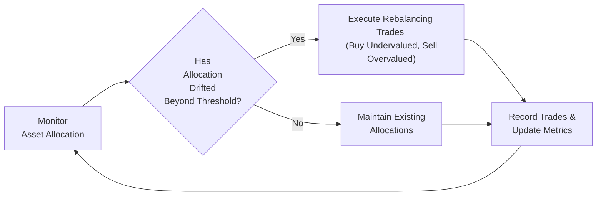

## Introduction and Context

Imagine you’ve spent hours, days, or even months crafting this perfect portfolio—slicing up assets across equities, fixed income, and a dash of alternatives. Then you walk away, thinking, “Well, that’s sorted!” But, um, guess what? The markets won’t just politely stay where you placed them. Assets grow, shrink, and shift. Market volatilities spike. Economic data surprises. Individual stock fundamentals evolve. Before you know it, your once carefully chosen allocation is drifting, and you’re left with a portfolio that might look quite different from the original design. That’s exactly why ongoing monitoring, systematic rebalancing, and consistent reporting are so critical to portfolio management.

This section explores how you can (and should) continuously keep an eye on the portfolio’s overall health, methodically bring it back in line with objectives when necessary, and clearly communicate progress and performance to stakeholders. We’ll walk through how these steps fit into the broader Investment Policy Statement (IPS) framework (see Chapter 4 for the nitty-gritty of IPS construction), and we’ll identify practical tips, common pitfalls, and real-world examples to drive the points home.

## Strategic vs. Tactical Rebalancing

One of the first big distinctions you’ll run into is strategic vs. tactical rebalancing. Let’s set the stage:

### Strategic Rebalancing
Strategic rebalancing is a method of returning the portfolio to the long-term target asset mix specified in the IPS. If your target says 60% equities, 35% bonds, and 5% alternatives, you want to stay true to that weighting over the long haul, barring any fundamental shift in your strategy or risk tolerance. It’s basically about discipline—choosing a point in time (e.g., quarterly) or setting thresholds (say you only rebalance if an allocation deviates by more than ±5%) and then realigning to keep the overall risk/return profile close to the initial blueprint. The idea: Over time, you reduce unintended bets and keep your portfolio in line with long-term objectives.

### Tactical Rebalancing
Tactical rebalancing is, well, a bit more adventurous. You might deviate from your strategic targets if you see a short-term opportunity or risk emerging. Let’s say you think the tech sector is temporarily undervalued or that inflation is about to spike. You might shift your weight slightly to exploit this short-run view. Tactical rebalancing can be lucrative if your market insight is strong, but it also demands strict risk controls. If left unchecked, it can lead you way off your strategic path and expose your portfolio to greater risk than you—or your client—ever intended.

Many professionals use a hybrid approach: adopt a strategic baseline to guide most decisions, and allow for small tactical tilts if rationalized by the research team or if certain macro indicators (see Chapter 1.6 on macroeconomic indicators) suggest near-term opportunities. Just remember to define these guidelines clearly in your IPS so clients know the difference between your “steady state” allocations and your “opportunity-driven” moves.

## Establishing Rebalancing Guidelines

“Wait, how often should I rebalance?” you might ask. That depends on your target asset classes, transaction costs, taxes, and risk tolerances. Typically, there are two broad approaches:

1. Time-Based Method: Rebalance every quarter or once a year. This is straightforward, easy to communicate, and ensures that at some regular interval you bring everything back to the target mix.
2. Threshold-Based Method: Rebalance whenever an asset class weight drifts outside a predefined band (e.g., ±2% or ±5% from the target). This approach can help minimize unnecessary transaction costs, because you only rebalance when it truly matters—i.e., the portfolio has drifted sufficiently to justify the buy/sell transactions.

During my early days as an analyst, I found it fascinating how a mere 1–2% drift could add so much additional equity risk to a moderately conservative portfolio. So, ensuring that you combine discipline and flexibility in your rebalancing guidelines can help maintain the intended risk-reward balance over time. Plus, keep in mind that rebalancing can be costly, especially if frequent trades trigger capital gains taxes. So, weigh the pros and cons carefully.

A simple representation of the rebalancing decision workflow could look like the following:

In this diagram:
- We continuously monitor the allocation (A).  
- If the drift is beyond threshold, we rebalance (C).  
- If not, we hold (D).  
- Then we record everything (E) before returning to the monitoring step (A).

## Performance Attribution in Rebalancing Decisions

Whenever you execute a rebalancing trade, it isn’t just about snapping the portfolio back to shape. It is also an ideal chance to evaluate what’s actually driving your returns. Performance attribution splits your portfolio’s performance into a few key buckets:

• Asset Allocation Effect: How much of your return stems from just being allocated to certain asset classes (e.g., equities vs. bonds) rather than specific securities.  
• Security Selection Effect: Within an asset class—like large-cap equities—did you pick better or worse stocks than the benchmark?  
• Timing Effect: Did your trade decisions to overweight or underweight an asset class within a specific time frame help or hurt performance?

This breakdown will let you see whether your short-term tactical rebalancing calls are actually working. Maybe your security selection is strong, but your tactical asset-allocation calls are consistently negative—then you know where to tweak your approach or reduce risk. Or perhaps the opposite is true, and consistent alpha is coming from correct macro calls, while your security selection is lagging. Performance attribution clarifies these outcomes.

### Simple Illustration
Suppose your portfolio total return over a quarter is 4%. Analysis might show 2% from broad equity market movement (allocation effect), 1% from your choice of specific stocks that outperformed, and 1% from being overweight in equity exactly as it soared at the right time (timing effect). This kind of breakdown helps you figure out whether you should keep focusing on sector rotation, picking star stocks, or rethinking your entire approach.

## Monitoring Process: Qualitative and Quantitative Factors

Sure, rebalancing is partly a mechanical exercise—weight goes too far in one direction, you bring it back. But a deeper, ongoing monitoring process also looks at qualitative market signals, macroeconomic forecasts, and evolving corporate governance issues (discussed in Chapter 1.10). By blending quantitative measurements (like volatility, Sharpe ratios, yield spreads) with qualitative assessments (like management quality, economic sentiment, policy environment), managers can anticipate structural changes and adapt ahead of the curve.

### Quantitative Measures
• Price/Earnings (P/E) Ratios, Price/Book (P/B) Ratios  
• Historical Volatility and Covariance Matrices  
• Yield Spreads for Fixed Income  
• Factor Exposures (see Chapter 9 for deeper factor model discussions)

### Qualitative Signals
• Market Mood: Are investors euphoric, or is there widespread fear?  
• Policy Shifts: Are central banks moving interest rates sharply? Any new tax policy changes?  
• Geopolitical Tensions: Could tariffs or trade disputes heavily impact your portfolio’s multinational holdings?  
• Governance and ESG: How well are companies managing sustainability and social risks?

In practice, you might hold a monthly or quarterly review meeting to assess these aspects. You’d pull your time-series data, update your risk dashboards, then place them within the context of real-world events like election cycles or major corporate news.

## Technology and Automated Tools

Nowadays, portfolio monitoring and rebalancing can be heavily automated. Data feeds from multiple markets, real-time risk metrics, and rebalancing triggers can all be wired into a portfolio management system. You might specify that if equity weighting drifts beyond a certain threshold, the system should auto-generate recommended trades. Or you can feed it short-run signals—like momentum or factor-based signals—that prompt a partial tactical rebalancing.

A quick caution: technology isn’t foolproof. If there’s a sudden data glitch or a macro event so big it breaks normal correlations, an overly automated approach can act too fast (or blindly). Always keep an eye on the data quality and interpret it with some good judgment. Remember, robo-advisors and algorithmic rebalancing might be convenient, but they can’t (yet) replicate human context.

## Reporting and Communication

Let’s say you’re in front of your clients or your investment committee. They want to know, “How did we do?” and “Are we still on track?” Clear, transparent reporting covers:

• Performance vs. Benchmark: Show total returns over various periods—quarter, year-to-date, annualized.  
• Risk Metrics: Show standard deviation, Sharpe ratios, drawdowns.  
• Attribution: Show how much of the return came from asset allocation, security selection, or timing.  
• Alignment to IPS: Document if the portfolio is still within the risk/return guidelines, and highlight whether tactical deviations are within the scope allowed by the policy.  
• Rolling Returns: Provide ongoing periods (e.g., rolling 12-month intervals over five years) to quell that hyper-focus on single-point performance. After all, a single quarter might be terrific or terrible, but the big question is how the strategy is doing consistently over multiple periods.

It can be tempting to minimize the negative or highlight only the positive, but honest communication—especially when the portfolio underperforms—is a hallmark of integrity. I once had a client whose biggest concern wasn’t that the portfolio went down but that he felt left in the dark about why. So, providing thorough records and a well-articulated explanation of what happened fosters trust and loyalty.

### Sample Reporting Table

| Metric            | Current Period | Year-to-Date | Since Inception |
|-------------------|---------------:|-------------:|----------------:|
| Portfolio Return  | 3.5%           | 8.2%         | 12.1%           |
| Benchmark Return  | 3.3%           | 7.9%         | 11.5%           |
| Allocation Effect | +0.3%          | +0.2%        | +0.3%           |
| Selection Effect  | -0.1%          | +0.1%        | +0.2%           |
| Timing Effect     | +0.0%          | +0.0%        | +0.1%           |
| Volatility        | 9.0%           | 9.0%         | 8.5%            |
| Sharpe Ratio      | 1.10           | 1.05         | 1.02            |

Including year-to-date, longer horizons, and performance attribution side by side helps investors interpret what’s driving results and whether the portfolio remains aligned with their broader goals.

## Coping with Clients’ Short-Term Focus

Let’s face it: many clients (and sometimes even the investment committee) are glued to short-term market fluctuations. They’ll see a dramatic headline or a day’s negative performance and freak out. That’s where rolling returns and ongoing communication come in. By presenting performance in a rolling format—say rolling 12-month windows over a five-year period—you visually demonstrate how the portfolio weathered various mini-cycles. This reduces knee-jerk reactions and helps them stay grounded in the big-picture strategy.

Encourage a conversation about their original horizon—maybe retirement in 20 years, or funding liabilities in a pension plan (see Chapter 4.7 on Liability-Driven Investing). Show how small hiccups in a single month often matter very little in that larger context. Over time, consistent education (and sometimes gentle reminders) can shift clients away from daily score-checking.

## Documentation and Regulatory Requirements

It might not sound thrilling, but thorough documentation can be a lifesaver. Trust me—I’ve scrambled more than once to find written notes on why a certain tactical allocation was recommended. In any regulated environment, especially if you’re following CFA Institute’s Global Investment Performance Standards (GIPS), you’ll want to keep:

• Trade Logs: Dates, rationale, and size of each trade.  
• Meeting Minutes: Summaries of investment committee or client meetings.  
• Rationale for Rebalancing: Reference your triggers or thresholds, plus any short-term tactical rationale.  
• Updates to IPS: If any changes in risk tolerance, constraints, or goals are made, make sure it’s documented and signed off.

This consistent documentation process preserves a historical trail showing how decisions line up with the stated policy, so if questions arise (from regulators, an oversight board, or the clients themselves), you can confidently show your compliance. Regulators and industry bodies tend to frown on “winging it,” so robust record-keeping is part of your fiduciary duty.

## A Brief Note on Implementation Costs

Before we wrap up, a quick word about costs. Rebalancing induces transaction fees, possible market impact, and in some jurisdictions, tax events. If your rebalancing triggers are set too tight, you could be generating needless transactions. If they’re too loose, your portfolio might drift far away, risking your carefully designed asset allocation. Like many things in portfolio management, the sweet spot is a trade-off. You’ll want to weigh transaction costs (and possible tax consequences) against the risk of drifting too far from your strategic allocation. Some managers might even apply “partial rebalancing,” re-centering only the largest drifts to keep costs lower.

## Exam Tips and Takeaways

• Rebalancing Frequency: Understand time-based vs. threshold-based approaches and their pros/cons.  
• Attribution Analysis: Know how to split out asset allocation, selection, and timing.  
• Communication: Provide transparent ongoing reporting. Don’t sugarcoat underperformance but clearly explain it.  
• Documentation: Keep a robust paper trail. This helps if you ever need to provide evidence of a consistent, structured process.  
• Balancing Act: Weigh costs vs. benefits. It’s about risk control as much as it’s about potential alpha.

Monitoring, rebalancing, and reporting are essentially the “maintenance” tasks for a portfolio. They may not be as thrilling as picking that big winner stock, but they form the backbone of responsible, risk-conscious portfolio management. Neglect these tasks, and your carefully built strategy might stray from the course. Manage them properly, and you’ll maintain alignment with long-term objectives while keeping both internal and external stakeholders informed and confident.

## References and Further Reading

- CFA Institute, “Global Investment Performance Standards (GIPS).”  
- Fabozzi, F. (2015). “Portfolio Construction and Analytics.” Wiley.  
- Ilmanen, A. (2011). “Expected Returns: An Investor’s Guide to Harvesting Market Rewards.” Wiley.  
- Chapter 4 (of this Volume): “Portfolio Planning and Construction” for details on the Investment Policy Statement (IPS).  
- Chapter 6 (of this Volume): “Introduction to Risk Management” for broader enterprise-wide risk frameworks.

--------------------------------------------------------------------------------

## Test Your Knowledge: Monitoring, Rebalancing, and Reporting



### Which of the following best describes the primary objective of strategic rebalancing?

- [x] Maintaining the portfolio’s intended long-term asset mix.
- [ ] Exploiting short-term market anomalies to generate excess returns.
- [ ] Enhancing daily trading activity to minimize execution cost.
- [ ] Implementing automated algorithmic adjustments for all tactical positions.

> **Explanation:** Strategic rebalancing is fundamentally about realigning the portfolio to its target allocations over the long term, ensuring consistency with the investor’s tolerance and objectives.

### What is one potential advantage of threshold-based rebalancing compared to time-based rebalancing?

- [x] Reducing unwanted transactions when portfolio weights do not meaningfully deviate.
- [ ] Guaranteeing rebalancing cost savings each time trades are executed.
- [ ] Completely eliminating tax consequences.
- [ ] Timing market tops and bottoms with greater accuracy.

> **Explanation:** Threshold-based rebalancing occurs only when asset weights exceed preset deviation bands, potentially reducing unnecessary trades in low-drift periods.

### In performance attribution, the “allocation effect” typically measures what?

- [x] The contribution to returns from the initial distribution of funds across asset classes.
- [ ] The return derived solely from selecting individual securities.
- [ ] The contribution resulting from short-term tactical trades.
- [ ] The excess return generated by currency hedging strategies.

> **Explanation:** Allocation effect captures how much of the portfolio’s performance is due to the choice of broad asset class weightings, separate from the selection of specific securities.

### Which of the following best exemplifies a qualitative factor in the monitoring process?

- [x] Market sentiment turning pessimistic due to geopolitical tensions.
- [ ] The portfolio’s historical volatility climbing to 12%.
- [ ] The correlation between two asset classes falling below 0.5.
- [ ] The price-to-book ratio for an equity portfolio dropping to 1.2.

> **Explanation:** Market sentiment and other subjective indicators fall under qualitative factors, whereas metrics such as volatility, correlation, and P/B ratios are quantitative.

### Why might rolling returns be a useful addition to a portfolio’s performance report?

- [x] They provide overlapping periods that highlight consistency over multiple time frames.
- [ ] They calculate only the minimum and maximum returns.
- [x] They reduce the reported volatility measure automatically.
- [ ] They make it impossible for clients to compare returns to a benchmark.

> **Explanation:** Rolling returns allow managers and clients to see how performance evolves over successive periods, helping contextualize short-term fluctuations.

### Which statement best represents a disadvantage of tight rebalancing triggers?

- [x] They may lead to frequent transactions, increasing costs and potential tax liabilities.
- [ ] They ensure the client never questions performance.
- [ ] They completely eliminate tracking error.
- [ ] They allow the portfolio to drift away from its strategic weight more than is desirable.

> **Explanation:** Tight triggers can prompt frequent rebalancings, which pile on transaction fees, spreads, and taxes, potentially hurting net returns.

### In an automated rebalancing system, which of the following is a key risk?

- [x] Data errors or anomalies triggering inappropriate trades.
- [ ] The manager spending too much time manually approving trades.
- [x] The system running too slowly to capture short-term price fluctuations.
- [ ] Markets ceasing to fluctuate due to algorithmic dominance.

> **Explanation:** Automated rebalancing heavily depends on accurate data feeds. Errors or corrupt data can cause trades that do not align with the investment policy.

### Which of the following items best describes “transparent reporting?”

- [x] Shared, detailed performance summaries that break down returns, risk, and alignment to stated goals.
- [ ] Hiding underperforming allocations so the client feels more confident.
- [ ] Delivering only top-line portfolio returns to remain succinct.
- [ ] Focusing on compliance disclosures while omitting performance details.

> **Explanation:** Transparent reporting means clearly communicating both the good and the bad, offering a clear performance breakdown and adherence to the IPS.

### When discussing alignment with client objectives, which measure is most appropriate?

- [x] Matching portfolio weighting and risk exposure with what was outlined in the IPS.
- [ ] Maximizing the Sharpe ratio irrespective of the client’s preferences.
- [ ] Keeping sector allocations static regardless of market changes.
- [ ] Focusing solely on near-term alpha generation.

> **Explanation:** Alignment generally refers to whether the portfolio continues to operate within the risk, return, and constraints set forth in the IPS.

### Rebalancing trades and meeting minutes should be documented primarily because:

- [x] Regulators and future audits require proof of adherence to stated policies.
- [ ] It eliminates the need to disclose historical portfolio performance.
- [ ] Traders enjoy reading logs of old trades.
- [ ] This practice ensures no mistakes were ever made in managing the portfolio.

> **Explanation:** Detailed documentation provides evidence of a consistent and compliant process; it’s key for auditors, regulators, and maintaining transparency with clients.


