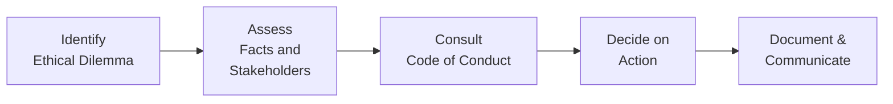

## Introduction
Ethical considerations might not be top of mind when you’re juggling market data, client calls, and research reports each day. But in the world of portfolio management—where we’re responsible for other people’s money—ethics should sit center stage. Acting ethically isn’t just about avoiding trouble (though that’s a big part) but embracing the duty to serve clients’ best interests. This means thinking carefully about potential conflicts, ensuring transparency, safeguarding confidential data, and being honest in the advice we give.

Sometimes, I think back to when I had my first big client in asset management. I was so focused on delivering stellar performance that I almost overlooked a conflict of interest in a new incentive plan tied to performance bonuses. That was a big wake-up call. It reminded me that we have to regularly pause and examine whether our decision-making lines up with the root principle: we must serve our clients above all else.

## Core Principles of Ethical Portfolio Management
Fiduciary duty is the bedrock: we must put our clients’ interests ahead of our own. But what does that look like in real, everyday decisions? It’s not just a policy text or a code snippet carved into an office plaque. It’s the million little things we do, like verifying that we treat all clients fairly in trade allocations, or being transparent about fees. In Chapter 7 (“Professional Practices in Portfolio Management”), the discussion on the regulatory environment and fiduciary roles echoes these exact responsibilities, illustrating how compliance frameworks and fiduciary obligations integrate seamlessly.

### The Fiduciary Duty
• Placing client interests first.  
• Exercising the highest level of care, skill, and diligence when managing client assets.  
• Making fully informed decisions backed by prudent due diligence, as pointed out in sections 4.1 (“The Investment Policy Statement”) and 4.2 (“Risk and Return Objectives”).

I’ll admit, it can feel burdensome at times—especially when under market pressure. Yet, the trust we cultivate by honoring these duties underpins the entire client-advisor relationship.

### Conflict of Interest Awareness
Conflicts of interest arise whenever personal or corporate incentives clash with client objectives. For instance, a manager might favor particular customers or use insider knowledge to benefit personal trades. A little while ago, I almost drifted into a sticky conflict scenario myself: a friend who owned a sizeable stake in a small-cap company recommended that I add it to a client’s portfolio. The friend promised me a “friendly reward”—which truly means “conflict of interest red flag.” By politely declining, I protected my clients, my reputation, and my own integrity.

Below is a quick illustration of common conflicts and approaches to address them:

| Common Conflict of Interest                  | Mitigation Strategies                                                                     |
|---------------------------------------------|--------------------------------------------------------------------------------------------|
| Personal Trading Before Client Trades (Front Running) | Implement strict personal trading policies, require pre-clearance for trades.               |
| Favoritism in Trade Allocation              | Adopt fair allocation procedures, use time-stamped records, rotate allocation if necessary. |
| Biased Research Recommendations             | Maintain a separation between research and trading, disclose any compensation incentives.   |
| Referral Fees or Soft-Dollar Arrangements   | Disclose all such arrangements, ensure they benefit clients, document thoroughly.           |

## Confidentiality and Data Protection
Client data is the lifeblood of daily portfolio management. In fact, anonymized performance data can even be used to glean personal insights if aggregated incorrectly. Maintaining confidentiality goes beyond not gossiping about your clients’ net worth at dinner parties. It involves storing documents securely, using encryption, and verifying that third-party providers comply with relevant laws and regulations.

One time, I overheard a conversation between two junior staffers discussing a client’s net worth in the company break room—no big deal, they thought, until they realized another client was right behind them, hearing every word. The awkwardness (and potential reputational damage) taught everyone a valuable lesson: keep client-anecdotes out of public settings.

## Fair Dealing and Transparency
Dishing out the same level of service and opportunities to all clients is not just “the right thing to do,” it’s the requirement. Fair dealing means:

• Consistency in trade execution.  
• Equal access to research and market opportunities.  
• Upfront disclosure of fees and any other relevant costs.

In Chapter 7, we discussed GIPS (Global Investment Performance Standards), which fosters transparency in reporting. While GIPS compliance itself is voluntary, the standards they embody—like consistent performance measurement, complete disclosure, and no cherry-picking of performance data—are a great framework for fairness and honesty in communicating with clients.

## Ethical Decision-Making in Daily Operations
So, how do we integrate all these obligations into the day-to-day? Let’s break it down step-by-step with a simple diagram:

1. Identify the ethical dilemma: Recognize potential problem areas—maybe it’s a conflict in awarding discretionary bonuses, or a delicate confidentiality matter.  
2. Assess relevant facts and stakeholders: Who is affected by the decision? Are there any national or international laws in play (as often noted in 6.15, “Regulatory Requirements for Risk Management”)?  
3. Consult the Code of Conduct: Many organizations adopt or adapt the CFA Institute Code of Ethics. That’s your guiding beacon.  
4. Decide on an action: Strive to choose a path that upholds fiduciary responsibility.  
5. Document and communicate: Keep thorough records of your entire reasoning, especially if regulators or compliance officers come knocking.

## Whistleblower Programs and Compliance Oversight
A strong compliance program is a manager’s best friend. It’s super helpful to have:

• Clear policies on what to do if staff suspect illegal or unethical behavior.  
• A whistleblower hotline or platform, guaranteeing anonymity or at least confidentiality.  
• Regular training that doesn’t just go through a PowerPoint but addresses real, practical scenarios.

In Chapter 6 (“Introduction to Risk Management”), we explored how risk frameworks integrate with broader enterprise objectives. Similarly, ethical oversight can weave into this structure. By tracking potential ethical infractions alongside operational or market risks, you get a holistic view of the organization’s risk posture.

## Documentation, Record-Keeping, and Regulatory Alignment
Most regulators love good documentation—actually, "expect" might be the better word. If you followed Chapter 4’s recommendations on building an IPS (Investment Policy Statement), you know that all constraints, objectives, and relevant client data should be well-documented. The same principle applies to ethics. Document ethical considerations, decisions, and the steps you took to mitigate conflicts. That way, if something goes south, you have a trail that shows your commitment to acting in good faith.

Striving for alignment with organizations such as the CFA Institute (via the CFA Institute Code of Ethics and Standards of Professional Conduct) can also demonstrate that you’re serious about upholding high standards. Regulators worldwide tend to view these standards as a sign of robust practice.

## Practical Examples and Common Pitfalls
Below are some scenarios that pop up more often than we’d like:

• Selective Disclosure: You have material, nonpublic information about an upcoming earnings announcement. Resist the temptation to leak it to a favored client. This is illegal in most jurisdictions and deeply unethical everywhere.  
• Performance Reporting: Never cherry-pick periods or particular strategies to inflate your results. Disclose everything—both the winning streaks and the slumps.  
• Fee Transparency: If you earn referral fees for funneling clients into certain mutual funds (e.g., from Chapter 1.2 “Types of Investors and Their Distinctive Characteristics” referencing investment vehicles), you must clearly disclose that. Hidden fees undermine trust faster than almost anything else.

## Reinforcing Ethics in the Organization
Cultivating ethical habits is an ongoing process. Here are a few tactics:

• Training: Conduct regular sessions reviewing case studies that mirror real situations—like trade allocation, insider trading, or personal account dealing.  
• Supervisory Measures: Segment duties (e.g., trade execution vs. compliance oversight). This helps keep checks on potential conflicts.  
• Technology Tools: Automated trade surveillance systems that flag suspicious trading patterns.  
• Culture: Encourage people to “speak up” if they sense something off. In many unethical fiascos, employees suspected wrongdoing early but felt discouraged from reporting it.

## Exam Tips: Bridging Theory and Practice
For your CFA exam (and your day-to-day job!), remember:

• Always tie back to the fundamental principle of client interest.  
• If you see a potential conflict in a question, identify it, highlight mitigating steps, and consider how you’d document it.  
• For essay (constructed response) questions, demonstrate your practical knowledge by showing how compliance and codes of conduct can be enforced, not just reciting definitions.  
• Keep an eye out for subtle signs of unethical activity, such as incomplete disclosures or suspicious trade timing.

You might get scenario-based items where you’re forced to choose between multiple courses of action. Often, the correct path is the one that ensures transparency, fairness, and alignment with client objectives. Remember the flowchart above—start with identifying the dilemma, incorporate your code of conduct, and finalize a well-documented decision.

## References and Further Reading
• CFA Institute, “Code of Ethics and Standards of Professional Conduct.”  
• Boatright, J. (2013). “Ethics in Finance.” Wiley.  
• Dimson, E., Marsh, P., & Staunton, M. (2012). “Investing for the Long Term: The Dimensions of Ethical Investing.”  

And of course, don’t forget the deeper dives in other chapters, especially Chapter 7 (“Professional Practices in Portfolio Management”) and Chapter 6 (“Introduction to Risk Management”), for strategies to integrate ethics and compliance with your overall risk frameworks.

---

## Ethical Portfolio Management Mastery Quiz



### 1. Which key principle is most fundamental to ethical portfolio management?

- [ ] Maximizing the manager’s compensation.
- [x] Acting in the client’s best interest above all else.
- [ ] Ensuring personal trades have the highest returns.
- [ ] Collecting referral fees even if they go undisclosed.

> **Explanation:** Fiduciary duty centers on placing the client’s interests above everything else, which is the core of ethical portfolio management.

### 2. Which of the following is a best practice for mitigating conflicts of interest?

- [ ] Allow managers to make personal trades prior to client trades.
- [x] Require strict personal trade pre-clearance policies.
- [ ] Keep personal trading private to avoid burdensome disclosures.
- [ ] Offer selective research reports only to top clients.

> **Explanation:** Pre-clearance ensures personal trades do not front-run or otherwise conflict with client interests. Transparency is central to ethical standards.

### 3. If a portfolio manager uses confidential client data for personal gain, it demonstrates a violation of which ethical standard?

- [ ] Fair Dealing.
- [ ] Disclosure of Fees.
- [x] Confidentiality.
- [ ] Suitability.

> **Explanation:** Using confidential data for personal gain clearly breaches the duty of confidentiality. Portfolio managers must protect client data and privacy.

### 4. Why is selective disclosure of material nonpublic information considered unethical?

- [x] It gives an unfair advantage to some investors.
- [ ] It boosts overall market liquidity.
- [ ] It provides alternative revenue streams to managers.
- [ ] It reduces compliance paperwork.

> **Explanation:** Selective disclosure undermines fair dealing by allowing certain parties an unfair advantage, and it’s illegal in many jurisdictions.

### 5. What is a key element of establishing a whistleblower process within a firm?

- [x] Protect employees who report ethical breaches from retaliation.
- [ ] Publicize whistleblower identities to deter cynics.
- [x] Provide multiple reporting channels, including anonymous ones.
- [ ] Encourage staff to report only major issues and ignore smaller infractions.

> **Explanation:** A robust whistleblower mechanism ensures that employees feel safe disclosing wrongdoing and fosters an ethical culture.

### 6. Which scenario typically violates fair dealing principles?

- [x] Allocating oversubscribed IPO shares only to favored high-net-worth clients.
- [ ] Executing trades in accordance with time-stamped orders.
- [ ] Maintaining consistent fee disclosures for new clients.
- [ ] Providing the same research updates to all clients simultaneously.

> **Explanation:** Allocating oversubscribed shares only to preferred clients constitutes favoritism and breaches fair dealing.

### 7. What should be the first step when encountering a suspected ethical dilemma?

- [ ] Immediately report it to the regulator without any internal review.
- [x] Identify and define the nature of the potential ethical conflict.
- [ ] Resolve it by personally confronting the involved party.
- [ ] Wait for a more senior manager to discover it.

> **Explanation:** Recognizing and clearly defining the ethical conflict is the initial step. Then assess stakeholders, consult policies, and proceed accordingly.

### 8. In the context of an investment management firm, adopting the CFA Institute Code of Ethics:

- [ ] Replaces the need for national laws and regulations.
- [x] Demonstrates a commitment to high professional standards.
- [ ] Guarantees zero compliance infractions.
- [ ] Serves only as marketing material and is rarely enforced.

> **Explanation:** The CFA Institute’s Code of Ethics is widely respected and indicates serious dedication to ethical practices, complementing legal requirements.

### 9. The concept of “Fiduciary Duty” requires which key aspect?

- [ ] Pursuing the highest-yield speculative investments for rapid gains.
- [x] Acting with loyalty and care, prioritizing the client’s interest above all else.
- [ ] Ensuring all trades are profitable 100% of the time.
- [ ] Leveraging insider information to outperform competitors.

> **Explanation:** Loyalty, care, and putting clients’ interests first define fiduciary duty. It does not guarantee profit but ensures integrity and diligence.

### 10. True or False: Documentation of ethical decisions is unnecessary if the intended action is obviously right.

- [ ] True
- [x] False

> **Explanation:** Proper documentation is critical. Even if the decision seems obviously correct, thorough records help demonstrate the reasoning and compliance to authorities or internal compliance teams.


